# Active Directory 설치
Active Directory를 사용하기 위해서는 AD 도메인 서비스를 설치해야한다.  
AD 도메인 서비스가 설치된 서버를 마스터 서버로 하며 우리는 이것을 DC라고 부른다.

## 1. DC 기본 설정

### 1. DC 명 재설정

* 실행창에서 __sysdm.cpl__ 을 입력하여 시스템 속성에서 서버명을 변경합니다.
* 서버명 변경 후에는 재시작을 해야 적용됩니다.

### 2. 네트워크 설정

* 실행창에서 __ncpa.cpl__ 을 입력하여 네트워크 연결창을 엽니다.
* 연결된 네트워크의 IPv4 속성을 설정합니다.


* IP주소와 서브넷 마스크를 입력합니다.  
* 일반적으로 DC는 DNS서버로도 사용하기 때문에 자신의 IP 주소를 입력합니다.
    * 127.0.0.1로 자신의 IP를 입력하여 루프백에 빠지지 않게 설정합니다.
* _폐쇄망일 경우, 게이트웨이 설정을 입력하지 않습니다._

### 3. administrator 이름 변경
* DC로 승격하면 RID가 500인 Administrator 계정이 도메인 관리자 계정이 된다.   
(_따라서 이름을 변경할 필요가 있다._)

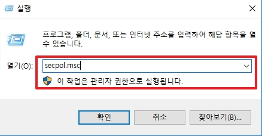
* 실행을 입력한 후, __secpol.msc__를 입력하여 실행한다.

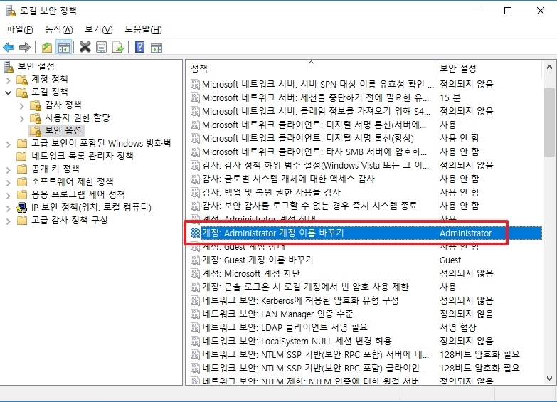
* 보안 설정 -> 로컬 정책 -> 보안 옵션 -> 계정: Administrator 계정 이름 바꾸기 로 이동합니다.

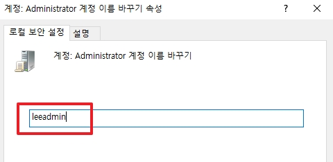
* 관리자 계정명을 변경합니다.

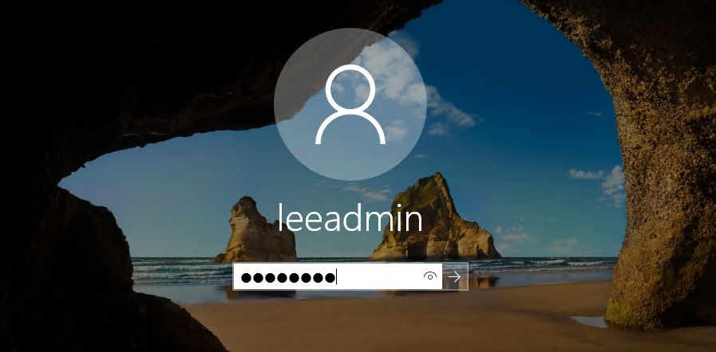
* 컴퓨터를 재부팅한 후, 변경된 관리자 계정으로 로그온 합니다.

## 2. AD 도메인 서비스 설치

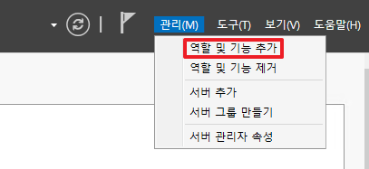
* 서버 관리자 -> 관리 -> 역할 및 기능 추가 로 이동합니다.

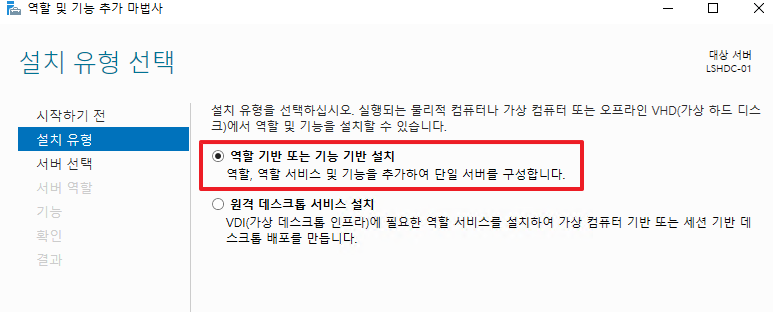
* __역할 기반 또는 기능 기반 설치__ 를 선택합니다.

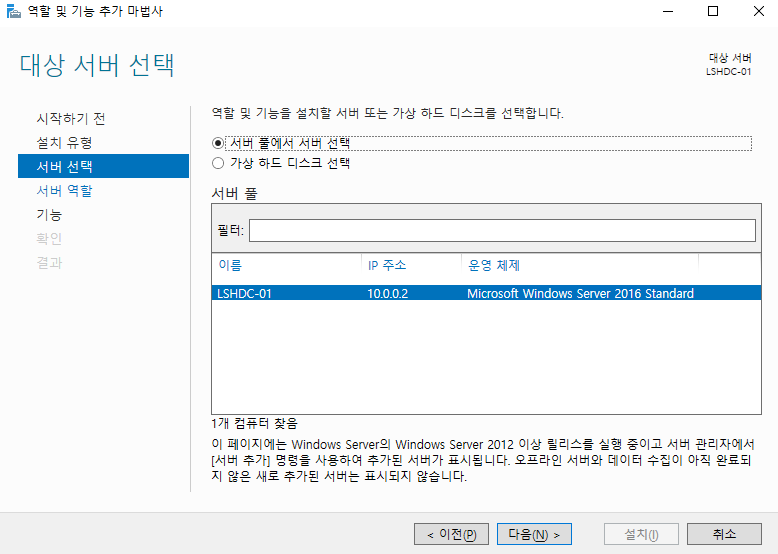
* __서버 풀에서 서버 선택__ 을 선택합니다.

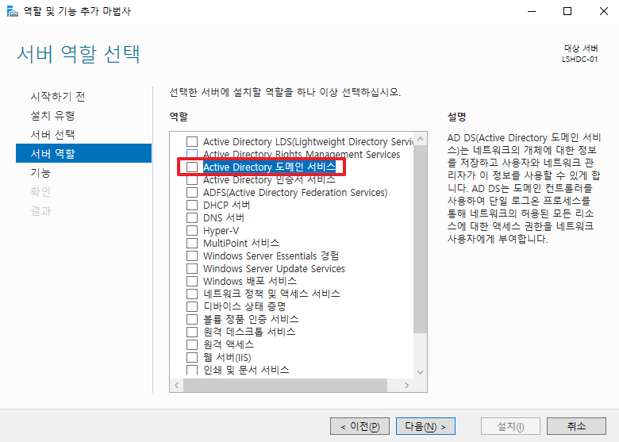
* __Acitve Directory 도메인 서비스__ 를 활성화 합니다.

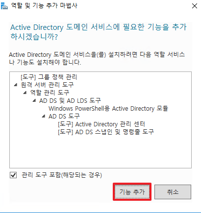
* 모든 기능을 추가합니다.

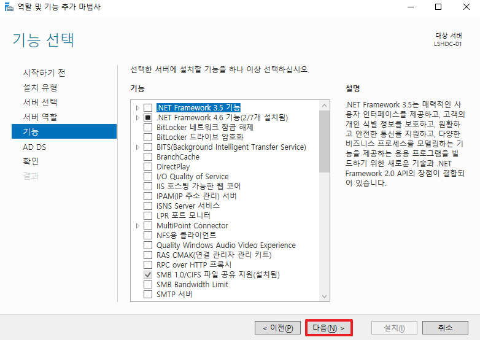
* 다음으로 넘어갑니다.

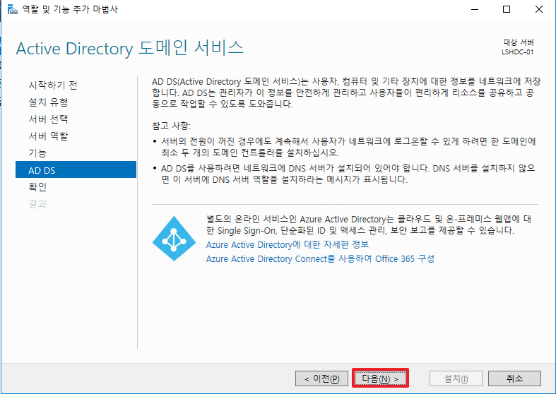
* 다음으로 넘어갑니다.

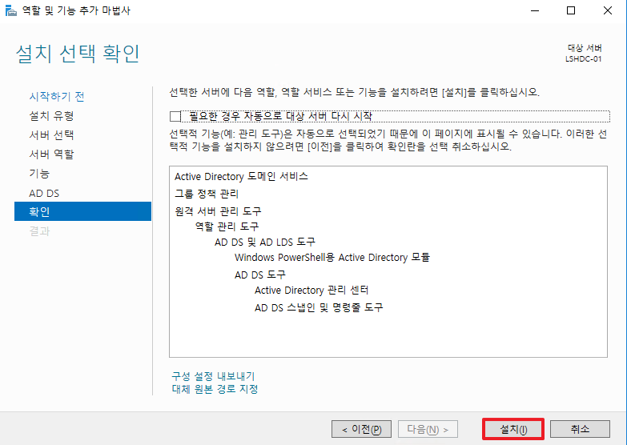
* AD DS를 설치합니다.

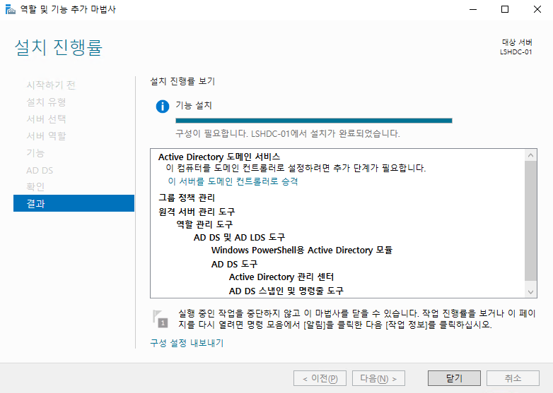
* 설치를 완료합니다.(_재부팅이 필요하지 않습니다._)

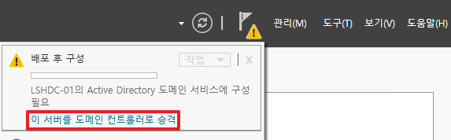
* AD DS 설치 이후에 DC 서버로 만들기 위하여 __이 서버를 도메인 컨트롤러로 승격__ 을 클릭합니다.

## 3. AD DC 승격

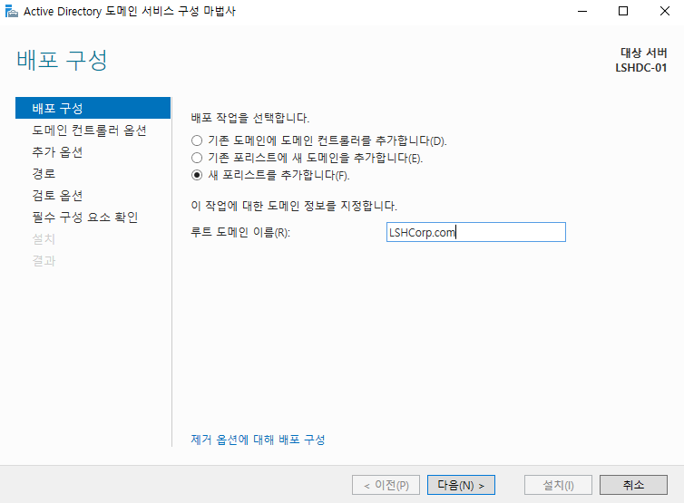
* 포레스트에 처음으로 DC를 생성하는 것이기 때문에 __새 포리스트를 추가합니다__ 를 선택합니다.

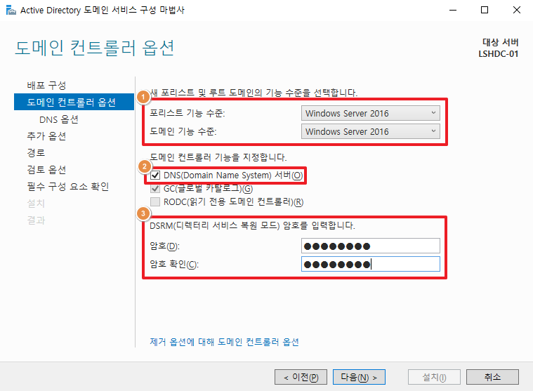
1. 기능 수준은 DC가 가질 수 있는 최소한의 OS 버전을 뜻 합니다.  
_도메인 컨트롤러에만 영향을 미치고 멤버 서버에는 영향이 없습니다. (_AD 마이그레이션 시, 중요함_)_

2. 현업에서 대부분의 DC 서버는 DNS 서버 역할도 같이 사용 합니다.

3. 디렉터리 서비스를 복구하기 위한 비밀번호를 설정합니다.
    * 재부팅 시에 Shift + F8을 같이 누르면 고급 시작 옵션으로 디렉터리 서비스 복구 모드로 부팅이 가능합니다.

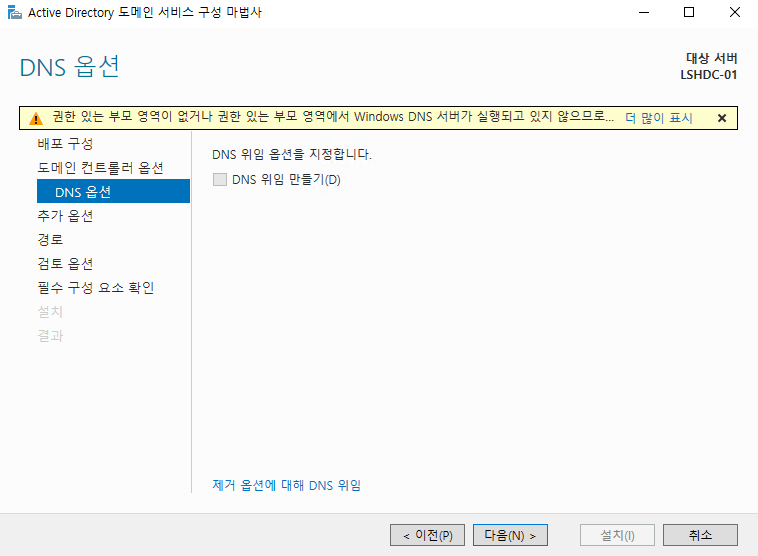
* 현재 DC를 승격 중이라 DNS 서버가 구성이 안되었기 때문에 다음으로 넘어 갑니다.

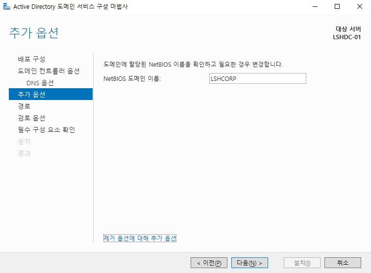
* NetBios는 쉽게 설명하면 Windows에서 동일한 네트워크에서 사용하는 서버의 이름입니다.
_도메인명으로 자동으로 설정되니 다음으로 넘어 갑니다._


* 위 경로는 그대로 사용하는게 일반적이며 다음으로 넘어갑니다.

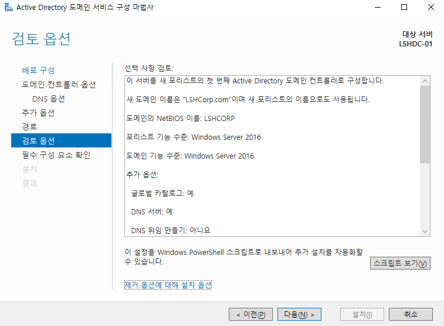
* 다음으로 넘어갑니다.

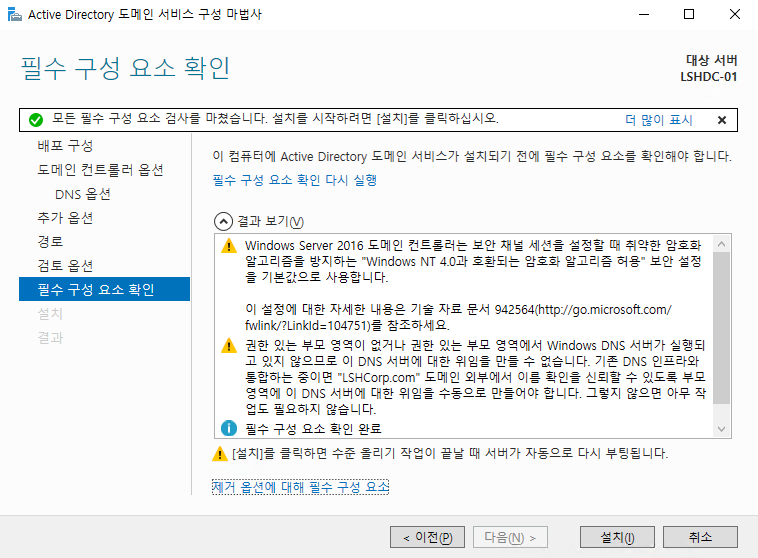
* AD DS의 필수 요소를 설치하여 DC로 승격합니다.

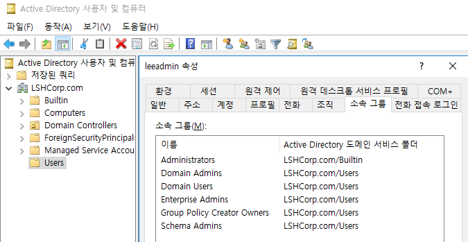
* RID 500의 계정에 Administrators 그룹 뿐만 아니라 도메인 관리에 관련된 계정들이 추가되는 것을 확인할 수 있습니다.

## 4. AD DC 추가
비용적인 측면을 고려하지 않았을 때, 한 개의 DC만 사용하여 AD DS를 운영하는 경우는 드뭅니다.  
따라서 이번에는 기존 도메인 안에 DC를 한 대 더 추가하는 작업을 진행합니다.

### ++) 추가 DC 기본 설정

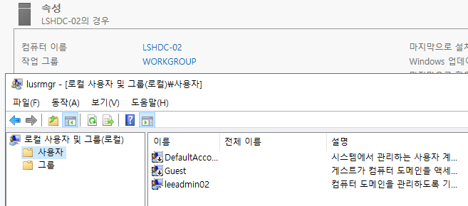
* RID 500 관리자 계정은 __leeadmin02__ 로 설정합니다.

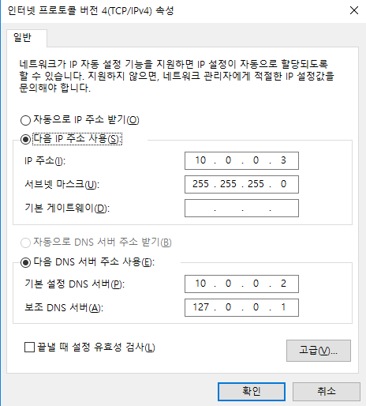
* DNS 서버 설정에서 미리 도메인에 가입되어져 있는 DC를 추가 해야합니다.  
_추후 현재 작업 중인 서버가 DC가 되었을 때, 다른 DC들의 DNS 설정에 현재 서버의 IP를 추가해야 합니다._

### 기존 도메인에 DC 추가
* 이 과정에서는 재부팅이 필요하며, DS 역할 설치 부분은 설명에서 생략합니다.

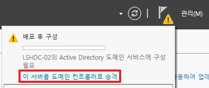
* DC로 승격 버튼을 클릭합니다.

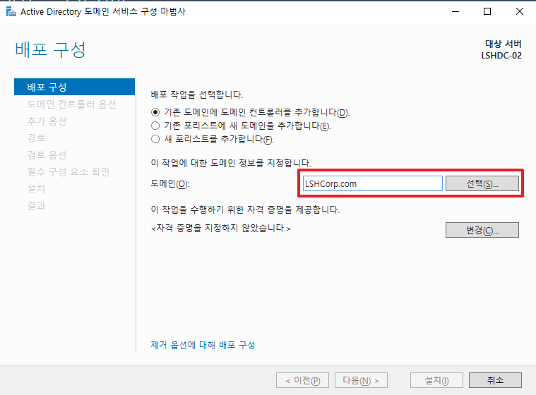
* 기존 도메인에 DC를 추가하기 때문에 기존 도메인 명을 입력하고 __선택__ 을 클릭합니다.

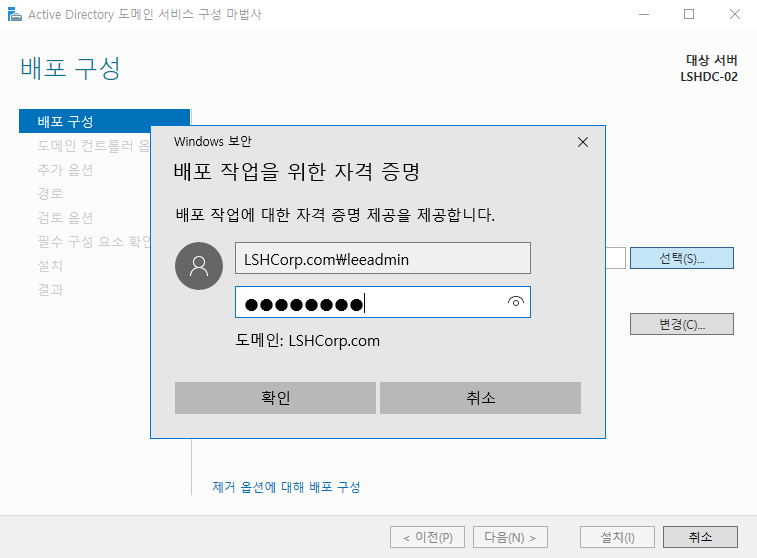
* 도메인에 가입하기 위한 자격 증명을 하기 위하여 관리자 계정으로 로그온 합니다.

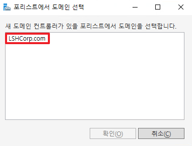
* 현재 서버가 가입할 도메인을 선택합니다.

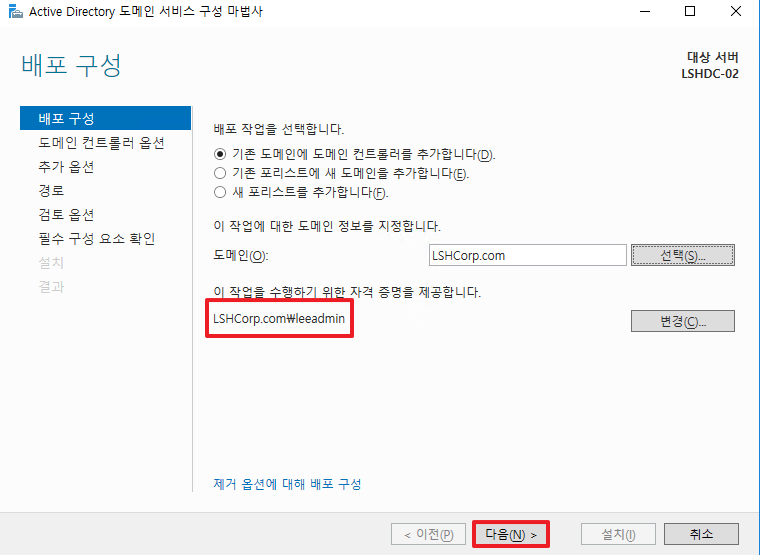
* 정상적으로 실행되었다면, 자격 증명에 __도메인\계정__ 이 표기 됩니다.

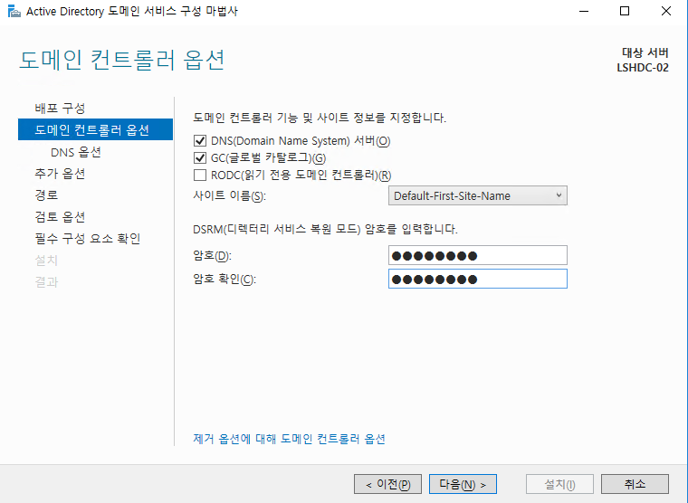
* DNS 옵션을 활성화합니다.
* Global Catalog 옵션을 활성화 합니다.

```
Global Catalog란?

- Global Catalog는 하나의 포레스트의 모든 AD 개체 복사본을 저장하는 도메인 컨트롤러이며, 똑같이 복사된 GC를 사용하게 됩니다.
- 따라서 사용자가 로그온 할 때, 유니버셜 그룹에 대한 정보 혹은 몇 가지 특징적인 정보는 Global Catalog에서 가져옵니다.
- Global Catalog는 LDAP 서비스에서 다중 도메인 환경에서 다른 도메인의 리소스를 검색하거나 쿼리하는 데 있어 필수적인 역할을 합니다.  
- Microsoft는 실제로 배포하는 모든 사이트에서 Global Catalog를 사용할 것을 권장합니다.

Ex) LSHCorp.com과 LEE.com이라는 2개의 도메인이 있다면 서로 트러스트를 맺고 리소스를 쿼리하는데 있어 Global Catalog를 사용합니다.

 추후에 Active Directory 사이트 및 서비스 -> Sites -> Default-Find-Site-Name -> Servers -> 서버명 -> NTDS Setttings -> 속성 -> 일반 탭 -> 글로벌 카탈로그 설정 에서 비활성화 할 수 있습니다. 
```
<br>
<br>

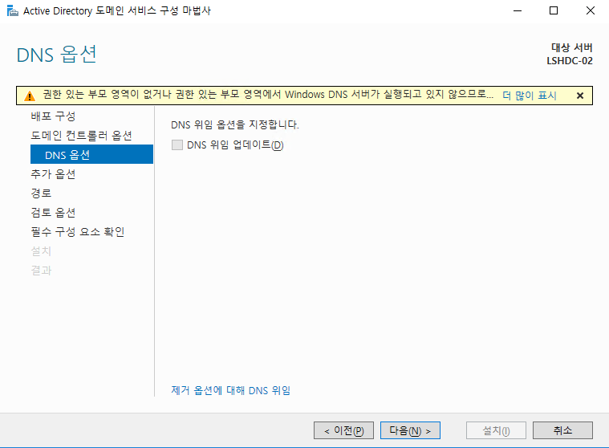
* 다음으로 넘어갑니다.

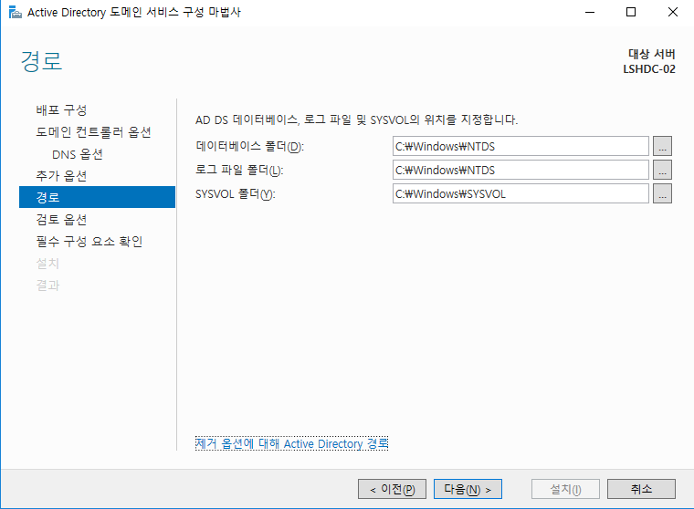
* 다음으로 넘어갑니다.

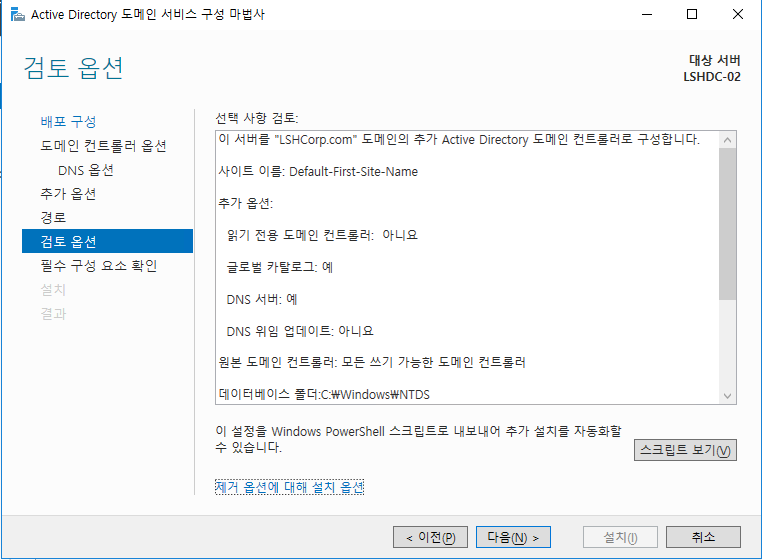
* 다음으로 넘어갑니다.

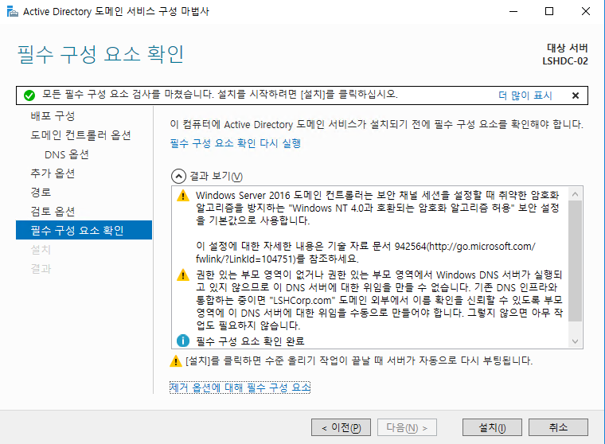
* __설치__ 버튼을 클릭합니다.

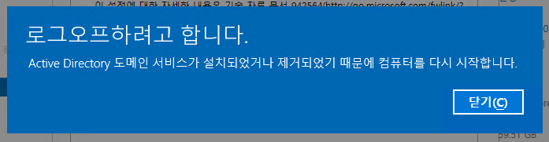
* 서버를 재부팅한 후, 로그온 합니다. (_leeadmin_ 으로 합니다.)

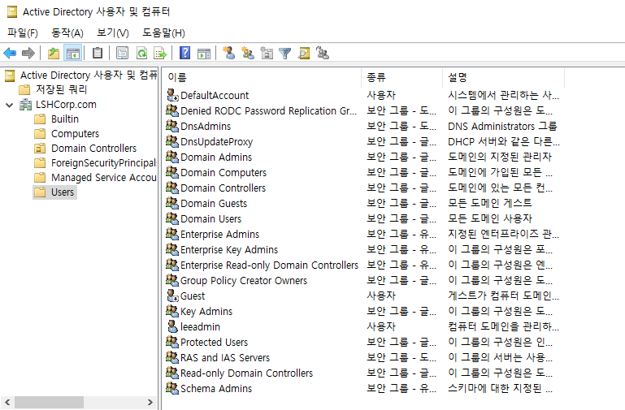
* 여기서 중요한 점은 해당 서버가 DC로 승격되면서, 기존에 사용한 leeadmin02 계정이 사라졌다는 것 입니다.
* DC 서버는 로컬 admin 계정을 사용하지 못하는게 포인트 입니다.

## 5. 복제 상태 확인 명령어

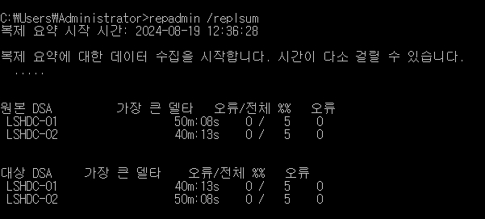
```bash
repadmin /replsum
```
* 도메인 컨트롤러 전체의 복제 상태를 요약하여 보여줍니다.

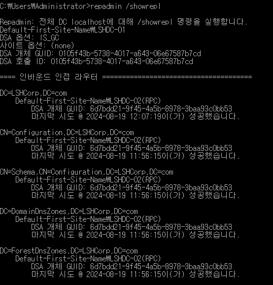
```bash
repadmin /showrepl
```

* 특정 도메인 컨트롤러에서 발생하는 복제의 상세한 상태를 보여줍니다.