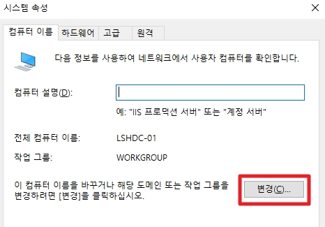
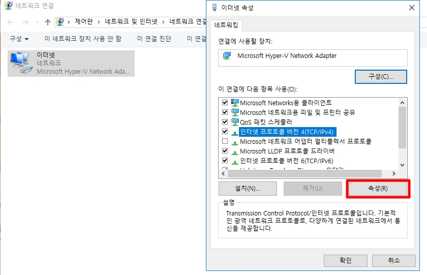

# Active Directory 설치
Active Directory를 사용하기 위해서는 AD 도메인 서비스를 설치해야한다.  
AD 도메인 서비스가 설치된 서버를 마스터 서버로 하며 우리는 이것을 DC라고 부른다.

## 1. DC 기본 설정

### 1. DC 명 재설정

* 실행창에서 __sysdm.cpl__ 을 입력하여 시스템 속성에서 서버명을 변경합니다.
* 서버명 변경 후에는 재시작을 해야 적용됩니다.

### 2. 네트워크 설정

* 실행창에서 __ncpa.cpl__ 을 입력하여 네트워크 연결창을 엽니다.
* 연결된 네트워크의 IPv4 속성을 설정합니다.

* IP주소와 서브넷 마스크를 입력합니다.  
* 일반적으로 DC는 DNS서버로도 사용하기 때문에 자신의 IP 주소를 입력합니다.
    * 127.0.0.1로 자신의 IP를 입력하여 루프백에 빠지지 않게 설정합니다.
* _폐쇄망일 경우, 게이트웨이 설정을 입력하지 않습니다._

## 2. AD 도메인 서비스 설치
