# Active Directory 개요

## 1. Activce Directory Object
AD에서 시스템 관리자가 주로 사용하는 Object는 User, Group 및 Computer가 있지만 실제로 좀 더 많은 Object가 존재합니다.  
Object는 Attributes로 이루어져 있습니다. 

### Active Directory 스키마 마스터

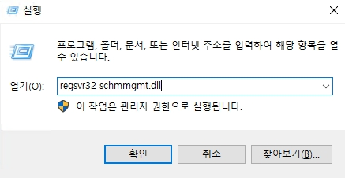

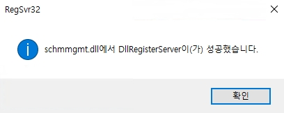
* 일반적으로 AD 스키마는 MMC에서 바로 출력되지 않기 때문에 레지스트리에 .dll 파일을 추가해야 합니다.
* __regsvr32 schmmgmt.dll__ 을 입력하여 AD 스키마 관리를 추가 합니다.

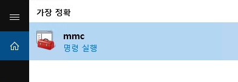
* MMC 창을 실행합니다.

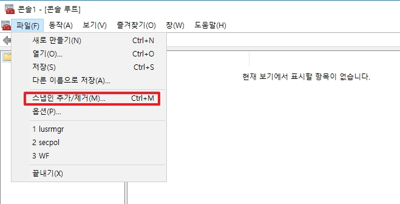
* 파일 탭 -> 스냅인 추가/제거 로 이동합니다.

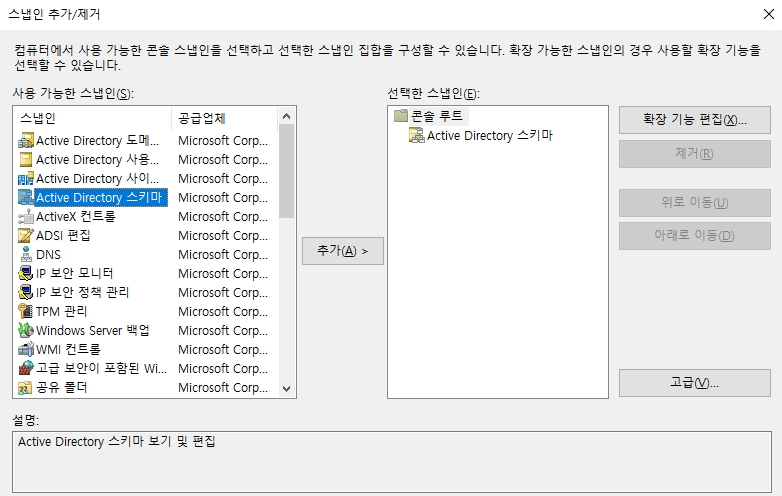
* Active Directory 스키마를 추가한 후, 확인을 클릭합니다.
* _Active Directory 스키마 가 없다면 위에서 레지값이 정상적으로 등록되지 않았습니다._

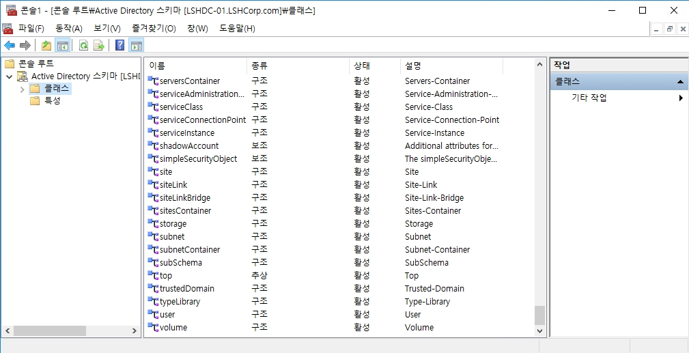
* Active Directory 스키마는 간단하게 클래스와 속성으로 이루어져 있습니다.
* 여기서 User 개체의 속성으로 이동합니다.

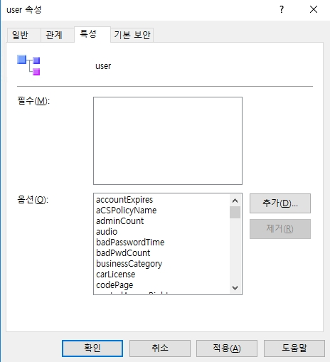
* __추가__ 버튼을 클릭하여 클래스에 특성을 추가할 수 있습니다.
* dsa.msc에서 보기 탭 -> 고급 기능 을 활성화 한 후에 속성의 특성 편집기에서 확인할 수 있습니다.
* _특성을 추가하고 AD에 적용하기 제일 쉬운 방법은 DC를 재부팅하는 것임으로 참고_

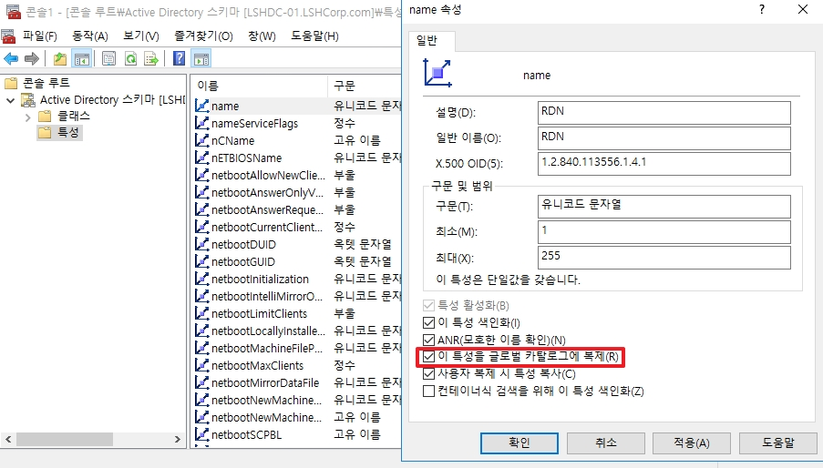
* 특성에서는 새로운 특성을 생성할 수 있으며, 기존에 없던 특성일 경우에는 GC 복제 옵션 활성화를 권장합니다.

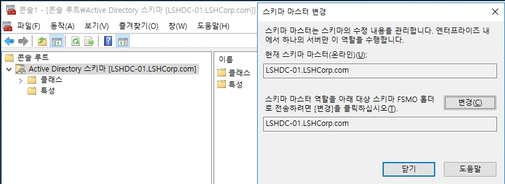
* 마지막으로 스키마 마스터도 변경이 가능합니다. (_이 내용은 아래에서 다시 설명합니다._)

### X.500 OID
OID(Object Identifier)란? 디지털 객체나 서비스, 혹은 어떤 정보를 고유하게 구분하기 위해 사용되는 ID 번호로 AD에서는 ladp 프로토콜을 위하여 사용됩니다.  
_깊게 설명하지는 않고 가볍게 설명합니다_

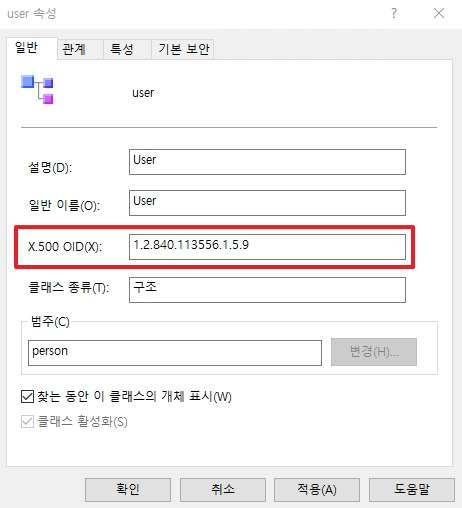
* 모든 객체와 특성에는 OID가 존재합니다.
* 1.2.840.113556.1.5.9 OID 설명
    * 1: ISO(International Organization for Standardization)
    * 2: ISO Member Body
    * 840: USA (미국)
    * 113556: Microsoft Corporation
    * 1: 디렉토리 서비스(Directory Services)
    * 5: 클래스 또는 속성 집합
    * 9: 특별한 속성 (구체적인 내용은 Microsoft에서 정의함)

* 위와 같은 OID가 국제 기구에 등록되면 모든 도메인의 DC 서버들의 User라는 객체는 위와 똑같은 OID로 생성되는 것을 확인할 수 있습니다.
* _일종의 공식적인 Object 혹은 Attribute 포멧이라고 생각하면편합니다._

## Active Directory 저장 파일
ntds.dit
sysvol


## FSMO(Flexible Single Master Operation)

DC들 간의 복제가 이루어질 때, 충동이 발생하게 될 수 있다. 이 상황에서 절대로 충돌이나면 안된거나 양쪽에서 수정이 불가능하도록 하는 솔루션을 __FSMO__ 라고 한다.

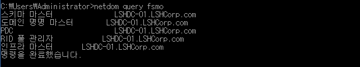
```bash
netdom query fsmo
```
* AD DC들의 CMD에 명령어를 입력하여 각각의 마스터들을 어떤 DC가 가지고 있는지 확인할 수 있습니다.
* _Role을 다른 DC로 옮길 경우에는 GUI보다 PowerShell로 옮기는 것을 지향합니다._

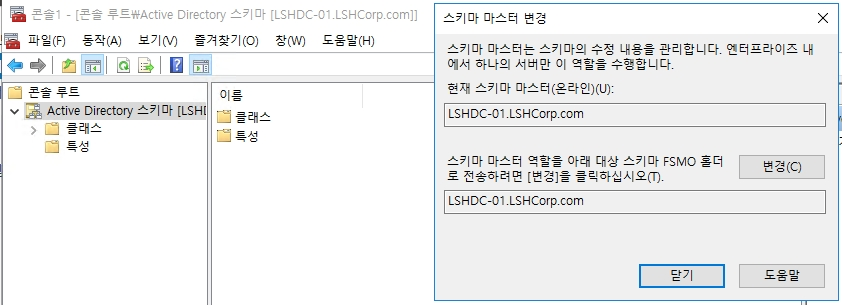
* __스키마 마스터(Schema master)__ 는 이름과 동일하게 스키마를 관리하는 역할을 합니다.
* __포레스트__ 전체 중에 하나의 DC만 필요합니다.

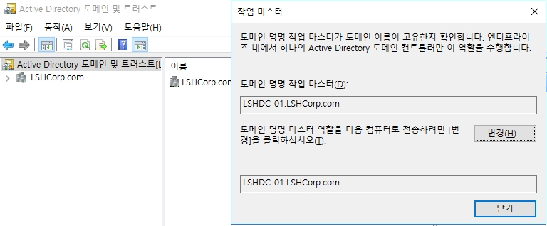
* __도메인 명명 마스터(Domain Naming Master)__ 는 도메인 구조, 즉 전체적인 뼈대를 관리하는 역할을 하며 모든 도메인을 확장 축소할 때 해당 DC를 참고하여 도메인 서버를 구축합니다.
* __포레스트__ 전체 중에 하나의 DC만 필요합니다.

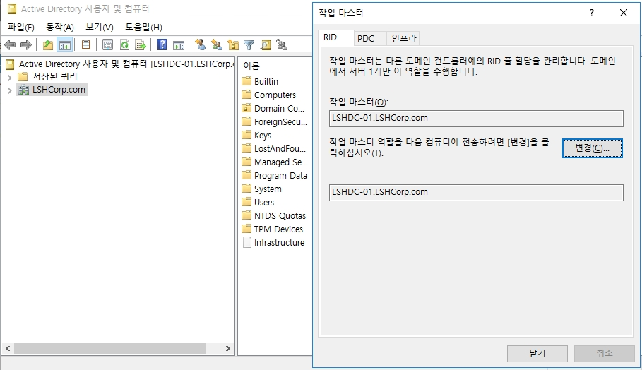
* 위 역할들은 __도메인__ 전체 중에 하나의 DC만 필요합니다.

1. RID 풀 관리자(Relative ID Master)
    * 모든 개체는 SID(도메인 값) + RID(개체 번호)를 바탕으로 생성됩니다.
    * 한 도메인 안에서 이 개체 생성 값이 꼬이지 않게 고유값을 관리해주는 역할을 RID Master가 수행합니다.

2. PDC(Primary Domain Controller)
    * 도메인 내의 DC들의 NTP가 기준이 되는 서버이며, Forest PDC의 시간과 동기화를 수행합니다.
    * 사용자 암호 변경 등을 확인하는 서버입니다. 
    * (_컴퓨터 개체들도 비밀번호가 존재하며 기본 정책 상 1달에 한번 자동으로 비밀번호가 변경 됩니다. 이러한 정보를 해당 DC가 가지고 있습니다._)

3. 인프라 마스터(Infrastructure Master)
    * 도메인 간의 변경을 체크합니다.
    * 예를 들어 "A도메인" 그룹에 "B도메인" 구성원이 포함되었다면 인프라 마스터는 B도메인에 개체 데이터를 복제하고 유지하는 역할을 담당합니다.
