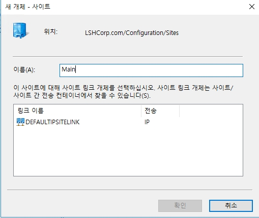
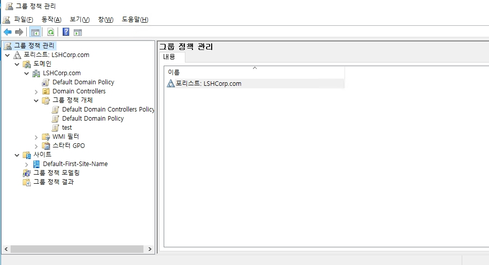

# Active Directory Site

기본적으로 AD DC를 처음 생성하게 되면 한 도메인 안에 사이트가 하나만 존재 합니다. 소규모의 기업에서는 사이트를 분리하지 않아도 되지만 국제적인 법인이 있는 대기업 같은 경우에는 빠른 복제를 위하여 사이트를 분리하여야 합니다.  
예를 들어 한국의 수출 회사에서 미국과 일본 등에 법인이 있고 이 모두 같은 도메인을 사용하고 싶다면 사이트를 복제해야 합니다.  
실제로는 네트워크 장비를 통해서 설정하지만 사용 방법을 보여주기 위하여 VM 1대를 홉으로 사용하여 사용 방법을 설명합니다.  

## 1. 실습 사전 구성


#### 1. 라우팅 테이블 설정
```bash
route -p add 172.0.0.0 mask 255.255.255.0 10.0.0.222
```
* LSHDC-01과 02의 CMD에 입력하여 라우팅 테이블에 추가합니다.
* 위 명령어를 입력하면 172.0.0.x의 IP로 패킷을 보낼 때 게이트웨이를 172.0.0.222를 사용하게 됩니다.


```bash
route -p add 10.0.0.0 mask 255.255.255.0 172.0.0.222
```
* NewSiteDC-01의 CMD에 입력하여 라우팅 테이블에 추가합니다.
* 위 명령어를 입력하면 10.0.0.x의 IP로 패킷을 보낼 때 게이트웨이를 10.0.0.222를 사용하게 됩니다.

#### 2. 홉 서버 레지스트리 설정
```
[Computer\HKEY_LOCAL_MACHINE\SYSTEM\CurrentControlSet\Services\Tcpip\Parameters]
IPEnableRoute=1
```
* 위 경로의 값을 0에서 1로 수정합니다.
* 이 레지스터리 값을 변경하게 되면 서버에 들어 온 패킷의 목적지가 자신이 아니라면 목적지로 패킷을 보낼 수 있게 됩니다.
* 더 쉽게 설명하면 서버를 라우팅용으로 사용이 가능하게 됩니다.

## 2. Site 분리


* 먼저 작업할 메인 DC에 로그온 한 후, AD 사이트 및 서비스를 실행합니다.


* Sites 폴더 아이콘을 우 클릭한 후, __새 사이트__ 를 클릭합니다.


* 10.0.0.0/24는 Main으로, 172.0.0.0/24는 Sub 사이트로 사용할 예정임으로 각각의 사이트를 생성합니다.


* 서브넷은 아래의 과정에서 바로 추가함으로 확인을 클릭합니다.


* 서브넷 폴더 아이콘을 우 클릭한 후, __새로 만들기 -> 서브넷__ 을 클릭합니다. 


* Main Site는 서브넷 대역대를 10.0.0.0/24로 설정합니다.


* Sub Site는 서브넷 대역대를 172.0.0.0/24로 설정합니다.


* 확인을 클릭합니다.


* 위와 같이 설정이 끝났다면 기초적으로 사이트가 분리가 됩니다.

## 3. DNS & GPO Manager 확인


* 사이트가 분리가 되면 실시간으로 DNS에 반영이 되며 아래에서 확인 가능합니다.
* Windows Server의 DNS 서버는 단순히 ip에 대해서만 아는게 아니라 이 서버가 DC인지 아니면 GC인지도 알 수 있습니다.


* 그룹 정책 관리자로 이동합니다.
* 사이트 분리 후 해당 페이지로 이동하게 되면 분리한 사이트가 출력이 되지 않는 것을 확인 할 수 있습니다.


* 따라서 분리된 사이트를 해당 페이지로 추가해야 합니다.
* 사이트 아이콘을 우 클릭한 후, __사이트 표시__ 를 클릭합니다.


* 모든 사이트를 추가합니다.


## 4. Replication Setting
자동으로 AD가 복제하도록 할 수 있지만, DC들을 간의 복제 일정 및 복제 경로를 설정할 수 있습니다.
* __DEFAULTIPSITELINK__ 안에 모든 DC들이 다 포함되어 있어 모두 다 자동으로 복제가 가능합니다.


 * __Sites -> Inter-Site Trasports -> IP 우 클릭 후, 새 사이트 링크__ 를 클릭합니다. 


* 복제 링크를 만들 사이트를 추가합니다.


* 생성된 링크의 속성에 들어와서 추가 설정이 가능합니다.
    1. __비용__ : 복제 시에 어떤 경로로 복제할 지에 대하여, 이 값을 참고하여 복제합니다. (사용되는 알고리즘은 다익스트라 알고리즘으로 최단 비용으로 계산합니다.)
    2. 복제 간격: 복제 주기를 설정할 수 있으며, 최소 시간은 15분 입니다.

이후에는 사이트 내부에서 외부와 연결할 DC를 선택하여 복제를 진행할 수 있습니다.
* 실습에서는 LSHDC-02와 NEWSITEDC-01을 설정합니다.


* 각각의 DC의 속성으로 이동합니다.


* 해당 DC를 브리지헤드로 설정하기 위하여 IP를 추가합니다.
