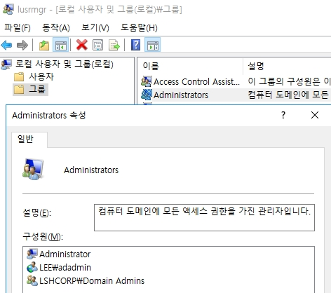
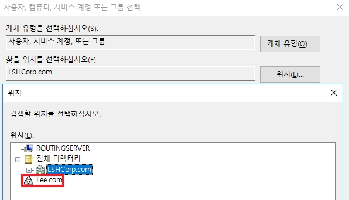
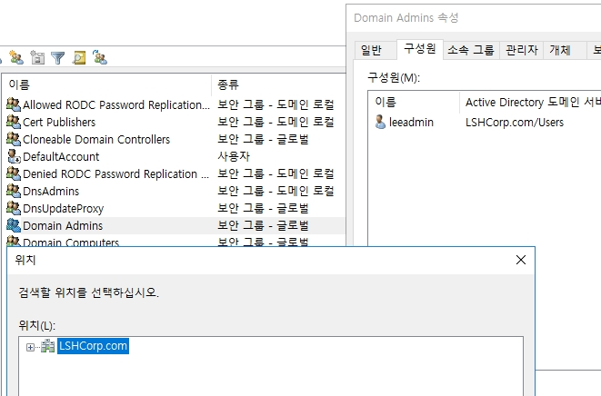

# Active Directory Trust

AD는 서로 다른 도메인 혹은 포레스트에서 Trust를 맺어서 리소스(SMB 등등..)를 공유하거나 사용이 가능합니다.

추가적으로 A<->B, B<->C가 트러스트가 맺어 있어도 A<->C가 맺는게 아니라면 트러스트가 적용되지 않습니다.

[참고 링크]   
[https://learn.microsoft.com/ko-kr/entra/identity/domain-services/concepts-forest-trust](https://learn.microsoft.com/ko-kr/entra/identity/domain-services/concepts-forest-trust)

## 1. Trust 구성 과정

* 각각의 AD DC의 DNS에 새 조건부 전달자를 설정합니다.
* 아직 트러스트를 맺지 않아서 FQDN이 표기되지 않습니다.
    * FQDN이란 호스트 네임과 도메인 네임을 합친 것을 뜻합니다.
    * Sever01.Lee.com이라는 FQDN이 있다면 Server01은 호스트 네임이며, Lee.com이 도메인 네임이 됩니다.

#### [ __새 조건부 전달자__ ]
* DNS에 특정 도메인을 찾는 쿼리가 들어왔을 경우에 DNS 서버는 조건부 전달자로 저장된 DNS 서버에 쿼리를 라우팅하여 전달 합니다. (_실질적인 쿼리계산을 하지 않습니다._)
* 위와 같이 LEE.com으로 DNS 도메인을 저장하면, *.Lee.com이라는 URL이 들어오게 될 경우에 10.0.0.102의 DNS 서버에 가서 찾게 됩니다.

  

* Trust를 설정할 AD DC에 로그온 합니다.

* DNS의 새 조건부 전달자에 들어가 Trust를 맺을 Target DC의 도메인과 IP를 설정합니다.

* 새 조건부 전달자를 설정하는 것 만으로도 Target DC의 DNS 사용이 가능합니다.

* Active Directory 도메인 및 트러스트에 들어가 도메인 명을 우 클릭한 후, 속성을 클릭합니다.

* 트러스트 탭으로 이동한 후, 새 트러스트를 선택합니다.

* 다음으로 넘어갑니다.

* 트러스트를 맺을 Target DC의 도메인을 입력합니다.

* Target 도메인의 관리자 계정을 통하여 인증 합니다.

* 트러스트는 전이적과 비전이적 트러스트가 가능하며, 이에 따라서 포리스트 트러스틀 맺어 전이적으로 모든 하위 도메인까지 트러스트가 가능합니다.

* 양방향과 단방향이 있으며, 위와 같이 필요에 따라서 어떻게 트러스트를 맺을지 정할 수 있다.

* Target 서버도 같이 트러스트를 만들어서, 한 번에 같이 트러스트를 만들지 선택하는 옵션입니다.
* _client 서버만 만들고, target 서버 트러스트를 나중에 또 만들게 되면 번거롭기 때문에 만들 때 같이 만드는 것을 권장합니다._

* Target 서버에 트러스트를 만들기 위하여 Targert DC의 관리자 계정을 인증합니다.

* 전체 포리스트 인증을 선택합니다.
* 전체 포리스트 인증을 하는 이유는 트러스트를 맺고 Target 자원에 엑세스할 경우에 인증을 자동으로 하기 때문에 인수 합병시에 사용하기 유리합니다.
* 공개되지 않아야 할 서버 혹은 리소스가 있을 경우에는 선택 인증을 권장합니다.
    * _다음 문서에서 구축 방법을 다룹니다._

* 다음으로 넘어갑니다.

* 다음으로 넘어갑니다.

* 트러스트가 동작하는지 확인합니다.

* 트러스트가 동작하는지 확인합니다.

* 트러스트를 완료합니다.

* Trust 생성이 끝나게 되면, 트러스트 속성 창이 위와 같이 표기 됩니다.

* Target DC의 AD 사이트가 분리되어 있어도 같은 도메인이라면, 다른 사이트 AD DC에도 트러스트가 맺어 집니다.

## 2. Trust로 Target 도메인 그룹 가입

* 트러스트를 맺으면 Target 서버의 그룹에 Client 서버의 계정이 가입이 가능합니다.
* 로컬 Remote Desktop Users 그룹에 넣으면 Target 도메인의 Member Server 들에도 원격 접속이 가능해집니다.

* 위와 같이 도메인-로컬 그룹은 트러스트를 맺은 계정이 가입이 가능합니다.

* 도메인-로컬이 아닌 글로벌 및 유니버셜의 그룹에는 가입이 불가능합니다.