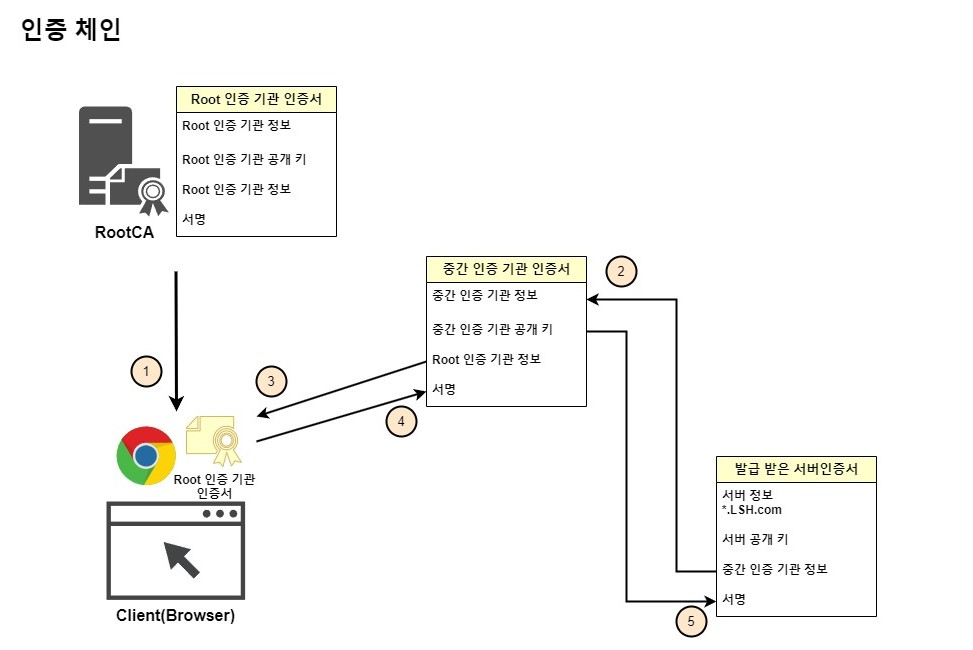

# PKI(Public Key Infrastructure) With Windows Server

Widows CA를 설명하기 전에 먼저 PKI 구조를 설명하고, 지나가도록 하겠습니다.  
CA는 쉽게 얘기하면, 인증 기관으로 서버가 본인을 증명할 인증서를 발급하여 주는 서버이며, 발급 받은 인증서는 아래와 같습니다.

* 간단하게 요약하면 __요청한 서버 정보__ , __요청한 서버 공개키__ , __인증기관 정보__ , __지문__  및 __서명__ 입니다.
    * __지문__ : 인증 정보(문서)를 해시 알고리즘(SHA-256 등등..)를 통하여 해시 문자열로 만든 것
    * __서명__ : 인증 기관이 지문을 개인키로 암호화하여 만든 전자 서명

[중요!]
* 여기서 알 수 있는 점은 서명을 복호화 하여 원상복귀 하게 되면 지문과 값이 같다는 점입니다~!

## 1. 전자 서명과 인증서
위 설명에 이어서 인증서 발급 시, 인증 기관이 하는 절차를 먼저 설명하여 보면,  
1. 인증 기관은 기본적으로 인증서의 내용을 해시화하여 지문으로 변환합니다.
2. 그 후에는 인증기관이 지문을 본 서버의 개인키를 가지고 다시 암호화를 합니다.
3. 이제 모든 값을 모아서 하나의 인증서로 만들게 됩니다.

클라이언트는 이 인증서가 옳바른지 검증하기 위해 암호화 되어 있는 전자서명을 복호화 하여 지문의 해시 값과 비교합니다.
* 복호화 하는 과정에서 CA 서버의 공용키가 필요합니다.  
* CA가 자기 자신을 발행하게 되면, 자신의 공개 키를 인증서 안에 넣게 되어집니다.
    * _중간 CA라면 Root CA가 발급하게 되면서, 중간 CA의 공용키가 포함되어집니다._
* 따라서 서버는 클라이언트와 TLS 통신을 하게 되면 발급 받은 인증서와 그 인증서를 발급하여 준 CA의 인증서 총 2개를 클라이언트에게 전달하게 됩니다.

## 2. 인증 체인(Chain of trust)
먼저 인증 체인을 설명하기 전에, CA 구조를 설명하면 CA가 하나만 설치되는 경우는 드뭅니다.  
Root CA가 있고, 그 아래에 중간 CA인 인증서 발급 기관이 있는 구조로 많이 사용됩니다.
* 중간 CA의 인증서는 Root CA가 발급하여 줍니다.
* Root CA의 인증서는 Root CA가 자체 발급하여 주며, 이것을 __Self-Signed__ 인증서라고 합니다.

   
1. 기본적으로 Root CA의 인증서는 브라우저를 설치 및 업데이트 할 때 신뢰하는 인증기관으로 같이 설치 됩니다.
    * 폐쇄망의 경우 AD GPO를 통하여 Root CA 인증서를 Client 및 Member Server에 배포합니다.

2. 발급 받은 서버 인증서의 __서명__ 을 복호화 하기 위해서는 인증서를 발급한 중간 인증 기관의 공개키가 필요합니다.
    * 공개 키를 얻기 위하여 중간 인증 기관 인증서로 넘어갑니다.

3. 중간 인증 기관 인증서도 인증서가 유효한지 검증하기 위해 서명을 복호화할 필요가 있습니다.
    * 따라서 중간 인증 기관 인증서를 발급한 Root CA의 공개 키가 필요합니다.
    * Root CA의 공개 키를 얻기 위하여 Root 인증 기관 인증서로 넘어갑니다.

4. 브라우저 및 서버에 저장되어 있는 Root CA에서 Root CA의 공개 키를 찾습니다.
    * 찾은 Root CA 공개 키를 사용하여 중간 CA 서명을 복호화한 후, 중간 CA 인증서의 유효성을 검사합니다.
    * 유효성 검사 시, 인증서에 이상이 없다면 인증서에 저장된 중간 CA의 공개 키를 획득합니다.

5. 중간 CA의 공개 키를 가지고, 다시 발급 받은 서버 인증서의 서명을 복호화 한 후, 유효성을 검사합니다.
    * 이 과정에서도 해시 값이 일치하여 최종적으로 인증서가 문제가 없다면 유효한 인증서로 인정됩니다.

6. 마지막에는 서버 인증서에 붙어있는 공개키는 체인 검증에 사용되지 않고 클라이언트가 초기 통신에서 안전하게 세션 키를 전달할 때 사용됩니다.

   
위 와 같이 인증서들이 서로 연결되어 공개 키를 가지고 유효성을 검사하는 과정을 우리는 __인증 체인__ 이라고 합니다.

## 3. CDP 및 AIA

그렇다면 인증서가 폐기 되었을 경우에 확인은 어떻게 할까?

* __CDP__ (Certificate Revocation List(CRL) Distribution Point): 인증서가 폐기 되었는지 확인하는 목록인 .crl 파일 배포 지점을 나타냅니다.

* __AIA__ ((Authority Information Access) : 클라이언트는 해시 값을 검증 할 때, 서버가 발급 받은 인증서와 발급한 인증 기관의 인증서 총 2개가 필요합니다. 이 때 서버는 발급 받은 인증서만 제공하지, CA의 인증서를 제공하지는 않습니다. 이 때, CA에 인증서를 받을 수 있는 배포 지점을 나타낸 것이 AIA 입니다.
