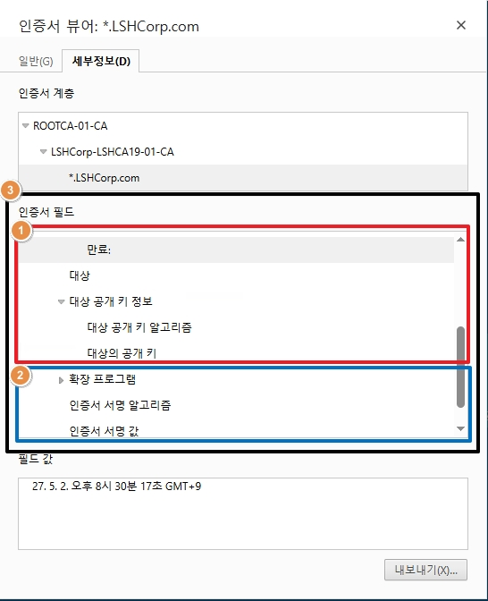
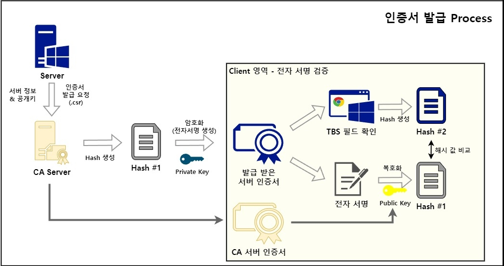
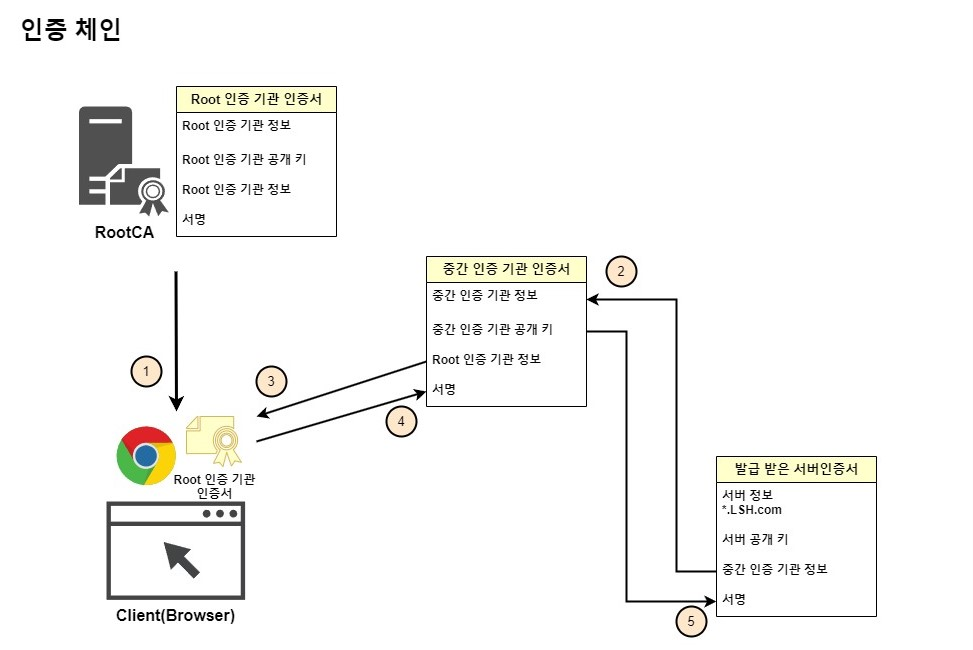
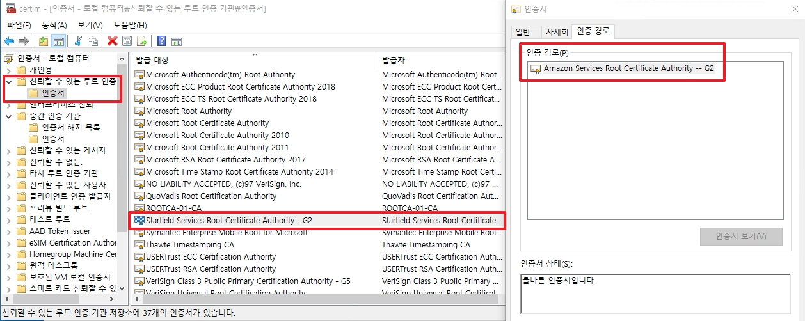
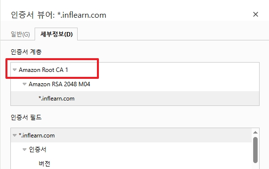

# PKI(Public Key Infrastructure) With Windows
Widows CA를 설명하기 전에 먼저 PKI 구조를 설명하고, 지나가도록 하겠습니다.
CA는 쉽게 얘기하면, 인증 기관으로 서버가 본인을 증명할 인증서를 발급하여 주는 서버이며, 발급 받은 인증서는 아래와 같습니다.

## 목차

1. [인증서 및 전자서명 & 발급 과정](#1-인증서-및-전자서명--발급-과정)  
2. [인증 체인(Chain of trust)](#2-인증-체인chain-of-trust)
3. [CDP 및 AIA](#3-cdp-및-aia)

<br>

## 1. 인증서 및 전자서명 & 발급 과정
TLS 버전과 관계 없이 해당 PKI 동작 방식은 동일합니다.  


1. `To Be Signed Certificate`(TBSCertificate): 일렬번호, 유효기간, 주체, 공개키 등 인증서에 대한 정보들이 들어있는 필드들을 위와 같이 부릅니다.
2. `SignatureValue`(전자서명): 발급 CA에서 위 `TBS`를 보고 개인키로 암호화환 서명 값을 뜻합니다.
3. `thumbprint`(지문): 위 TBS와 전자서명을 해시 값으로 만든 것을 지문이라고 합니다.

<br>  

위 내용을 바탕으로 아래와 같이 인증서가 발급됩니다.  

 

클라이언트는 이 인증서가 옳바른지 검증하기 위하여 `TBSCertificate`를 Hash 값으로 만든 후, 전자서명 안에 있는 Hash 값과 비교합니다.  
좀 더 순서대로 얘기하면  
1. Windows 서버가 인증서 생성에 사용할 .csr 파일( X.509 인증서 정보 및 서버 공개 키)를 CA에 전달합니다.  
2. CA 서버는 .csr 파일에 있는 인증서 정보로 해시 값을 만든 후, 개인 키로 암호화합니다.  
    이 때 암호환 된 것을 전자서명이라고 합니다.  
3. 전자서명을 포함하여 인증서를 생성하여 서버에 전달 후, 서버는 해당 인증서로 웹을 호스팅합니다.  
4. 클라이언트는 사이트 접속 시 전달 받은 인증서의 TBS 값으로 Hash를 생성합니다.  
    그 후, 인증서의 전자서명 부분을 CA 서버 인증서에 있는 공개키로 복호화하여 두 개의 해시 값을 비교합니다.  

_(주의) 지문에 있는 Hash 값은 위에서 사용된 Hash 값과 연관이 없습니다._

<br>

## 2. 인증 체인(Chain of trust)
먼저 인증 체인을 설명하기 전에, CA 구조를 설명하면 CA가 하나만 설치되는 경우는 드뭅니다.  
Root CA가 있고, 그 아래에 중간 CA인 인증서 발급 기관이 있는 구조로 많이 사용됩니다.
* 중간 CA의 인증서는 Root CA가 발급하여 줍니다.
* Root CA의 인증서는 Root CA가 자체 발급하여 주며, 이것을 __Self-Signed__ 인증서라고 합니다.


</br>  
1. 기본적으로 Root CA의 인증서는 브라우저를 설치 및 업데이트 할 때 신뢰하는 인증기관으로 같이 설치 됩니다.
    * 폐쇄망의 경우 AD GPO를 통하여 Root CA 인증서를 Client 및 Member Server에 배포합니다.

2. 발급 받은 서버 인증서의 __서명__ 을 복호화 하기 위해서는 인증서를 발급한 중간 인증 기관의 공개키가 필요합니다.
    * 공개 키를 얻기 위하여 중간 인증 기관 인증서로 넘어갑니다.

3. 중간 인증 기관 인증서도 인증서가 유효한지 검증하기 위해 서명을 복호화할 필요가 있습니다.
    * 따라서 중간 인증 기관 인증서를 발급한 Root CA의 공개 키가 필요합니다.
    * Root CA의 공개 키를 얻기 위하여 Root 인증 기관 인증서로 넘어갑니다.

4. 브라우저 및 서버에 저장되어 있는 Root CA에서 Root CA의 공개 키를 찾습니다.
    * 찾은 Root CA 공개 키를 사용하여 중간 CA 서명을 복호화한 후, 중간 CA 인증서의 유효성을 검사합니다.
    * 유효성 검사 시, 인증서에 이상이 없다면 인증서에 저장된 중간 CA의 공개 키를 획득합니다.

5. 중간 CA의 공개 키를 가지고, 다시 발급 받은 서버 인증서의 서명을 복호화 한 후, 유효성을 검사합니다.
    * 이 과정에서도 해시 값이 일치하여 최종적으로 인증서가 문제가 없다면 유효한 인증서로 인정됩니다.

6. 마지막에 서버 인증서에 붙어있는 공개키는 체인 검증에 사용되지 않고 클라이언트가 초기 통신에서 안전하게 세션 키를 전달할 때 사용됩니다.

</br>  

위 와 같이 인증서들이 서로 연결되어 공개 키를 가지고 유효성을 검사하는 과정을 우리는 `인증 체인` 이라고 합니다.  

### ++ 추가) Root CA 인증서 배포와 신뢰할 수 있는 루트 인증 기관

우선 인증서 체인 검증 시, Root CA 인증서는 무조건 PC 혹은 서버의 '신뢰할 수 있는 루트 인증 기관'에 등록된 인증서여야 정상적으로 동작합니다.  

일반적인 사내망 혹은 폐쇄망의 경우, AD DC의 GPO를 활용하여서 인증서를 배포하면 됩니다.  
반면, 인터넷망 환경의 PC는 Microsoft가 엄격한 보안 심사 기준을 거쳐 선별한 공인된 Root CA의 인증서만을 '신뢰할 수 있는 루트 인증 기관' 목록에 사전 등록하여 안전을 보장합니다.    


  
_예시는 인프런 사이트가 Amazon에서 인증서를 발급 받은 이미지입니다._

* _인증서 서비스를 제공하는 Amazon에서도 RootCA가 스타필드라는 타 회사이기 때문에,  
    외부망 인증서 사용 시에는 사내 Root CA를 사용하지 않는 걸 권장합니다._

<br>

## 3. CDP 및 AIA

그렇다면 인증서가 폐기 되었을 경우에 확인은 어떻게 할까?

* __CDP__ (Certificate Revocation List(CRL) Distribution Point): 인증서가 폐기 되었는지 확인하는 목록인 .crl 파일 배포 지점을 나타냅니다.

* __AIA__ ((Authority Information Access) : 클라이언트는 해시 값을 검증 할 때, 서버가 발급 받은 인증서와 발급한 인증 기관의 인증서 총 2개가 필요합니다. 이 때 서버는 발급 받은 인증서만 제공하지, CA의 인증서를 제공하지는 않습니다. 이 때, CA에 인증서를 받을 수 있는 배포 지점을 나타낸 것이 AIA 입니다.  

<br>

여기서 추가적으로 궁금하게 되는 것은 서버 인증서는 웹서버로부터 받고 RootCA 인증서도 있으면,  
 중간 CA 인증서는 언제 받느냐는 것이다. AIA에서 crt 파일로 계속 가져올 것 같지만 해당 방법은 권고하지 않는다.  
 실제로 IIS에서 호스팅하는 인증서를 확인하면 아래와 같이 출력됩니다.  

 ```bash
 # 명령어
openssl s_client -connect [URL]:443 -showcerts

# 예시 
openssl s_client -connect WEBSvr22-01.LSHCorp.com:443 -showcerts
 ```


```powershell
C:\Users\Lee Seung Hyun\Downloads>openssl s_client -connect WEBSvr22-01.LSHCorp.com:443 -showcerts -CAfile newRootCA2.cer
Connecting to 10.0.0.30
CONNECTED(000001EC)
depth=2 CN=ROOTCA-01-CA
verify return:1
depth=1 DC=com, DC=LSHCorp, CN=LSHCorp-LSHCA19-01-CA
verify return:1
depth=0 C=kr, ST=Gyeonggi-do, L=Suwon, O=LSH Corp, OU=Operation Team, CN=*.LSHCorp.com
verify return:1
---
Certificate chain
 0 s:C=kr, ST=Gyeonggi-do, L=Suwon, O=LSH Corp, OU=Operation Team, CN=*.LSHCorp.com
   i:DC=com, DC=LSHCorp, CN=LSHCorp-LSHCA19-01-CA
   a:PKEY: RSA, 4096 (bit); sigalg: sha256WithRSAEncryption
   v:NotBefore: May  2 15:27:29 2026 GMT; NotAfter: May  2 11:30:17 2027 GMT
-----BEGIN CERTIFICATE-----
MIIG2TCCBMGgAwIBAgITTwAAAAhD0dT7sxerqAABAAAACDANBgkqhkiG9w0BAQsF
                    ,,,,,
ekEf8cvK251Ox4iTVfc8kJDV8Critl6n5pGcfew=
-----END CERTIFICATE-----
 1 s:DC=com, DC=LSHCorp, CN=LSHCorp-LSHCA19-01-CA
   i:CN=ROOTCA-01-CA
   a:PKEY: RSA, 4096 (bit); sigalg: rsassaPss
   v:NotBefore: May  2 11:20:17 2026 GMT; NotAfter: May  2 11:30:17 2027 GMT
-----BEGIN CERTIFICATE-----
MIIGwTCCBHWgAwIBAgITMAAAAAu70wQ95jfp3AADAAAACzBBBgkqhkiG9w0BAQow
IUP3238=
-----END CERTIFICATE-----
---
Server certificate
subject=C=kr, ST=Gyeonggi-do, L=Suwon, O=LSH Corp, OU=Operation Team, CN=*.LSHCorp.com
issuer=DC=com, DC=LSHCorp, CN=LSHCorp-LSHCA19-01-CA
---
No client certificate CA names sent
Peer signing digest: SHA256
Peer signature type: rsa_pss_rsae_sha256
Peer Temp Key: X25519, 253 bits
---
SSL handshake has read 4241 bytes and written 1642 bytes
Verification: OK
---
```
_openssl이 Windows 인증서 저장소에서 인증서를 읽지 못하여 옵션에 추가합니다._
* openssl을 통하여 인증서를 2개 전달 받은 모습을 확인할 수 있습니다.  