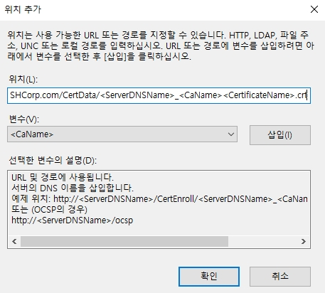
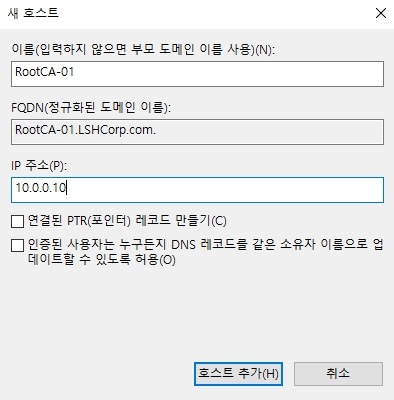

# Windows Certificate Authority Demo

이 번 문서에는 2 계층의 CA 구조로 PKI 환경을 구성합니다.  
* Root CA: workgroup 서버로 추후 설정 후에는 서버를 오프라인으로 유지합니다  
    * 위와 같이 Root CA를 오프라인으로 유지하는 이유는 Root CA의 개인키를 보호하기 위함입니다.  
* Issue CA: Domain에 가입된 서버로 중간 인증 및 인증서 발급 역할을 진행합니다.

## 1. Root CA 구성

* Root CA는 Workgroup으로 위와 같이 설정합니다.


* 서버 역할 관리자를 통하여 AD 인증 서비스를 설치합니다.


* AD CA에 필요한 기능을 같이 추가합니다.


* 다음으로 넘어갑니다.


* AD CA가 되게 되면, 컴퓨터의 이름 및 도메인 가입 & 탈퇴가 불가능하게 됩니다.


* AD CA 서비스 중, 인증기관 역할만을 선택하여 설치합니다.


* 설치를 진행합니다.


* 설치가 끝나게 되면, AD CS를 구성합니다.


* Root CA이기 때문에, 로컬 서버의 Admin 계정으로 자격 증명을 실행합니다.


* 인증 기관을 선택 활성화합니다.


* Domain에 가입된 서버가 아니기 때문에, 독립 CA를 선택합니다.


* 루트 CA를 선택합니다.


* 신규 CA를 구축하기 때문에, 새 개인 키를 생성합니다.


* 인증 내용을 해시로 만드는데 사용할 암호화 옵션을 선택합니다.
* _SHA256에 4096을 흔히 많이 사용합니다._


* CA의 이름을 설정합니다.
* default 값은 __[서버 네임]-CA__ 입니다. 


* 발급한 인증성의 유효 기간을 설정합니다.
* Demo에서는 5년으로 설정하였지만, 실무에서는 13개월 이하로 진행해야 합니다.
    * Chrome 및 Firefox 정책에서 특정 기간 이내에 인증서만 유효하다고 판단하기로 되어있습니다.


* CA DB 위치를 지정합니다.


* 모든 설정이 완료되었다면, CA를 구성합니다.


* 구성에 성공하면 위와 같이 출력됩니다.


## 2. Root CA CDP 및 AIA 설정
참고링크: [https://learn.microsoft.com/ko-kr/windows-server/networking/core-network-guide/cncg/server-certs/configure-the-cdp-and-aia-extensions-on-ca1](https://learn.microsoft.com/ko-kr/windows-server/networking/core-network-guide/cncg/server-certs/configure-the-cdp-and-aia-extensions-on-ca1)


* Root CA의 속성으로 넘어갑니다.


* Root CA의 속성을 살펴보면, 확장에서 CDP를 확인할 수 있습니다.
* CDP는 CRL(인증서 해지 목록)이 있는 배포 지점으로, Root CA는 오프라인에 들어갈 예정이기 때문에 하위 CA 경로로 CDP를 추가합니다.


```py
# 입력 경로
http://LSHCA-01.LSHCorp.com/CertData/<CaName><CRLNameSuffix><DeltaCRLAllowed>.crl

# 형식
http://[접속 경로]/<CaName><CRLNameSuffix><DeltaCRLAllowed>.crl
```
* 위 경로 형식을 참고하여, 경로를 입력합니다.


1. 새로 추가한 경로 이외에 모든 경로를 삭제합니다.
    * "C:\Windows\system32\CertSrv\CertEnroll\<CaName><CRLNameSuffix><DeltaCRLAllowed>.crl" 는 삭제하지 않습니다.
2. CRL 파일을 요약본인 델타 CRL도 활성화합니다.
3. Root CA에서 발급된 인증서에 CDP 속성이 들어가게 합니다.
4. 설정한 내용을 적용합니다.


* 적용 시에는 재시작이 필요하지만, AIA도 적용 후에 재시작하기 위하여 "아니오"를 선택합니다.


* 확장 선택에서 AIA로 변경 후, 새로운 AIA를 추가합니다.
* AIA는 클라이언트가 CA 인증서가 없을 경우에 배포 받는 지점입니다.


```py
# 입력 경로
http://LSHCA-01.LSHCorp.com/CertData/<ServerDNSName>_<CaName><CertificateName>.crt

# 형식
http://[접속경로]/<ServerDNSName>_<CaName><CertificateName>.crt
```


1. 새로 추가한 AIA 이외의 AIA 경로는 전부 삭제합니다.
    * "C:\Windows\system32\CertSrv\CertEnroll\<ServerDNSName>_<CaName><CertificateName>.crt"는 삭제하지 않습니다.
2. Root CA가 발급한 인증서에 AIA 경로를 넣는 것을 활성화 합니다.
3. 모든 설정을 적용합니다.


* AD CS를 재시작합니다. (_서버가 재부팅 되지는 않습니다._)


* CDP와 AIA를 변경하였음으로 AD CS에 이 내용을 게시합니다.


* 이를 통하여 새로운 CRL을 반영합니다.


* 생성된 __CRL 파일__(인증서 해지 목록)과 __CRT 파일__(Root CA Self-signed 인증서)은 "C:\Windows\system32\CertSrv\CertEnroll\"에 생성 및 갱신됩니다.


* 이제는 클라이언트 및 멤버 서버들에 배포한 PKI용 Root CA 인증서를 내보낼 차례입니다.
* Root CA의 속성으로 이동합니다.


* __인증서 보기__ 를 클릭합니다. 


* 자세히 탭으로 이동합니다.


* Self-signed 인증서를 복사하기 위하여 __파일에 복사__를 클릭합니다.


* 다음으로 넘어갑니다.


* DER로 인코딩 된 바이너리 X.509 파일로 내보냅니다.


* Root CA 인증서를 저장할 경로 및 이름을 설정합니다.
* 클라이언트에게 저장할 인증서로 나타내기 위하여 기존 crt 파일과 다른 이름으로 저장합니다.
    * Crt 파일과 큰 차이는 없습니다.


* Root CA 인증서를 저장합니다.


* 다음으로 넘어갑니다.


* 생성한 인증서들을 복사하여, 새로운 폴더에 복사한 파일들을 생성합니다.

하위 CA 설정은 다음 문서(Winodws CA Demo_2)에서 설명합니다.

### DNS(AD DC)에 Root CA 정보 추가


* DNS에서 새로운 호스트에 Root CA를 추가합니다.


## 3. 내용 정리
1. Root CA를 생성합니다.
2. Root CA는 추후에 오프라인 서버로 전환하기 때문에 CDP와 AIA URL을 아직 생성하지 않은 하위 CA로 설정합니다.
3. 내부 DNS에서 Root CA에 대한 정보를 모르기 때문에 DNS(AD DC)에 서버명을 추가합니다.