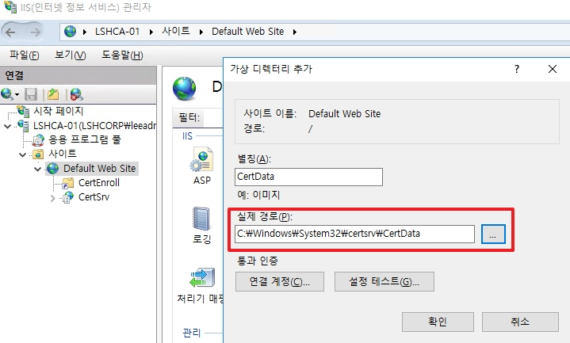
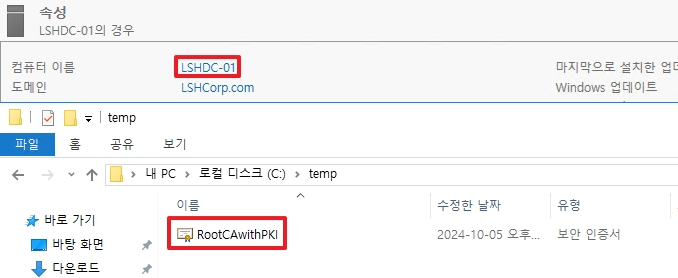
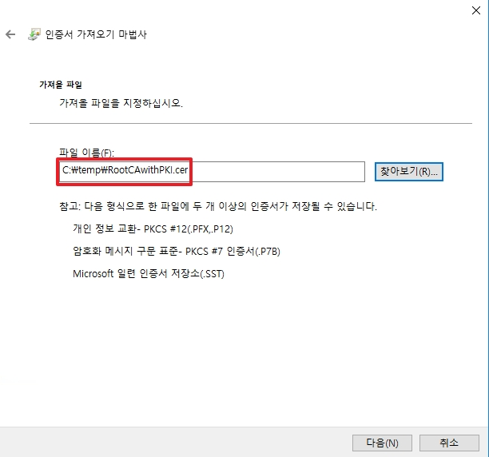

# Windows Certificate Authority Demo

## 1. Domain Issue CA 생성 및 Root CA 인증서 설치

* 하위 CA 서버를 생성한 후, 도메인에 가입합니다.
* Domain Admin과 Enterprise Admin 그룹에 속한 계정으로 로그온합니다.


* AD CS 역할을 선택합니다.


* 다음으로 넘어갑니다.


1. 인증 기관 서비스를 활성화합니다.
2. 인증 기관 웹 등록 서비스를 활성화합니다.
    * 하위 CA는 다른 서버들로부터 인증서를 발급하는 CA역할합니다.


* 역할을 설치합니다.


* 설치가 완료되면, 역할을 설정합니다.
* Domain Admin과 Enterprise Admin 그룹에 속한 계정으로 자격증명합니다.


* __인증 기관__ 과 __인증 기관 웹 등록__ 을 활성화합니다.


* 하위 CA는 도메인에 자동으로 발급하는데 사용할 CA이기 때문에 __엔터프라이즈__ 로 선택합니다.


* 하위 CA이기 때문에 __하위 CA__ 를 선택합니다.


* 새롭게 구축하는 CA이기 때문에 __새 개인 키 만들기__ 를 선택합니다.


* RSA256에 4096으로 생성합니다.


* `도메인-서버명-CA`가 기본 값으로 그대로 설정합니다.


* 하위 CA는 구축한 후, 운영하기 위해서는 상위 CA로 부터 인증서를 발급 받고 적용해야 합니다.
* 이에 사용되는 __.req__ 파일을 C: 에 저장합니다.


* 다음으로 넘어갑니다.


* 하위 CA(엔터프라이즈)를 구성합니다.


* 구성 후에는 Root CA로부터 가져온 Root CA 인증서를 설치합니다.


* 현재 로그온한 사용자 뿐만이 아닌 하위 CA 서버에서 사용할 수 있도록 __로컬 컴퓨터__ 를 선택합니다.


* 인증서를 저장할 위치를 찾습니다.


* Root CA 인증서이기 때문에 `신뢰할 수 있는 루트 인증 기관`으로 선택합니다.


* Root CA 인증서 등록을 완료합니다.

## 2. Root CA로부터 하위 CA인증서 발급 및 AD CS 시작 & 세팅

* 하위 CA 인증서를 발급 요청하는 .req 파일은 위에서 설정한대로 C:\에 생성됩니다.


* .req 파일을 Root CA로 옮깁니다.


* Root CA 이름을 우 클릭하여, __새 요청 제출__ 을 클릭합니다.


* 요청이 완료되면, 자동으로 발급 되지 않습니다.
* `보류 중인 요청` 탭으로 이동하여서 발급 요청한 하위 CA 인증서를 발급합니다.


* 발급 되어진 인증서를 옮기기 위하여 __인증서 속성__ 에 들어가 파일을 복사합니다.


* CA용 인증서이기 때문에 PKCS #7 인증서로 내보냅니다.


* 파일을 저장합니다.


* 인증서 생성에 성공합니다.


* 생성한 인증서를 다시 하위 CA로 가져옵니다.


* 하위 CA에 가져온 인증서를 설치합니다.


* 가져온 인증서를 선택합니다.

### [퀴즈] 위와 같이 인증서를 설치하면 정상적으로 하위 CA가 서비스를 시작할까요?


</br>  
</br>  
</br>  

### [정답]

* 정답은 시작되지 않습니다. 그 이유는 루트 CA의 CDP와 AIA 지점을 하위 CA로 잡았기 때문에 이에 대한 설정을 진행하지 않았기 때문입니다.


* 가져온 `CRL` 파일과 `crt` 파일을 __C:\Windows\System32\certsrv\CertData__ 에 생성합니다.
* _다른 위치에 해도 됩니다. `C:\Windows\System32\certsrv`가 기본 위치이기 때문에 같게 설정하였습니다._


* 해당 위치는 물리적인 위치이고, 클라이언트는 http로 들어오기 때문에 IIS에 __/CertData__ 라는 하위 경로를 생성합니다.


* CDP와 AIA가 정상적으로 동작한다면, AD CS가 정상적으로 동작합니다.

### 그렇다면 하위 CA의 CDP와 AIA는?

* 기본적으로 설정이 되어있습니다.
* IIS는 `기본 경로/CertEnroll` 으로 되어 있습니다.
* 로컬 위치는 `C:\Windows\System32\certsrv\CertEnroll`로 되어 있습니다.


* 하지만 CDP 옵션을 설정이 되어 있지 않기 때문에 설정을 추가합니다.


* AIA 옵션도 똑같이 설정이 되어 있지 않기 때문에 설정을 추가합니다.


* 설정을 마친 후, AD CS를 다시 시작합니다.


* CDP와 AIA의 변경 사항을 게시하기 위하여 다시 게시합니다.


* CDP를 새로 게시하였기 때문에, 수정한 날짜가 변경된 것을 확인할 수 있습니다.

## 3. Root CA 오프라인 전환 후, AD DC에 Root CA 인증서 GPO 생성

* Root CA의 개인 키를 안전하게 보관하기 위하여 Root CA를 종료합니다.


* DC의 Admin 계정으로 로그온하 한 후, Root CA 인증서를 하위 CA로 부터 가져옵니다.


* GP 관리 편집기에 들어가서 도메인 단위로 적용되는 GPO를 편집합니다.


* 하기의 경로로 이동합니다.
    * 경로: `컴퓨터 구성` -> `정책` -> `Windows 설정` -> `보안 설정` -> `공개 키 정책` -> `신뢰할 수 있는 루트 인증 기관` -> `우 클릭` -> `가져오기`


* 다음으로 넘어갑니다.


* 가져온 Root CA 인증서를 등록합니다.


* 인증서를 저장할 위치를 선택합니다.


* 설정을 완료합니다.


* 인증서를 가져오는데 약간의 시간이 소요됩니다.


* 정책 설정이 정상적으로 실행되면 인증사가 화면과 같이 출력됩니다.


```bash
gpupdate /force
```
* 정책을 반영할 수 있도록 DC에서 위 명령어를 실행합니다.


* Member Server에 로그온 한 후, 실해에서 `mmc.msc` 로 이동하여, 인증서가 생성된 것을 확인합니다.
* _운영 중인 서버라면 DC와 같이 gpupdate /force를 한 후 확인합니다._

## 3. 내용 정리
1. 하위 CA 생성 및 Root CA 인증서 등록
2. Root CA로 부터 하위 CA 인증서 발급 및 루트 & 하위 CA의 CDP & AIA 배포 지점 설정
3. AD GPO를 활용한 Root CA 인증서 배포 