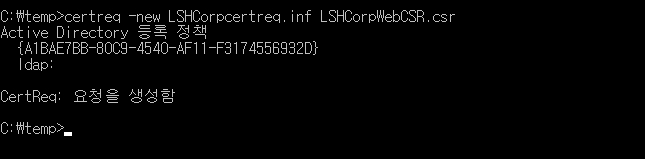
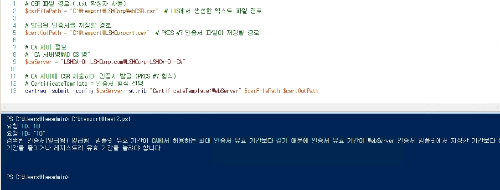
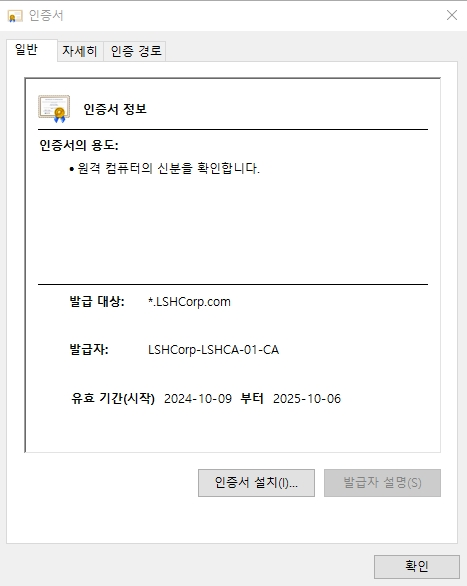
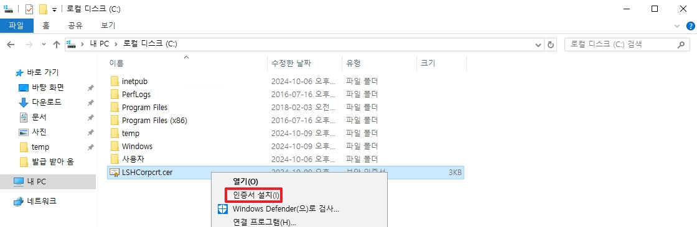
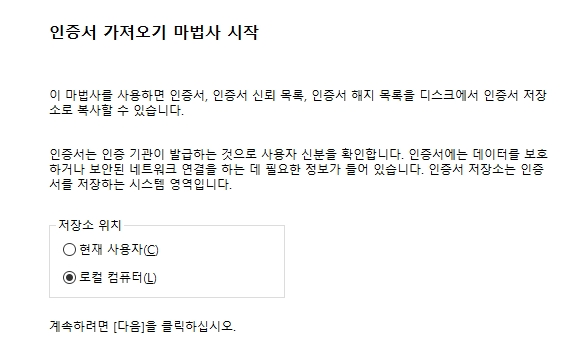
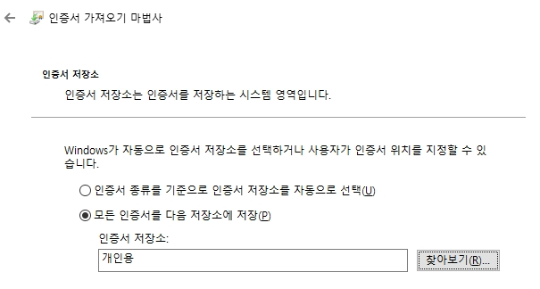
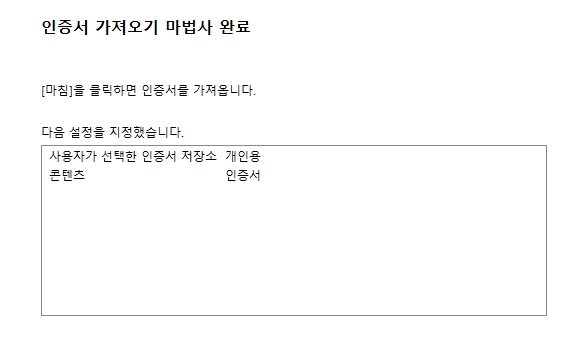
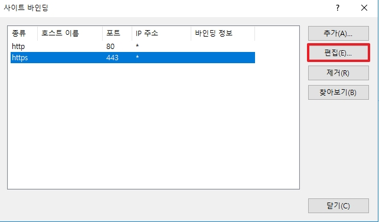
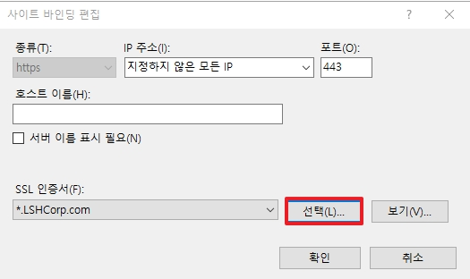
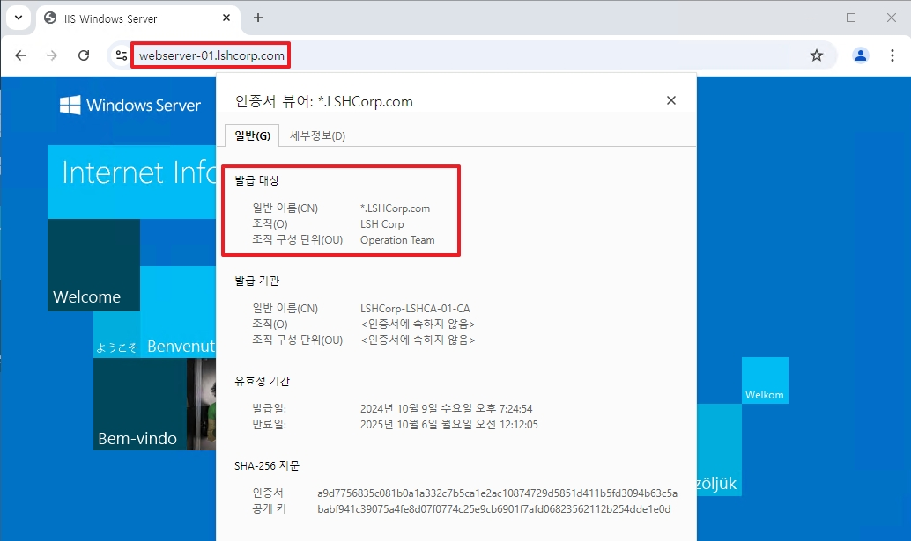

# 09. Issue certificate with CSR in Windows


링크: [https://learn.microsoft.com/ko-kr/windows/win32/seccertenroll/certenroll-portal](https://learn.microsoft.com/ko-kr/windows/win32/seccertenroll/certenroll-portal)


## 1. CSR 파일 생성
* 이번 과정에서는 Windows OS에서 CSR 파일을 생성하는 법을 배웁니다.  
</br>

IIS도 가능은 하지만, SAN과 같은 확장 필드를 생성할 수 없기 때문에 아래와 같은 방법으로 생성하는 것이 Chrome과 같은 브라우저들에 좀 더 적합합니다.

```
[Version]
Signature="$Windows NT$"

[NewRequest]
Subject = "CN=*.LSHCorp.com, O=LSH Corp, OU=Operation Team, L=Suwon, ST=Gyeonggi-do, C=kr"
KeySpec = 1
KeyLength = 4096
Exportable = TRUE
MachineKeySet = TRUE
SMIME = FALSE
PrivateKeyArchive = FALSE
UserProtected = FALSE
UseExistingKeySet = FALSE
ProviderName = "Microsoft RSA SChannel Cryptographic Provider"
ProviderType = 12
RequestType = PKCS10
KeyUsage = 0xa0

[Extensions]
2.5.29.17 = "{text}"
_continue_ = "dns=*.LSHCorp.com&"
_continue_ = "dns=LSHCorp.com";

[RequestAttributes]
CertificateTemplate = WebServer
```
CSR 파일을 발급하기 위하여 작성한 inf 파일 전체 내용입니다.

```
[Version]
Signature="$Windows NT$
```
* 이 파일은 Windows NT 운영 체제에서 사용되는 형식을 따르고 있음을 뜻 합니다.

```
[NewRequest]
Subject = "CN=*.LSHCorp.com, O=LSH Corp, OU=Operation Team, L=Suwon, ST=Gyeonggi-do, C=kr"
KeySpec = 1
KeyLength = 4096
Exportable = TRUE
MachineKeySet = TRUE
SMIME = FALSE
PrivateKeyArchive = FALSE
UserProtected = FALSE
UseExistingKeySet = FALSE
ProviderName = "Microsoft RSA SChannel Cryptographic Provider"
ProviderType = 12
RequestType = PKCS10
KeyUsage = 0xa0
```

* __Subject__: 인증서의 주체를 넣습니다.
    * CN(Common Name): 인증서 이름 혹은 도메인, 사용자 명
    * O(Organization Name): 조직 이름
    * OU(Organizational Unit Name): 조직 내 부서 이름
    * L(Locality Name): 조직이 위치한 시 또는 구 (ex: 수원시)
    * ST(State or Province Name): 조직이 위치한 주 또는 도 (ex: 경기도)
    * C(Country Name): 국가 설정
* __keySpec__: 공개 키와 비밀 키의 사용 용도를 나타냅니다. (1은 전자서명, 2는 데이터 암호화입니다.)
* __KeyLength__: 생성 되는 키(RSA)의 길이 입니다.
* __Exportable__: 인증서 발금을 요청하는 서버(`현재 서버`)의 개인 키를 CSR 파일 안에 넣을지 말지 정합니다.
* __MachineKeySet__: 사용자 키가 저장소가 아닌 로컬 컴퓨터 키 저장소 저장할지 선택합니다.
* __SMIME__ (Secure/Multipurpose Internet Mail Extensions): 이메일 메시지를 암호화 할지 정합니다 <- _인증서 발급에는 필요 없습니다._
* __PrivateKeyArchive__: 개인 키를 아카이브 할 것인지 선택합니다.
* __UserProtected__: 사용자와 상호 작용 없이 개인 키에 접근할 수 있는지 선택합니다.
* __UseExistingKeySet__: 기존에 있던 공개 키와 개인 키 쌍을 사용할지 선택 합니다.
* __ProviderName__: 암호화 키 방식 명을 선택합니다.
* __ProviderType__: 암호화 키 방식 타입 번호를 설정합니다.
    * _12번은 __Microsoft RSA SChannel Cryptographic Provide__ 를 뜻합니다._
* __RequestType__: 공개키 암호화와 관련된 표준 타입을 지정합니다.
    * CSR 파일과 같은 인증서 요청 타입의 표준 타입 값은 __PKCS#10__ 입니다.
* __KeyUsage__: 키를 어떻게 사용할지에 대하여 16진수로 나타냅니다.  
</br>
키 사용 용도를 조금 더 설명하면 아래의 표를 참고하면 좋습니다.  
예시로 0xa0은 이진 수로 변환하게 되면 10100000 입니다.

| 비트 위치 | 이진수 값 | 16진수 값 | 키 사용 용도         | 활성화 여부 |
|:---:|:---:|:---:|:---|:---:|
| 7         | 1          | 0x80      | Digital Signature     | 활성화됨    |
| 6         | 0          | 0x40      | Non-Repudiation       | 비활성화    |
| 5         | 1          | 0x20      | Key Encipherment      | 활성화됨    |
| 4         | 0          | 0x10      | Data Encipherment     | 비활성화    |
| 3         | 0          | 0x08      | Key Agreement         | 비활성화    |
| 2         | 0          | 0x04      | Key Cert Sign         | 비활성화    |
| 1         | 0          | 0x02      | CRL Sign              | 비활성화    |
| 0         | 0          | 0x01      | Encipher Only         | 비활성화    |

위 표를 참고하여 보면 이 키는 전자 서명과 암호화에 사용되게 됩니다.  
</br>

```
[Extensions]
2.5.29.17 = "{text}"
_continue_ = "dns=*.LSHCorp.com&"
_continue_ = "dns=LSHCorp.com";
```

위 확장은 `SAN`(Subject Alternative Name) 인증서를 위한 확장 필드입니다.  
웹을 운영하다 보면, 모든 웹 서버마다 인증서를 발급하여 리소스를 낭비할 수 없습니다.  
같은 도메인(LSHCorp.com) 안에 있다면 하나의 인증서로 모든 웹 서버에서 사용하자는 개념에서 나왔으며 이것을 우리는 SAN이라고 부릅니다.
* 일반적으로 *으로 와일드 카드를 넣은 URL 하나와 도메인 명을 추가하여 사용합니다.
* 하위 도메인에서도 사용하고 싶다면 아래와 같이 추가하면 됩니다.

```
[Extensions]
2.5.29.17 = "{text}"
_continue_ = "dns=*.LSHCorp.com&"
_continue_ = "dns=LSHCorp.com&"
_continue_ = "dns=*.learn.LSHCorp.com"
```

이제 마지막으로는 CA 서버가 가지고 있는 인증서 템플릿을 설정합니다.

```
[RequestAttributes]
CertificateTemplate = WebServer
```
_Windows CA가 기본적으로 가지고 있는 WebServer 템플릿으로 설정합니다._

### CSR 파일 생성

```py
# 예시
# inf 파일이 있는 폴더로 이동 후
certreq -new [사용할 inf 파일 명].inf [생성할 csr 파일 명].csr

# 사용 명령어
certreq -new LSHCorpcertreq.inf LSHCorpWebCSR.csr
```
* CMD에서 위 명령어를 사용하여 csr 파일을 발급합니다.



## 2. CA에서 powershell을 사용하여 CSR 파일을 인증서로 변환

```bash
# CSR 파일 경로 (.txt 확장자 사용)
$csrFilePath = "C:\tempcrt\LSHCorpWebCSR.csr"  # IIS에서 생성한 텍스트 파일 경로

# 발급된 인증서를 저장할 경로
$certOutPath = "C:\tempcrt\LSHCorpcrt.cer"  # PKCS #7 인증서 파일이 저장될 경로

# CA 서버 정보
# "CA 서버명\AD CS 명"
$caServer = "LSHCA-01.LSHCorp.com\LSHCorp-LSHCA-01-CA"

# CA 서버에 CSR 제출하여 인증서 발급 (PKCS #7 형식)
# CertificateTemplate = 인증서 형식 선택
certreq -submit -config $caServer -attrib "CertificateTemplate:WebServer" $csrFilePath $certOutPath
```
* 위 명령어를 ps1 파일로 만든 후 CA 서버에서 실행합니다.





## 3. IIS에서 인증서 설정 후, HTTPS로 통신하기


* CA에서 발급 받은 인증서를 다시 Web Server로 가져옵니다.
* 가져온 인증서를 서버에 설치합니다.


* 로컬 컴퓨터로 선택합니다.


* 인증서를 저장할 위치를 선택합니다.


* 인증서를 저장합니다.


* IIS에로 접속하여 Https를 사용할 사이트의 바인딩 편집으로 이동합니다.


* Https 통신에서 사용할 인증서를 선택합니다.
* 위에서 저장하였던 인증서 명을 찾아 위와 같이 인증서를 선택합니다.


* (내부망) Client에서 Chrome 브라우저를 사용하여 접속하면 Https로 접속한 것을 확인할 수 있습니다.
* SAN을 이용하여 *.LSHCorp.com으로 하였기 때문에 LSHCorp.com 도메인에서 운영 중인 모든 Web Server에서 사용이 가능합니다.