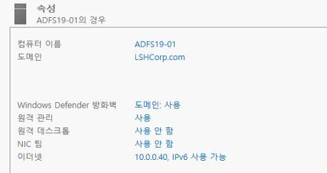
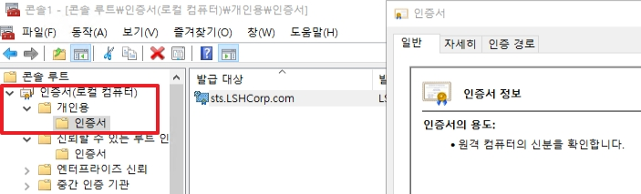
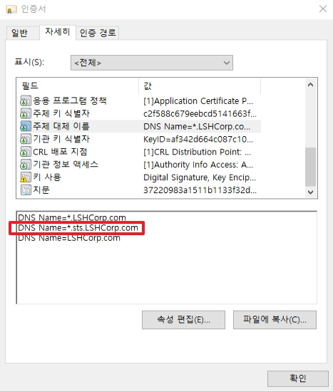
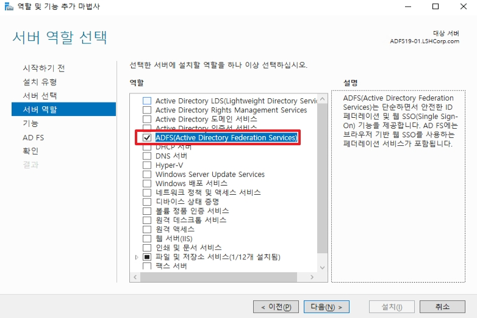
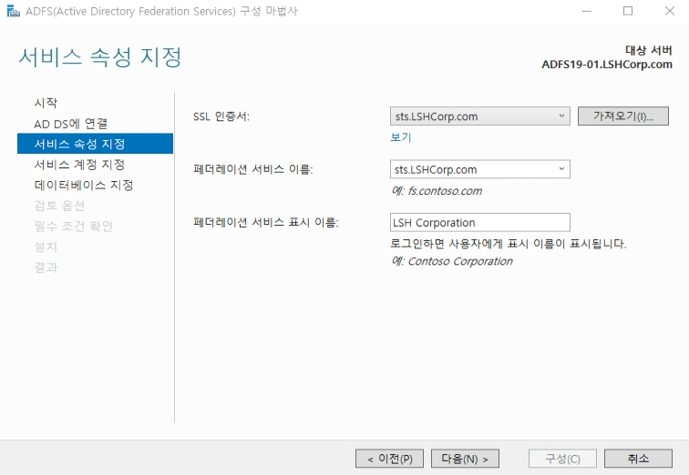
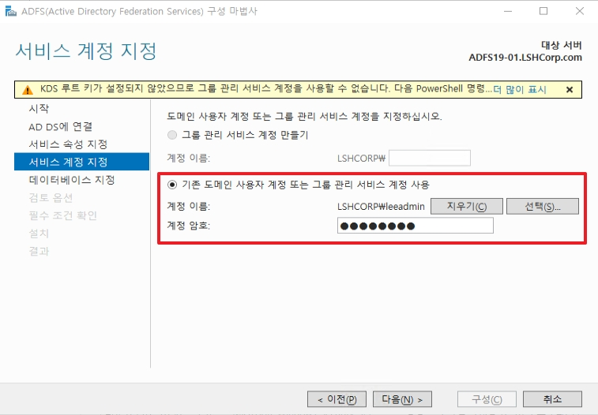
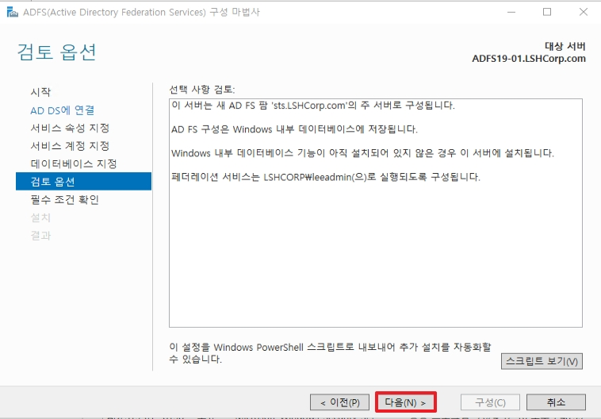
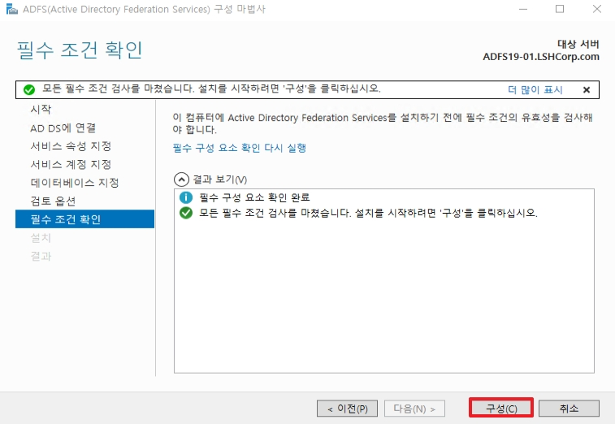

# 10. Active Directory Federation Services

ADFS는 쉽게 설명하면 SSO 인증이다. 외부에서 접속하게 되면 직접적으로 AD에 쿼리를 날리는 것은 바람직하지 않다.  
따라서 이것을 대신 인증하게 해주는 서버가 필요한데 이것을 쉽게 ADFS라고 정의할 수 있다.


## 1. ADFS 구축
_이번 과정에서는 WAP를 사용하지 않고, Farm 안에 stand-alone인 상황으로 구현하였다._


*  ADFS 용 서버를 생성한다.


* ADFS에서 사용할 인증서를 발급 받아야 합니다.
* 발급 받은 인증서는 "로컬 PC의 -> 개인용"에 저장하여야 됩니다.


* 발급 받은 인증서의 대상은 ADFS 서버명이 아닌 ADFS 서비스 명으로 발급 받습니다.


* 인증에 필요하기 때문에 서비스 명의 __*.서비스명.도메인__ 으로 SAN(Subject Alternative Name)이 필요합니다.


* 서버 역할에서 ADFS 역할을 선택합니다.


* ADFS를 설치합니다.


* ADFS 설치가 완료되었으면, 서비스를 구성합니다.


* ADFS를 처음 구성 했으면, __서버 팜__을 구성합니다.


* 현재 접속한 Enterprise Admin 계정을 사용합니다.


1. SSL 인증서는 위에서 저장한 "개인 저장소"에 있는 인증서를 선택합니다.
2. ADFS 이름을 선택합니다.  
    * 도메인 명으로 인증서를 발급 받게 되면, 서비스 이름이 선택 목록에 없을 수 있습니다.

3. UI에 표기될 서비스 이름을 설정합니다.


* 서비스 관리자 계정을 선택합니다.


* ADFS 로그를 저장할 위치를 선택합니다.


* 다음으로 넘어갑니다.


* 지금까지 설정한 내용을 구성합니다.


* 설치가 완료됩니다.

## 2. 외부 설정


* DNS에 ADFS 서버가 아닌 서비스명을 추가하기 위하여 AD서버에 로그온합니다.
* 새 호스트에 추가합니다.


* 서비스 명과 IP주소를 입력합니다.


* DNS에 레코드를 생성합니다.

## 3. ADFS SSO 테스트 진행
* _외부가 아닌 ADFS 서버 자체에서 동작하는지 테스트를 진행하여 봅니다._


* ADFS에 Windows 인증(NTLM)을 끕니다.
    * Windows 환경이 아닌 디바이스에서 사용하게 되면 동작하지 않을 수 있습니다.


* _ADFS는 인트라넷과 엑스트라넷을 IP 기준으로 판별합니다._


```bash
Set-AdfsProperties -EnableIdpInitiatedSignonPage $true
```
* Powershell에서 위 명령어를 입력합니다.
* 위 명령어를 통하여 사용자가 adfs 명령어를 통하여 직접 로그온이 가능합니다.


```
https://<ADFS_서비스명_도메인>/adfs/ls/idpinitiatedsignon.aspx
```
* ADFS 내에서 위 URL로 이동합니다.


* 로그온 합니다.


* 정상적으로 로그온이 되는지 확인합니다.

#### ++ 추가) UPN 로그온 결과


