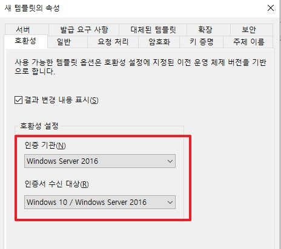
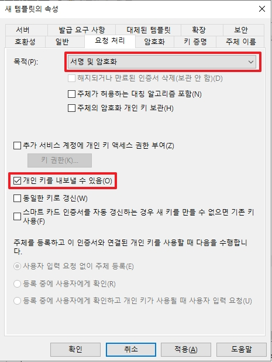
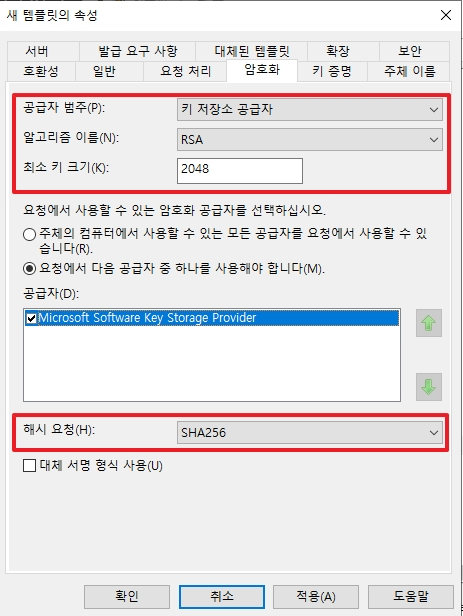
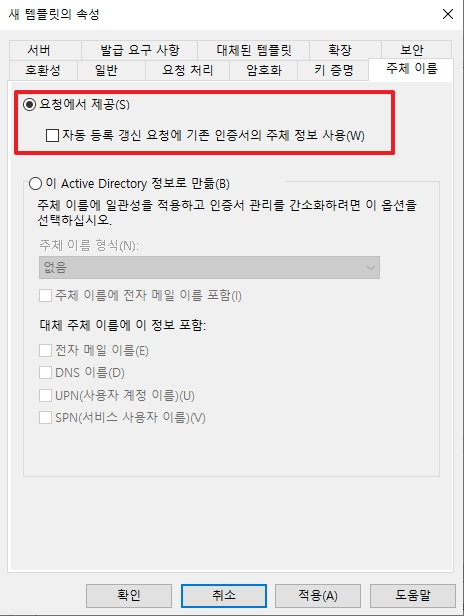
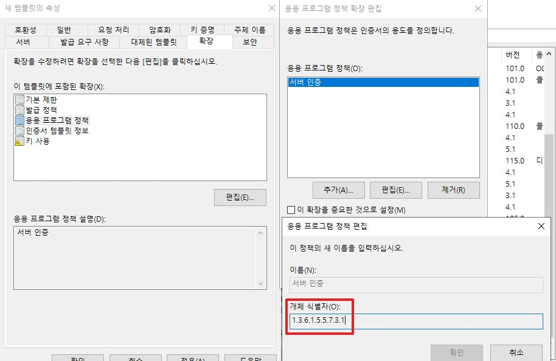
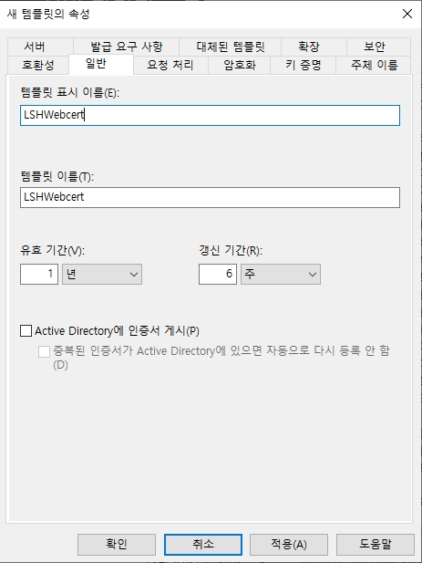
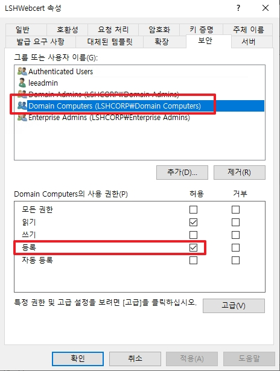
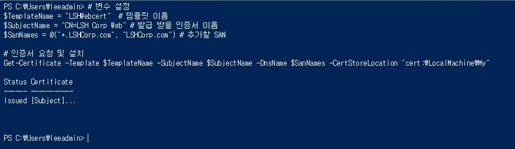
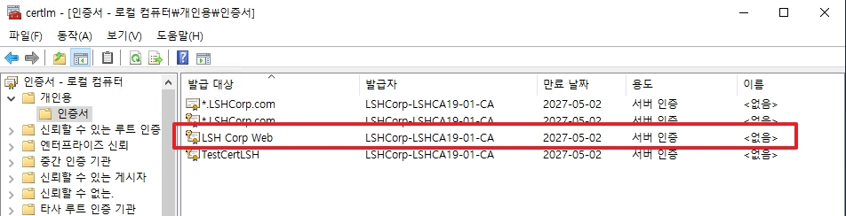
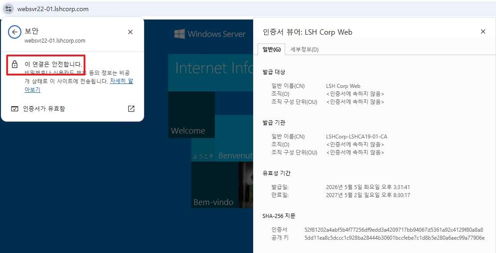

# 11. CA 운영

CA 운영 시, 고려할 점을 정리하여 같이 기록합니다.  


## 목차


## 1. RootCA 인증서 만료 시, 인증서 변경 작업


<br>

## 2. 웹서버 인증서 템플릿 및 자동화

위 9번 목차에서처럼 inf 파일을 통하여 직접적으로 인증서를 CA로부터 발급 받을 수 있지만 아래와 같이 매우 절차가 길고 자동화가 편한편은 아니다.  

* `inf 파일` -> `CSR 파일` -> `CER 파일` -> `인증서 등록`

따라서 CA에서 웹서버 템플릿을 제대로 만들고, 명령어로 해당 템플릿을 기반으로 인증서를 바로 요청할 수 있도록 아래와 같이 기록하게 되었다.  
전사 보안 기준이 아닌 Chrome과 Edge 등에서 인증서 사용 시, 보안 문구가 출력이 되지 않는 방향으로 작성하였습니다.  

```powershell
# 멤버 서버에서 인증서를 템플릿을 발급받기 예시 코드
# 변수 설정
$TemplateName = "LSHWebcert"  # 템플릿 이름
$SubjectName = "CN=LSH Corp Web" # 발급 받을 인증서 이름
$SanNames = @("*.LSHCorp.com", "LSHCorp.com") # 추가할 SAN

# 인증서 요청 및 "로컬서버저장소/개인용"에 저장
Get-Certificate -Template $TemplateName -SubjectName $SubjectName -DnsName $SanNames -CertStoreLocation "cert:\LocalMachine\My"
```

#### CA는 Windows Server 2019 이며, 기본 WebServer 템플릿을 복제하여 수정하였습니다


* 호환성은 제일 최신인 Windows Server 2016으로 설정합니다.  

<br>


* 인증서가 PKI 구조에서 동작할 수 있도록 `서명 및 암호화`를 선택합니다.  
* 해당 인증서가 리눅스 서버에서도 사용할 수 있도록 `개인 키를 내보낼 수 있음`을 활성화 합니다.  

<br>


* 범주는 제일 최신으로 `키 저장소 공급자`를 선택합니다.  
* 알고리즘은 일반적인 `RSA`를 선택하며, Legacy에서도 동작할 수 있도록 `2048`을 선택합니다.  
* 해시 또한 브라우저에서 권장하는 `SHA-256`을 선택합니다.  

<br>


* 발급을 요청하는 서버에서 `CN과 SAN`을 직접 입력할 수 있도록 `요청에서 제공` 옵션을 선택합니다.  
* 인증서 재발급 시, 키를 신규 생성하는 매커니즘을 권장하여 자동 등록 갱신은 활성화 하지 않습니다.  

<br>


* WebServer 템플릿을 복제하였다면 기본으로 설정되어 있는 부분입니다.  
* 브라우저에서는 이 인증서가 무슨 용도인지 위 `1.3.6.1.5.5.7.3.1`로 이해합니다.  

<br>


* Chrome 기준으로 인증서의 유효기간은 13개월을 권고합니다.  
* 따라서 위와 같이 유효기간은 1년, 갱신 기간은 6주로 설정합니다.  

<br>


* 위 명령어는 인증서를 저장할 때, 서버 인증서 저장소에 저장할 예정입니다.  
* 따라서 멤버 서버들이 인증서를 저장할 수 있도록 위와 같이 권한을 추가해야 합니다.  

<br>


* Powershell에서 정상적으로 실행될 경우, 위와 같이 출력됩니다.  

<br>


* CA에서 인증서가 발급이 정상적으로 될 경우에 추가 동작 없이 바로 저장됩니다.  

<br>


* Chrome과 Edge에서 정상적으로 동작하는 모습을 확인할 수 있습니다.  

<br>