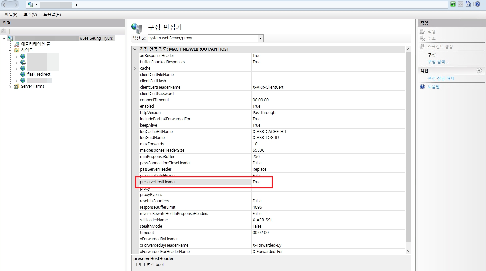
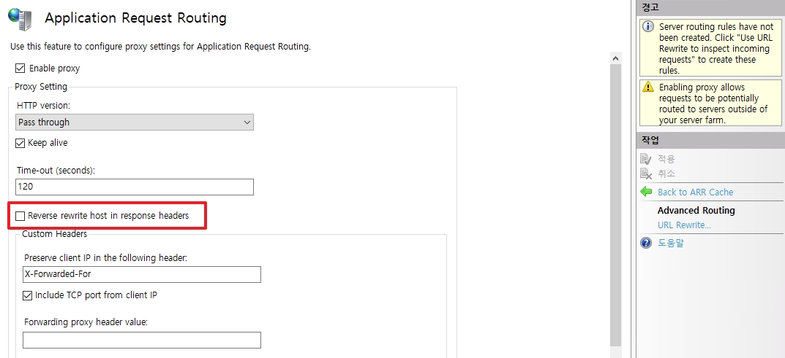
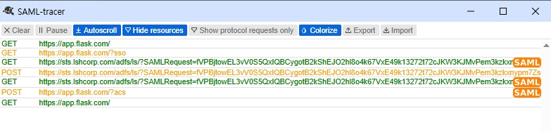

# SAML 2.0 With ADFS  

개인 Demo 링크: [https://github.com/MindException/SSO-with-ADFS](https://github.com/MindException/SSO-with-ADFS)  

ADFS 운영 환경을 실제로 이해할 수 있도록, SP(Service Provider)와 IDP(IDentity Provider)를 실제로 구현하여 기록합니다.  
* SP: Web Server(IIS) -> Web Application Server(Flask)
* IDP: ADFS

해당 프로젝트는 onelogin 오픈소스를 사용하여 SAML를 구현하였습니다.  

## 목차
1. [IIS 설정](#1-iis-설정)


<br>

## 1. IIS 설정  

위에서 사용된 IIS는 Reverse Proxy 역할로 사용됩니다.  
따라서 IIS 및 ARR 설정은 2가지가 필수입니다.  

### 1. preserveHostHeader


* 경로: `IIS 웹서버` -> `구성 편집기` -> `system.webServer/proxy` -> `preserveHostHeader`
* 값: True

위 값을 체크하지 않으면 `Web Svr -> WAS`로 패킷을 넘길 때 사용한 IP 혹은 호스트명이 사용됩니다.  

```
--- Incoming Headers ---
Connection: Keep-Alive
Accept: text/html,application/xhtml+xml,application/xml;q=0.9,image/avif,image/webp,image/apng,*/*;q=0.8,application/signed-exchange;v=b3;q=0.7
Accept-Encoding: gzip, deflate, br, zstd
Accept-Language: ko-KR,ko;q=0.9
Cookie: session=eyJBdXRoTlJlcXVlc3RJRCI6Ik9ORUxPR0lOX2RiYjM4NTBjMjA0MGYzMTNlOWY1MzcxNWZiNGRjNTA4MThmYmY1YjUifQ.agMmxg.aF-OhX2zipTDEJbOCoCyTYMbHO8
Host: app.flask.com
Max-Forwards: 10
Referer: https://app.flask.com/
User-Agent: Mozilla/5.0 (Windows NT 10.0; Win64; x64) AppleWebKit/537.36 (KHTML, like Gecko) Chrome/147.0.0.0 Safari/537.36
Sec-Ch-Ua: "Google Chrome";v="147", "Not.A/Brand";v="8", "Chromium";v="147"
Sec-Ch-Ua-Mobile: ?0
Sec-Ch-Ua-Platform: "Windows"
Upgrade-Insecure-Requests: 1
Sec-Fetch-Site: same-origin
Sec-Fetch-Mode: navigate
Sec-Fetch-User: ?1
Sec-Fetch-Dest: document
Priority: u=0, i
X-Original-Url: /?sso
X-Forwarded-For: 10.0.0.131
X-Arr-Ssl: 2048|256|DC=com, DC=LSHCorp, CN=LSHCorp-LSHCA19-01-CA|CN=app.flask.com
X-Arr-Log-Id: 121fcbe6-3f3c-4da7-917e-5aedefe8e2b1
-------------------------
```
```
Host: app.flask.com
```
* 위 옵션을 체크하여 위와 같이 Client가 접속할 때 사용한 URL 값이 들어간다.  
* 만약 체크하지 않았다면 Host 값은 `Host: 10.0.0.131:8123`으로 표기된다.  

<br>

### 2. Reverse rewrite host in response headers



* 경로: `IIS 웹서버` -> `Application Request Routing Cache` -> `Server Proxy Settings` -> `Reverse rewrite host in response headers`
* 값: 비활성화  

해당 값은 기본적으로 체크로 활성되어있으며, 웹서버가 응답하는 헤더 값을 host 값과 같게 변환하게 됩니다.     
일반적으로는 문제가 없으나 Redirect 할 때 문제가 발생하게 됩니다. ADFS에서 로그인하여 인증을 받기 위해 ADFS로 Redirect를 해야하지만 이 부분을 IIS가 SP의 Host명으로 수정하게 됩니다.  

예시
* 활성화: https://app.flask.com/adfs/ls/?SAMLRequest=fVPBjtow~~~~
* 비활성화: https://sts.LSHCorp.com/adfs/ls/?SAMLRequest=fVPB~~~~

위와 같이 활성화하게 되면 Redirect를 못 하기 때문에 결국 로그인이 불가능하게 됩니다.  
추가적으로 ADFS는 `X-Forwarded-For 헤더`가 필요합니다. 위와 같이 ARR에는 기본 설정이 되어있음으로 수정하지 않습니다.   

<br>

## 2. SP 설정


<br>

## x. Web Browser SSO 동작 과정

  
위 동작과정은 아래와 같다.

1. https://app.flask.com 으로 접속
2. SSO 로그인 접속
3. ADFS 로그인 화면 접속 및 SAML Request 전달
4. Post로 접속할 계정 ID/Pwd 전송
5. ADFS에서 인증 후, SAML Request 재요청
6. ADFS로부터 받은 SAML Response /acs 로 전달
7. SSO 로그인 성공

> SAML Request/Response는 `content-type: text/html`으로 전부 Get형태로 SAML을 전달합니다.  

<br>

### 3,5 SAML Request

```xml
<samlp:AuthnRequest xmlns:samlp="urn:oasis:names:tc:SAML:2.0:protocol"
                    xmlns:saml="urn:oasis:names:tc:SAML:2.0:assertion"
                    ID="ONELOGIN_f630e57f79e0280f99d1887ebfa30eb3ee2c7656"
                    Version="2.0"
                    ProviderName="SP test"
                    IssueInstant="2026-05-17T15:17:35Z"
                    Destination="https://sts.LSHCorp.com/adfs/ls/"
                    ProtocolBinding="urn:oasis:names:tc:SAML:2.0:bindings:HTTP-POST"
                    AssertionConsumerServiceURL="https://app.flask.com/?acs"
                    >
    <saml:Issuer>https://app.flask.com/metadata/</saml:Issuer>
    <samlp:NameIDPolicy Format="urn:oasis:names:tc:SAML:1.1:nameid-format:emailAddress"
                        AllowCreate="true"
                        />
    <samlp:RequestedAuthnContext Comparison="exact">
        <saml:AuthnContextClassRef>urn:oasis:names:tc:SAML:2.0:ac:classes:PasswordProtectedTransport</saml:AuthnContextClassRef>
    </samlp:RequestedAuthnContext>
</samlp:AuthnRequest>
```


### 6 SAML Response

```xml
<samlp:Response xmlns:samlp="urn:oasis:names:tc:SAML:2.0:protocol"
                ID="_ad3b4aff-686d-4f65-b616-889383ff43bd"
                Version="2.0"
                IssueInstant="2026-05-17T15:17:53.337Z"
                Destination="https://app.flask.com/?acs"
                Consent="urn:oasis:names:tc:SAML:2.0:consent:unspecified"
                InResponseTo="ONELOGIN_f630e57f79e0280f99d1887ebfa30eb3ee2c7656"
                >
    <Issuer xmlns="urn:oasis:names:tc:SAML:2.0:assertion">http://sts.LSHCorp.com/adfs/services/trust</Issuer>
    <samlp:Status>
        <samlp:StatusCode Value="urn:oasis:names:tc:SAML:2.0:status:Success" />
    </samlp:Status>
    <Assertion xmlns="urn:oasis:names:tc:SAML:2.0:assertion"
               ID="_ddecb4e5-8396-4606-b176-39e694c91a90"
               IssueInstant="2026-05-17T15:17:53.337Z"
               Version="2.0"
               >
        <Issuer>http://sts.LSHCorp.com/adfs/services/trust</Issuer>
        <ds:Signature xmlns:ds="http://www.w3.org/2000/09/xmldsig#">
            <ds:SignedInfo>
                <ds:CanonicalizationMethod Algorithm="http://www.w3.org/2001/10/xml-exc-c14n#" />
                <ds:SignatureMethod Algorithm="http://www.w3.org/2001/04/xmldsig-more#rsa-sha256" />
                <ds:Reference URI="#_ddecb4e5-8396-4606-b176-39e694c91a90">
                    <ds:Transforms>
                        <ds:Transform Algorithm="http://www.w3.org/2000/09/xmldsig#enveloped-signature" />
                        <ds:Transform Algorithm="http://www.w3.org/2001/10/xml-exc-c14n#" />
                    </ds:Transforms>
                    <ds:DigestMethod Algorithm="http://www.w3.org/2001/04/xmlenc#sha256" />
                    <ds:DigestValue>hHyJ3aQgpqg8st9FQEjI14q0r2OfNeHK0TNSHXdQob8=</ds:DigestValue>
                </ds:Reference>
            </ds:SignedInfo>
            <ds:SignatureValue>OTgGmv9+Hn8ebjI1P4VMEw8ZtIzSbzVRLAVMRFjc+d4YEzSagHrLCHWZHWOdup81ILVmuvg5Dml3KU2bkgq5arCvsi6KEvDuLkqEt/CNR8C+mzdHEeDaY+MyiFjXxEkhl8PjCjZErT9T7Ibr6+F1PUwRl6UDX2eu4JQGifrVhk8soUgLNWk7KjFiTHj1eE7ma4mLYn1xV8dTdt7zOaNzPw3JnZm5scOtzICQMYSdm2GRj2Jt6+WSBanW/m94H86gyYue4+dNkxfpX/SFkAeDXLFzMBA0WzNYHoyaQGrR8YNqtlRUhcOBEdJ2q4Ul5V7sm0lAe5sylPM9Yv1qdeuWxg==</ds:SignatureValue>
            <KeyInfo xmlns="http://www.w3.org/2000/09/xmldsig#">
                <ds:X509Data>
                    <ds:X509Certificate>MIIC2jCCAcKgAwIBAgIQbuOng6M3zphHBHJTiU13uDANBgkqhkiG9w0BAQsFADApMScwJQYDVQQDEx5BREZTIFNpZ25pbmcgLSBzdHMuTFNIQ29ycC5jb20wHhcNMjYwNTA1MTI0NDA1WhcNMjcwNTA1MTI0NDA1WjApMScwJQYDVQQDEx5BREZTIFNpZ25pbmcgLSBzdHMuTFNIQ29ycC5jb20wggEiMA0GCSqGSIb3DQEBAQUAA4IBDwAwggEKAoIBAQCkXxOYHYcV6p4xxdpLr8jGC4tM5lIZpzC20cxnI3Tfk4uL1wefTTEdy+BgojmTyoHfMgsxK0YJHsmEkwMHCyv9yZrTPCSmKIIEQpsa5Y8WWGpoXM/avvCjyzKk4tS1RdXHnps4STrm1s0kkArV8bOppnOSXurP03LOM0zf+lnLUNaG7ZmBeDL+FBeDrMP+gqHOhohkn3KDMIu03DXL2MOiR9CIT9wFGjLO9BN1sbI5YfA8DnQt4n4k9B8PRJN10IOfUtMRF0DekQuc+miFRevqxIFvATsResn8qjbfLYR6B/HHKnwpr8gWtsI/zJJw4Y5MpuzmnBNLw2nNFheI29tFAgMBAAEwDQYJKoZIhvcNAQELBQADggEBADnrZAROAHViD3Knka6grRjBJ3PdLhWQuCuE7yOCyc0nG/F3vtONhnTWRWmNHikHVUopOZbrs7Y3lJ0/Kkuc5oIpG0bY2AEYtr/7lA68lBjYrRGVlQj/sCdRovh0sRCDUI+CbIIi/E7y9JxMaPNzB4QGFCRwGm51BYnUhyyamN+e6ul0rwaHY4pPbg5SOdoGdsZ1j5lryxgq3gUyO8ipD6zQT3wHJI2v0a5HI3PgszIthLpusKXnv2mayQCxkGP7cMlyVWZ3no8gQPP9J/QR0FnPYQ71SkxzHA1hJ1iMISyZo+Ff+nZHm6xc/3dq1Qr8XVgEA87mqcRZ6tobdIa6YaY=</ds:X509Certificate>
                </ds:X509Data>
            </KeyInfo>
        </ds:Signature>
        <Subject>
            <NameID Format="urn:oasis:names:tc:SAML:1.1:nameid-format:emailAddress">AFmail@lshcorp.com</NameID>
            <SubjectConfirmation Method="urn:oasis:names:tc:SAML:2.0:cm:bearer">
                <SubjectConfirmationData InResponseTo="ONELOGIN_f630e57f79e0280f99d1887ebfa30eb3ee2c7656"
                                         NotOnOrAfter="2026-05-17T15:22:53.337Z"
                                         Recipient="https://app.flask.com/?acs"
                                         />
            </SubjectConfirmation>
        </Subject>
        <Conditions NotBefore="2026-05-17T15:17:53.337Z"
                    NotOnOrAfter="2026-05-17T16:17:53.337Z"
                    >
            <AudienceRestriction>
                <Audience>https://app.flask.com/metadata/</Audience>
            </AudienceRestriction>
        </Conditions>
        <AttributeStatement>
            <Attribute Name="http://schemas.xmlsoap.org/ws/2005/05/identity/claims/emailaddress">
                <AttributeValue>AFmail@lshcorp.com</AttributeValue>
            </Attribute>
        </AttributeStatement>
        <AuthnStatement AuthnInstant="2026-05-17T15:17:53.274Z"
                        SessionIndex="_ddecb4e5-8396-4606-b176-39e694c91a90"
                        >
            <AuthnContext>
                <AuthnContextClassRef>urn:oasis:names:tc:SAML:2.0:ac:classes:PasswordProtectedTransport</AuthnContextClassRef>
            </AuthnContext>
        </AuthnStatement>
    </Assertion>
</samlp:Response>
```