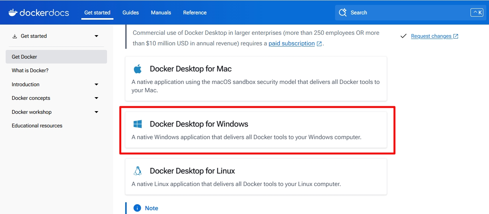
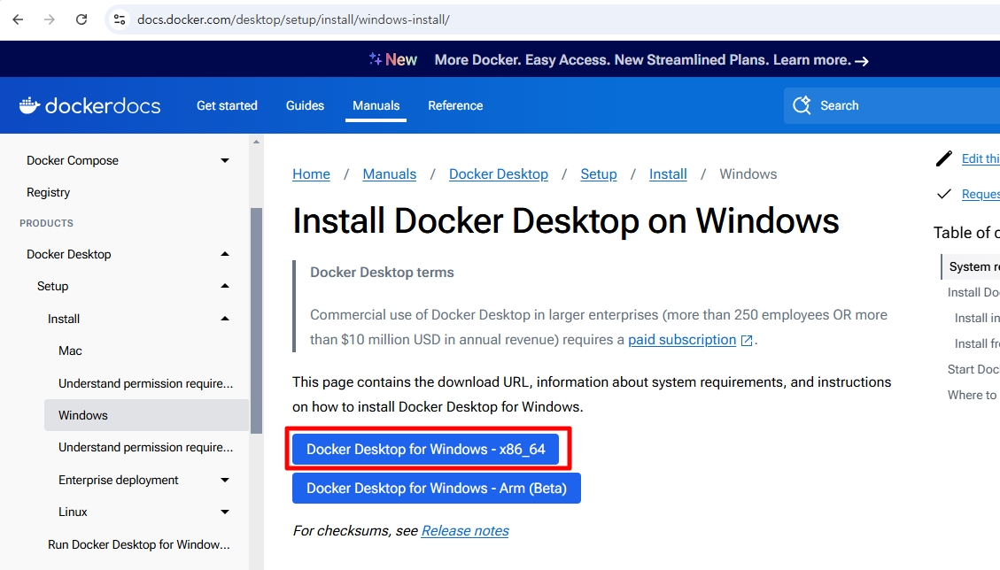
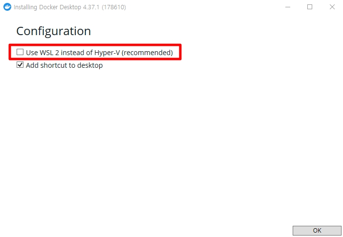
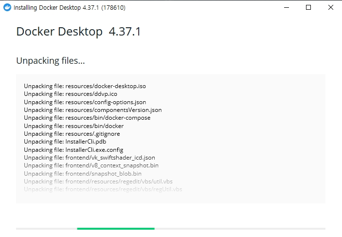
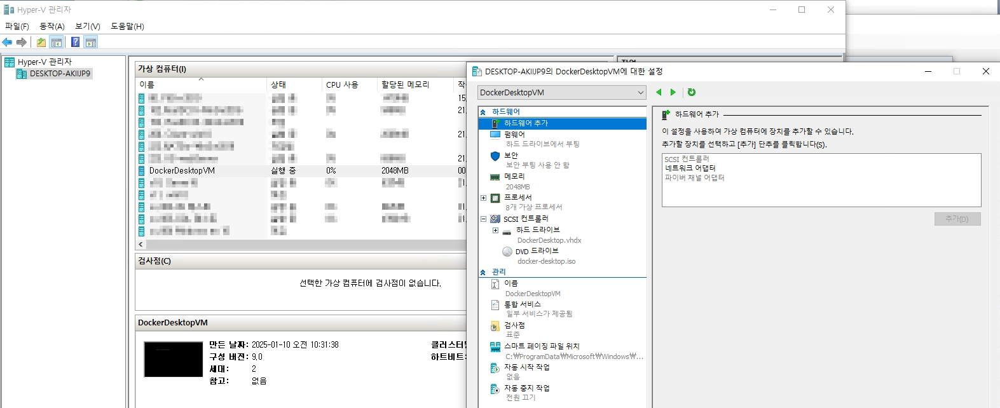

# Docker Desktop 설치

Linux에서는 CLI 기반으로 Docker Engine을 사용할 수 있지만, Windows에서는 Native하게 사용할 수 없기 때문에 Docker Desktop을 설치하여 Engine을 사용합니다.  
기본적으로 리눅스 기반 이미지에 Application을 올린 Con

Link: [https://www.docker.com/products/docker-desktop/](https://www.docker.com/products/docker-desktop/)
* 위 주소에서 Windows 용 Docker Desktop을 설치합니다.

* x86_64bit 옵션으로 Docker Desktop을 설치합니다.

* 이 부분의 옵션이 중요합니다.
* `WSL2`: Hyper-v 가상화 기술로 리눅스 기반 커널을 실행하여 컨테이너를 실행합니다.
    * 아래의 Hyper-v와는 조금 다릅니다. 형태가 아닌 가상화 기술로 이해하는게 좀 더 편합니다.
* `Hyper-v`: Hyper-v 기능을 사용하여 VM을 생성한 후, Windows 기반으로 컨테이너를 실행합니다.

_위 이야기에 대해서는 아래에서 조금 더 다룹니다._

* Docker Desktop을 설치합니다.

* 설치가 완료되면 서버를 재부팅합니다.

* Docker Desktop이 정상적으로 설치가 되면 Hyper-v 관리자에서 해당 Docker가 사용하는 VM을 확인할 수 있습니다.
* _WSL2로 설치할 시, 위와 같이 표기되지 않습니다._

 

# Windows Container