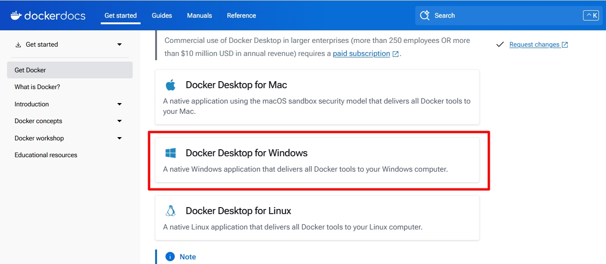
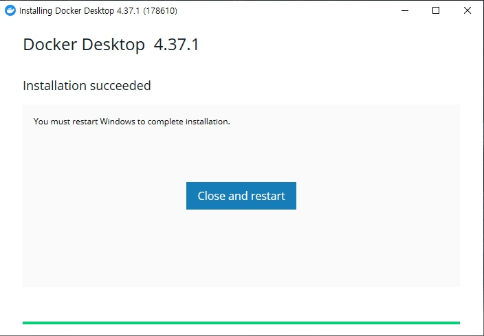
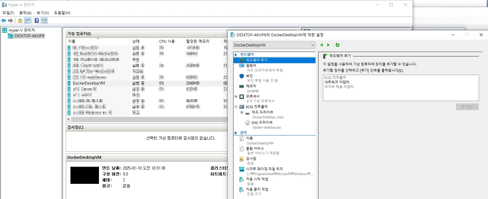

# Docker Desktop 설치

Docker Destop을 사용하는 이유는 실제 컨테이너 이미지를 GUI 개발 환경에서 좀 더 쉽게 만들기 위하여 사용하게 됩니다.(`Linux 컨테이너와 Windows 컨테이너 둘 다 가능`)  
_Windows Server 같은 경우에는 Docker Desktop에 대한 기술지원이 종료 되었으며, 오직 Windows 컨테이너에 대한 작업만 권장합니다._

<br>


Link: [https://www.docker.com/products/docker-desktop/](https://www.docker.com/products/docker-desktop/)
* 위 주소에서 Windows 용 Docker Desktop을 설치합니다.

<br>


* x86_64bit 옵션으로 Docker Desktop을 설치합니다.

<br>


```
PS C:\WINDOWS\system32> docker version
Client:
 Version:           27.4.0
 API version:       1.47
 Go version:        go1.22.10
 Git commit:        bde2b89
 Built:             Sat Dec  7 10:40:21 2024
 OS/Arch:           windows/amd64
 Context:           desktop-linux

Server: Docker Desktop 4.37.1 (178610)
 Engine:
  Version:          27.4.0
  API version:      1.47 (minimum version 1.24)
  Go version:       go1.22.10
  Git commit:       92a8393
  Built:            Sat Dec  7 10:38:57 2024
  OS/Arch:          linux/amd64
  Experimental:     false
 containerd:
  Version:          1.7.21
  GitCommit:        472731909fa34bd7bc9c087e4c27943f9835f111
 runc:
  Version:          1.1.13
  GitCommit:        v1.1.13-0-g58aa920
 docker-init:
  Version:          0.19.0
  GitCommit:        de40ad0
```
* 위 옵션 값과 함께 `docker version`을 보여주는 이유는 어떠한 옵션으로 설치하여도 `OS/Arch: linux/amd64`를 사용하게 됩니다.
    * 위 WSL2를 체크하지 않고 Hyper-v로만 설치하여도 기본적인 컨테이너 모드는 Linux 컨테이너로 되어있습니다.
    * _Windows Container 전환 방법은 아래에서 다룹니다._

* `WSL2`(권장): 경량화된 Hyper-v 기능을 사용하여 WSL2로 직접 Linux 이미지를 사용하여 컨테이너 내부에서 `파일을 읽고 쓰는 속도가 좀 더 유연`하며 `메모리가 동적`으로 관리되는 장점이 있습니다.
* Hyper-v: 보안성과 격리성에 대한 이점을 채울 수 있지만 WSL2에 비하여 VM처럼 조금 무겁다는 단점이 있습니다.

<br>


* Docker Desktop을 설치합니다.

<br>


* 설치가 완료되면 서버를 재부팅합니다.

<br>


* Docker Desktop을 WSL2 없이 설치하게 되면, 위와 같이 Hyper-v 관리자에서 해당 Docker가 사용하는 VM을 확인할 수 있습니다.
* _WSL2로 설치할 시, 위와 같이 표기되지 않습니다._

<br>
 
  
 
* 또한 위와 같이 Windows Container mode로 리눅스에서 전환이 가능합니다.

<br>

```
PS C:\WINDOWS\system32> docker version
Client:
 Version:           27.4.0
 API version:       1.47
 Go version:        go1.22.10
 Git commit:        bde2b89
 Built:             Sat Dec  7 10:40:21 2024
 OS/Arch:           windows/amd64
 Context:           desktop-windows

Server: Docker Desktop 4.37.1 (178610)
 Engine:
  Version:          27.4.0
  API version:      1.47 (minimum version 1.24)
  Go version:       go1.22.10
  Git commit:       92a8393
  Built:            Sat Dec  7 10:39:14 2024
  OS/Arch:          windows/amd64
  Experimental:     false
```