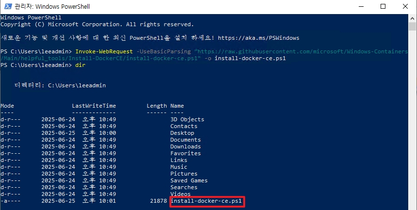
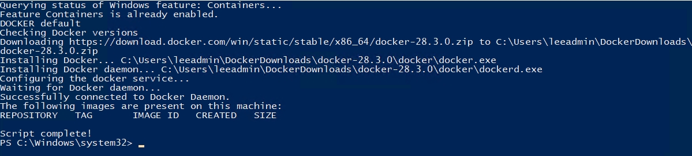

# Windows Container with Windows Admin Center

실제로 현업에서 Windows Container를 사용하기 위하여 서버에 Window OS 10/11를 설치하여 사용하지 않을 것 입니다.  
Windows Server를 설치하여 사용하며, 기존 10/11처럼 Docker Desktop을 사용하면 되지 않냐고 생각할 수 있지만 더 이상 Windows Server에서 Desktop을 지원하지 않습니다.  
이에 대하여 설치하는 과정을 기록하며, 이를 Windows Admin Center를 통하여 관리하는 방법을 기술합니다.

<br>

# Install Docker Engine with Windows Container

_2023년도에는 설치 시에 아래와 같은 방법을 사용하였습니다._
```powershell
# PowerShell 실행
Install-Module -Name DockerMsftProvider -Repository PSGallery -Force
Install-Package -Name docker -ProviderName DockerMsftProvider -Force
```
* 위 방법은 더 이상 기술지원 되지 않으며, 아래의 링크를 참조하여 진행합니다.
* 링크: [https://learn.microsoft.com/ko-kr/virtualization/windowscontainers/quick-start/set-up-environment?tabs=mirantiscontainerruntime](https://learn.microsoft.com/ko-kr/virtualization/windowscontainers/quick-start/set-up-environment?tabs=mirantiscontainerruntime)


<br>

해당 구성 환경은 Windows Server가 외부 인터넷과 통신이 가능해야 합니다.  



```
Invoke-WebRequest -UseBasicParsing "https://raw.githubusercontent.com/microsoft/Windows-Containers/Main/helpful_tools/Install-DockerCE/install-docker-ce.ps1" -o install-docker-ce.ps1
```
* 위 명령어를 입력하여 설치 스크립트를 다운로드 합니다.

<br>



```
.\install-docker-ce.ps1
```
* 위 명령어를 통하여 설치를 진행하며, 설치되는 동안 재부팅이 발생합니다.

<br>


```
PS C:\Windows\system32> docker version
Client:
 Version:           28.3.0
 API version:       1.51
 Go version:        go1.24.4
 Git commit:        38b7060
 Built:             Tue Jun 24 15:44:57 2025
 OS/Arch:           windows/amd64
 Context:           default

Server: Docker Engine - Community
 Engine:
  Version:          28.3.0
  API version:      1.51 (minimum version 1.24)
  Go version:       go1.24.4
  Git commit:       265f709
  Built:            Tue Jun 24 15:43:48 2025
  OS/Arch:          windows/amd64
  Experimental:     false
```
* 설치가 완료되면 위와 같이 `OS/Arch: windows/amd64`를 확인하면 됩니다.

<br>

# 2. Windows Admin Center