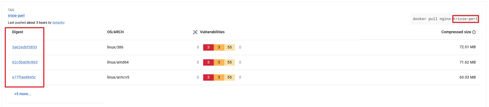

# Docker 컨테이너 기본 사용


## 목차

1. [Docker Hub Login & Logout](#1-docker-hub-login--logout)  
2. [Digest vs Tag](#2-docker-이미지-참조-비교-digest-vs-tag)
3. [Image Search & Download](#3-image-search--download)

## 1. Docker Hub Login & Logout

Docker Hub: [https://hub.docker.com/](https://hub.docker.com/)

* 도커 허브란 쉽게 이야기하여서 도커 엔진에서 사용할 컨테이너들의 이미지 저장소입니다.
* 따라서 

<br>

```
docker login -u [dockerHub 사용자명]
```
* 위 명령어로 docker hub에 로그인하여 이미지를 사용합니다.

```
docker logout
```
* 만약 다른 계정으로 docker hub를 사용해야할 경우, 위 명령어로 로그아웃합니다.

<br>

## 2. Docker 이미지 참조 비교: Digest vs Tag



| 항목 | Digest | 태그 (Tag) |
| :--- | :--- | :--- |
| **정의** | 이미지의 고유 SHA256 해시 값 | 이미지에 붙이는 사람이 읽기 쉬운 이름 |
| **고유성** | 고유함 | 동일한 태그가 여러 이미지에 사용될 수 있음 |
| **가변성** | 고정됨 (Immutable) | 업데이트 가능 (예: `:latest` 등) |
| **용도** | 특정 이미지 선택 시 사용 | 버전 선택의 편의성 |

</br>

위와 같이 값이 표기되며 추후에 아래에서 배울 이미지 다운로드 시에는 아래와 같은 차이가 있다.

```bash
#Tag
docker pull nginx:trixie-perl

#Digest
docker pull nginx@sha256:62c5ba08c863
```

<br>

## 3. Image Search & Download

### 1. 이미지 찾기
```powershell
# 명령어
docker search --limit=5 [이미지 명]

# 결과
PS C:\WINDOWS\system32> docker search --limit=5 ubuntu
NAME            DESCRIPTION                                      STARS     OFFICIAL
ubuntu          Ubuntu is a Debian-based Linux operating sys…   17629     [OK]
ubuntu/squid    Squid is a caching proxy for the Web. Long-t…   117
ubuntu/nginx    Nginx, a high-performance reverse proxy & we…   131
ubuntu/cortex   Cortex provides storage for Prometheus. Long…   4
ubuntu/kafka    Apache Kafka, a distributed event streaming …   55
```

### 2. 이미지 다운로드
* 편의를 위해서 위에서 사용하였던 예시 명령어를 사용합니다.

```bash
# 실제 명령어
docker pull docker.io/library/nginx:trixie-perl

# 요약된 명령어
docker pull nginx:trixie-perl
```
* 도커가 이미지 저장소(레지스트리)에서 이미지를 가져올 경우에는 `도메인`/`프로젝트명`/`이미지명` 경로에서 가져오게 됩니다.
* 도메인과 프로젝트명을 명시하지 않을 경우, 기본적으로 `Docker Hub(도메인)`에서 `library` 프로젝트에서 가져오게 됩니다.  
* library 프로젝트에 있는 이미지들은 official 이미지들입니다.  