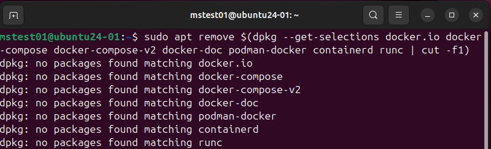
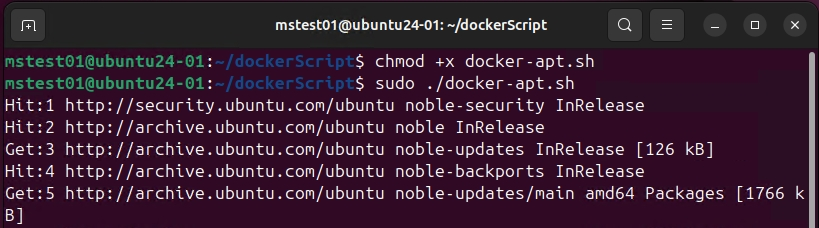
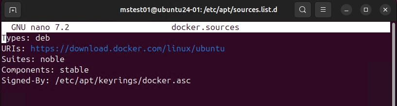
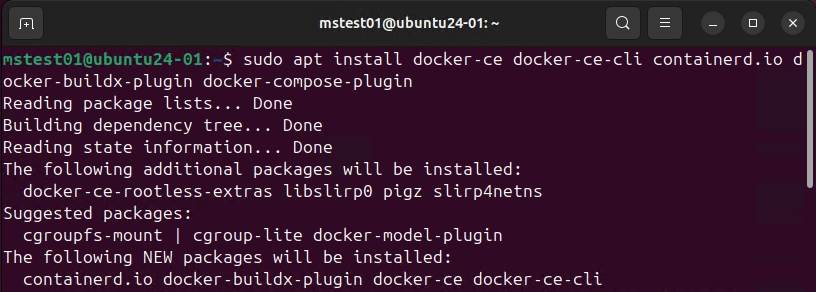
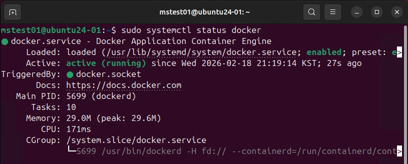
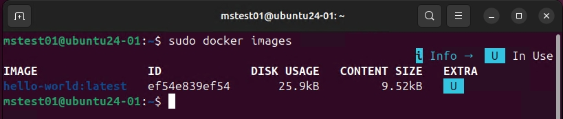

# Docker CE 세팅

이 과정은 Windows가 아니라 리눅스에서 정석으로 Docker를 사용하기 위하여 준비한 페이지입니다.  
_Windows에 치우친 경향이 있어서 우분투에서 시도하여 보았습니다._

## 환경
_Hyper-v 환경에서 구축되었습니다._

* `OS`: Ubuntu 24.04.4 LTS
* `vCPU`: 4 core
* `RAM`: 8192 MB

> 추가 세팅
* Hyper-v 2세대 VM 사용
* `보안부팅`: Microsoft UEFI 인증 기관
* _ISO는 원활하게 진행하기 위해 LTS로 사용합니다_.
```bash
Get-CimInstance Win32_Processor | Select-Object Name, NumberOfCores, NumberOfLogicalProcessors
```
* 위 명령어를 통하여 현재 PC에서 vCPU가 몇 개까지 가능한지 확인합니다.

네트워크는 내부망(도메인망)과 외부망(NAT)로 2가지를 사용하여 구축할 예정입니다.  
세팅 후에는 시스템에 설정에서 한국어 언어팩을 적용합니다. 만약 적용되지 않는다면 `APT Repository` 서버와 정상적으로 통신되지 않기 때문에 먼저 설정하고 시작합니다.  
_엄격하게는 다르지만 이해하기 쉽게 표현하자면 WSUS와 통신 확인 절차입니다._

추가적으로 hyper-v 고급 세션 사용을 위해 xrdp 설치와 아래 기능을 활성화합니다.
```bash
# 명령어
Set-VMProcessor -VMName "[Hyper-V VM명]" -ExposeVirtualizationExtensions $true

# 예시
Set-VMProcessor -VMName "200. Ubuntu24.04-01" -ExposeVirtualizationExtensions $true

# 확인
Get-VM | Get-VMProcessor | Select-Object VMName, ExposeVirtualizationExtensions
```
* 위 명령어를 해야 VM 내부에서 가상화가 가능합니다.


## nano 편집기
Windows의 notepad를 쓰다보니 vim이 익숙하지 않은 분들은 nano 편집기를 추천한다.

### 1. 설치 및 확인
```bash
sudo apt update
sudo apt install nano
nano --version
```

### 2. 기본 단축키
#### 1. 파일 저장 및 닫기
| 기능 | 커맨드 |
|:--|:--:|
|파일 저장|ctrl + O|
|파일 닫기|ctrl + x|

#### 2. 이동
| 기능 | 커맨드 |
|:--|:--:|
|찾기(where is)|ctrl + w|
|외부문자열 붙여넣기| crtl + alt + v|
|행 맨앞 이동(Ahead)|ctrl + a|
|행 맨뒤 이동(end)|ctrl + e|
|내부 문자열 자르기|ctrl + k|
|내부 문자열 붙여넣기|ctrl + U|

* _복사하기가 따라 없기 때문에 자르고 다시 붙여넣어서 사용합니다._

</br>

## Docker CE 설치
참고 링크: [https://docs.docker.com/engine/install/ubuntu/](https://docs.docker.com/engine/install/ubuntu/)

위 링크를 참고하여 docker APT 서버에서 패키지를 불러와 설치하는 실습을 진행합니다.

#### 1. 이전 버전 제거

```bash
sudo apt install docker-ce docker-ce-cli containerd.io docker-buildx-plugin docker-compose-plugin
```
* OS 이미지가 골든 이미지로 Docker가 포함된 경우가 있기 때문에 기존 docker가 있다면 제거합니다.

#### 2. Docker APT 서버 설정

```ini
# Add Docker's official GPG key:
sudo apt update
sudo apt install ca-certificates curl
sudo install -m 0755 -d /etc/apt/keyrings
sudo curl -fsSL https://download.docker.com/linux/ubuntu/gpg -o /etc/apt/keyrings/docker.asc
sudo chmod a+r /etc/apt/keyrings/docker.asc

# Add the repository to Apt sources:
sudo tee /etc/apt/sources.list.d/docker.sources <<EOF
Types: deb
URIs: https://download.docker.com/linux/ubuntu
Suites: $(. /etc/os-release && echo "${UBUNTU_CODENAME:-$VERSION_CODENAME}")
Components: stable
Signed-By: /etc/apt/keyrings/docker.asc
EOF

sudo apt update
```
* docker 패키지를 배포하는 APT서버를 설정합니다.
* _Windows에서 WSUS 위치 잡아주는 것과 같은 방식입니다._

#### ++참고)

* `/etc/apt/sources.list.d` 폴더에 위치하며 위와 같이 생성됩니다.

#### 3. Docker 패키지 설치

```bash
sudo apt install docker-ce docker-ce-cli containerd.io docker-buildx-plugin docker-compose-plugin
```
* 최신 Docker 패키지를 설치합니다.

#### 4. Docker 서비스 확인

```bash
sudo systemctl status docker
```
* 위 명령어를 사용하여 설치된 Docker 서비스가 자동으로 시작되었는지 확인합니다.  
* 만약 stop 상태라면 `sudo systemctl start docker` 위 명령어를 실행합니다.

#### 5. Docker 

```bash
sudo docker run hello-world
sudo docker images
```
* 마지막으로 Docker가 정상적으로 컨테이너를 다운로드 후, 실행이 가능한지 확인합니다.