# Python 설치 및 환경 구성

## 1. Python 다운로드 

### 1. Python 공식 홈페이지 접속
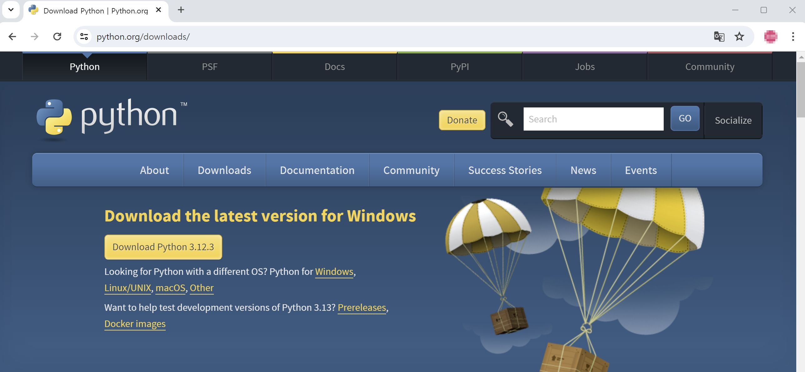
링크: [https://www.python.org/downloads/](https://www.python.org/downloads/)  


### 2. Windows installer 다운로드
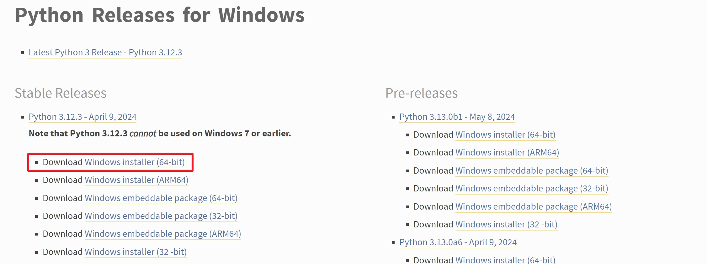
* 원하는 버전의 Python을 서버 가상환경에 맞게 선택하여 다운로드 합니다.

### 3. Winodws installer 실행
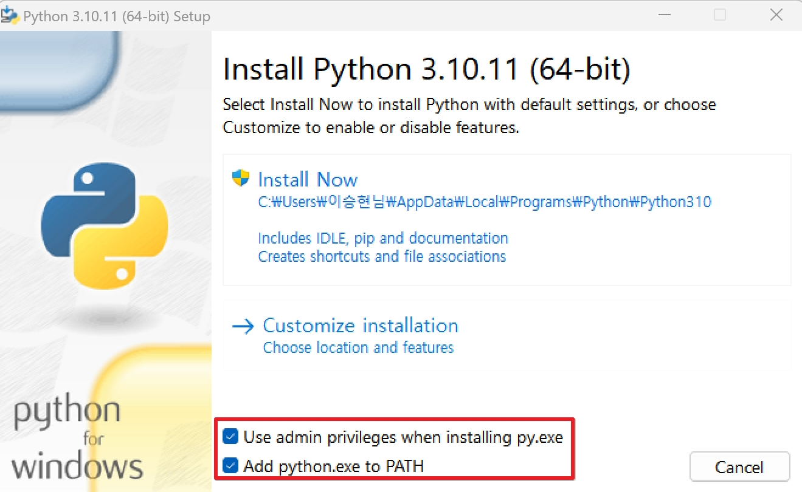
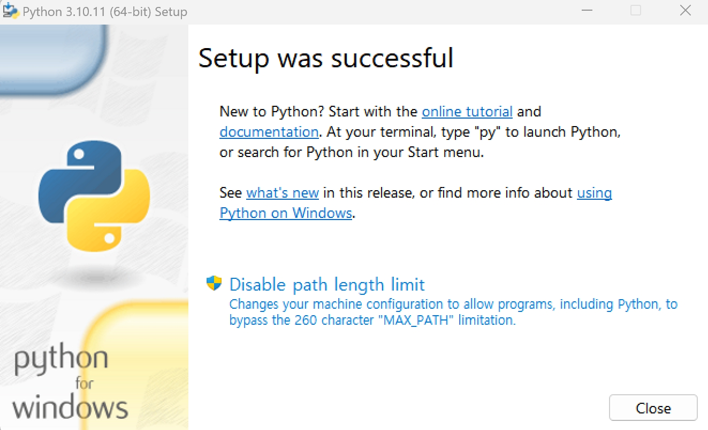
* 다운로드 받은 installer를 실행합니다.
* 아래의 관리자 권한 실행과 환경 변수 설정을 설정합니다.

### 4. 설치 후, CMD를 통한 Python 설정 화인
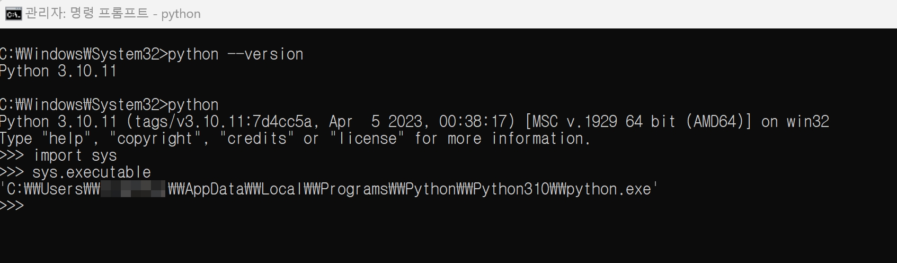
* CMD 창을 실행한 후, 아래의 명령어를 입력합니다.

```bash
:: 파이썬 버전 확인
python --verion

:: 파이썬 환경변수 설정 확인
python
import sys
sys.executable
```


## 2. Python 가상환경 만들기
아나콘다와 같은 기업 제품을 사용하여 가상환경을 좀 더 쉽게 다를 수 있겠지만,  
라이센스 문제 때문에 사용하지 못할 경우, 파이썬에서도 기본적으로 제공하는 가상환경이 있다.  

### 1. 경로 이동
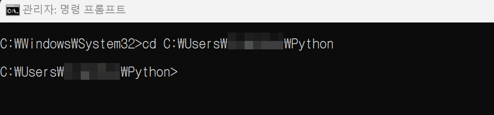
* 파이썬 가상환경을 만들 경로 이동한다.

<br>

### 2. 가상환경 생성(1)
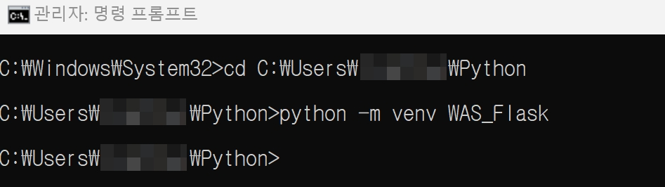
* 이동한 경로에서 아래의 명령어를 입력하여 가상환경을 생성한다.

```bash
python -m venv [가상환경 이름]
```

<br>

### 3. 가상환경 생성(2)
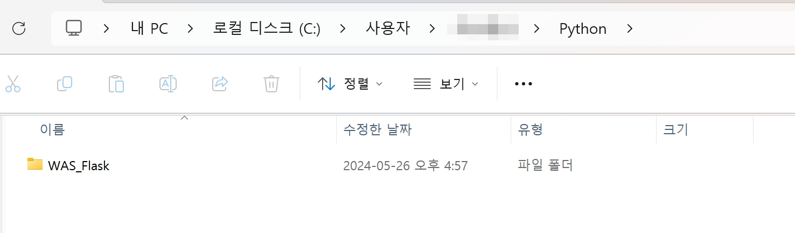
* 위 명령어를 사용하여 생성하면, 위와 같이 가상 환경 이름과 동일한 폴더가 생성된다.

<br>

### 4. 가상환경 실행
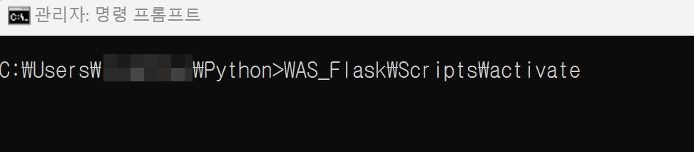
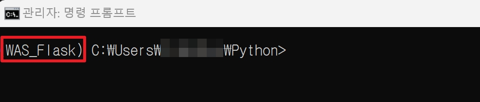
* 아래의 명령어를 입력하여 가상환경을 실행한다.
```bash
[경로]\activate.bat
```

<br>

### 5. 가상환경 실행 종료
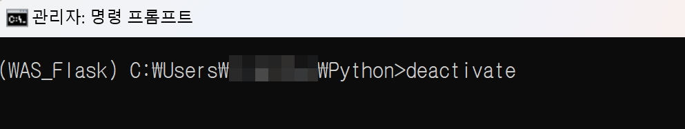
* 아래의 명령어를 입력하여 가상환경을 종료한다.
```bash
deactivate
```

<br>

### 추가) 가상환경 설치 모듈 리스트 출력
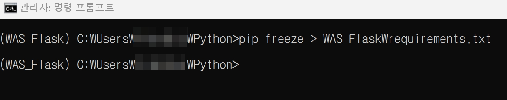
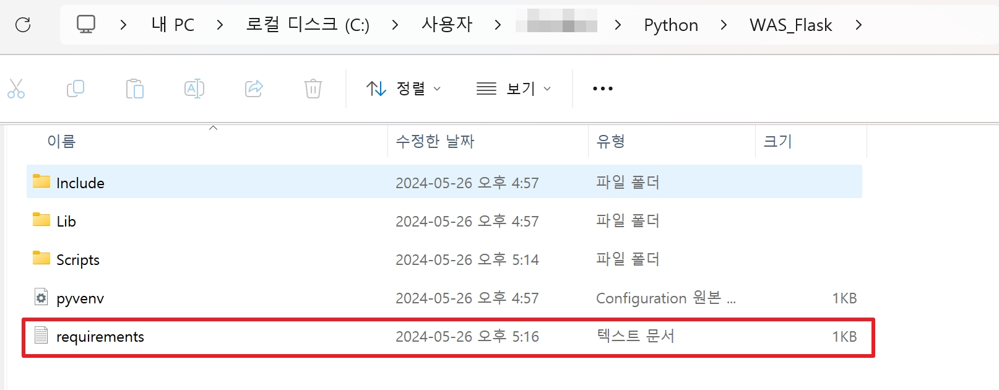
* 가상환경에서 pip 등을 사용하여 설치한 모듈 리스트를 관리하기 위하여 텍스트 파일로 목록을 출력할 수 있다.
* 명령어는 아래와 같다.
```bash
pip freeze > [가상환경 이름]\requirements.txt
```


## 3. Python 모듈 다운로드 및 오프라인 설치
실제로 서버를 운영하다보면 폐쇄망을 사용하는게 기본이다.  
하지만 우리는 개발을 하면서 원하는 모듈을 pip를 사용하여 인터넷을 통해 다운로드 및 설치한다.
아래의 방법은 개발 서버 등과 같은 인터넷이 가능한 환경에서 미리 다운 받은 파일을 폐쇄망에 설치하는 방법을 다룬다.

### 1. 패키지 오프라인 다운로드
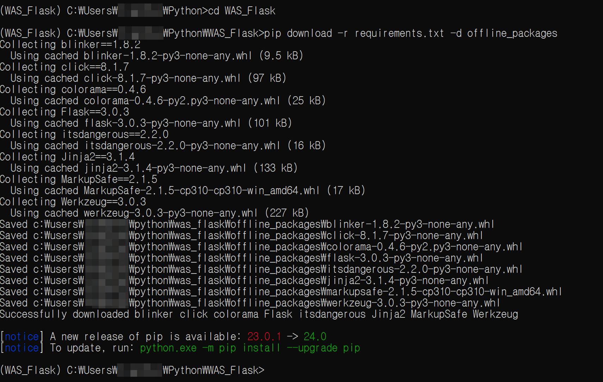
* 아래의 명령어를 입력하여 가상환경에 설치된 목록(requirements)을 다운로드합니다.
```bash
pip download -r requirements.txt -d [현재 경로에 저장할 폴더명]
```

<br>

### 2. 저장된 패키지 확인
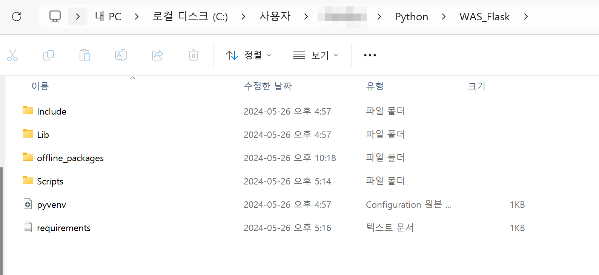
* 폴더가 없다면 폴더를 생성하여 해당 경로에 저장됩니다.

<br>

### 3. 파이썬을 설치하고 싶은 폐쇄망 서버에 파이썬 설치 후, 신규 가상환경 폴더를 생성합니다..
* 가상환경에는 환경 변수 및 설정 값들이 포함되어 생성되기 때문에, 이전 서버에 대한 정보들이 남아있습니다. 따라서 개발 서버에서 운영 서버로 넘겼을 때 `신규 가상 환경을 생성`하는 것을 권장합니다.

<br>

### 4. 패키지 오프라인 설치
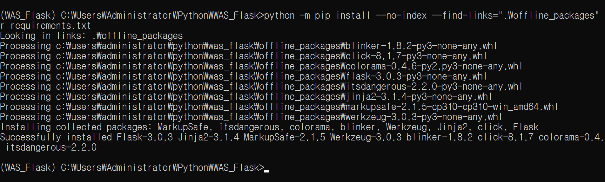
* 
```bash
python -m pip install --no-index --find-links="[저장된 설치 패키지가 있는 폴더 경로]" -r requirements.txt
```

<br>

### 4. 패키지 설치 확인
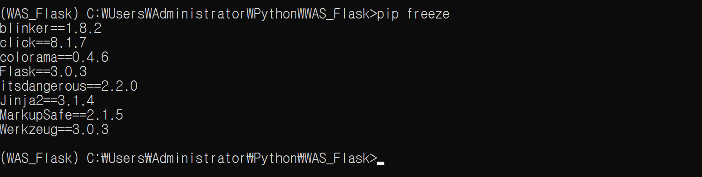
* 아래의 명령어를 입력하여 패키지가 설치되었는지 확인합니다.
```bash
pip freeze
```