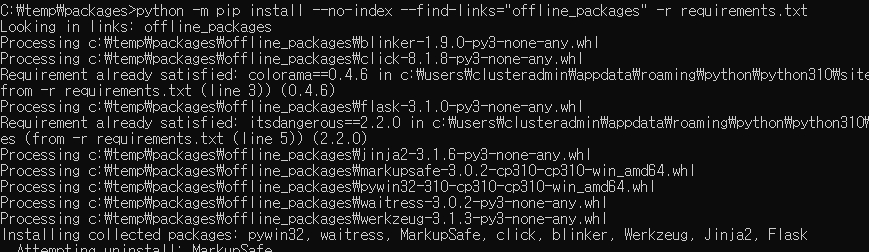
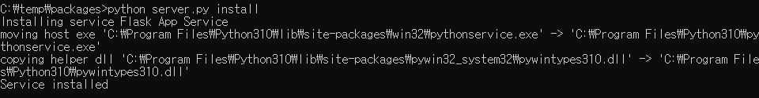
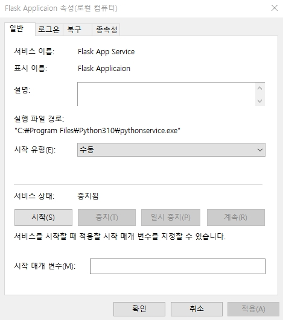
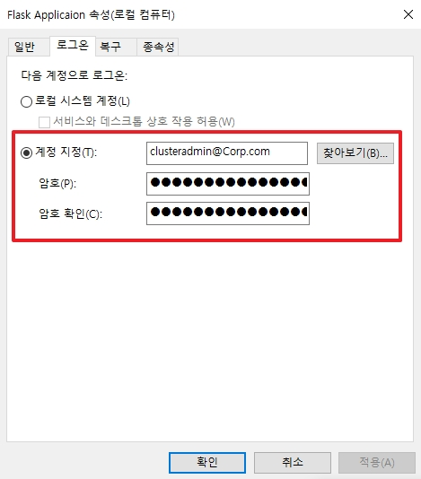
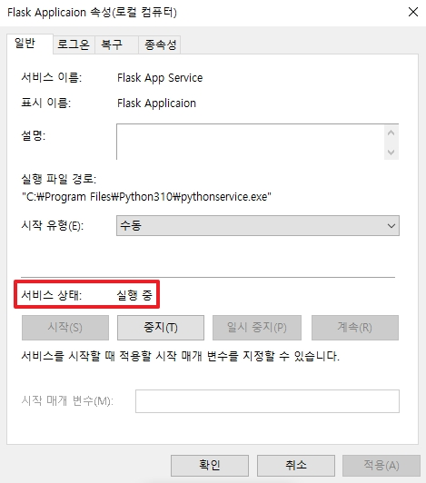

# Python Windows Service with Flask

파이썬으로 생성한 Application을 Failover Cluster를 이용하여 HA로 이중화를 해보면 어떨까라는 생각에서 글을 작성하게 되었습니다.   
테스트 결과, 유일하게 동작하는 방법은 `pywin32`를 통하여 Windows 친화적으로 애플리케이션을 생성하는 것 입니다.  
(_sc 명령어를 사용하여 서비스를 시도해보았지만 3rd Party Tool을 사용하지 않는 이상 불가능하였다._)

구성환경은 아래와 같습니다.  
1. OS: Windows Server 2022 Standard
2. Python: pywin32

</br> 

# 1. 패키지 다운로드

```
flask
waitress
pywin32
```

총 3가지의 모듈을 다운로드하여 폐쇄망 오프라인 설치로 사용합니다.

</br>

```bash
# 새로운 가상환경 생성 및 실행
pip install --upgrade pip
pip install flask
pip install waitress
pip install pywin32
```
* 가상환경 실행 후, 위 모듈들을 설치합니다.

</br>

```bash
pip freeze > [가상환경 이름]\requirements.txt
```
* 설치되어진 모듈 목록을 requirements.txt으로 추출합니다.

</br>

```bash
pip download -r requirements.txt -d [현재 경로에 저장할 폴더명]
```
* 설치되어진 모듈을 라이브러리 형태로 위 폴더에 저장합니다.

</br>


```
python -m pip install --no-index --find-links="[저장된 설치 패키지가 있는 폴더 경로]" -r requirements.txt
```
* Windows Server에 Python을 설치한 후, 온라인에서 다운 받은 모듈들을 설치합니다.
* _폐쇄망에서 가상환경을 안 사용하는 이유는 테스트 결과, Service에서 가상환경이 사용이 불가능하기 때문입니다._

### ++추가)

```
pip list -v
```
* 추후에 모듈 버전을 롤백하기 위하여 삭제해야 할 경우, 위 명령어를 통하여 경로 확인이 가능합니다.

</br>

# 2. Python Windows Service 등록

_직관적이기 위하여, 하나의 파일에 작성하였습니다._
```py
from os import environ
from waitress import serve
from win32 import servicemanager
import win32serviceutil, win32service, win32event, win32evtlogutil
from flask import Flask


# ------ flask Code -------
app = Flask(__name__)

@app.route("/")
def test1():
    return "Server Open!!"

@app.route("/hello")
def test2():
    return "Happy New Year 2025~!!!!"

# ------ flask Code -------

class FlaskAppService(win32serviceutil.ServiceFramework):
    _svc_name_ = 'Flask App Service'
    _svc_display_name_ = 'Flask Applicaion'


    def __init__(self, args):
        # 서비스 객체 초기화
        win32serviceutil.ServiceFramework.__init__(self, args)
        # 종료 이벤트 대기
        self.hWaitStop = win32event.CreateEvent(None, 0, 0, None)

    # 서비스 중지 요청 처리
    def SvcStop(self):
        self.ReportServiceStatus(win32service.SERVICE_STOP_PENDING)
        win32event.SetEvent(self.hWaitStop)

    # 서비스 시작시 실행 - start 옵션에서 실행되는 함수
    def SvcDoRun(self):
        servicemanager.LogMsg(servicemanager.EVENTLOG_INFORMATION_TYPE,
                              servicemanager.PYS_SERVICE_STARTED,
                              (self._svc_name_, 'Flask Service Run~!!'))
        self.main()

    def main(self):
        # flask를 app.run()인 debug 형태가 아닌 waitress WAS로 사용
        # waitress는 Window에서 사용 가능한 강점이 있습니다.
        HOST = environ.get('SERVER_HOST', '10.10.0.37')
        PORT = int(environ.get('SERVER_PORT', '8123'))
        serve(app, host=HOST, port=PORT)

if __name__ == '__main__':
    win32serviceutil.HandleCommandLine(FlaskAppService)
```

</br>

# 3. 서비스 설정 및 실행


```
python server.py install
```
* 위에서 생성한 server.py를 실행하여 서비스를 등록합니다.

</br>


*
```
services.msc
```
* 실행창에서 위 명령어를 실행한 후, 등록한 서비스로 이동합니다.
* 로그온 탭에서 `계정 지정`을 Local System이 아닌 `User 계정`으로 변경합니다.

</br>


* 마지막으로 서비스가 정상적으로 동작하는 것을 확인합니다.

### ++추가 서비스 종료 및 삭제)

```bash
# 서비스 종료
서비비

# 프로세스 강제 종료료
# taskkill /f /fi "SERVICES eq FlaskAppService"
taskkill /f /fi "SERVICES eq [서비스명]"
```