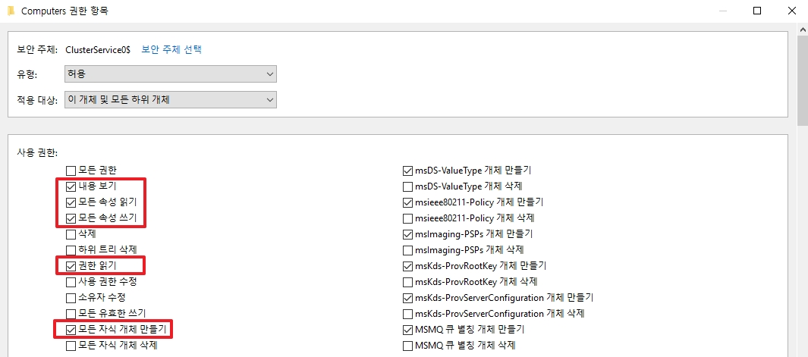
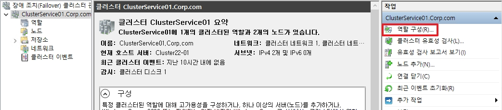
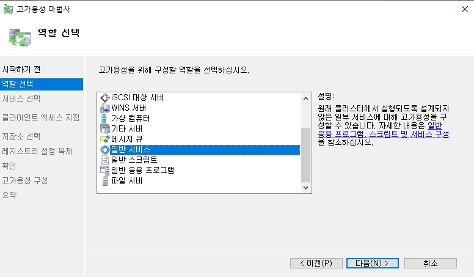
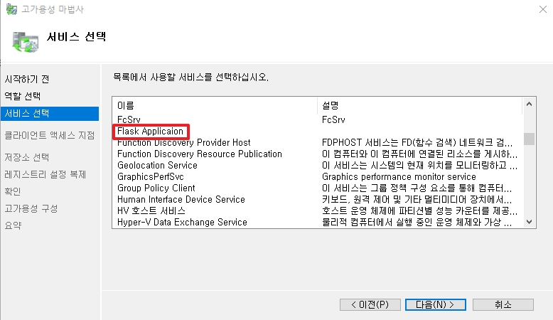
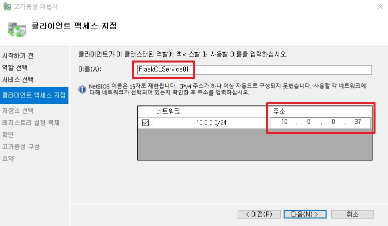
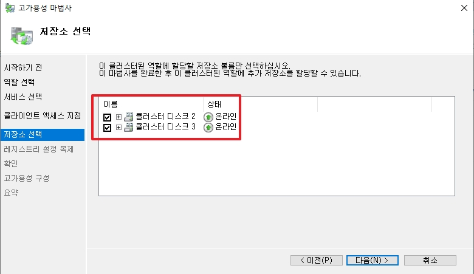
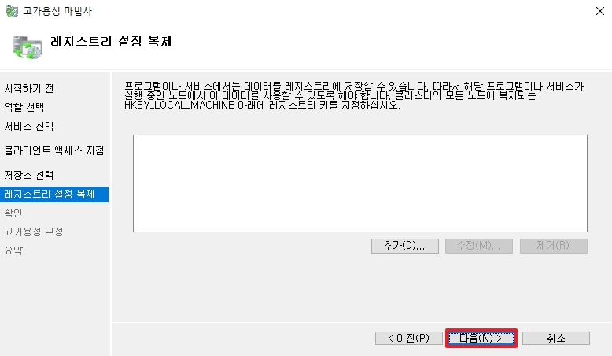
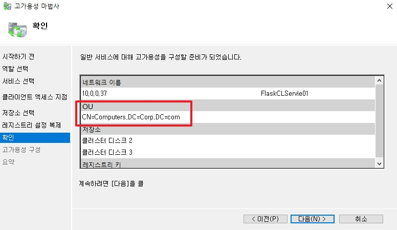
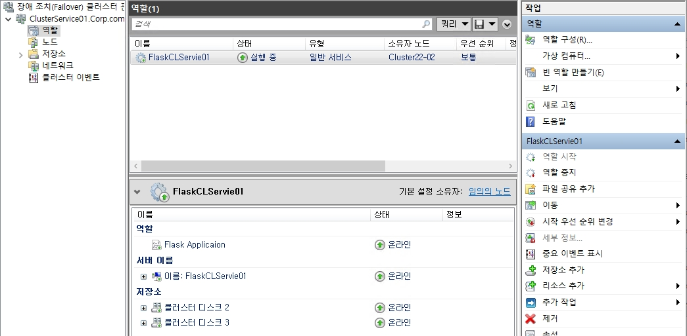

# 고가용성 Python Application

전 챕터에서 Python을 일반 서비스로 생성하였기 때문에 이번 시간에는 Python 서비스를 클러스터에 올려 이중화를 해보도록 하겠습니다.

 

# 1. AD 권한

* CNO 하위에 VCO를 생성하기 위해서는 CNO가 위와 같은 권한을 소유해야 합니다.
* Cluster에서 작업하는 Domain 계정이 admin이 아닌 Domain users 그룹이라면, CNO 권한에 모든 권한을 추가합니다.

 

# 2. Python Service -> Cluster Role

* 클러스터 서비스에서 `역할 구성`을 클릭합니다.

 

* 역할 선택에서 `일반 서비스`를 선택합니다.

 

* 서비스 중, Python Application 서비스를 선택합니다.

 

* Python Service가 사용할 IP와 역할명을 설정합니다.
* _위 IP는 기존에 서비스를 생성할 때 사용된 Python 파일의 IP와 일치해야합니다._

 

* 서비스에 Disk가 필요할 경우, 추가합니다.

 

* 레지스트리 값을 사용하지 않는다면 다음으로 넘어갑니다.

 

* 클러스터 역할을 생성합니다.
* OU에 VCO가 생성될 위치가 표기되는지 확인합니다. 표기가 안 될 경우, 생성할 권한이 부족할 수 있습니다.

 

* 클러스터 역할이 정상적으로 생성될 경우, 위와 같이 출력됩니다.

 

* 해당 IP에 접속하여 동작하는지 확인합니다.

 