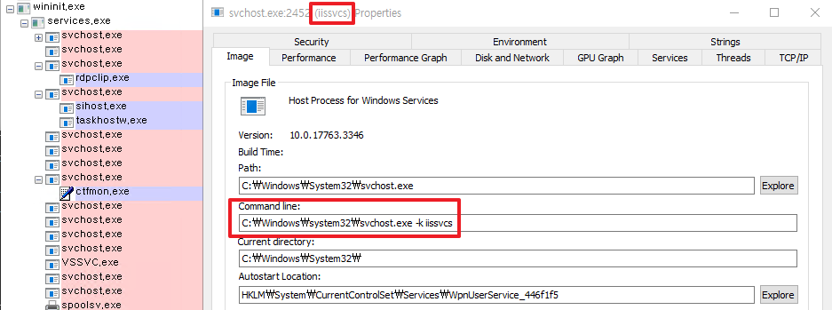
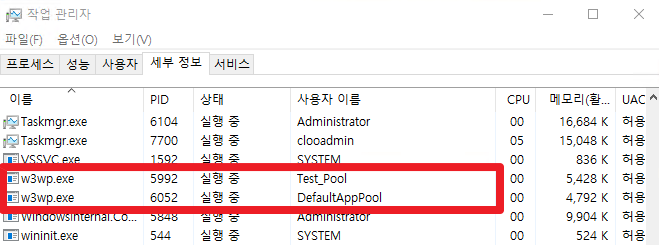
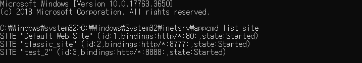

# IIS Process & Services
IIS에 아키텍쳐를 보기 전에 IIS가 구동 및 운영 중 사용하는 기본적인 프로세스와 서비스들을 살펴본다.

## 1. Service Host: Internet Information Service


* IIS는 기본적으로 서비스가 시작되면 WAS와 W3SVC가 생성되어지며, 동작한다.
* 프로그램 동작 시에 사용되는 명령어는 아래와 같다.

```bash
C:\Windows\system32\svchost.exe -k iissvcs
```


### 1-1. WAS(Windows Process Activation Service)


### 1-2. W3SVC(Windows Process Activation Service)


## 2. W3WP(IIS Worker Process)
* W3WP는 Application Pool을 생성하면 하나씩 생기는 프로세스이며, 실질적인 요청을 처리하는 곳이다.
* 따라서 요청이 들어오면 W3WP가 생성되어지며, 작업 관리자의 세부정보 탭에서 __사용자 이름__ 속성을 보면 해당 Application Pool의 이름을 확인할 수 있다. 



### +추가) LOG
* IIS의 Log는 Application Pool 단위로 저장되어지지 않고, Site 단위로 저장된다.
* 하지만 해당 사이트의 Log 폴더를 알기 쉽지 않기 때문에 아래의 명령어를 이용하면 쉽게 알 수 있다.

```bash
C:\Windows\System32\inetsrv\appcmd list site
```

* _관리자 권한으로 실행하여야 state에 Site 상태가 표기된다._  


* 위 CMD 창의 id 번호를 통하여 해당 폴더가 어떤 Site의 Log 폴더인지 알 수 있다.


## 3. IISADMIN(IIS Admin Serivec)
* inetinfo.exe는 IIS 7.0미만 버전에서는 매우 중요한 역할을 하였다.
* 예전에는 HTTP.sys가 없었기 때문에 맨 처음으로 요청을 받게 되는 역할을 하였으며,
WAS와 W3SVC의 역할을 IISADMIN이 혼자 수행하였다.  
* 지금도 남아있는 이유는 FTP & SMTO 구성을 Metabase로 가지고 있는 역할을 하며, WAS에게 구성을 전달한다.  
* 따라서 inetinfo.exe가 없으면 FTP가 사용이 불가능하다.  
* _7.0 이상에서 default 값으로 설치되어진 서비스는 아니다. 따라서 모듈을 설치하면 같이 설치된다._

```bash
:: IIS Admin 실행
net start iisadmin

:: IIS Admin 중지
net stop iisadmin
```

## 4. WMSVC


# IIS Architecture
