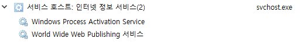
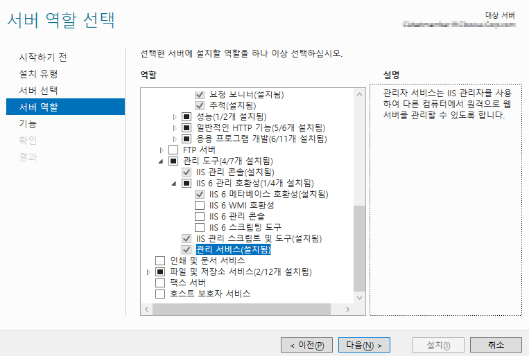
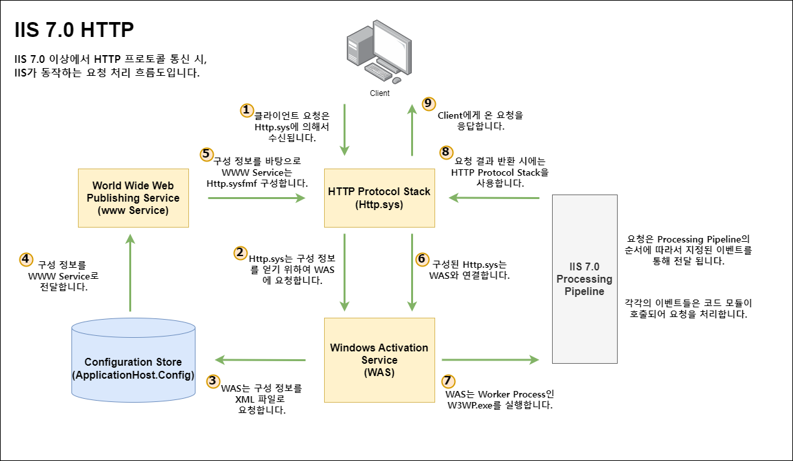

# IIS Process & Services
IIS에 아키텍쳐를 보기 전에 IIS가 구동 및 운영 중 사용하는 기본적인 프로세스와 서비스들을 살펴본다.

## 1. Service Host: Internet Information Service


* IIS는 기본적으로 서비스가 시작되면 WAS와 W3SVC가 생성되어지며, 동작한다.
* 프로그램 동작 시에 사용되는 명령어는 아래와 같다.

```bash
C:\Windows\system32\svchost.exe -k iissvcs
```


### 1-1. W3SVC(World Wide Web Publishing Service)
-_7.0 버전 이후로 설명 합니다._-
* W3SVC는 WAS와 비교했을 때 순수하게 수신기 역할을 수행하며, WAS가 applicationHost.config로 부터 가져온 정보들을 바탕으로 Http.sys를 구성합니다.
* 성능을 모니터링하고 웹 사이트 및 IIS 캐시에 대한 성능 카운터를 제공합니다.
* HTTP.sys의 수신기 어댑터로서 WWW 서비스는 요청이 요청 큐에 들어갈 때 WAS에 알리는 역할을 합니다.


### 1-2. WAS(Windows Process Activation Service)
* 실질적으로 Application Pool(작업 프로세서)을 관리합니다. (w3svc는 관리하지 않습니다.)  
* Applicationhost.config와 같은 설정 파일로 부터 설정값을 가져옵니다.
* w3wp.exe 작업 프로세스를 시작합니다.


## 2. W3WP(IIS Worker Process)
* W3WP는 Application Pool을 생성하면 하나씩 생기는 프로세스이며, 실질적인 요청을 처리하는 곳이다.
* 따라서 요청이 들어오면 W3WP가 생성되어지며, 작업 관리자의 세부정보 탭에서 __사용자 이름__ 속성을 보면 해당 Application Pool의 이름을 확인할 수 있다. 


### +추가) LOG
* IIS의 Log는 Application Pool 단위로 저장되어지지 않고, Site 단위로 저장된다.
* 하지만 해당 사이트의 Log 폴더를 알기 쉽지 않기 때문에 아래의 명령어를 이용하면 쉽게 알 수 있다.

```bash
C:\Windows\System32\inetsrv\appcmd list site
```

* _관리자 권한으로 실행하여야 state에 Site 상태가 표기된다._  


* 위 CMD 창의 id 번호를 통하여 해당 폴더가 어떤 Site의 Log 폴더인지 알 수 있다.


## 3. IISADMIN(IIS Admin Serivec)
* inetinfo.exe는 IIS 7.0미만 버전에서는 매우 중요한 역할을 하였다.
* 예전에는 HTTP.sys가 없었기 때문에 맨 처음으로 요청을 받게 되는 역할을 하였으며,
WAS와 W3SVC의 역할을 IISADMIN이 혼자 수행하였다.  
* 지금도 남아있는 이유는 FTP & SMTO 구성을 Metabase로 가지고 있는 역할을 하며, WAS에게 구성을 전달한다.  
* 따라서 inetinfo.exe가 없으면 FTP가 사용이 불가능하다.  
* _7.0 이상에서 default 값으로 설치되어진 서비스는 아니다. 따라서 모듈을 설치하면 같이 설치된다._

```bash
:: IIS Admin 실행
net start iisadmin

:: IIS Admin 중지
net stop iisadmin
```

## 4. WMSVC(웹 관리 서비스)
* IIS를 원격으로 관리하기 위하여 사용되어지는 프로세스이다.
* IIS 역할에서 __관리 도구 -> 관리 서비스__ 에서 역할 설치하면 활성화된다.



# HTTP프로토콜 통신 시, IIS 동작 순서

 
 _HTTP 프로토콜에 대한 동작 순서이며, FTP 등은 다르게 동작합니다_
 

