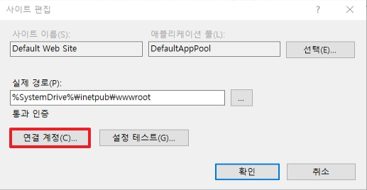
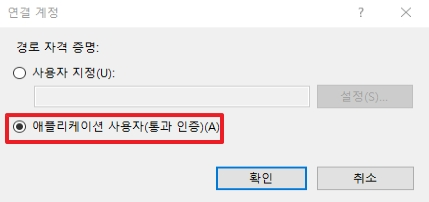
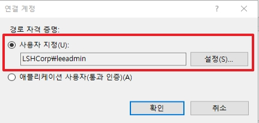
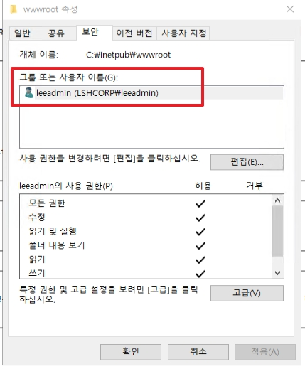

# Basic Setting
이 페이지에서는 알고 있으면 괜찮은 잡다한 기능들을 설명합니다.

## 목차

1. 연결 계정
2. _생각나면 추가 예정_
    
</br>

# 1. 연결 계정
IIS의 기본 동작 원리를 설명하면 Client가 IIS의 Site에 접속을 시도하면 접속하기 위한 인증을 우선 진행합니다.  
IIS를 맨 처음 설치하였을 때 보이는 Default Web Site는 익명 인증을 사용하고 있습니다.  
* _사이트에서 인증을 사용하지 않을 경우에는 정상적으로 접속이 되지 않습니다.(401.2 Error 반환환)_

```html
# applicationHost.config
<security>
            <authentication>
                <anonymousAuthentication enabled="true" userName="IUSR" />
            </authentication>
<security>
```
위와 같이 IIS Web Server을 익명 인증로 접속하게 되면 IUSR 계정으로 통하여 접속하게 됩니다.  
하지만 FTP와 같이 익명 인증이 아닌 다른 인증을 사용하여 접속하려면 어떻게 해야 될까요? 답은 `연결 계정` 입니다.


* 사이트 편집에서 `연결 계정`으로 이동합니다.

|애플리케이션 사용자(통과 인증)|사용자 지정|
|:---:|:---:|
|||
|인증에서 사용하였던 계정을 사용합니다. <br>_익명인증은 위와 같이 `IUSR`가 계정이 됩니다._|인증 후에 연결할 계정을 선택합니다. <br> 익명인증을 하여 사이트 접속 시에는 __leeadmin__ 계정을 사용합니다.|


* 사이트가 바인딩하는 실제 경로 폴더 권한을 연결 계정으로 맞춥니다.

</br>

# 2. _추가 예정_