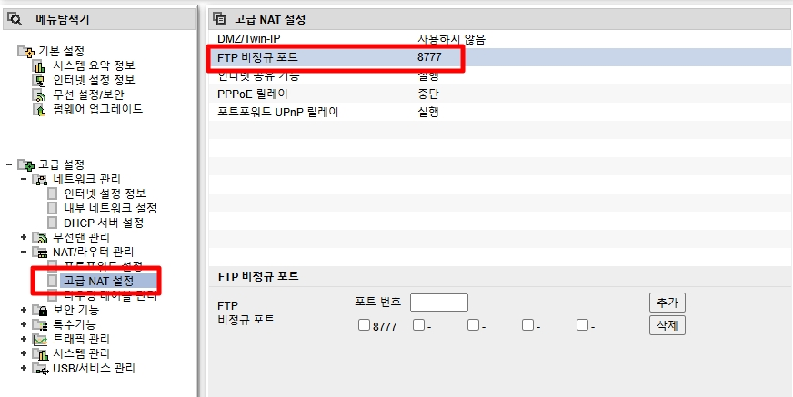

# FTP 구축

이번 시간에는 FTP 서버 구축 방법을 설명합니다.
* _IIS는 기본적으로 FTPS를 지원하며, SFTP는 지원하지 않습니다._

## 1. FTP 설치

* 서버 역할에서 `웹 서버 (IIS)` -> `FTP 서버` -> `FTP 서비스`를 추가합니다.

 

* FTP 서비스 역할을 설치합니다.

 

* 역할 추가 후, 사이트 탭에서 `FTP 사이트 추가` 작업을 선택합니다.

 

1. FTP 사이트 명을 입력합니다.
2. FTP 폴더가 위치한 경로를 입력합니다.
    * 해당 위치의 상위 폴더를 지정하면 하위 폴더들이 자동으로 하위 사이트에 추가됩니다.

 

1. IP 주소 및 포트를 입력합니다.
2. SSL을 설정합니다.  
    1. `SSL 사용 안함`: FTP로만 접속을 허용합니다.
    2. `SSL 허용`: FTP와 FTPS 둘 다 사용합니다.
    3. `필요`: FTPS로만 접속을 허용합니다.

 

1. 기본 인증을 선택합니다.
2. FTP 접속 시 사용할 계정을 설정합니다.
    * _쓰기 권한을 추가해야 파일을 수정하거나 삭제할 수 있습니다._

 

* FTP 사이트 추가가 완료되면 왼쪽 사이트 탭에 추가됩니다.

 

* `wf.msc`에서 인바운드 방화벽을 살펴보면 FTP 사이트 생성 시에 인바운드 규칙이 바로 생성됩니다.

 

## 2. Active(능동) & Passive(수동) 모드
쉽게 생각 설명하면 데이터를 받을 동적 포트를 누가 열지 정하는 것 입니다. 능동 모드는 클라이언트가 동적 포트를 열고, 수동 모드는 서버가 동적 포트를 엽니다.  
이 과정에서 외워야 될 포트는 아래와 같습니다.

### [Active Mode]
* Client가 동적 포트를 열기 때문에 Server에서 중요한 건 `20`번 포트입니다.
* Server가 20번 포트를 사용하여 데이터를 전달합니다. 

### [Passive Mode]

* 서버에서 동적 포트를 열기 때문에 포트 범위를 지정할 수 있습니다.
* IIS 웹서버에서 `FTP 방화벽 지원` 기능에서 확인할 수 있습니다.

## 추가) 다중 FTP 서버 설치 시, 주의점

기본적으로 FTP를 사용할 경우에 제어 채널로 21번 포트를 사용합니다. 하지만 하나의 IP를 사용할 경우에는 어떻게 할까요?  
당연하게 2번 째 FTP 사이트는 21번 포트가 아닌 다른 포트를 사용하게 됩니다.  
 
하지만 안타깝게도 이를 윗단 장비에서 막을 수 있기 때문에 장비가 허용하는 지 확인해야 합니다.

### [Iptime 예시]
  
_이걸 몰라서 사무실에서 이중 FTP 사용할 때 고생했습니다._