# Isapi_redirect.dll

IIS는 실제로 ARR과 같은 라우팅 역할을 할 때, HTTP 프로토콜만 사용합니다.  
하지만 Tomcat과 같은 ajp 프로토콜을 ARR로 라우팅해야 할 경우에는 어떻게 할까요? Tomcat 오픈소스에서 개발한 isapi_redirect.dll 모듈을 사용합니다.

### [Download Link]
Open JDK17: [https://www.azul.com/ko/](https://www.azul.com/ko/)  
Tomcat10: [https://tomcat.apache.org/download-10.cgi](https://tomcat.apache.org/download-10.cgi)

# 1. Tomcat 서버 설정
## 1.1) Java 설치

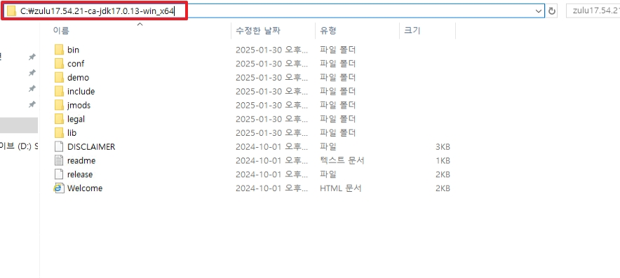
* 다운로드 받은 Java zip 폴더 압축을 해제합니다.

</br>

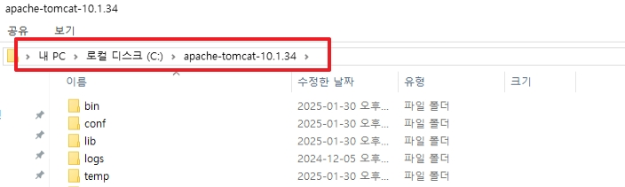
* 다운로드 받은 Tomcat zip 폴더 압축을 해제합니다.

</br>

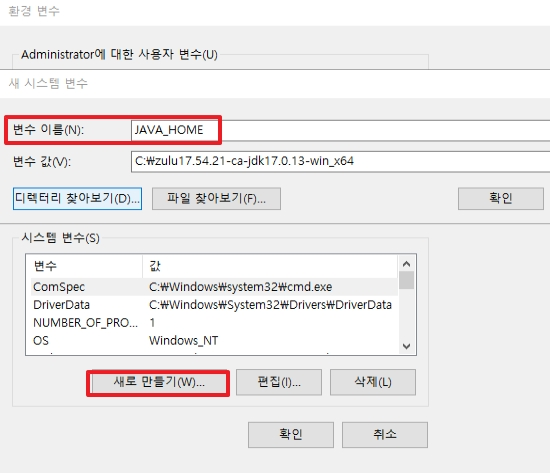
```
변수 이름: JAVA_HOME
변수 값: [Java 폴더 위치]
```
* `sysdm.cpl`로 이동 한 후, 환경변수로 이동합니다.
* 시스템 환경 변수에 위 변수를 추가합니다.

</br>

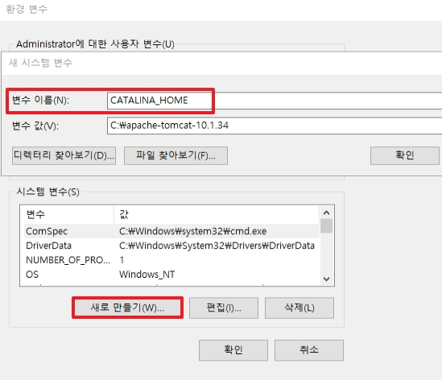
```
변수 이름: CATALINA_HOME
변수 값: [Tomcat 폴더 위치]
```
* 시스템 환경 변수에 위 변수를 추가합니다.

</br>

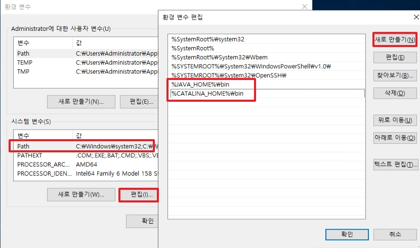
```
%JAVA_HOME%\bin
%CATALINA_HOME%\bin
```
* 시스템 변수 중 Path 변수를 편집합니다.
* Path 변수 경로에 위 경로 2개를 새로 만듭니다.

</br>

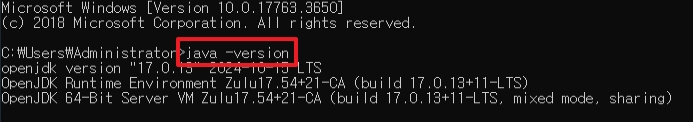
* cmd에서 `java -version`을 입력하여 java가 정상적으로 호출되는지 확인합니다.

</br>

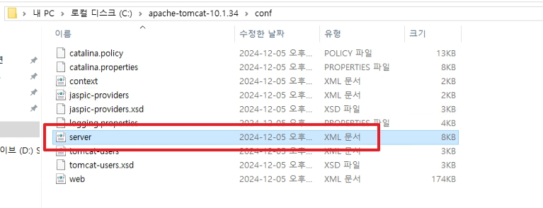
* Tomcat은 기본으로 설정하면 HTTP로 구성되어 있어서 ajp1.3으로 변경해야 합니다.

</br>

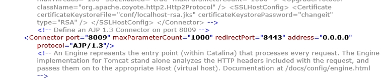
```xml
<!--
    <Connector port="8080" protocol="HTTP/1.1"
               connectionTimeout="20000"
               redirectPort="8443"
               maxParameterCount="1000"
               />
-->

            .........           

    <Connector protocol="AJP/1.3"
               secretRequired="false"
               address="0.0.0.0"
               port="8009"
               redirectPort="8443"
               maxParameterCount="1000"
               />
```
* http 프로토콜 영역은 위와 같이 주석처리합니다.
* 주석처리 되어 있던 ajp1.3 프로토콜의 주석을 없애고 외부 접속 주소를 `"::1"`에서 `0.0.0.0`으로 변경합니다.
    * _http프로토콜의 default maxParameterCount는 원래 10000입니다. 필요할 경우 수정합니다._
* _https가 아닌 http일 경우 `secretRequired="false"` 가 필요합니다._

</br>

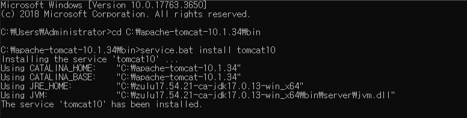
```bash
service.bat install tomcat10
```
* 관리자 권한으로 cmd를 실행한 후, 위 명령어를 실행하여 기본 설정을 마칩니다.

</br>

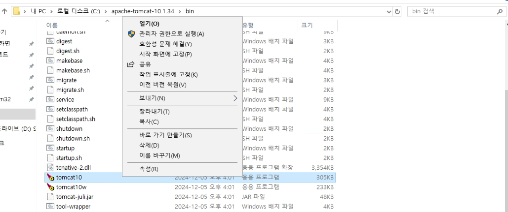
* bin폴더에 있는 tomcat10을 관리자 권한으로 실행합니다.

</br>

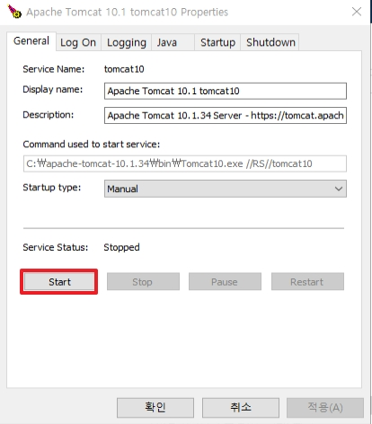
* Tomcat gui에서 서비스를 시작합니다.
* 서비스 시작 후, 외부 접속에 필요한 8009 포트도 오픈 해줍니다.

</br>

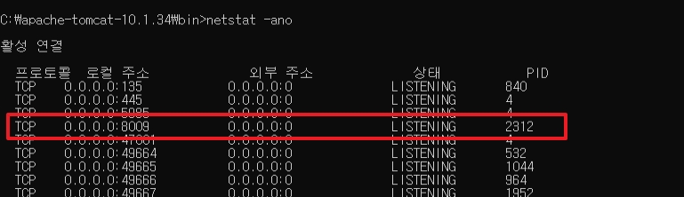
```
netstat -ano
```
* 위 명령어 입력 후, 서비스가 정상적으로 8009번 포트를 사용 중인지 확인합니다.

</br>

# 2. ISAPI 설정
ISAPI를 설정하기 전에 설정해야하는 전체적인 틀부터 설명합니다.

```
Tomcat-----bin-----isapi_redirect.dll
        |       |--isapi_redirect.properties
        |
        |--conf----uriworkermap.properties
        |       |--workers.properties
        |
        |--log-----isapi_redirect.log

```
_모든 properties 파일은 UTF-8 형식으로 생성되어야 합니다. Windows Server 2019까지는 ANSI가 기본 형식입니다._

* `isapi_redirect.dll`: Tomcat에서 제공하는 isapi 모듈입니다.
* `isapi_redirect.properties`: properties 파일 들의 경로와 가상 사이트 경로를 지정합니다.
* `uriworkermap.properties`: Tomcat 서버(Worker)로 요청을 보낼 URI 를 지정하는 파일입니다.
* `workers.properties`: redirect할 서버들을 지정하는 파일입니다. 여러 Tomcat 서버로 부하를 분산할 수 있습니다.
* `isapi_redirect.log`: 로그 파일이며, isapi_redirect.properties 설정으로 자동으로 생성됩니다.

### isapi_redirect.dll 다운로드
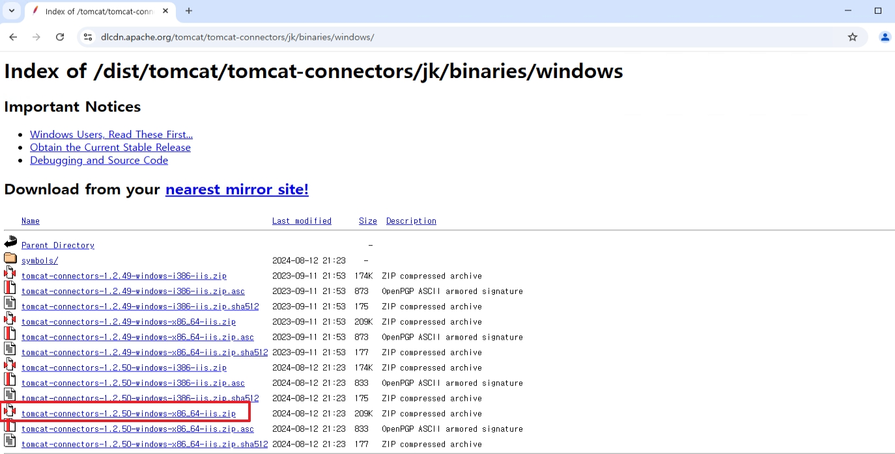
[Link][https://tomcat.apache.org/download-connectors.cgi](https://tomcat.apache.org/download-connectors.cgi)

### __isapi_redirect.properties__ 설정
```bash
# isapi_redirect.dll을 찾는 경로입니다.
# extension_uri=/가상 사이트 경로/isapi_redirect.dll
extension_uri=/redirect/isapi_redirect.dll

#log 파일 절대경로 설정
log_file=c:\Tomcat\log\isapi_redirect.log
 
# 로그 레벨 : debug, info, warn, error, trace
log_level=info
 
worker_file=c:\Tomcat\conf\workers.properties
worker_mount_file=c:\Tomcat\conf\uriworkermap.properties
```
위와 같이 isapi_redirect.properties 파일을 생성한 후, bin 폴더에 넣습니다.

### __uriworkermap.properties__ 설정
```bash
# 모든 요청을 redirect할 경우는 아래와 같이 작성합니다.
/*.jsp=worker1
/*=worker1
```
위와 같이 작성하게 되면 .jsp로 끝나는 모든 페이지를 worker1 서버로 보내게 됩니다.

### __workers.properties__ 설정
```
# Tomcat 서버를 지정합니다. 콤마로 분리 시, 여러 개 지정 가능
worker.list=worker1
 
# Tomcat과 통신하는 프로토콜을 지정합니다.
worker.worker1.type=ajp13

# Tomcat 서버의 IP 주소 입니다.
worker.worker1.host=10.0.0.90
 
# Tomcat 서버의 ajp13 통신 포트 입니다. Tomcat의 server.xml 에 지정되어 있습니다.
worker.worker1.port=8009
```

# 3. IIS 설정

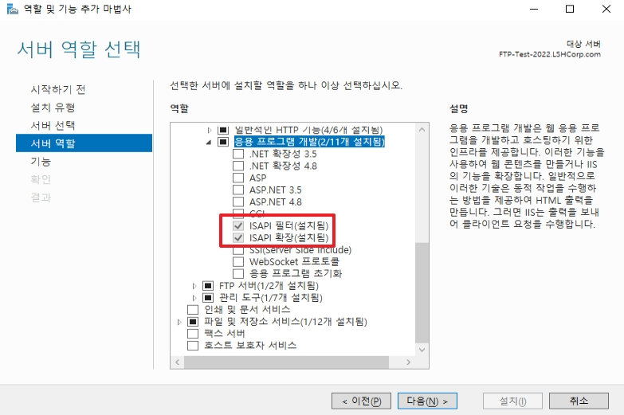
* 역할에서 IIS의 `ISAPI 필터`와 `ISAPI 확장`을 설치합니다.

</br>

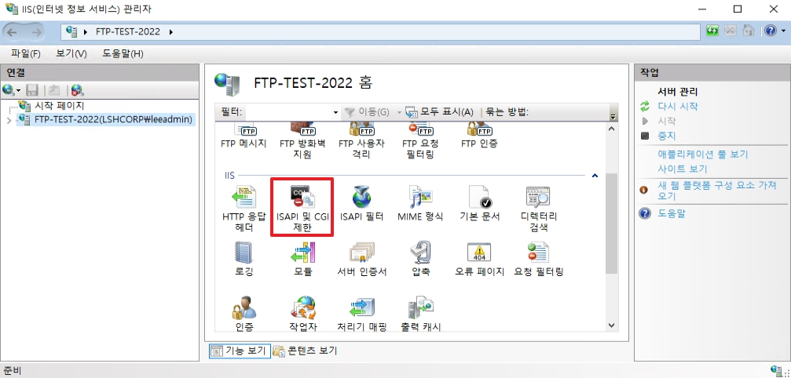
* IIS 관리자의 Web Server 페이지에서 `ISAPI 및 CGU 제한`으로 이동합니다.

</br>


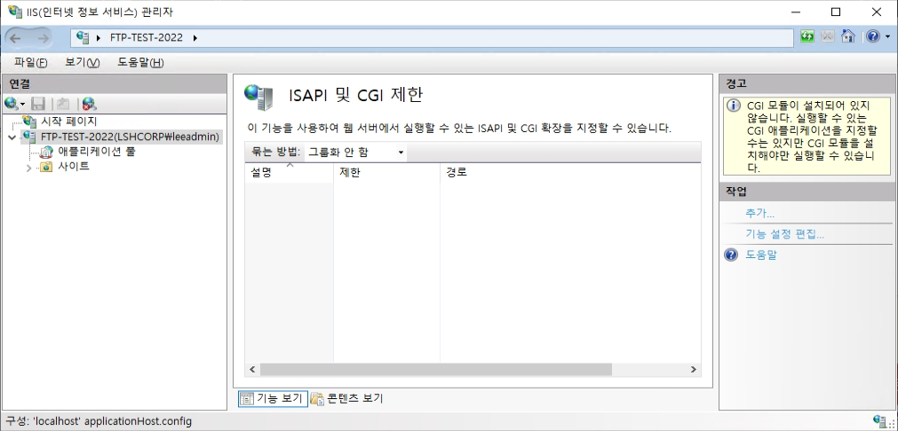
* 새로운 확장을 추가합니다.

</br>


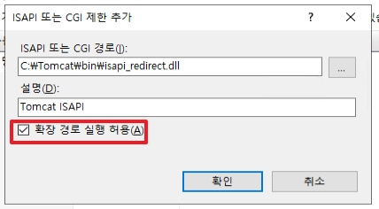
* `isapi_redirect.dll`을 추가합니다.
* `확장 경로 실행 허용`을 활성화합니다.

</br>


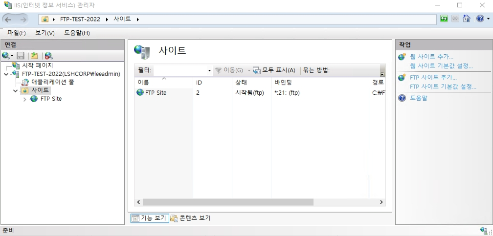
* 사이트로 이동한 후, 새로운 웹 사이트를 추가합니다.

</br>


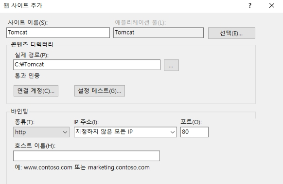
* http를 사용하는 새로운 사이트를 추가합니다.
* _위 설정은 자유롭게 지정하여도 괜찮습니다._

</br>


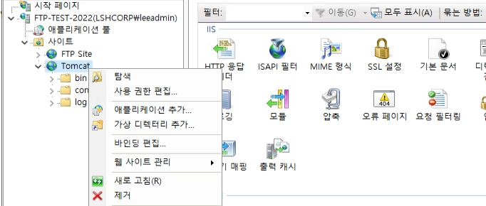
* 새로 생성한 사이트의 가상 디렉터리를 추가합니다.

</br>


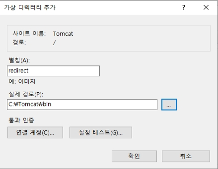
* 가상 디렉터리를 추가합니다.
* 가상 디렉터리 별칭은 `isapi_redirect.properties` 파일의 `extension_uri` 경로와 일치해야합니다.

</br>


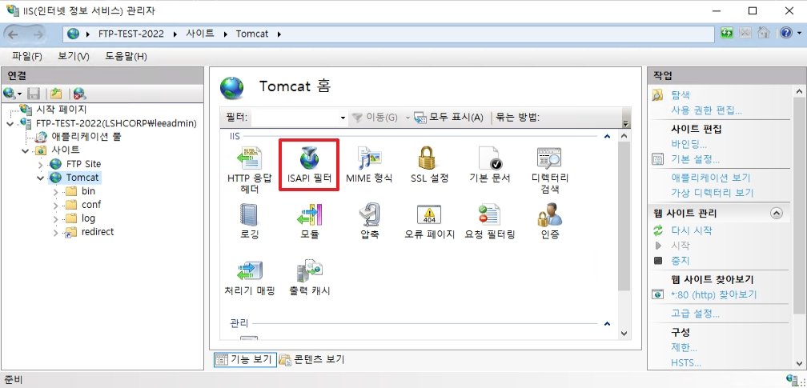
* 새로 생성한 사이트의 `ISAPI 필터`로 이동합니다.

</br>


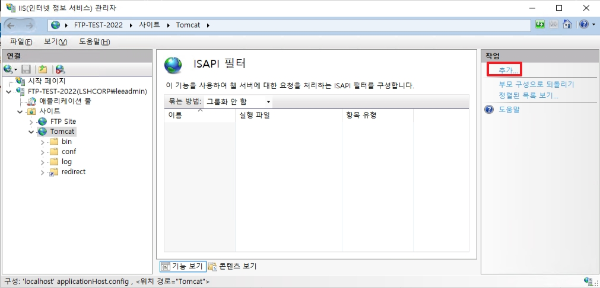
* 새로운 ISAPI 필터를 추가합니다.

</br>


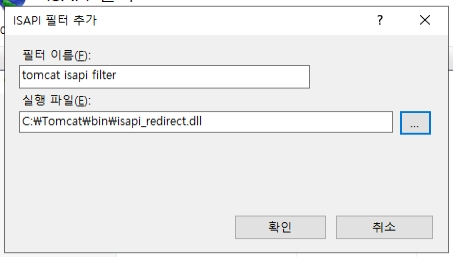
* `isapi_redirect.dll`을 추가합니다.

</br>


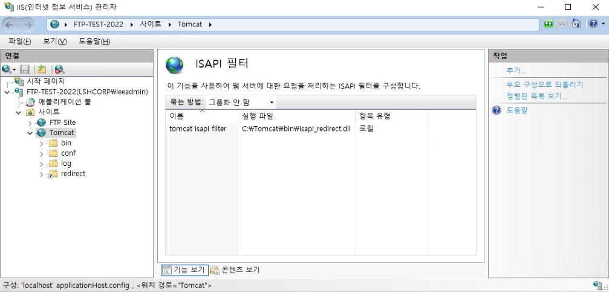
* 새로 추가된 isapi 필터를 확인합니다.

</br>


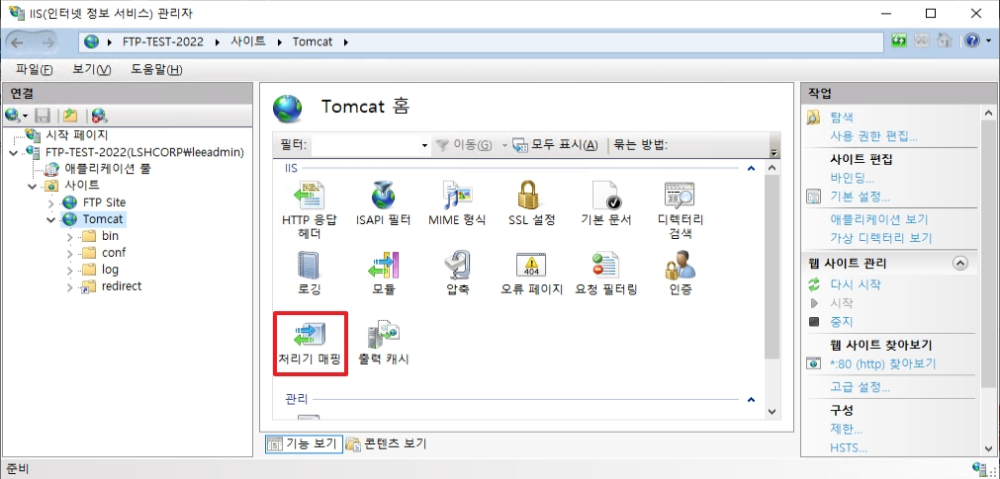
* isapi 필터가 생성되었다면 `처리기 매핑`으로 이동합니다.

</br>


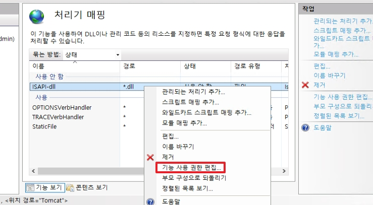
* 비활성화 되어 있는 ISAPI-dll을 우 클릭한 후, `기능 사용 권한 편집`을 클릭합니다.

</br>


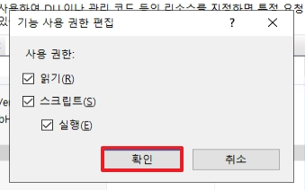
* 스크립트의 `실행` 옵션을 활성화합니다.

</br>


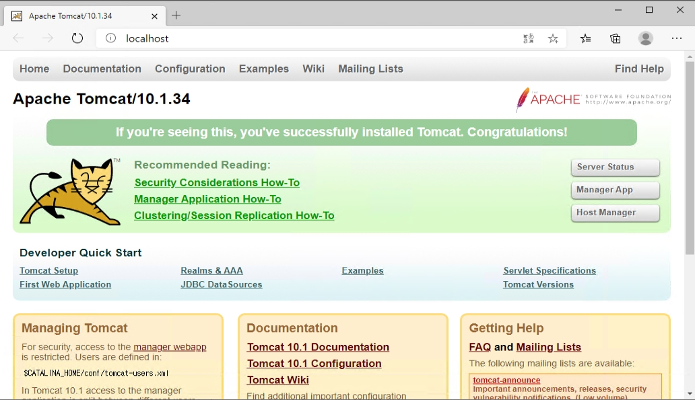
* 모든 설정을 끝마친 후, IIS를 재시작합니다.
* 브라우저에 localhost를 입력하여 정상적으로 라우팅이 되는지 확인합니다.

</br>
