# Reverse Proxy with ARR

IIS는 기본적으로 라우팅을 하는 웹서버로 사용됩니다. 지난 문서에서는 ajp프로토콜을 라우팅하는 방법에 대해 알아보았으니,  
이번에는 정석적인 HTTP 프로토콜을 라우팅하는 방법을 설명합니다.  

### __[구성환경]__
* OS: Windows Server 2016

|역할|Application|IP|
|:---:|:---:|:---:|
|Web server|IIS|10.0.0.95:443|
|Web Application Server|Flask|10.0.0.200:80|

### __[사전 설치]__  
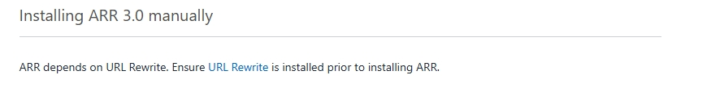
* URL Rewrtie Link: https://www.iis.net/downloads/microsoft/url-rewrite
* ARR Link: https://www.iis.net/downloads/microsoft/application-request-routing

 

# 1. URL Rewrite & ARR 설치

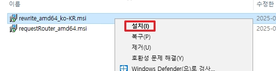
* 다운 받은 URL Rewrite 파일을 실행합니다.

 

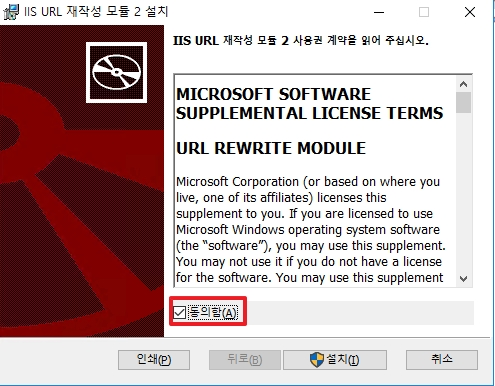
* 라이센스를 동의합니다.

 

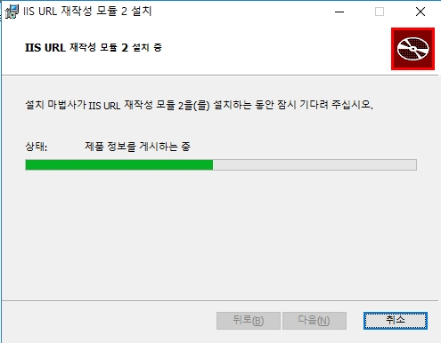
* URL Rewrite를 설치합니다.

 

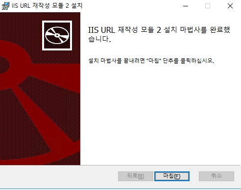
* IIS URL Rewrite 설치가 완료되면 마침을 클릭합니다.

 

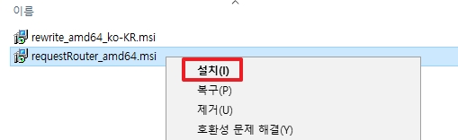
* 다운로드 받은 ARR 설치 파일을 실행합니다.

 

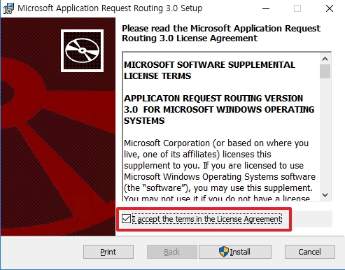
* 라이선스를 동의합니다.

 

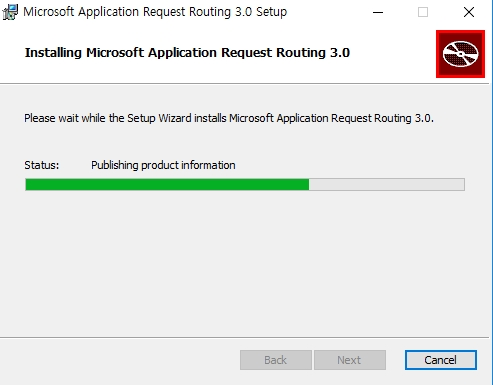
* ARR을 설치합니다.

 

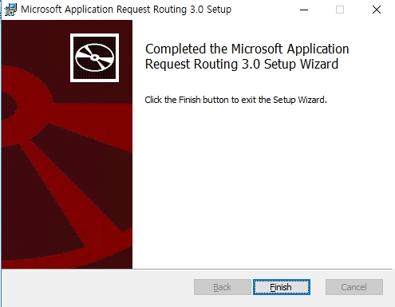
* ARR 설치를 완료합니다.

 

# 2. IIS Routing 설정

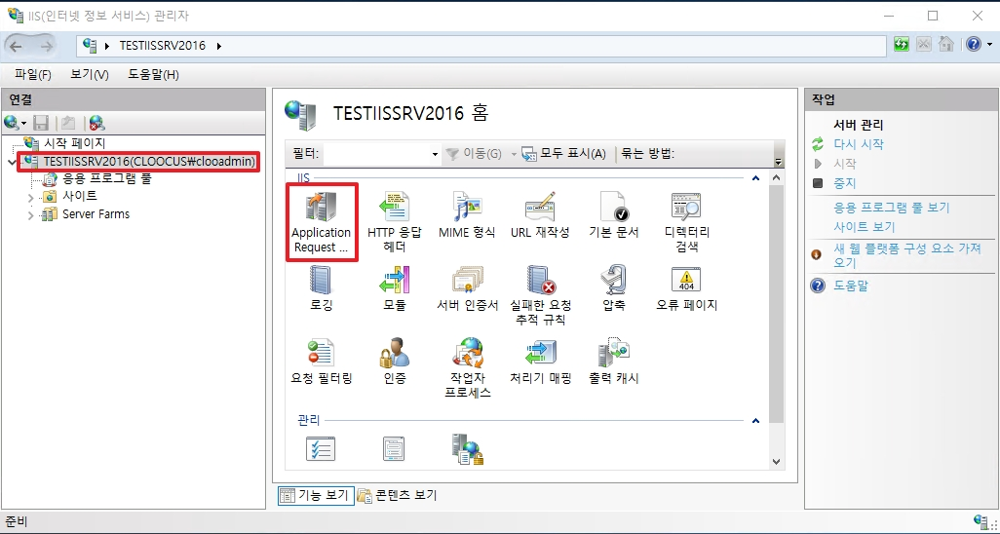
* Web Server 명을 클릭한 후, ARR 을 클릭합니다.

 

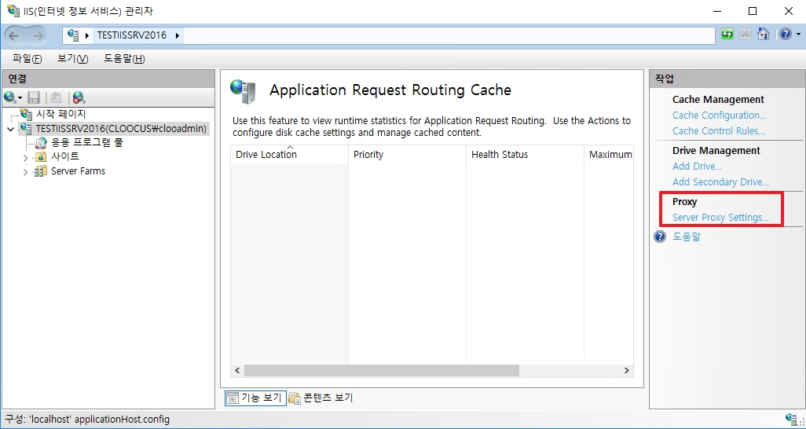
* 오른쪽 탭에 Proxy 설정을 클릭합니다.

 

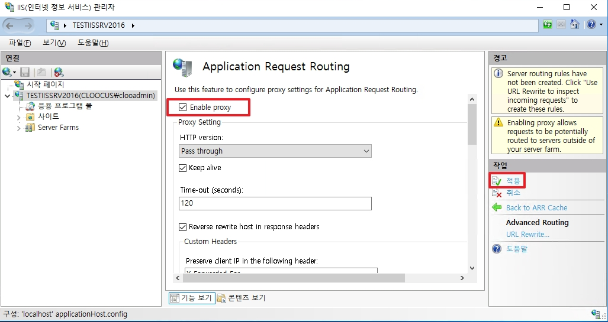
* Proxy 설정을 활성화 한 후, 설정을 적용합니다.

 

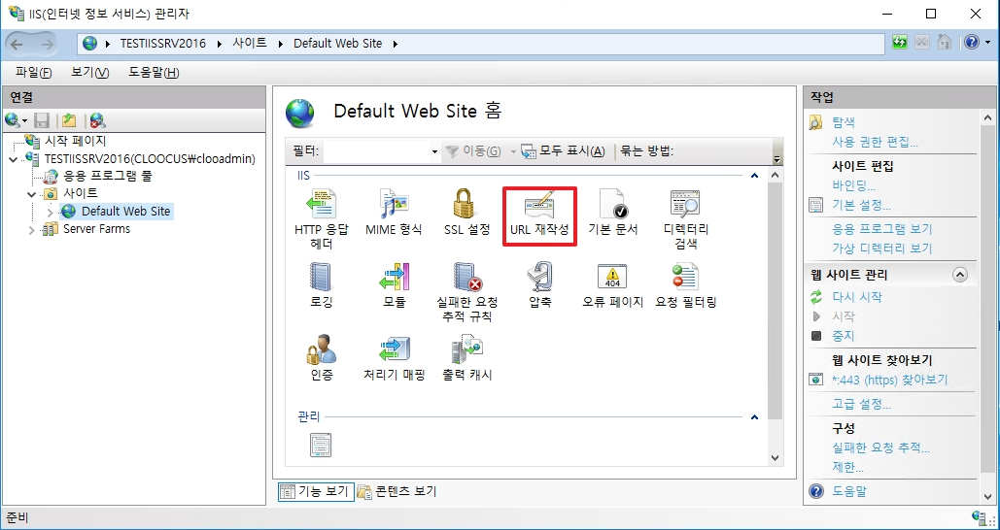
* 라우팅 할 사이트를 클릭한 후, URL 재작성 UI를 클릭합니다.

 

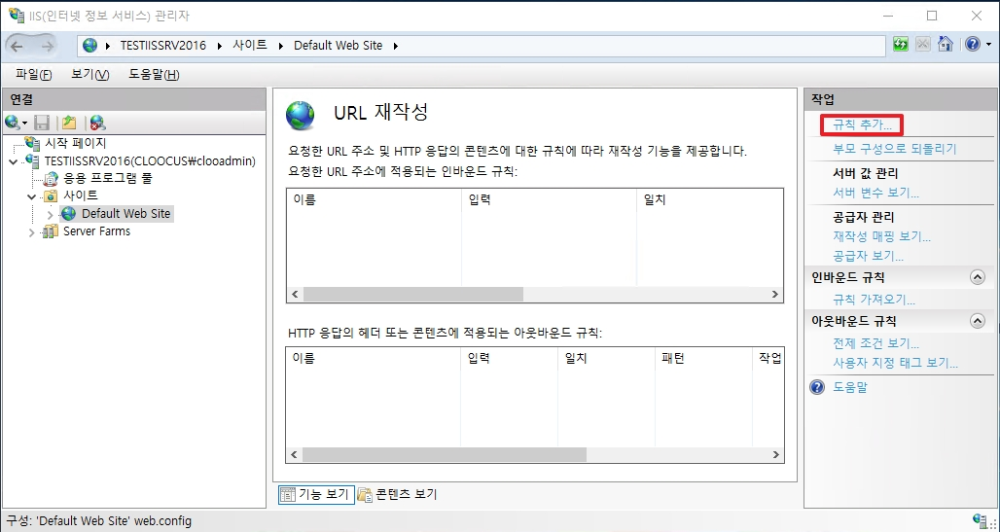
* `작업` -> `규칙 추가`를 클릭하여 라우팅 규칙을 추가합니다. 

 

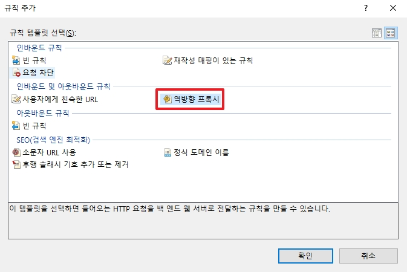
* “역방향 프록시”를 선택합니다.

 

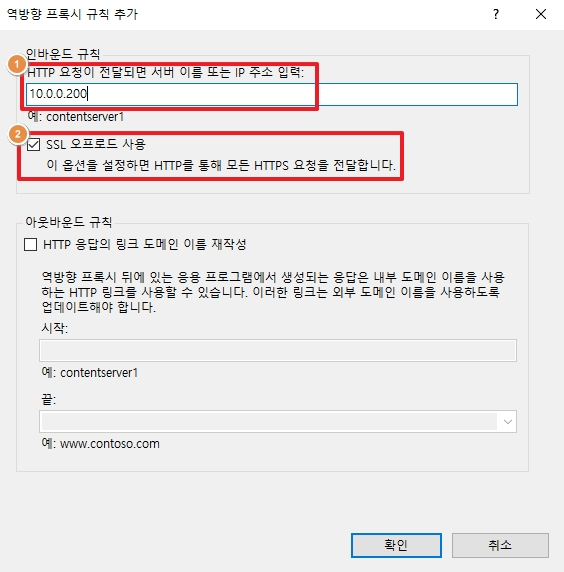
1. 라우팅 할 서버명 혹은 IP 를 입력합니다.
2. “SSL 오프로드 사용”을 활성화 합니다.
    * 위 옵션을 활성화 해야 Web Server 와 Application 은 http 로 통신하지만 Web Server 가
Client 와 통신할 때는 인증서를 포함한 https 로 통신합니다.

 

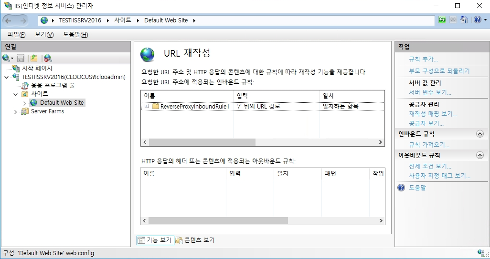
* 생성된 라우팅 규칙을 확인합니다.

 

# 3. 테스트

1. 접속 테스트(1)  
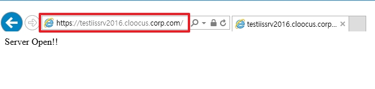

 

2. 접속 테스트(2)  
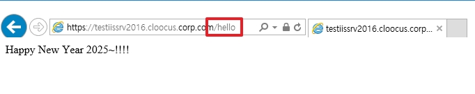  
* _하위 path 인 /hello 는 IIS 의 가상 디렉토리가 아닙니다._
* 상위 URN 에서 라우팅 되면, Application 이 해당 경로에 위치한 페이지를 반환합니다.
