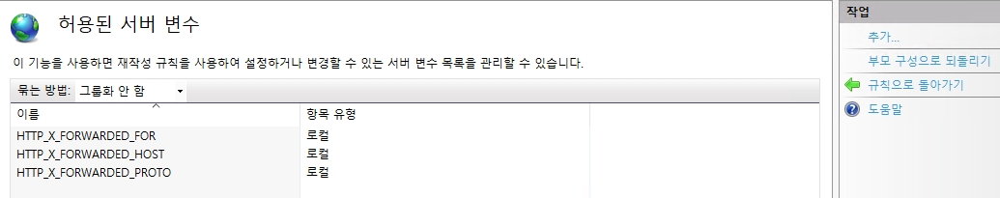
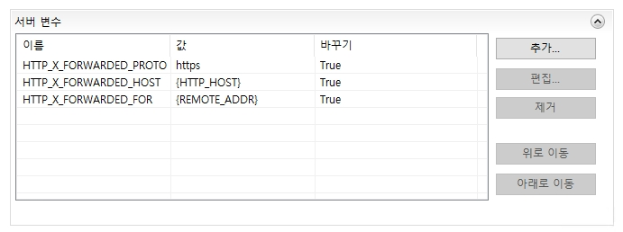
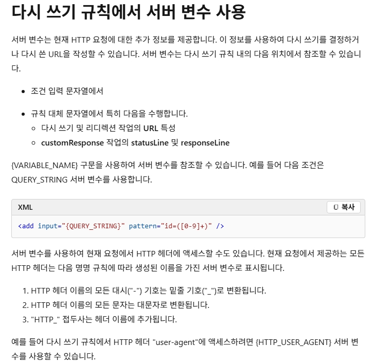
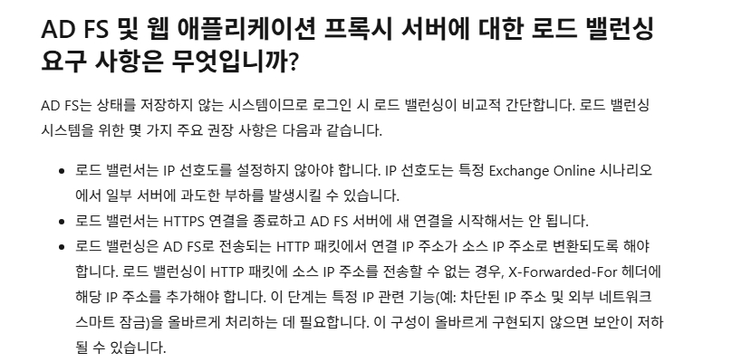

# HTTP Header

## 목차

1. [서버 정보 헤더](#1-서버-정보-헤더)
2. [WEb Server Request & Response 헤더 추가](#2-web-server-request--response-헤더-추가)

## 1. 서버 정보 헤더


## 2. WEb Server Request & Response 헤더 추가

```py
from flask import Flask, request

@app.before_request
def print_headers():
    print("--- Incoming Headers ---")
    for header, value in request.headers.items():
        print(f"{header}: {value}")
    print("-------------------------")
```
* WAS로 보내는 헤더를 확인하기 위한 flask 코드입니다.  

<br>

위 코드는 request를 받으면 아래와 같이 출력됩니다.  

```powershell
Connection: Keep-Alive
Accept: text/html,application/xhtml+xml,application/xml;q=0.9,image/avif,image/webp,image/apng,*/*;q=0.8,application/signed-exchange;v=b3;q=0.7
Accept-Encoding: gzip, deflate, br, zstd
Accept-Language: ko
Cookie: session=eyJBdXRoTlJlcXVlc3RJRCI6Ik9ORUxPR0lOXzYwNWFlYjMyMzkxMTNjZGM3NGFkZmEwOWYzMTRlNWY1ZDcwYTNhZDIifQ.agMbmQ.EAVNCzTw98Lr9oOspRV8g_mWtDU
Host: app.flask.com
Max-Forwards: 10
User-Agent: Mozilla/5.0 (Windows NT 10.0; Win64; x64) AppleWebKit/537.36 (KHTML, like Gecko) Chrome/148.0.0.0 Safari/537.36 Edg/148.0.0.0
Sec-Ch-Ua: "Chromium";v="148", "Microsoft Edge";v="148", "Not/A)Brand";v="99"
Sec-Ch-Ua-Mobile: ?0
Sec-Ch-Ua-Platform: "Windows"
Upgrade-Insecure-Requests: 1
Sec-Fetch-Site: none
Sec-Fetch-Mode: navigate
Sec-Fetch-User: ?1
Sec-Fetch-Dest: document
Priority: u=0, i
X-Forwarded-Proto: https
X-Forwarded-Host: app.flask.com
X-Forwarded-For: 10.0.0.131, 10.0.0.131:60282
X-Original-Url: /
X-Arr-Ssl: 2048|256|DC=com, DC=LSHCorp, CN=LSHCorp-LSHCA19-01-CA|CN=app.flask.com
X-Arr-Log-Id: 171a12e2-5d04-40b2-abd0-ce747567b579
```

우선 이 중에서 IIS의 URL 재작성을 통하여 추가한 헤더는 총 3개입니다.    

```powershell
X-Forwarded-Proto: https
X-Forwarded-Host: app.flask.com
X-Forwarded-For: 10.0.0.131, 10.0.0.131:60282
```

* X-Forwarded-Proto: Client가 최초 접속 시 사용한 프로토콜 - `SSL Offloading 확인용`
* X-Forwarded-Host: Client가 서버에 최초 접속 시 사용한 원본 Host명
* X-Forwarded-For: 요청이 거쳐온 IP 주소들의 경로 목록  
    * 위 경우, Reverse Proxy는 IIS 1대이며, port는 ARR의 ( Server Proxy Settings -> Custom Headers)가 보유한 옵션 값입니다.  
    * 예시)---> X-Forwarded-For: [Web Server IP], [Client IP]



* 추가적인 서버 변수(Header)는 `URL 재작성`을 통하여 작성 가능합니다.  
* 우선 URL 재작성에서 허용된 서버 변수를 위와 같이 추가한 후, 인바운드 규칙 편집에서 위와 같이 서버 변수를 추가하여 사용하면 됩니다.  

### [참조 링크]
 
* 헤더 변수명: [https://learn.microsoft.com/ko-kr/iis/extensions/url-rewrite-module/url-rewrite-module-configuration-reference](https://learn.microsoft.com/ko-kr/iis/extensions/url-rewrite-module/url-rewrite-module-configuration-reference)

* 변수 값: [https://learn.microsoft.com/ko-kr/previous-versions/iis/6.0-sdk/ms524602(v=vs.90)](https://learn.microsoft.com/ko-kr/previous-versions/iis/6.0-sdk/ms524602(v=vs.90))


### ++추가) X-Forwarded-For

X-Forwarded-For (XFF) 헤더는 HTTP 프록시나 로드 밸런서를 통해 웹 서버에 접속하는 클라이언트의 원 IP 주소를 식별하는 사실상의 헤더입니다.

* 예를 들어 `Client` -> `IIS` -> `IIS` -> `flask`
    * client IP: 10.0.0.2
    * IIS IP: 10.0.0.30 / 10.0.0.131

위와 같은 구조에서 Flask가 받은 Request Header는 아래와 같습니다.  
```
Connection: Keep-Alive
Accept: text/html, application/xhtml+xml, image/jxr, */*
Accept-Encoding: gzip, deflate
Accept-Language: ko-KR
Host: 10.0.0.131:8872
Max-Forwards: 9
User-Agent: Mozilla/5.0 (Windows NT 10.0; WOW64; Trident/7.0; rv:11.0) like Gecko
Dnt: 1
X-Original-Url: /
X-Forwarded-For: 10.0.0.2:63215, 10.0.0.30:60517
X-Arr-Log-Id: d3a5fa37-b763-4af4-bcd8-1b4bcd7aa5e7
```
* ARR을 사용할 경우, 기본 설정에서 "X-Forwarded-For" 헤더를 붙이기 때문에 따로 추가할 필요는 없습니다.  

<br>

그렇다면 X-Forwarded-For 설정과 관련하여서 중요한 점은 ADFS입니다.  

  
링크: [https://learn.microsoft.com/en-us/windows-server/identity/ad-fs/overview/ad-fs-faq#what-are-load-balancing-requirements-for-ad-fs-and-web-application-proxy-servers-](https://learn.microsoft.com/en-us/windows-server/identity/ad-fs/overview/ad-fs-faq#what-are-load-balancing-requirements-for-ad-fs-and-web-application-proxy-servers-)  

* ADFS 및 WAF에서는 실제로 Client IP가 필요하기 때문에 L4 스위치 혹은 NAT에서 Client IP에 대한 정보를 지우게 되면 장애가 발생하개 된다.
* `WAF Error Code`: 0x8007520C, `ADFS EventID`: 224


<br>