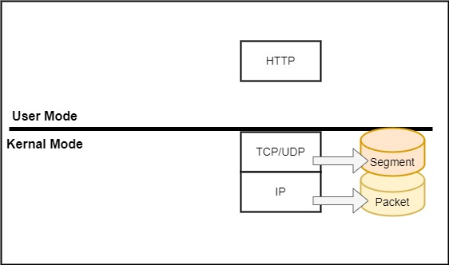
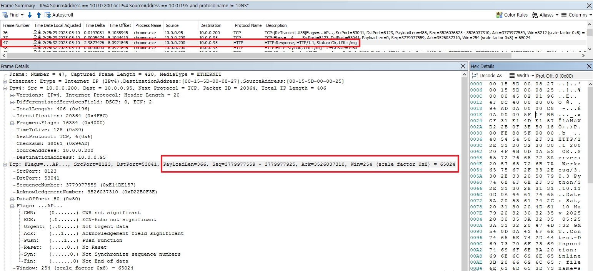

# Network Packet

IIS에 관한 부분보다는 전체적인 네트워크에서 패킷에 관하여 중요하게 생각하는 부분을 정리하여 작성하였습니다.  
패킷 분석을 위하여 Microsoft Network Monitor 3.4 를 사용합니다.  
링크: [https://www.microsoft.com/en-us/download/details.aspx?id=4865](https://www.microsoft.com/en-us/download/details.aspx?id=4865)

  
네트워크 아키텍쳐에는 여러 네트워크 모델이 있지만 Windows OS는 OSI 7 Layer를 기반으로 설계되었습니다.  
실제로 여기서 패킷 분석 시에 중요히게 볼 부분은 3,4 그리고 7 계층입니다.

* 3계층은 Packet으로 부르면 여기서는 IP 및 Port 등을 확인하면 됩니다.
* 4계층은 해당 세그먼트의 상태 등을 확인할 수 있기 때문에 TCP에서는 `SEQ`와 `ACK` 그리고 데이터인 `PayloadLen`을 확인합니다.
* 7계층은 우리가 흔히 알고 있는 애플리케이션 단으로 위에서 사용하는 넷몬 보다는 Fiddler를 사용하여 데이터 파일과 인증서 등을 확인하는게 좋습니다.

</br>

## MTU & PayloadLen
`MTU`(Maximum Transmission Unit)란 쉽게 설명하여 네트워크에서 전송할 수 있는 최대 패킷의 크기입니다.  
Payloadlen은 실제 데이터의 크기(byte 단위)로 `MTU = IP 헤더 + TCP/UDP 헤더 + Payloadlen`이 됩니다.  

```
netsh interface ipv4 show subinterfaces
```
* 위 명령어를 통하여 해당 Windows OS에서 이더넷이 사용하고 있는 MTU를 확인할 수 있습니다.

일반적으로 MTU는 `1500(20 + 20 + 1460)Byte`이며, 거의 대부분의 파일들의 크기는 1500 Byte를 넘습니다.  
그렇다면 어떤 일이 벌어질까요? 데이토를 쪼개서 보내게 됩니다.  
예를 들어 보낼 데이터가 1700 Byte이면, 
* 1번 패킷 = 20 + 20 + `1460` = 1500
* 2번 패킷 = 20 + 20 + `240` = 280

으로 데이터를 쪼개서 보내게 되며, 이를 `데이터 단편화`(Data Fragmentation)이라고 합니다.

### +++ 추가) 데이터 단편화는 어떤 경우에 또 발생하나요?
네트워크 장비 혹은 수신 측 OS의 MTU 설정에 영향을 받습니다.  
예를 들어서 PC와 OS 모두 MTU가 1500이지만 라우터 장비가 1500, 1400 그리고 800으로 이루어져 있다면 결론적으로 MTU는 800으로 통신하게 됩니다.

따라서 데이터 단편화는 발생 안 할 수록 더 빠르게 동작합니다.

<br>

## TCP 3-way Handshake
_10.0.0.95가 Client로 예시입니다._
```py
# Frame Number / Time / Time Delta / Time Offset / Process Name / Source / Destination / Protocol Name / Description / Conv Id

10	오후 2:25:26 2025-05-10	0.0000000	2.2456953	System	10.0.0.95	10.0.0.200	TCP	TCP:Flags=CE....S., SrcPort=53039, DstPort=8123, PayloadLen=0, Seq=3637860973, Ack=0, Win=8192 ( Negotiating scale factor 0x8 ) = 8192	{TCP:11, IPv4:27}

11	오후 2:25:26 2025-05-10	0.0005502	2.2462455	System	10.0.0.200	10.0.0.95	TCP	TCP:Flags=.E.A..S., SrcPort=8123, DstPort=53039, PayloadLen=0, Seq=3688316387, Ack=3637860974, Win=65535 ( Negotiated scale factor 0x8 ) = 16776960	{TCP:11, IPv4:27}

12	오후 2:25:26 2025-05-10	0.0000216	2.2462671	System	10.0.0.95	10.0.0.200	TCP	TCP:Flags=...A...., SrcPort=53039, DstPort=8123, PayloadLen=0, Seq=3637860974, Ack=3688316388, Win=8212 (scale factor 0x8) = 2102272	{TCP:11, IPv4:27}
```
* `3-way Handshake`는 쉽게 설명하면, TCP 통신을 하기 전 네트워크 연결을 위해 패킷을 전달하는 행위입니다.
* 여기서 중요한 점은 `seq`와 `ack`입니다. 기본적으로 seq는 송신 측에서 사용하는 데이터 번호로 수신 측은 이 번호를 받고 ack에서 사용하게 됩니다.   

좀 더 쉽게 예시를 들어 A: 송신, B: 수신 으로 정리하여 보겠습니다.  
1. A는 자신의 데이터 블록 번호를 seq로 B에게 전달합니다. (_B 서버의 seq를 모르기 때문에 ACK가 0입니다._)
2. B는 이것을 잘 받았다며 다음 데이터부터 받고 싶다고 해당 seq에 +1을 하여 ACK에 반환합니다. 그 후, Seq에도 자신의 데이터 블록 번호를 생성하여 보냅니다.
3. A는 B가 보낸 ACK를 통하여 자신의 데이터가 잘 전달되었다는 것을 `마지막 전송 순서에서 + 1`한 ACK 값으로 판단합니다.

위 패킷과 예시를 예로 들으면, Client인 10.0.0.95는 10.0.0.200 서버로부터 ACK를 첫 번째 보낸 패킷의 마지막 데이터 블록 순서인 `3637860973`에 `+1`한 값인 `3637860974`를 ACk로 받아서 Seq에 넣어 보낸 것을 확인할 수 있습니다.

여기서 좀 더 알아두면 좋은 것은 위와 같은 3-way Handshake는 제어 패킷으로 데이터가 없기 때문에 Payloadlen의 값은 0이 됩니다.  

<br>

## 데이터 단편화 with Seq&Ack
위 예시와 같이 제어 패킷의 경우는 Payloadlen의 값이 0이기 때문에 데이터 단편화가 발생하지 않는다.  
하지만 일어난다면 어떻게 표현 될까? 아래의 예시는 고 용량 png 파일을 보낼때의 예시이다.
* _아래의 예시는 Client에서 수집하였습니다._


* 여기서 위와 다르게 볼 부분은 seq입니다. 위 이미지에서 `Seq=3779977559 - 3779977925`로 표현 되어 있는데, 3779977559부터 3779977924까지 보냈다는 뜻입니다. 따라서 수신 측은 ACK로 3779977925를 하게 됩니다.
* 3779977925 - 3779977559 = 366으로 Payloadlen도 366으로 일치하는 것을 확인할 수 있습니다.

더 단 순하게 예시를 들어 보겠습니다.
```
1, 2, 3, 4 ...
Payloadlen: 2
seq: 1 - 3
```
마지막은 실제로 포함된 데이터가 아닌 다음부터 보내야 될 데이터 블록 순서입니다.

해당 패킷 이후에 마지막 부분은 아래와 같이 됩니다.
```java
# Frame Number / Time / Time Delta / Time Offset / Process Name / Source / Destination / Protocol Name / Description / Conv Id

114	오후 2:25:32 2025-05-10	0.0000000	8.0942307	chrome.exe	10.0.0.200	10.0.0.95	TCP	TCP:[Continuation to #106]Flags=...A...., SrcPort=8123, DstPort=53041, PayloadLen=1460, Seq=3780067877 - 3780069337, Ack=3526037310, Win=254 (scale factor 0x8) = 65024	{TCP:27, IPv4:27}

115	오후 2:25:32 2025-05-10	0.0000000	8.0942307	chrome.exe	10.0.0.200	10.0.0.95	TCP	TCP:[Continuation to #106]Flags=...AP..., SrcPort=8123, DstPort=53041, PayloadLen=1424, Seq=3780069337 - 3780070761, Ack=3526037310, Win=254 (scale factor 0x8) = 65024	{TCP:27, IPv4:27}

116	오후 2:25:32 2025-05-10	0.0000149	8.0942456	chrome.exe	10.0.0.95	10.0.0.200	TCP	TCP:Flags=...A...., SrcPort=53041, DstPort=8123, PayloadLen=0, Seq=3526037310, Ack=3780070761, Win=8123 (scale factor 0x8) = 2079488	{TCP:27, IPv4:27}

117	오후 2:25:32 2025-05-10	0.0013460	8.0955916	chrome.exe	10.0.0.95	10.0.0.200	TCP	TCP:[Dup Ack #118]Flags=...A...., SrcPort=53041, DstPort=8123, PayloadLen=0, Seq=3526037310, Ack=3780070761, Win=8212 (scale factor 0x8) = 2102272	{TCP:27, IPv4:27}

118	오후 2:25:32 2025-05-10	0.0003116	8.0959032	chrome.exe	10.0.0.95	10.0.0.200	TCP	TCP:Flags=...A...F, SrcPort=53041, DstPort=8123, PayloadLen=0, Seq=3526037310, Ack=3780070761, Win=8212 (scale factor 0x8) = 2102272	{TCP:27, IPv4:27}
```
114. 1460Byte로 이미지를 데이터 단편화하여 계속 보내고 있다.
115. 마지막 1424Byte로 서버는 전부 데이터를 보냈습니다. 같은 데이터를 단편화하여서 보낼 때 ACK는 같습니다.  
    * 실제로 ACK가 마지막까지 "3526037310"입니다.
116. Client는 잘 받았다고 Ack를 3780070761로 보냅니다.  
    * 그러면 여기서 패킷 누락이 있다면 어떻게 할까요? `누락된 데이터 블록 순서`를 보냅니다. 하나만 누락되고 뒤에는 전부 정상적으로 받았어도, 수신 측은 이를 전부 버리고 누락된 패킷 시작 순서를 ack로 회신하게 됩니다.
117. 잘 받았다고 중복하여 회신합니다.
118. `TCP:Flag에 F`가 포함됨으로 패킷을 전부 받았기 때문에 연결 종료하고 싶다고 보냅니다.