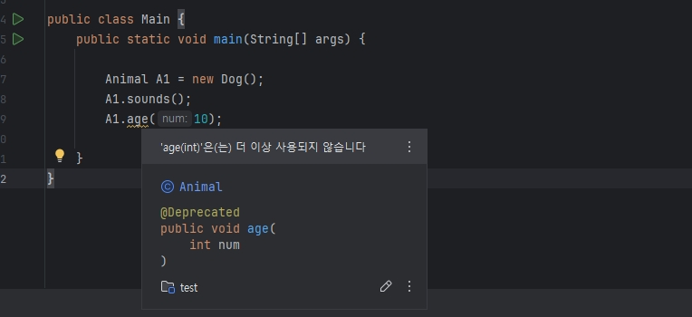

# Annotation

FrameWork는 어노테이션(Annotation)이 붙은 코드를 리플렉션(reflection) 등을 통해 읽고,  
이에 특정 의미를 부여해서 동작을 자동화 하는 것 입니다. 그 중 어노테이션은 `추가 정보`를 붙여주는 태그로 보는 것이 좋습니다.  

코드 수준에서 활용 가능한 주석형 자료라고 표현하며, `인터페이스`와 닮은 부분이 존재합니다.  
컴파일, 실행 과정에서 코드를 어떻게 처리할 것인지에 대한 정보로 보면 좋다.  
데이터 타입 구조체(메타 데이터)에 가까우며, 어노테이션을 읽고 사용하는 것은 `리플렉션`이나 `프레임워크`에서 사용됩니다.  

## 대표적인 예시

1. [@Override (재정의)](#1-override)
2. [@Deprecated(사용되지 않음 확인)](#2-deprecated)
3. [SuppressWarnings(경고무시)](#3-suppresswarnings)
4. [직접 구현](#4-sample)

<br>

## 1. Override

```java
class Animal {
    public void sounds() {
        System.out.println("nothing");
    }

    public void age (int num) {
        System.out.println(num);
    }
}

class Dog extends Animal {
    @Override
    public void sounds() {
        System.out.println("bark bark");
    }
}
```
* Override는 쉽게 설명하면 자식 클래스가 상속받은 메서드를 재정의하는 것이다.  

```java
public class Main {
    public static void main(String[] args) {
        
        Animals A1 = new Dog();
        A1.sounds();
        A1.age(10);

    }
}
```
```md
# 결과값
bark bark
10
```

* 위와 같이 `업캐스팅(Upcasting)`하여 `다형성(polymorphism)`을 구현할 수 있습니다.
    * 다형성이란?: 하나의 타입(부모 클래스 타입)으로 여러 자식 클래스의 객체를 다루는 행위입니다.  

이 이야기를 하는 이유는 상속에서는 시점이 중요하기 때문입니다.  
예를 들어 `Animals A1 = new Dog()`로 기존 팀이 사용을 하였으며 Dog에는 `sounds`를 구현을 안 하고, 사용하였다고 가정합니다.  
미래에 팀이 새로 구현하게 되었을 때, 레거시 코드들이 자동으로 Bark Bark를 외치게 되며 이는 전체적인 프로젝트 방향성이 달라지기 때문에 기존에 어떻게 개발하였는지가 중요합니다.


```java
package java.lang;
import java.lang.annotation.*;

//주석은 생략함

@Target(ElementType.METHOD)
@Retention(RetentionPolicy.SOURCE)
public @interface Override {
}
```
* _@Override를 Intelij IDE에서 Ctrl + B를 누르면 위와 같이 실제 코드를 볼수 있습니다._  
* 뒤에서 더 이야기 하겠지만 `RetentionPolicy.SOURCE`로 해당 어노테이션은 코드 단계에서 까지만 동작합니다.
* 쉽게 이야기하여서 주석입니다. ( _@Override를 사용하지 않아도 오버라이드됩니다._ )

<br>

## 2. Deprecated
더 이상 사용하지 않게 된 Method를 표기하여 주는 어노테이션입니다. ( _주석일 뿐 실행은 가능합니다._ )

```java
class Animals {
    public void sounds() {
        System.out.println("nothing");
    }

    @Deprecated
    public void age (int num) {
        System.out.println(num);
    }
}
```

* 위와 같이 사용되지 않는 메서드를 사용하게 되었을 때, 디버깅 혹은 IDE에서 위와 같이 표기되게 됩니다.

```java
/**
 * {@link #[대체할 메서드]} [하고 싶은 설명]
 */
@Deprecated
public void age (int num) {
    System.out.println(num);
}
```
* 위와 같이 수정하여 주는 것이 코드를 유지보수하기 좀 더 좋습니다.

<br>

## 3. SuppressWarnings
소스 코드 수준에서 적용되는 어노테이션으로 변수, 메서드, 클래스에 적용 가능합니다.  
사용되지 않는 변수, 메서드 등에 대한 `경고 메시지`를 무시하는 설정입니다. (컴파일은 가능합니다.)
* 특히 리플렉션할 때, 많이 발생되는데 이 때 유용하게 사용 가능합니다.

### 옵션
@SuppressWarnings("`deprecation`")
* 더 이상 사용되지 않는 코드를 사용함으로써 발생하는 경고를 무시합니다.
* _예전에 Android 개발할 때, 많이 보던 옵션_

@SuppressWarnings("`rawtypes`")
* (중요)제네릭 타입이 아닌 raw type 사용 시 발생하는 경고 무시합니다. 
    * 예시: `List list = new ArrayList()` `< >`이 생략됨
    * 테스트 코드여서 타입을 정하지 않거나 Java 5 이전의 레거시와 호환되게 사용 시에 쓰입니다.

@SuppressWarnings("`unchecked`")
* (중요)확인되지 않은 형변환에 관한 경고 무시합니다.

위와 같이 경고를 일부로 무시하는 해위이기 때문에 신중하게 사용해야 합니다.

```java
@SuppressWarnings("unused")
    public void newsounds() {
}
```
* 위와 같이 작성하면 한 번도 사용하지 않은 메서드에 더 이상 경고가 발생하지 않게 됩니다.

<br>

## 4. Sample