# Stand-Alone Installation

독힙형 SQL Server 설치를 설명하기 위하여 SQL Server 2016으로 작성하였습니다.  
기본적인 Windows Server 설치는 해당 문서에서 생략합니다.

## 1. Installation

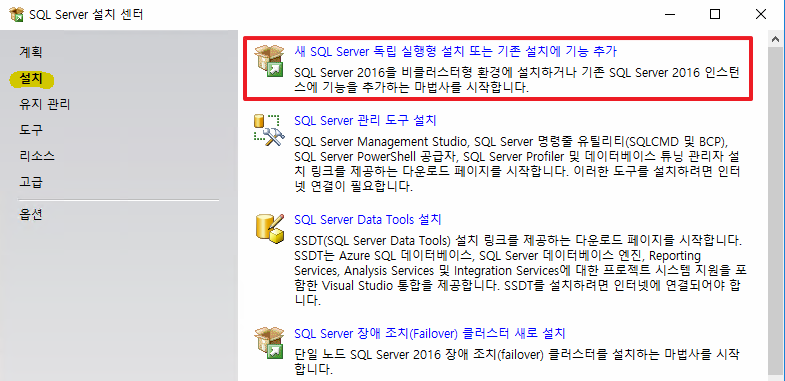
* SQL Server set_up을 클릭한 후, SQL Server 설치 센터를 실행합니다.
* 설치 탭으로 이동 후, "새 SQL Server 독립 실행형 설치 또는 기존 설치에 기능 추가"를 선택합니다.

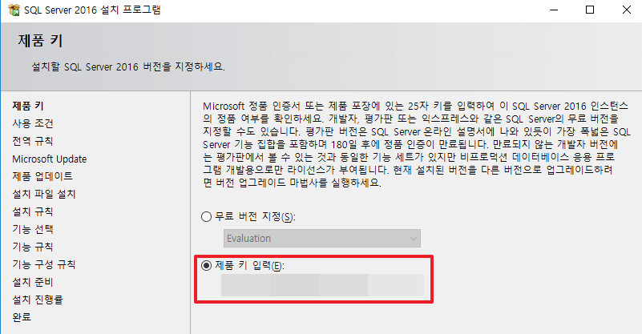
* 제품 키를 입력 후, 넘어갑니다.  
* 평가판에서 다른 에디션으로 추후에 변경할 수 있지만 권장 드리지 않습니다. (_평가판의 경우 다른 에디션으로 변경 가능한 기간에 대한 제한이 있습니다._)

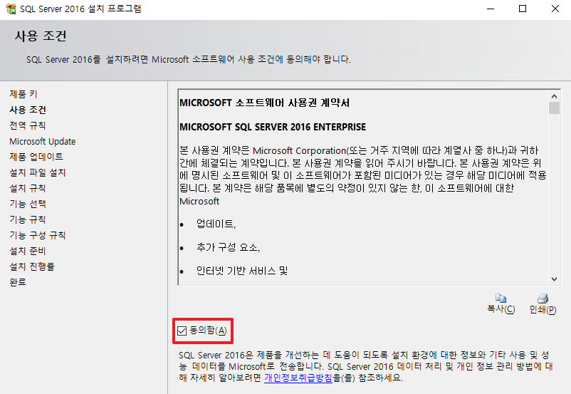
* 동의합니다.

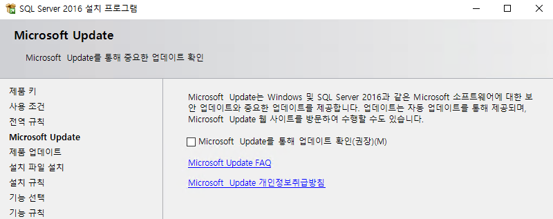
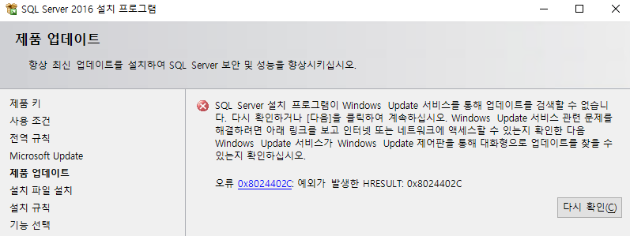
* 대부분 DB는 폐쇄망에서 사용하기 때문에 Update 옵션은 체크하지 않습니다.
* 업데이트 옵션을 체크하지 않을 경우, 오류가 출력되지만 무시하고 다음으로 넘어갑니다.

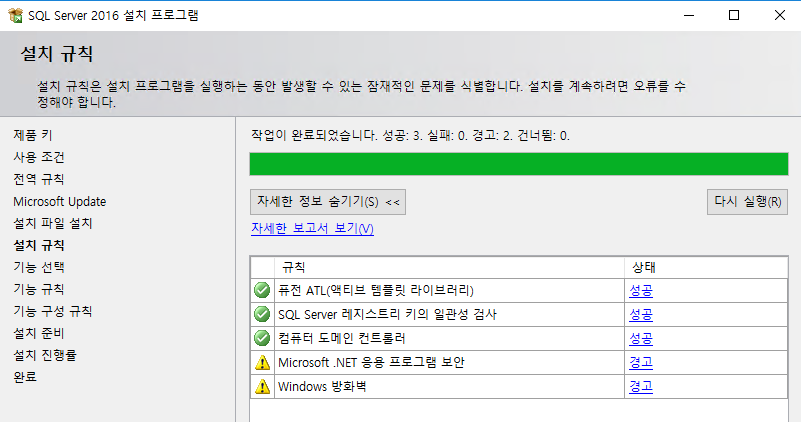
* .netframework 3.x를 설치하지 않아서 경고 상태가 발생합니다. (Windows Server OS를 사용하여 .net 3.x 설치를 권장합니다.)  
* 방화벽 설정을 하지 않아서 경고 상태가 발생합니다.

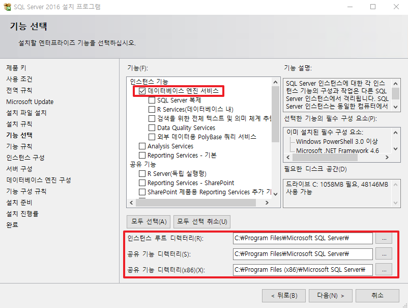
* 기본적인 데이터베이스 엔진 서비스만 설치합니다.
* 하기의 인스턴스 설치 경로는 Default로 유지합니다.(_굳이 변경하는 케이스는 아직까지 못 봤습니다._)
    * 여기서 공유 기능 디렉터리란 여러 인스턴스들이 공유하며 사용하는 디렉터리를 뜻합니다.

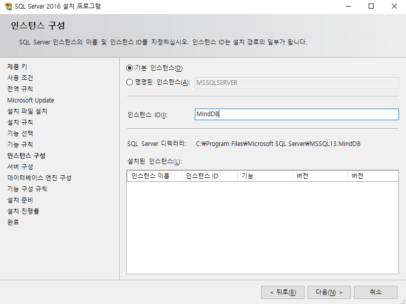
* 하나의 서버에는 여러 개의 DBMS를 설치할 수 있으며, 이러한 단위로 사용하는 것이 인스턴스 입니다.
    * _정말 특별한 케이스 아닌 이상 같은 서버에 여러 개의 인스턴스를 설치하는 것을 보진 못하였습니다._
* 그 중에서 메인인 인스턴스를 기본 인스턴스라고 합니다.
* 인스턴스 명을 설정한 후, 다음으로 넘어갑니다.

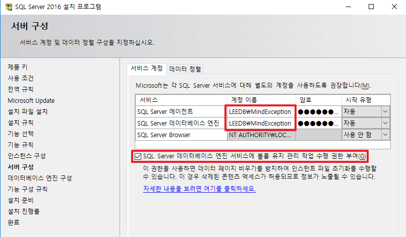
* DB 엔진인 SQL Server 데이터베이스 엔진과 스케쥴러인 SQL Server 에이전트의 관리자 계정을 변경하여 줍니다.
    * 실제로 운영 환경에서 Default인 계정을 사용하는 경우는 잘 없습니다.
* 해당 옵션은 DB 생성 시에 데이터 파일과 로그 파일이 생성이 되는데, 데이터 파일 생성과 스케일링이 빨라지는 장점이 있다.
* 기본적으로 허용이 안된 이유는 볼륨에 기존 데이터 파일을 삭제하지 않고, 공간만 확보한다. 따라서 이전에 흔적을 볼 수 있다.
* 추가적으로 데이터가 있는 볼륨에 해당 계정에 대하여 권한을 주는 옵션이다. Administrators일 경우 상관 없지만 따로 만든 그룹이라면 해당 옵션으로 성능이 향상 될 수 있다. (_기본적으로 활성화 하는게 좋다._)

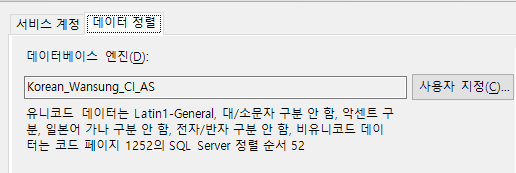
* 기본적으로 해당 옵션은 수정하지 않는 걸 권장한다.
* 옵션을 해석하자면 한국어, A = a로 대소문자 구분 없음, (1) != ① 악센트 등은 구분하는 옵션이다.

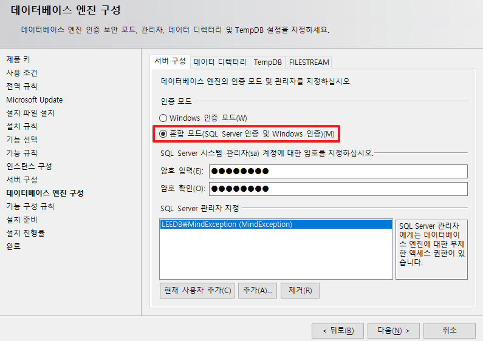
* Windows 인증을 선택하게 되면 Windows 계정 ID와 Pwd만을 이용하여 인증합니다.
* 혼합 계정 인증을 통하여 SQL Server로부터도 인증 받기를 권장하며, SQL Server 관리자 역할에 Windows 계정들을 넣어줍니다.

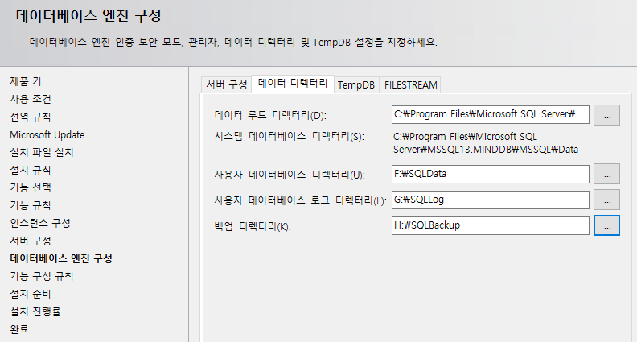
* 시스템 DB 데이터 path는 수정하지 않고, C에 사용한다.
* 데이터, 로그 및 백업 저장 경로는 각각의 볼륨으로 나누어서 설정하는 것을 권장한다.

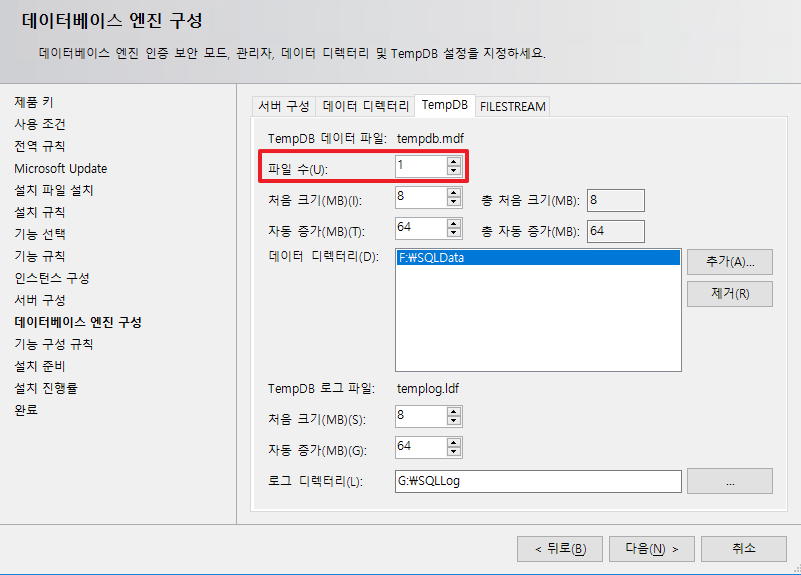
* 해당 파일 수는 CPU 코어 수에 따라서 설정하여 주면 된다(ex: 4core 사용 중일 경우, max가 4로 설정한다.)
    * 그 위로 설정할 경우, 오버헤드 되어 성능이 좋지 않아 권장하지 않는다.

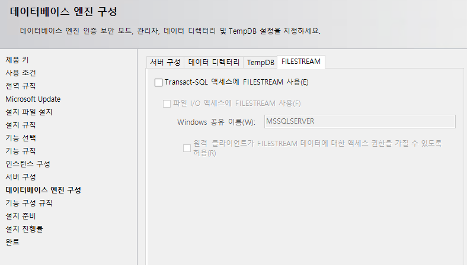
* 데이터 형식을 파일 형식으로도 가능하게 되어, 이미지나 비디오 등에 사용된다.

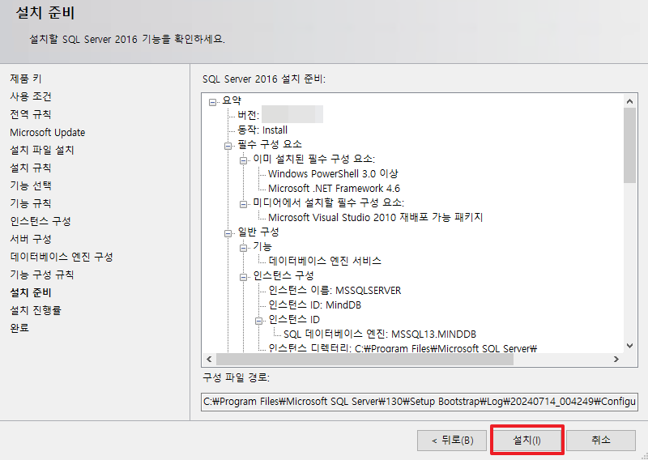
* 설정한 모든 옵션을 확인하고, 설치합니다.

# 2. SSMS(SQL Server Management Studio)
SQL Server는 Microsoft에서 제공하는 SSMS IDE를 사용하는 것을 권장한다.  
_아래의 링크에서 다운 받은 후, 설치하면 되기 때문에 설치 방법은 생략합니다._
* 링크: [https://learn.microsoft.com/ko-kr/sql/ssms/download-sql-server-management-studio-ssms?view=sql-server-ver16](https://learn.microsoft.com/ko-kr/sql/ssms/download-sql-server-management-studio-ssms?view=sql-server-ver16) 

