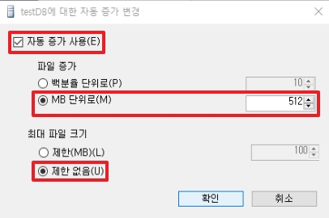

# DataBase Structure
DB 생성 시에 제일 중요한 3가지는 Naming, Location, Size 입니다.

## 1. Create DB


* 데이터베이스 항목에서 새로운 데이터베이스를 생성합니다.


* system DB 중 하나인 model DB를 복사하여서 새로운 DB를 생성합니다.


* 데이터 파일과 트랜잭션 로그 파일로 2개가 생성됩니다.
    * __데이터 파일__: *.mdf, *ndf
        * mdf 파일은 Primary 파일이며, ndf 파일은 Secondary 파일입니다.
        * mdf 파일은 하나만 존재하지만, ndf 파일은 보조 파일로 여러 개 존재가 가능합니다.
    * __트랜잭션 로그 파일__: .ldf

  
순간적으로는 거의 동시지만, 엄격하게는 로그 파일에 먼저 데이터가 전달되고, 데이터 파일이 수행되게 됩니다.

* MS SQL은 트랜잭션이 들어오면 데이터와 로그 파일에 전달되게 됩니다.
    * 이 과정에서 데이터 파일과 로그 파일이 하나의 Disk에 있게 된다면, Disk I/O 속도에 영향을 받아 성능이 저하 될 수 있습니다. 따라서 구성 시에 따로 구성하여야 합니다.
* 이를 통하여 데이터 파일은 로그 파일을 참조하여 데이터를 복구 혹은 롤백할 수 있게 됩니다.


  
Link: [https://learn.microsoft.com/ko-kr/sql/relational-databases/pages-and-extents-architecture-guide?view=sql-server-ver16](https://learn.microsoft.com/ko-kr/sql/relational-databases/pages-and-extents-architecture-guide?view=sql-server-ver16)
* 데이터 행은 페이지에 기록이 됩니다. 기본적으로 하나의 페이지는 8kb이며, 8개의 페이지가 모이게 된 것을 익스텐트라고 부릅니다.
    * 기본 설정 시, 하나의 익스텐트가 된 후 부터는 페이지를 생성하는 것이 아닌, 익스텐트를 생성하게 됩니다.  

_Oracle에서는 페이지가 아닌 블록이라고 부르며, 블록 크기도 고정이 아니라 설정이 가능합니다._

</br>

## 2. 파일 크기 설정 (Size)


* 처음 생성 시에 데이터 파일 크기를 지정할 수 있습니다.
    * _일반적으로 로그 파일이 데이터 파일 크기 보다 작습니다._

* 데이터 파일에 용량이 꽉 차게 된다면, SQL Server는 자동으로 파일 크기를 늘릴 수 있습니다.

  
_위 설정이 기본 권장 설정입니다_
* 자동 증가 옵션을 활성화 하여야 데이터 파일 용량이 다 찼을 때 파일 크기가 자동으로 증가합니다.
* 증가하는 파일의 크기는 백분율이 아닌 MB로 설정하여 데이터를 추가합니다.
    * 파일 크기가 증가한다는 의미는 .mdf 파일에서 .ndf 파일로 새로 추가된다는 뜻이 아닌, .mdf 파일의 용량 크기가 증가한다는 뜻 입니다.

* 기본적으로 디스크 용량이 꽉 찰 때까지 가능한 __제한 없음__ 을 선택합니다.
    * 제한이 있는 경우는 C 디스크를 사용할 경우가 아니라면, 체크하지 않습니다.

</br>

## 3. 파일 그룹 (Location)
* 기본 파일 그룹에는 기본 데이터 파일과 다른 파일 그룹에 배치되지 않은 보조 파일이 포함됩니다.
* 관리, 데이터 할당 및 순위를 위해 데이터 파일을 그룹화하기 위해 사용자 정의 파일 그룹 생성이 가능합니다.


* 새로운 데이터 파일을 생성할 경우, 파일 그룹을 위와 같이 설정할 수 있습니다.


* 새 파일 그룹을 생성할 경우, __읽기 전용__ 과 __기본값__ 옵션이 존재합니다.
    * __읽기 전용__ : 해당 데이터 파일을 읽기만 가능하게 만듭니다. 처음부터 설정할 수 있지만, 일반적으로 데이터가 저장된 데이터 파일을 읽기 전용으로 변경 시에 사용하는 옵션입니다.
    * __기본값__ : 기본 파일 그룹은 Primary로 되어 있습니다. 테이블을 만들 때, 특정 파일 그룹을 지정하여 만들지 않을 경우에 자동으로 기본값 파일 그룹을 선택하여 테이블을 생성합니다.


* 새로운 파일 그룹 생성 시에는 디스크를 따로 설정하여 성능을 향상 시킵니다.


* 하나의 파일 그룹에는 그룹인 만큼 다른 데이터 파일을 포함시키는 것이 가능합니다.
* 같은 Primary 그룹이라도 mdf 파일은 데이터베이스에 하나만 존재하며, 이후에는 전부 ndf 파일입니다.

  
Link: [https://learn.microsoft.com/ko-kr/sql/relational-databases/databases/database-files-and-filegroups?view=sql-server-ver16#filegroups](https://learn.microsoft.com/ko-kr/sql/relational-databases/databases/database-files-and-filegroups?view=sql-server-ver16#filegroups)
* Primary 그룹에 하나의 데이터 파일이 아니라 위와 같이 __testDB__ 와 __testDB02__ 가 있을 경우에 하나의 데이터 파일을 우선적으로 사용하는 것이 아닌 `라운드 로빈 방식`으로 하나씩 채워 나가면서 사용되어진다.

* 위 문서에서 권장 사항 확인 시에 `하나의 디스크에는 하나의 파일 그룹`만 사용하며, 파일 그룹 안에 `단일 데이터 파일`만 사용하는 것이 좀 더 성능에 향상에 도움이 됩니다.

```sql
-- Primary는 예약어 이기 때문에 [ ] 구문 안에 넣어서 문자열로 만듭니다.
create table testTable02(
	col1 int,
	col2 int,
	col3 int
) on [PRIMARY];

create table testTable02(
	col1 int,
	col2 int,
	col3 int
) on [파일 그룹 이름];
```
* 만약 파일 그룹을 설정하지 않는다면, 기본값으로 설정된 파일 그룹을 사용하게 됩니다.