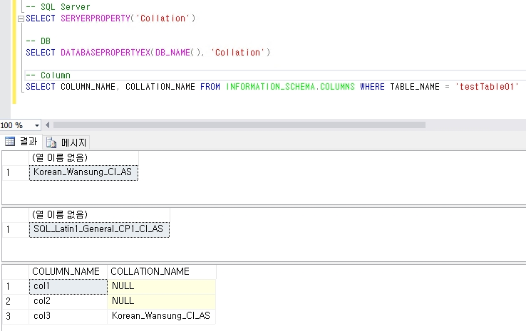

# 데이터 정렬(Collation)

데이터 정렬은 char, varchar, text, nchar, nvarchar 또는 ntext와 같은 문자열의 `대소문자`와 `악센트`를 어떻게 구분할지 정의하는 설정입니다.  
기본적인 구분 방법은 아래와 같습니다.

- **Case Insensitive (CI)**: `A`와 `a`를 동일하게 취급
- **Case Sensitive (CS)**: `A`와 `a`를 다르게 취급
- **Accent Sensitive (AS)**: `resume`과 `résumé`를 다르게 취급
- **Accent Insensitive (AI)**: `resume`과 `résumé`를 동일하게 취급

실제로는 위 취급을 조합하여 사용하게 되며, 아래 정도만 숙지하면 됩니다.  

| 정렬 방식 | `"ABC"` vs `"abc"` | `"résumé"` vs `"resume"` |
|-----------|---------------------|---------------------------|
| `CI_AS`   | ✅ 같음              | ❌ 다름                    |
| `CS_AI`   | ❌ 다름              | ✅ 같음                    |

</br>

Korean SQL Server를 설치하게 되면 기본적으로 `Korean_Wansung_CI_AS` 로 설정됩니다.  
혹시라도 SCCM에서 사용할 DB라면 데이터 정렬을 `SQL_Latin1_General_CP1_CI_AS`로 설정할 것을 권고합니다.

</br>

기본적으로 데이터 정렬을 설정하지 않을 경우에는 서버 인스턴스의 정렬을 상속하게 됩니다.  
`SQL Server Instance` -> `Database` -> `Table(Column)` 입니다.  


```sql
-- Server
SELECT SERVERPROPERTY('Collation')

-- DB 
SELECT DATABASEPROPERTYEX(DB_NAME(), 'Collation')

-- Column
SELECT COLUMN_NAME, COLLATION_NAME FROM INFORMATION_SCHEMA.COLUMNS WHERE TABLE_NAME = '[테이블명]'
```
위 테이블은 Server의 데이터 정렬인 Korean_Wansung_CI_AS을 상속 받아 사용하다가 DB의 데이터 정렬을 바꾼 상황입니다.  
여기서 중요한 점은 DB의 데이터 정렬을 변경하더라도 테이블의 정렬이 변경되지 않는다는 점입니다.  

따라서 기존에 운영 중인 테이블의 데이터 정렬을 변경하게 될 경우, 컬럼부터 수작업으로 변경해야 하니 구축 단계부터 여러 차례 확인 하는 것이 중요합니다.

[Reference]
[https://learn.microsoft.com/ko-kr/sql/relational-databases/collations/set-or-change-the-column-collation?view=sql-server-ver16](https://learn.microsoft.com/ko-kr/sql/relational-databases/collations/set-or-change-the-column-collation?view=sql-server-ver16)