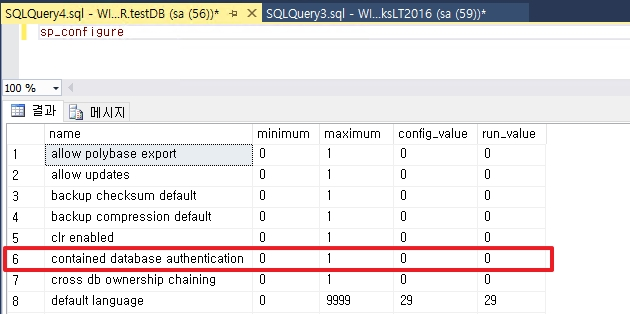
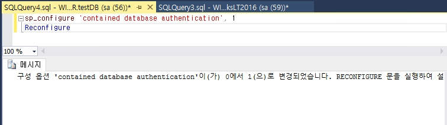
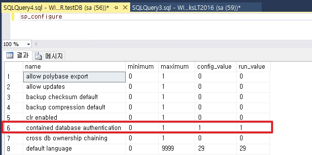
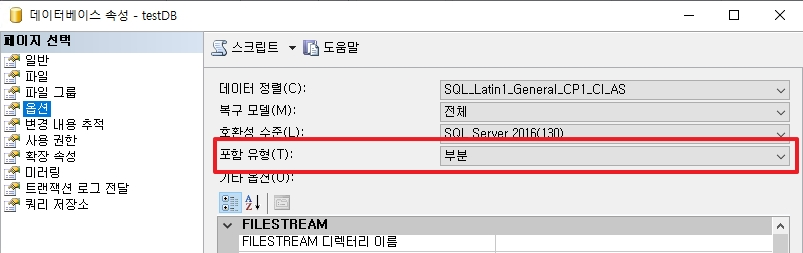
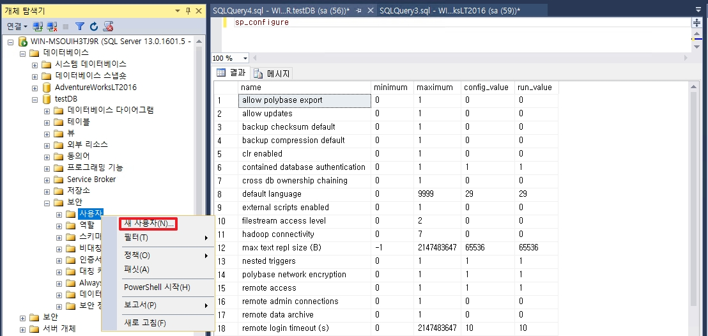
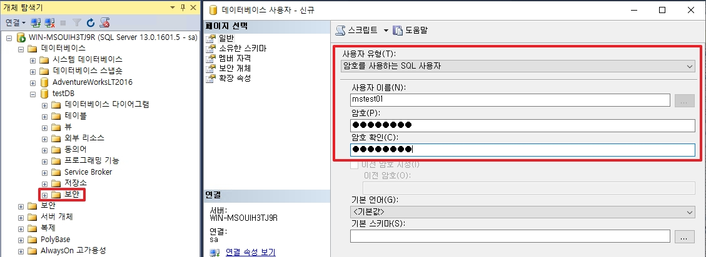
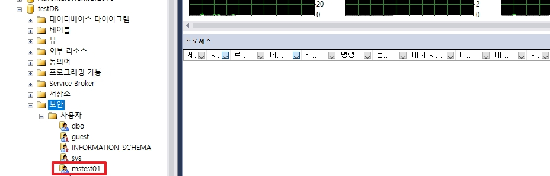
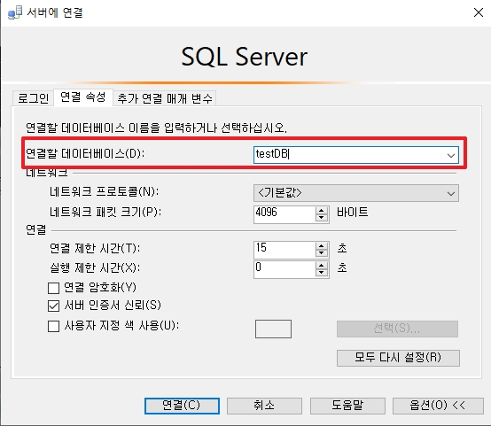
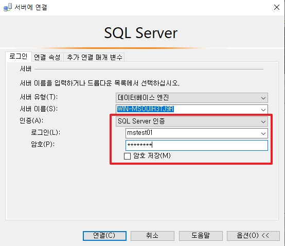
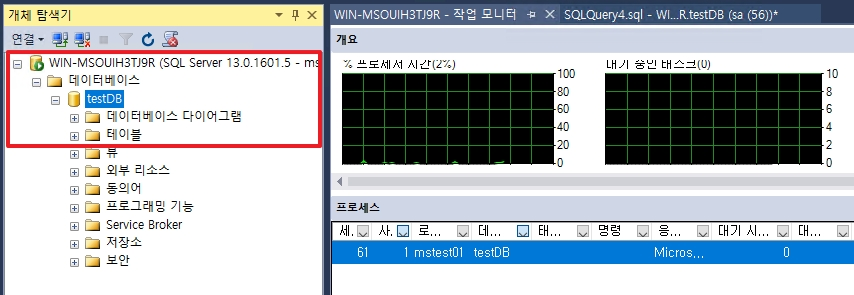

# Database Option

여기서는 SQL Server의 Database 옵션 중 알면 좋은 것들을 기록합니다.

1. SQL Server 호환성
2. 포함 유형(Contained Database)
3. 자동 닫기 및 축소
4. 통계
5. 엑세스 제한
6. 읽기 전용

</br>

# 1. SQL Server 호환성

SQL Server 마다 호환성이 존재하며, 2016의 경우 13버전으로 130으로 표기하게 됩니다.  
호환성에 따라서 데이터베이스 엔진이 달라지기 때문에 쿼리 즉, `함수를 처리하는 방식의 변경` 혹은 `새로운 함수`를 사용할 수 있다는 이점 등이 있습니다.  

예를 들어 아래의 명령어를 통하여 확인이 가능합니다.
```sql
select * From STRING_SPLIT('1,2,3,4,5,6', ',')
```
<br>

__[130 ver]__   


__[120 ver]__  


대신 엔진의 변경으로 인하여 기존 사용하던 쿼리의 처리 속도가 느려지는 경우도 매우 드물게 있기 때문에 Hotfix 등의 확인이 필요합니다.  
결론적으로 DB를 마이그레이션 할 때 호환성을 최신으로 올리는 것을 권장합니다.  

<br>

# 2. 포함 유형(Contained Database)
_실무적인 기능은 아닙니다._  
`포함`(CONTAINMENT) 옵션은 로그온 계정 관리에 대하여 SQL Server 인스턴스로부터 DB를 분리하는 개념입니다.

__[추가 사항]__
* 복제, 변경 데이터 캡처, 변경 내용 추적을 사용하도록 설정하면 포함된 데이터베이스를 사용하지 못합니다.
* _이 기능들은 작동 시 서버 수준 보안 개체나 작업, SQL Agent 등과 연동되는데, 포함된 데이터베이스는 이런 서버 수준 기능과 호환되지 않음._

  
기본 옵션은 `없음`으로 되어 있으며, 포함 유형을 사용하기 위해서는 `부분` 값으로 변경해야합니다.  
하지만 바로 변경은 안되기 때문에 설정 값을 변경해야합니다.

<br>


```sql
-- SQL Server 인스턴스의 설정값
sp_configure
```
* 위 `contained database authentication` 의 기본 값은 0이며, 0일 경우 포함 오션을 사용하지 못 합니다.

<br>


```sql
-- SQL Server에서 포함(Contained) 데이터베이스 기능을 활성화
sp_configure 'contained database authentication', 1
Reconfigure
```
* 위 명령어를 통하여 값을 `1`로 변경합니다.

<br>


```sql
-- SQL Server 인스턴스의 설정값
sp_configure
```
* 1로 변경할 경우 위와 같이 출력됩니다.

<br>


* 옵션 값을 변경하였으면, 데이터베이스의 포함 유형 값이 `부분`으로 변경됨을 확인할 수 있습니다.

<br>


* `데이터베이스` -> `보안` -> `새 사용자`로 이동합니다.

<br>


* 포함 유형 값이 없음일 경우에는 사용자 유형 기본 값이 `로그인을 사용하는 SQL 사용자`이지만, 변경 후에는 `암호를 사용하는 SQL 사용자`로 변경됩니다.
* _테스트를 진행하기 위하여 신규 계정을 생성합니다. 해당 계정은 testDB에만 존재합니다._

<br>


* 위와 같이 DB의 사용자 목록에서 확인할 수 있습니다.

<br>


* 포함된 데이터베이스로 설정하게 되면 서버로 접속하는 것이 아닌, 데이터베이스로 접속이 가능합니다.

<br>


* 위에서 만든 테스트 계정으로 로그인합니다.

<br>


* 기존에서 서버로 접속할 때와 다르게 개체 탐색기에서 해당 testDB만 출력되는 것을 확인할 수 있습니다.

<br>