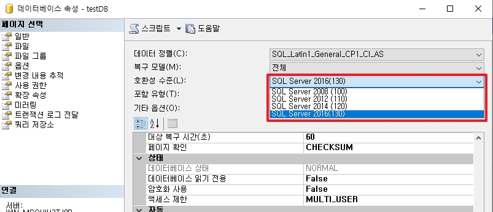
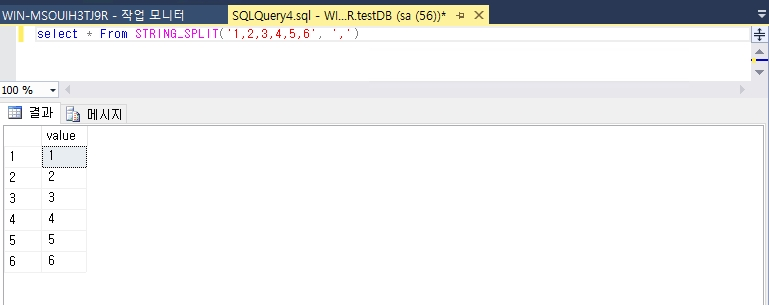
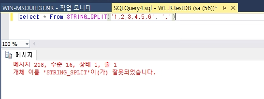
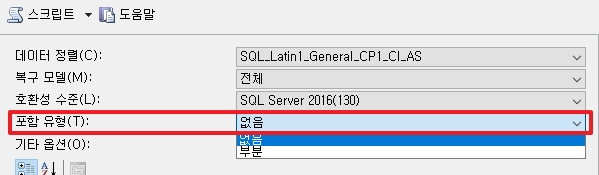

# Database Option

여기서는 SQL Server의 Database 옵션 중 알면 좋은 것들을 기록합니다.

1. SQL Server 호환성
2. 포함 유형(Contained Database)
3. 자동 닫기 및 축소
4. 통계
5. 엑세스 제한
6. 읽기 전용

</br>

# 1. SQL Server 호환성

SQL Server 마다 호환성이 존재하며, 2016의 경우 13버전으로 130으로 표기하게 됩니다.  
호환성에 따라서 데이터베이스 엔진이 달라지기 때문에 쿼리 즉, `함수를 처리하는 방식의 변경` 혹은 `새로운 함수`를 사용할 수 있다는 이점 등이 있습니다.  

예를 들어 아래의 명령어를 통하여 확인이 가능합니다.
```sql
select * From STRING_SPLIT('1,2,3,4,5,6', ',')
```
<br>

__[130 ver]__ 


__[120 ver]__  


대신 엔진의 변경으로 인하여 기존 사용하던 쿼리의 처리 속도가 느려지는 경우도 매우 드물게 있기 때문에 Hotfix 등의 확인이 필요합니다.  
결론적으로 DB를 마이그레이션 할 때 호환성을 최신으로 올리는 것을 권장합니다.  

<br>

# 2. 포함 유형(Contained Database)
_실무적인 기능은 아닙니다._

