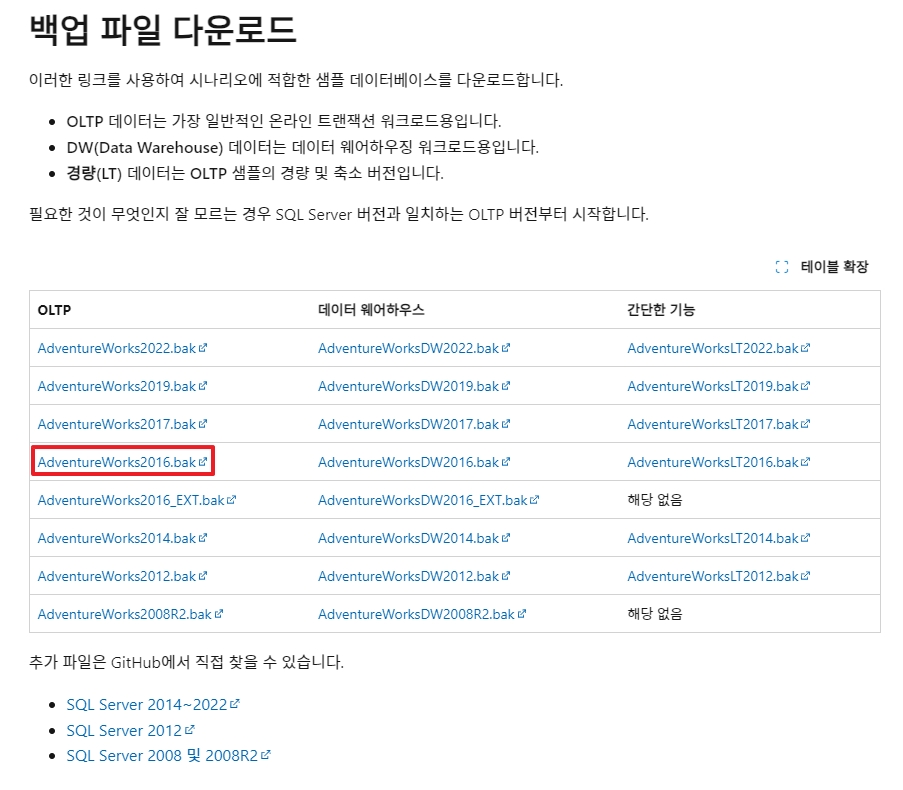
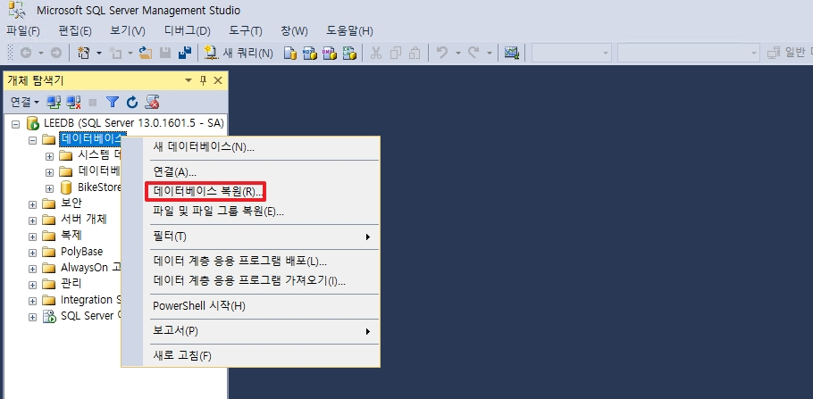
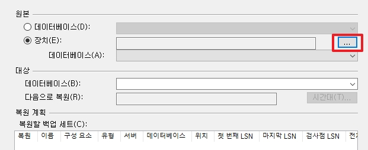
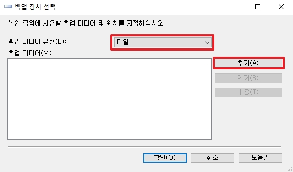
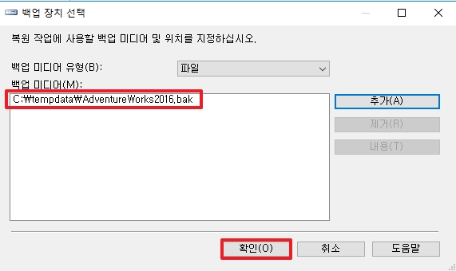
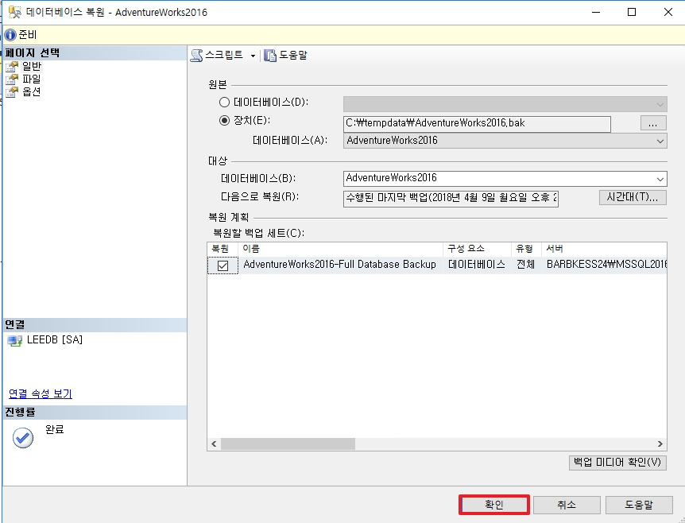
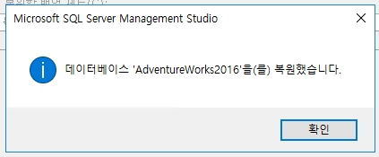

# SQL Server Sample 데이터 추가 방법

MS에서 제공하는 샘플 DB를 복원하여, 안에 데이터를 사용한 연습 및 실습을 진행합니다.

## 1. 적용 방법

  
링크: [https://learn.microsoft.com/ko-kr/sql/samples/adventureworks-install-configure?view=sql-server-ver16&tabs=ssms](https://learn.microsoft.com/ko-kr/sql/samples/adventureworks-install-configure?view=sql-server-ver16&tabs=ssms)

* 설치한 SQL Server 버전에 맞추어서 OLTP 데이터를 다운로드 합니다.

* SSMS에 접속한 후, 데이터베이스 폴더를 우 클릭하여 __데이터베이스 복원__ 을 선택합니다.

* 원본 탭에서 장치를 선택한 후, 우측의  ... 버튼을 클릭합니다.

* .bak 파일을 다운 받았기 때문에 백업 미디어 유형을 __파일__ 로 선택한 후, 추가 버튼을 클릭합니다.

* 다운로드 받은 .bak 파일을 선택하여 추가합니다.

* .bak 파일을 통하여 데이터 베이스를 복원합니다.