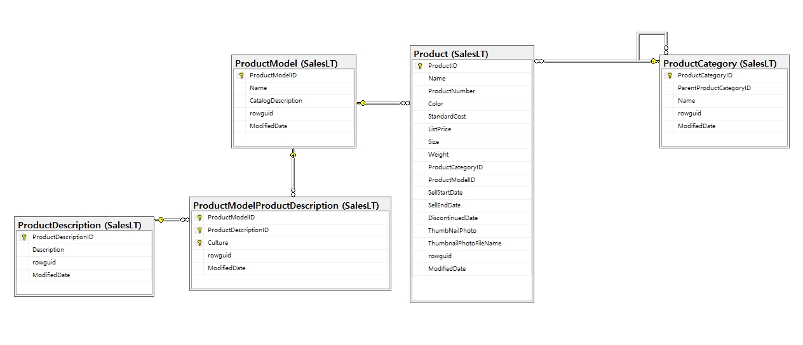

# 개요
SQL 연습 및 Code 업로드 용으로 사용합니다.

 
  
## AdventureWorksLT2016

[Link] [https://learn.microsoft.com/ko-kr/sql/samples/adventureworks-install-configure?view=sql-server-ver16&tabs=ssms](https://learn.microsoft.com/ko-kr/sql/samples/adventureworks-install-configure?view=sql-server-ver16&tabs=ssms)

* DB 데이터는 Microsoft에서 제공하는 예제 데이터를 사용하여 진행합니다. 
