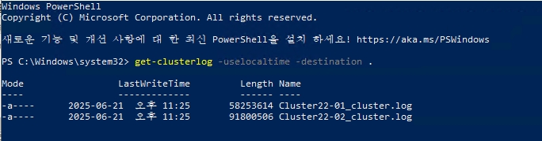

# Failover Cluster

Failover Cluster에서 주로 수집할 부분은 `Cluster Log`와 `유효성 검사 보고서`입니다.  
주로 생성되는 위치는 `C:\Windows\Cluster\Reports`입니다.

# Cluster log 생성

1. 관리자 권한으로 Powershell을 실행합니다.

2. 아래의 명령어를 실행하여 Cluster Log를 생성합니다.  

```
get-clusterlog -uselocaltime -destination .
```
_하나의 node에서 실행하면 모든 node에서 cluster log가 생성됩니다._

3. 모든 node에서 `C:\Windows\Cluster\Reports`에 생성된 Cluster Log를 수집합니다.