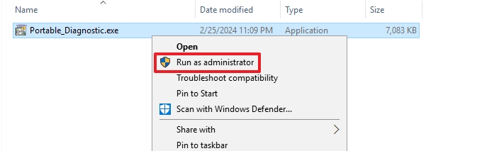
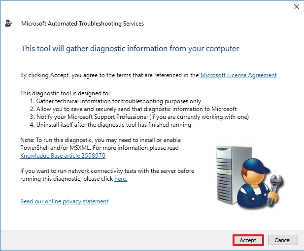
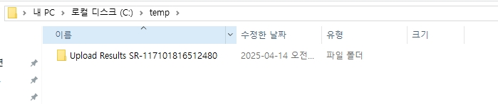

# MPS Report

해당 툴은 Windows Server의 설정 값 및 이벤트 로그 등을 한 번에 수집할 수 있게 도움을 주는 Tool입니다.  
MPS Report -> Portable_Diagnostic -> TSS로 발전하였으며, 아래의 링크에서 TSS는 다운로드 가능합니다.(_이전 버전은 EOS 되었습니다._)  
링크: [https://learn.microsoft.com/ko-kr/troubleshoot/windows-client/windows-tss/introduction-to-troubleshootingscript-toolset-tss](https://learn.microsoft.com/ko-kr/troubleshoot/windows-client/windows-tss/introduction-to-troubleshootingscript-toolset-tss)

_Windows Server 2025 & Windows 11에서 정상적으로 수집되지 않기 때문에 위와 같이 TSS를 사용하여 수집해야합니다._

 

# 1. Portable_Diagnostic 수집(English)

* After decompressing, run with administrator privileges.

 

* Click `Accept`

 

* Click `Start`

 

* Click `Yes`

 

* Click `Collect Detailed DFSR Information`
* _In the case of a member server, workgroup, or DC server that is not being replicated, A pop-up window like the one above may not appear._

 

* Click `Next`

 

* Set the location where you want to store the MPS Report.

 

* Click `Cancle`

 

* Please check the saved MPS report and compress it and deliver it to us.

 

# 2. Portable_Diagnostic 수집(Korean)

* 압축을 해제한 후, 파일을 관리자 권한으로 실행합니다.

 

* 데이터 수집에 동의합니다.

 

* 데이터 수집을 시작합니다.

 

* 보안 로그 수집에 동의합니다.

 

* `DFSR 상세 정보` 수집에 동의합니다.
* _복제가 이루어지고 있지 않은 DC 서버 혹은 멤버서버, Workgroup일 경우에 위와 같은 팝업창은 나타나지 않을 수 있습니다._

 

* `다음`으로 넘어갑니다.

 

* 수집한 MPS Report를 저장할 경로를 설정합니다.

 

* 저장이 완료되면, 취소를 클릭합니다.

 

* 폴더가 생성된 위치로 이동하여, MPS Report를 압축하여 전달 부탁드립니다.

 