# Microsoft Network Monitor

네트워크 패킷 단에서 분석하기 위해서 위 도구를 사용하여 캡쳐하고 분석합니다.  
seq&ack 확인을 통한 패킷 누락 및 Payloadlen 값 확인 후, 패킷 단편화 분석 등등...

다운로드 링크: [https://www.microsoft.com/en-us/download/details.aspx?id=4865](https://www.microsoft.com/en-us/download/details.aspx?id=4865)

## 1. 넷몬 설치
[Korean]  
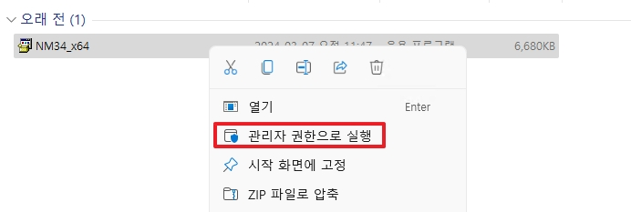
* 관리자 권한으로 실행합니다.

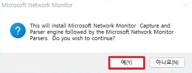
* Network Monitor 설치에 동의합니다.

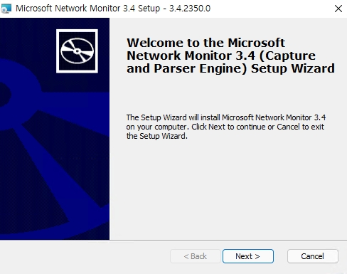
* 다음으로 넘어갑니다.

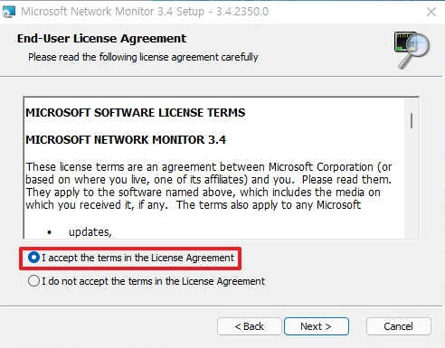
* 라이센스에 동의합니다.

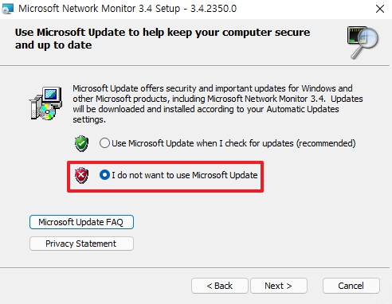
* 자동 업데이트를 비활성화합니다.

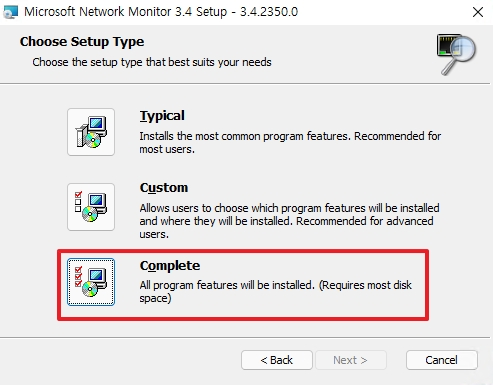
* 모든 옵션을 설치합니다.

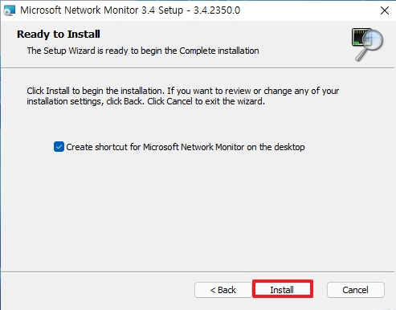
* Network Monitor를 설치합니다.

[English]  

* Run with administrator privileges.


* Agree to install Network Monitor.


* Move Next Course


* Agree with the license.


* Disable automatic updates.


* Install all options.


* Install Network Monitor.

## 2. 네트워크 캡쳐(로컬 분석)
_용량을 한정하여 캡쳐하고 싶다면 GUI가 아닌 CMD로 수집합니다._
  
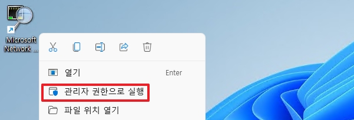
* 관리자 권한으로 실행합니다.

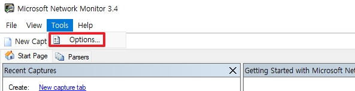
* `Tools` -> `Option`으로 이동합니다.

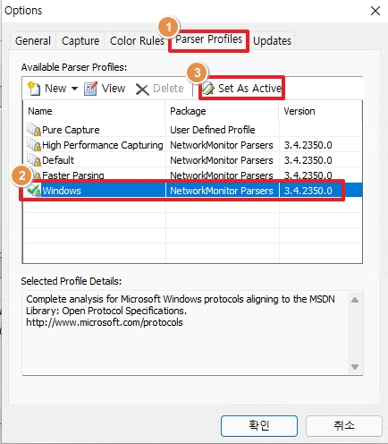
* `Parser Profiles` -> `Windows` -> `Set As Active`을 순서대로 클릭합니다.
* 위 설정으로 Netmon에서 Windows Parser Profile을 활성화합니다.

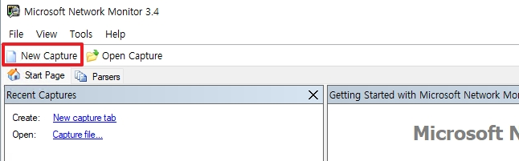
* 패킷 수집을 위한 새로운 캡쳐를 생성합니다.

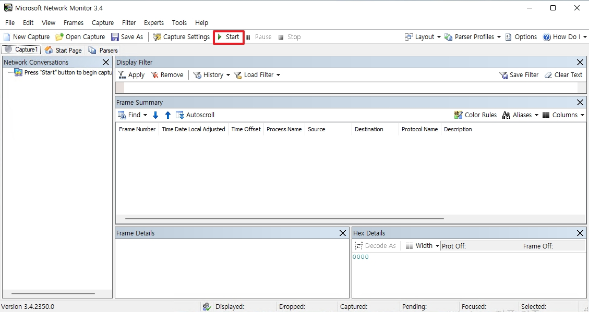
* `Start`를 클릭하여 패킷 수집을 시작합니다.

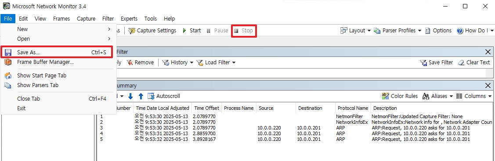
* 수집이 종료된 후, `Stop`을 클릭합니다.
* 데이터 수집 후, `File` -> `Save AS`로 이동합니다.

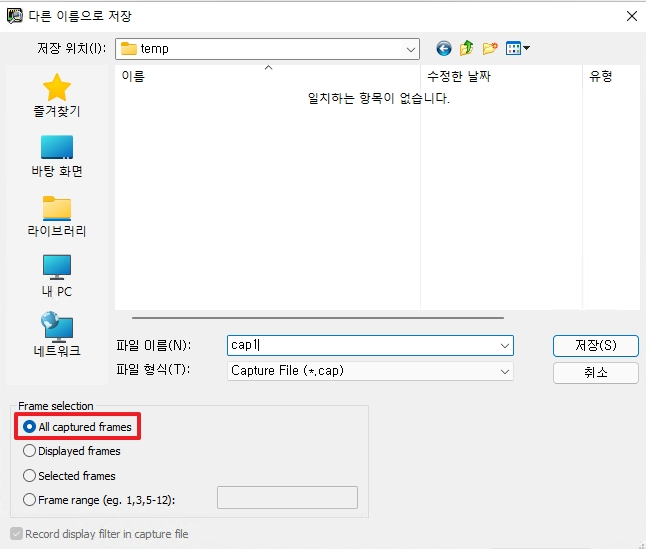
* 수집된 데이터를 원하는 경로에 저장합니다.

<br>

## 3. 네크워크 캡쳐(덤프 수집)

[Korean]  
Netmon 수집 시, 해당 서버에서 발생하는 모든 네트워크 패킷이 캡처되므로 초기에는 1분간만 수집하여 1분 동안의 데이터 적재량을 모니터링해 주시기 바랍니다. 문제가 없다고 판단될 경우, 장애 재현 시점 또는 10분간 수집하여 전달해 주시기 바랍니다.

수집 시에 디스크 용량을 확인 부탁드리며, 용량이 부족할시에 즉시 CMD창에서 `Ctrl + C`를 입력하여 수집을 종료합니다.

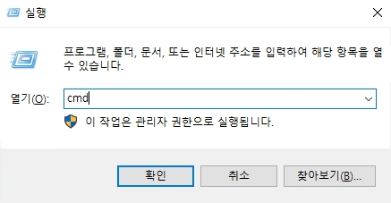
* 실행창에서 cmd를 관리자 권한으로 실행합니다.
* `cmd` 입력 후, `Ctrl + Shift + Enter`를 동시 입력하여 관리자 권한으로 실행됩니다.

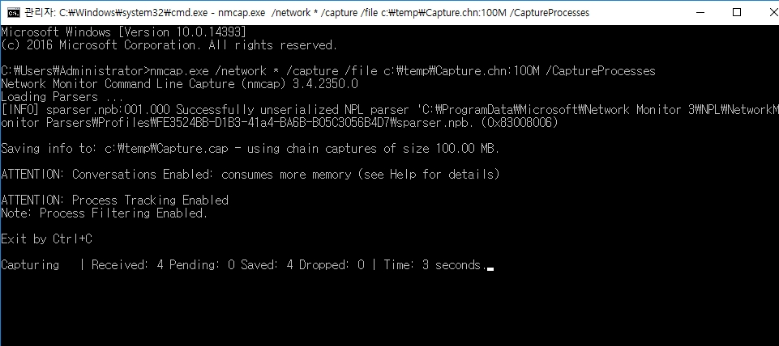
```
nmcap.exe /network * /capture /file c:\temp\Capture.chn:100M /CaptureProcesses
```
위 명령어를 실행하여 네트워크 패킷을 수집합니다.
* c:\temp 경로에 Capture 이름을 한 cap파일들을 100Mbyte 단위로 수집합니다.


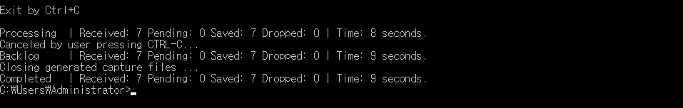
* 수집이 완료된 후, `Ctrl + C`를 입력하여 수집을 종료합니다.

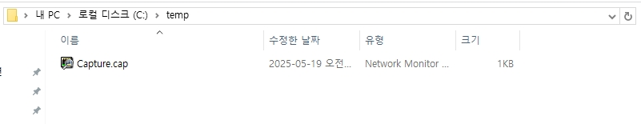
* 수집된 데이터를 전달합니다.

<br>

[English]  
When collecting Netmon, all network packets from that server are captured, so initially collect only one minute and monitor the data load for one minute. If you think there is no problem, collect and deliver it at the time of failure or for 10 minutes.

Please check the disk capacity when collecting, and if the capacity is insufficient, immediately enter 'Ctrl + C' in the CMD window to end the collection.


* In the Run window, run cmd with administrator privileges.
* After entering 'cmd', enter 'Ctrl + Shift + Enter' at the same time and run with administrator authority.


```
nmcap.exe /network * /capture /file c:\temp\Capture.chn:100M /CaptureProcesses
```
Run the above command to collect network packets.
* Collect cap files named Capture in the c:\temp path repeatedly in units of 100 Mbytes.


* After the collection is complete, type 'Ctrl + C' to end the collection.


* Deliver the collected data.