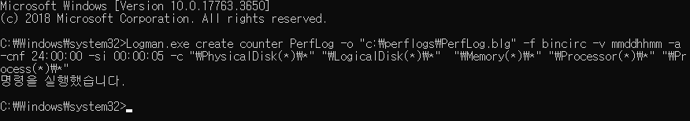
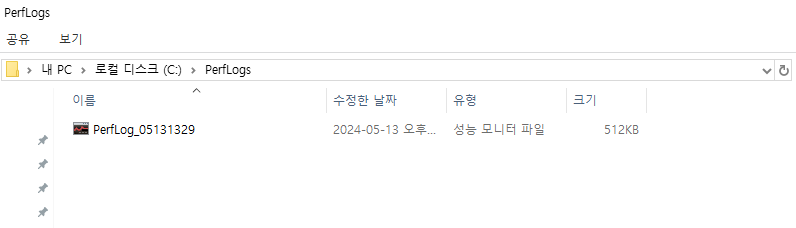

# Perfmon
## Windows 성능 모니터

Windows 운영 체제에서 성능 모니터링을 위한 툴입니다. "Performance Monitor"의 줄임말로, 시스템 리소스 사용량을 추적하고 모니터링하여 시스템의 성능을 분석할 수 있게 해줍니다.   
이를 통해 CPU, 메모리, 디스크, 네트워크 등의 리소스 사용량을 실시간으로 확인하고, 특정 프로세스 또는 서비스의 성능을 감시할 수 있습니다. 또한 사용하여 성능 로그를 캡처하고 이를 분석하여 시스템의 성능 향상을 위한 조치를 취할 수도 있습니다.

## 데이터 수집 방법

### 1. 관리자 권한 명령 프롬프트 창 실행


* Win + R키를 입력하여, 실챙 창을 엽니다.
* cmd를 입력한 후, shift + ctrl + Enter를 입력하여 관리자 권한으로 실행합니다.

### 2. PerfLogs 폴더 생성


* c: 드라이브 경로에 PerfLogs 경로가 없을 경우, PerfLogs 폴더를 생성합니다.

### 3. 수집 명령어 입력 - 환경 설정




```bash
Logman.exe create counter PerfLog -o "c:\perflogs\PerfLog.blg" -f bincirc -v mmddhhmm -a -cnf 24:00:00 -si 00:00:05 -c "\PhysicalDisk(*)\*" "\LogicalDisk(*)\*"  "\Memory(*)\*" "\Processor(*)\*" "\Process(*)\*"
```

* __-o__: c:\perflogs\PerfLog.blg으로 파일 경로 저장
* __-f__: 로그 파일을 바이너리 순환 파일 형식으로 저장합니다.
    * 일정한 한도에 도달하면 오래된 데이터를 자동으로 삭제하여 파일 크기를 일정하게 유지합니다.
* __-v__: 파일 이름에 날짜 및 시간을 추가합니다. 여기서 mmddhhmm은 월, 일, 시, 분을 나타냅니다.
* __-a__: 로그 파일이 존재하지 않으면 새로운 파일을 만듭니다.
* __-cnf__: 24:00:00 으로 순환되는 간격은 24시간입니다.
* __-si__: 00:00:05 으로 카운터 샘플링 간격 시간은 5초로 한 번씩 샘플링합니다.


### 4. 수집 시작


```bash
Logman.exe start Perflog
```
* 위 명령어를 입력하여 로그를 수집합니다.

### 5. 문제의 증상이 재현될 때까지 성능 모니터 로그를 계속 수집합니다.

### 6. 수집 종료


```bash
Logman.exe stop Perflog
```
* 위 명령어를 입력하여 로그를 수집을 중지합니다.

### 7. PerfLogs 생성


