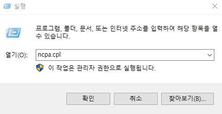

# Network Setting.md

이 파일에서는 기본적으로 알고 있어야 하는 Windows OS의 네트워크 설정을 다룹니다.

## 1. IP Setting
_폐쇄망을 기준으로 IPv4만 설명합니다._


```bash
ncpa.cpl
```
* 위 명령어를 입력하여 네트워크 설정 창으로 이동합니다.


* 원하는 어뎁터를 우 클릭한 후, 속성을 클릭합니다.


* 인터넷 프로토콜 버전 4(TCP/IPv4)의 속성으로 이동합니다.
</br>
위 값들을 입력하여 IP를 설정합니다.
* __기본 게이트웨이__ : 인터넷 통신 시, 아웃바운드 시에 사용할 게이트웨이를 설정합니다.
* DNS 서버: DNS 정보를 가져올 서버 IP를 설정합니다.  
    * AD DC 서버일 경우에는 자기 자신의 DNS 정보를 가져오기 위하여 127.0.0.1로 설정합니다.
    * Member Server가 도메인에 가입을 시도할 경우, __기본 설정 DNS 서버__ 에 설정 되어진 AD DC를 통하여 도메인에 조인하게 됩니다.

## 2. Network Profile
네트워크 선을 연결하여 서버가 네트워크에 접속하게 되면, 서버는 각각의 어뎁터마다 프로필을 갖게 됩니다.  
이에 따라서 개인 네트워크 or 게스트 또는 공용 네트워크를 선택하여 네트워크 프로필을 설정하게 됩니다.  
</br>
_도메인 프로필은 Member Server 가 도메인에 가입하게 되면 가입할 때 사용된 네트워크가 도메인 프로필로 자동 변경 됩니다._


* 일반적으로 WiFi 혹은 DHCP 같은 환경에서는 __게스트 또는 공용 네트워크__ 를 사용하며, 집과 같은 local에서는 개인 네트워크를 사용합니다.

* 이에 대한 차이점으로는 Default로 설정되어 있는 네트워크 검색, 파일 및 프린터 공유, 그리고 허용 되는 앱에 대한 설정 값이 다르며, 만약 설정 값을 변경하여 두 프로필 값을 같게 해놓은다면 둘에 대한 차이점은 없습니다.


* 실질적으로 중요한 것은 __네트워크 검색__ 과 __파일 및 프린터 공유__ 이며, Windows Platform 구축 시에 __파일 및 프린터 공유 활성화__ 에 대한 유무가 중요합니다.
    * _AD DC 서버는 도메인 프로필에서 파일 및 프린터 공유를 사용해야 합니다._

* __네트워크 검색__ : 활성화 시, 파일 탐색기의 __네트워크__ 폴더에 접속하여 주변 프린터기 및 PC 장치들을 확인이 가능합니다.
* __파일 및 프린터 공유__ : 위 옵션을 활성해 놓아야 SMB를 통하여 Client들이 서버의 공유 폴더들에 접속하여 리소스들을 사용할 수 있습니다.

[참고사항]  

* 모든 네트워크는 공유 폴더 중에서도 __C:\Users\Public__ 공용 폴더에 대한 설정입니다.
* 따라서 공용 폴더 공유를 끄기로 설정해 놓아도 위 경로 이외의 위치의 공유 폴더들을 공유하는 것이 가능합니다.

## 3. Inbound & Outbound

인터넷에서 서버에 접속하는 것을 인바운드라고 하며, 서버가 인터넷으로 나가는 과정을 아웃 바운드라고 합니다.  
주로 서버에 접속할 경우가 많기 때문에 인바운드 규칙으로 특정 포트를 활성화 시키는 방법에 대하여 알아 보겠습니다.


```bash
wf.msc
```
* 실행 창에서 위 명령어를 입력합니다.


* 인바운드 규칙에서 새 규칙을 생성합니다.


* 8123 포트를 여는 시나리오로 포트를 선택한 후, 다음으로 넘어갑니다.


* 특정 포트에 8123 포트를 입력한 후, 다음으로 넘어갑니다.


* __연결 허용__ 을 선택한 후, 다음으로 넘어갑니다.


* 통신한 이더넷의 프로필을 활성화 합니다.
* 모든 네트워크에서 포트 접속을 가능하게 하길 원할 경우, 모든 프로필을 활성화 합니다.


* 인바운드 규칙의 이름을 설정합니다.


```bash
netstat -ano
```
* 위 명령어를 통하여 Port가 열려 있는지 확인이 가능합니다.
* 위 명령어에 Open Port가 출력되지 않을 경우
    1. 생성한 인바운드 규칙이 활성화 되지 않았을 때
    2. 포트는 오픈하였지만 해당 포트를 사용하는 프로세스가 없을 경우