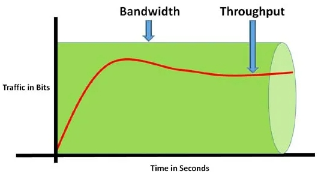
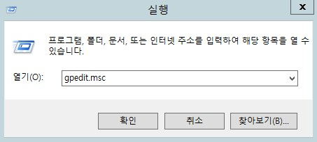
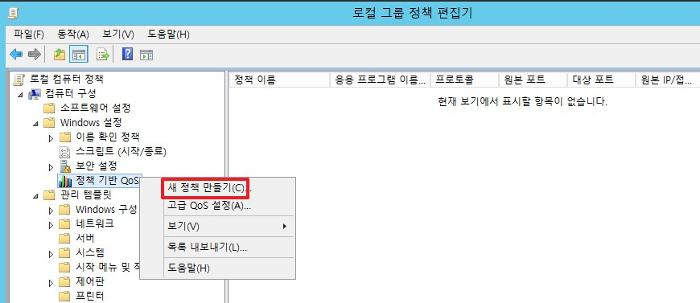
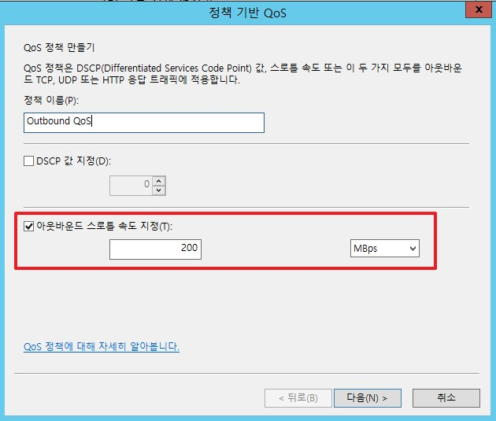
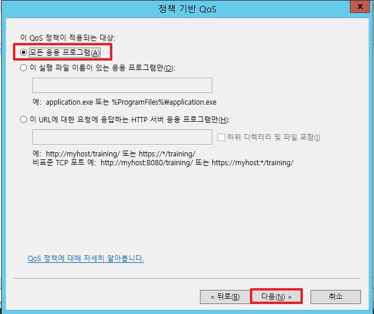
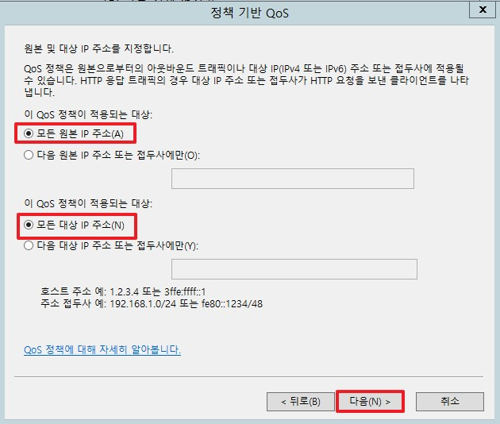
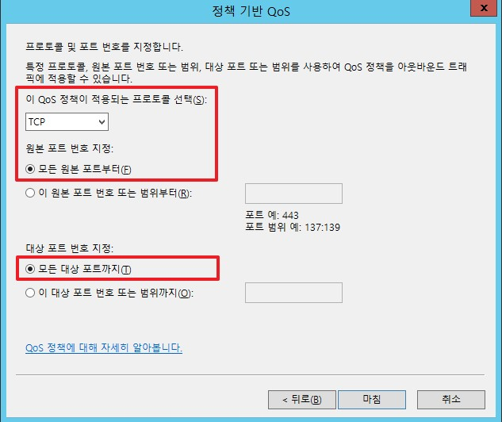
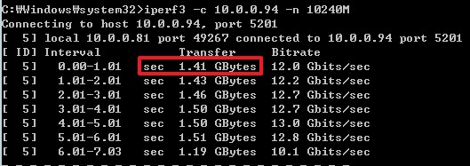
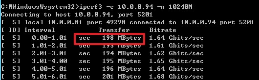

# 개요
이 과정에서는 OS 측면에서 기본적으로 좀 더 알고 있어여 하는 내용을 정리합니다.


# 1. 네트워크 대여폭
  

네트워크 대역폭(Bandwidth)은 쉽게 설명하면 1초 동안 데이터를 전달할 수 있는 총량입니다. 전달 할 수 있는 총량과 실제 처리한 처리량은 일치하지 않으며 위 그래프와 조금의 차이가 발생합니다.  
따라서 네트워크 장비가 10G 혹은 5G라고 나타내는 것은 처리량이 아닌 대역폭을 뜻합니다.  

네트워크 처리량을 확인하고 싶다면 Windows Server에서는 아래의 오픈소스 Tool을 사용하여 확인이 가능합니다.

```bash
# Server
iperf3 -s

# client
iperf3 -c [서버 IP 주소] -n 10240M
```
_iperf3를 다운 받고 설치하는 과정은 생략합니다._

* -s: 패킷을 수신 받는 서버로 지정
* -c: 패킷을 송신하는 클라이언트 서버로 지정
* -n: 총 전달한 패킷 양을 정하며, 위와 같이 설정할 시 총 10Gbyte의 파일을 전달합니다.

Windows Server는 일반적으로 클라이언트에서 세션을 열어서 인바운드 접속하게 되면 네트워크 트래픽이 들어온 장비 혹은 클라이언트에 맞혀서 자동으로 조절하게 됩니다.    
그렇다면 Windows Server가 아웃바운드로 먼저 트래픽을 보내게 되면 어떻게 될까요? 이더넷의 용량에 맞추어 Windows Server가 자동으로 조절하여 트래픽을 보내게 됩니다.  
[Reference] [https://learn.microsoft.com/ko-kr/windows-server/networking/technologies/network-subsystem/net-sub-performance-tuning-nics](https://learn.microsoft.com/ko-kr/windows-server/networking/technologies/network-subsystem/net-sub-performance-tuning-nics)

## 1. QoS(서비스 품질) 정책책
위와 같은 상황에서 OS는 유연하게 네트워크 속력을 조절하지만 특이한 케이스가 발생할 경우 네트워크 트래픽 속도(처리량)을 조절해야합니다.  
 예를 들어 아웃바운드 상황에서서 OS에서는 10G로 네트워크를 처리하였지만 네트워크 장비가 5G까지 처리가 가능하다면 이는 모든 패킷을 장비가 처리하지 못하여 패킷 손실이 발생하게 됩니다.  
 이런 경우에는 OS에서 강제적으로 네트워크 속도를 줄여줘야 하는데 이 때 사용할 수 있는데 QoS입니다.
 * QoS는 송수신 서버가 같은 도메인 안에 존재하여야 사용이 가능합니다.  

[Reference] [https://learn.microsoft.com/ko-kr/windows-server/networking/technologies/qos/qos-policy-top](https://learn.microsoft.com/ko-kr/windows-server/networking/technologies/qos/qos-policy-top)

## 2. QoS 설정 방법(송신 서버)

* 실행에서 `gpedit.msc`를 실행합니다.

</br>


* `로컬 컴퓨터 정책` -> `컴퓨터 구성` -> `Windows 설정` -> `정책 기반 QoS`로 이동합니다.
* 정책 기반 QoS를 우 클릭한 후, `새 정책 만들기`를 클릭합니다.

</br>


* DSCP 값은 설정하지 않습니다.
* 아웃바운드 스트롤 속도에서 1초 동안 처리를 제한할 네트워크 용략을 설정합니다.  
    * _위 이미지와 같이 설정할 시에 1초에 200Mbyte를 처리할 수 있습니다._

</br>


* 모든 응용 프로그램으로 설정합니다.

</br>


* 모든 원본 IP 주소로 설정합니다.
* 모든 대상 IP 주소로 설정합니다.

</br>

  
* 어떤 프로토콜로 제한을 둘 지 설정합니다. (_모든 트래픽일 경우, TCP+UDP로 설정합니다._)
* 모든 원본 IP 주소로 설정합니다.
* 모든 대상 IP 주소로 설정합니다.

</br>

```
gpupdate /force
```
* 마지막으로 위 QoS 정책을 적용하기 위하여 위 명령어를 적용합니다.

## 3. QoS 적용 결과

|설정 전| 설정 후|
|---|---|
|||
* 위 결과로 기존에 1초 동안 1.41GByte를 처리하였지만 정책 적용 후, 200Mbyte 이하로 처리하는 모습을 확인할 수 있습니다.

# 2. 라우팅 테이블

# 3. 네트워크 티밍