# 개요
이 과정에서는 OS 측면에서 기본적으로 좀 더 알고 있어여 하는 내용을 정리합니다.

_가볍게 용어 정리만 하고 갑니다._
| 용어        | 의미                           | 예시                              |
|-------------|------------------------------|---------------------------------|
| Ethernet    | 네트워크 기술/규격 (L2 데이터링크 계층) | IEEE 802.3 (100Mbps, 1Gbps, 10Gbps 등) |
| 어댑터(Adapter) | 실제로 OS가 인식하는 네트워크 장치 인터페이스    | 이더넷 1, vEthernet (WSL), Wi-Fi, Bluetooth Network Adapter 등 |
* _해당 문서는 OS 측면에서 설명하기 때문에 어뎁터로 표현하는 것이 좀 더 옳은 표현입니다._

<br>

# 1. 네트워크 대여폭
  

네트워크 대역폭(Bandwidth)은 쉽게 설명하면 1초 동안 데이터를 전달할 수 있는 총량입니다. 전달 할 수 있는 총량과 실제 처리한 처리량은 일치하지 않으며 위 그래프와 같이 조금의 차이가 발생합니다.  
따라서 네트워크 장비가 10G 혹은 5G라고 나타내는 것은 처리량이 아닌 대역폭을 뜻합니다.  

네트워크 처리량을 확인하고 싶다면 Windows Server에서는 아래의 오픈소스 Tool을 사용하여 확인이 가능합니다.

```bash
# Server
iperf3 -s

# client
iperf3 -c [서버 IP 주소] -n 10240M
```
_iperf3를 다운 받고 설치하는 과정은 생략합니다._

* -s: 패킷을 수신 받는 서버로 지정
* -c: 패킷을 송신하는 클라이언트 서버로 지정
* -n: 총 전달한 패킷 양을 정하며, 위와 같이 설정할 시 총 10Gbyte의 파일을 전달합니다.

Windows Server는 일반적으로 클라이언트에서 세션을 열어서 인바운드 접속하게 되면 네트워크 트래픽이 들어온 장비 혹은 클라이언트에 맞혀서 자동으로 조절하게 됩니다.    
그렇다면 Windows Server가 아웃바운드로 먼저 트래픽을 보내게 되면 어떻게 될까요? 이더넷의 용량에 맞추어 Windows Server가 자동으로 조절하여 트래픽을 보내게 됩니다.  
[Reference] [https://learn.microsoft.com/ko-kr/windows-server/networking/technologies/network-subsystem/net-sub-performance-tuning-nics](https://learn.microsoft.com/ko-kr/windows-server/networking/technologies/network-subsystem/net-sub-performance-tuning-nics)

## 1. QoS(서비스 품질) 정책책
위와 같은 상황에서 OS는 유연하게 네트워크 속력을 조절하지만 특이한 케이스가 발생할 경우 네트워크 트래픽 속도(처리량)을 조절해야합니다.  
 예를 들어 아웃바운드 상황에서서 OS에서는 10G로 네트워크를 처리하였지만 네트워크 장비가 5G까지 처리가 가능하다면 이는 모든 패킷을 장비가 처리하지 못하여 패킷 손실이 발생하게 됩니다.  
 이런 경우에는 OS에서 강제적으로 네트워크 속도를 줄여줘야 하는데 이 때 사용할 수 있는데 QoS입니다.
 * QoS는 송수신 서버가 같은 도메인 안에 존재하여야 사용이 가능합니다.  

[Reference] [https://learn.microsoft.com/ko-kr/windows-server/networking/technologies/qos/qos-policy-top](https://learn.microsoft.com/ko-kr/windows-server/networking/technologies/qos/qos-policy-top)

## 2. QoS 설정 방법(송신 서버)

* 실행에서 `gpedit.msc`를 실행합니다.

</br>


* `로컬 컴퓨터 정책` -> `컴퓨터 구성` -> `Windows 설정` -> `정책 기반 QoS`로 이동합니다.
* 정책 기반 QoS를 우 클릭한 후, `새 정책 만들기`를 클릭합니다.

</br>


* DSCP 값은 설정하지 않습니다.
* 아웃바운드 스트롤 속도에서 1초 동안 처리를 제한할 네트워크 용략을 설정합니다.  
    * _위 이미지와 같이 설정할 시에 1초에 200Mbyte를 처리할 수 있습니다._

</br>


* 모든 응용 프로그램으로 설정합니다.

</br>


* 모든 원본 IP 주소로 설정합니다.
* 모든 대상 IP 주소로 설정합니다.

</br>

  
* 어떤 프로토콜로 제한을 둘 지 설정합니다. (_모든 트래픽일 경우, TCP+UDP로 설정합니다._)
* 모든 원본 IP 주소로 설정합니다.
* 모든 대상 IP 주소로 설정합니다.

</br>

```
gpupdate /force
```
* 마지막으로 위 QoS 정책을 적용하기 위하여 위 명령어를 적용합니다.

## 3. QoS 적용 결과

|설정 전| 설정 후|
|---|---|
|||
* 위 결과로 기존에 1초 동안 1.41GByte를 처리하였지만 정책 적용 후, 200Mbyte 이하로 처리하는 모습을 확인할 수 있습니다.

</br>

# 2. 라우팅 테이블
_예시 사진입니다_  
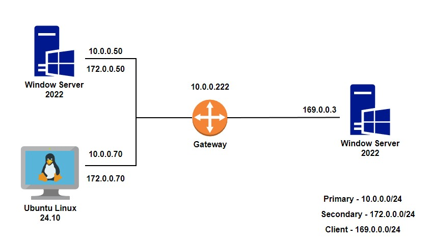  
만약 사용 중인 서버가 하나의 이더넷만 사용 중이라면 굳이 라우팅 테이블을 설정할 필요가 없습니다. 하지만 2개 이상의 이더넷을 사용 중이라면 패킷을 다시 인터넷으로 송신할 때 어느 게이트웨이를 사용할지 우리는 설정해야할 필요가 있습니다. 이 때 구성하는 것이 라우팅 테이블입니다.

## 1. 기본 라우팅 테이블 설정
_`ncpa.cpl`에서 작업합니다_
|Primary|Secondary|
|---|---|
|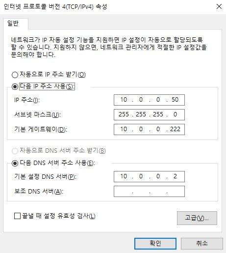|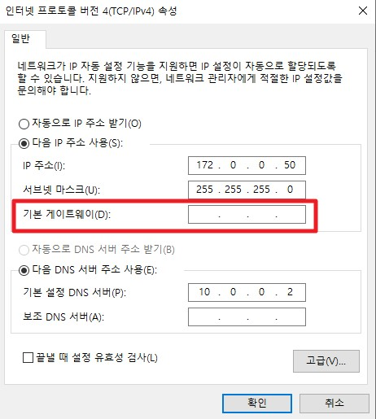|

__[결과]__  
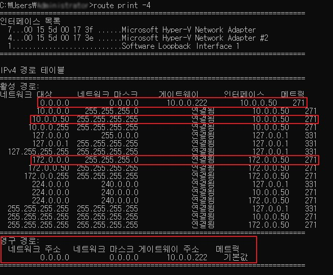
* 위와 같이 기본적으로 기본 게이트웨이를 빼고 생성하면 정상적으로 설정이 가능합니다.
* _게이트웨이 연결됨은 0.0.0.0을 뜻합니다._

## 2. 명령어로 라우팅 테이블 설정
만약에 서버가 DC와 같이 인터넷과 통신을 하지 못하게 하기위하여 기본 게이트웨이를 설정하지 않을 수 있습니다.  
이럴 때는 각각의 네트워크 대역대에 대하여 일일이 설정해줘야 하는데 방법은 아래와 같습니다.

```bash
# 명령어
route -p add [네트워크 목적지 주소] mask [서브넷] [사용할 게이트웨이]

# 예시
route -p add 169.0.0.0 mask 255.255.255.0 10.0.0.222
```
위 명령어는 169.0.0.0/24로 패킷을 보내야 할 때 10.0.0.222 게이트웨이를 사용한다는 뜻 입니다.
* `-p`: 해당 라우팅 테이블을 영구적으로 설정합니다.

### TMI) 관문으로 사용하는 서버
만약 게이트웨이가 장비가 아니고 Windows Server일 경우에는 아래의 레지스트리를 추가해야 라우팅이 가능합니다.
```
Computer\HKEY_LOCAL_MACHINE\SYSTEM\CurrentControlSet\Services\Tcpip\Parameters
```
* 위 경로의 `IPEnableRouter` 값을 `0`에서 `1`로 변경합니다.

## 3. 라우팅 검증 - Linux
_Windows Server도 동일하게 작동합니다._
기본 게이트웨이가 설정되면 Sub로 request가 들어와도 response는 Primary로 반환합니다.  

__[구성환경]__  
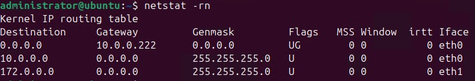
* 게이트웨이가 0.0.0.0인 경우는 기본 게이트웨이로 전달하겠다는 뜻입니다.
* 여기서는 목적지가 0.0.0.0인 맨 위 라우팅 테이블이 기본 게이트웨이 입니다.

</br>

__[테스트 진행]__  
|Primary 이더넷 유무|VM 어뎁터 스크린샷|Client PC ping 결과|
|:---:|:---:|:---:|
|활성화|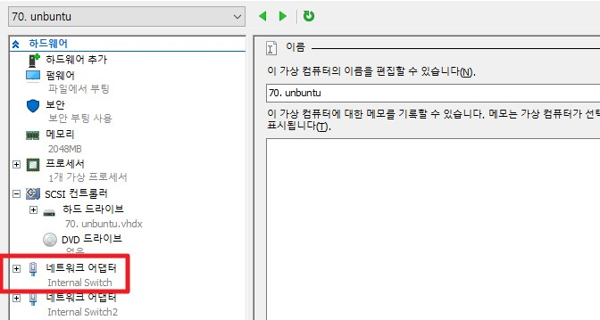|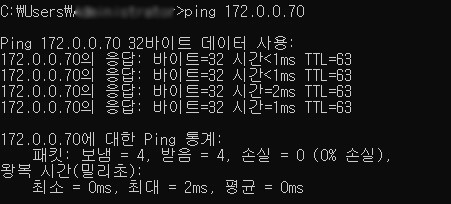|
|비활성화|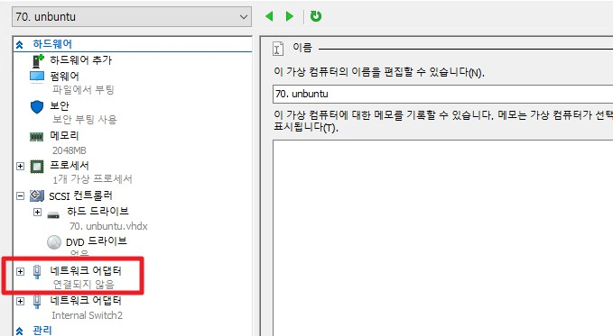|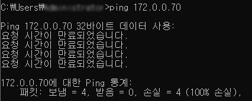|
* 위 테스트를 결과로 Secondary로 Request가 들어와도 Response는 Primary로 한다는 것을 알 수 있습니다.  

그렇다면 Primary가 죽으면 통신을 못하는데 이것을 어떻게 방지할 수 있을까요? 답은 `Primary를 이중화`하는 것 입니다.

<br>

# 3. NIC Teaming
Windows Server에서는 이더넷을 이중화 하는 방법을 `NIC Teaming` 이라고 부르며, `LBFO(Load Balancing Failover)`라고 부릅니다.  
현재는 Hyper-v에 SET 스위치를 통한 티밍을 사용하며, legacy 티밍입니다. (_SET는 chapter 17에서 다룹니다._)

LBFO Teaming은 쉽게 스위치와 연관이 있냐 없냐로 아래와 같이 나뉩니다.

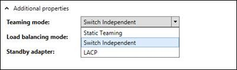
```
Team Mode: 
├── Switch Independent
└── Switch Dependent
     ├── Static Teaming
     └── LACP
```
* 따라서 Switch Dependent Teaming일 경우, 각 L2 장비 하드웨어 벤더사의 레퍼런스를 따르길 추천합니다.

추가적으로 이런 Teaming 혹은 LACP 등을 L2에서 사용하는 이점은 아래와 같다.  
1. Link Aggregation
    * 물리 포트를 묶어서 논리 포트로 사용 가능하다.  
    * 예를 들어, 10 Gbps 대역폭인 2개의 포트를 묶어서 사용해서 20 Gbps로 사용 가능하다.

2. Failover(이중화)
    * 절대 죽어서는 안되는 Primary Port가 있다면 Stand-by 혹은 2개 다 사용하여 이중화 할 수 있습니다.

3. Load Balancing
    * 2개의 어뎁터를 번 갈아가며 사용할 수 있습니다.
    * _TCP로 세션이 열려있다면 닫힐 때까지 사용하던 1개의 어뎁터를 사용합니다._

## ++ 추가 설명) L2 장비

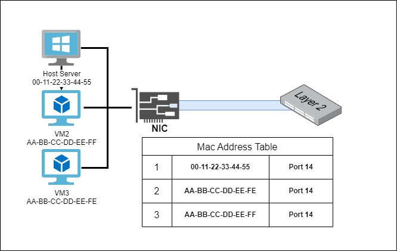
* L2 장비를 정말 쉽게 설명하면 자신의 몇 번 포트에 네트워크 프레임이 들어오게 되면 해당 MAC 주소를 `MAC 주소 테이블`에 기록하여 통신하게 됩니다.
    * 물리적으로 2개의 NIC를 사용한다고 가정하고 L2 장비에 13번과 14번 포트를 사용하면 이것을 우리는 티밍이라고 부릅니다.

__[추가]__  
추가적으로 요즘 NIC는 다중 MAC을 지원하기 때문에 하나의 물리 NIC에서도 여러 개의 MAC 주소를 사용 가능합니다.
* 위 기능으로 VM들이 각각의 Mac 주소를 갖고 사용하게 됩니다.

<br>

## NIC Teaming with Switch Independent

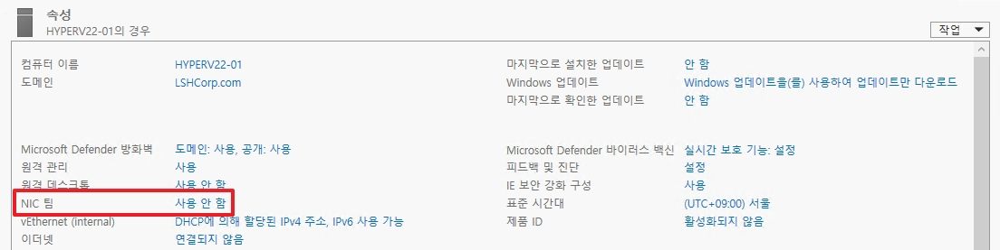
* 서버 괸리자에서 `NIC 팀`으로 이동합니다.

<br>

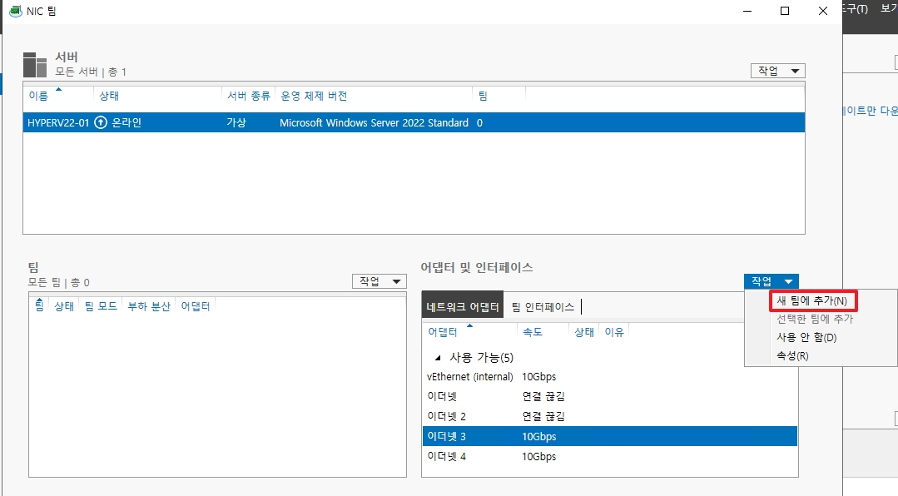
* 어뎁터 창에서 `새 팀에 추가`를 클릭하여 새로운 Teaming을 생성합니다.

<br>

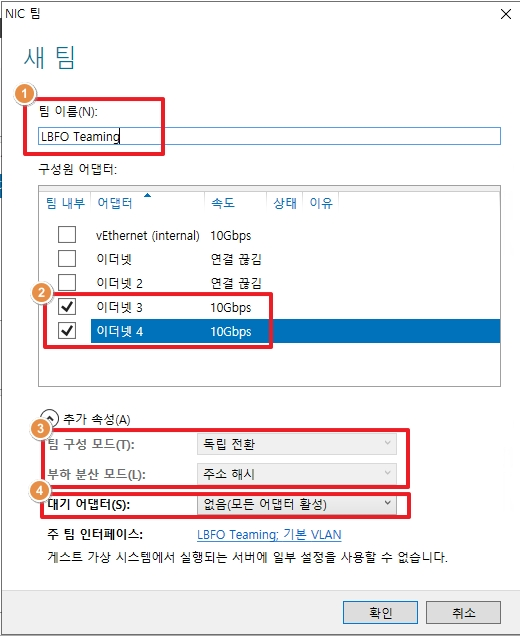
1. LBFO Teaming에 이름을 설정합니다.
2. Teaming에 사용할 어뎁터를 선택합니다.
3. 구성할 Teaming 모드를 선택합니다.
    * 독립 전환이 `Switch Independent` 입니다.
4. 모든 어뎁터를 사용하지 않고 하나의 어뎁터를 Stand-by로 예비 어뎁터로 사용할 수 있습니다.
    * 예를 들어 4번 어뎁터를 Stand-by로 사용하게 되면 LBFO Teaming 대역폭은 20 Gbps가 아닌 10 Gbps로 사용되게 됩니다.

<br>

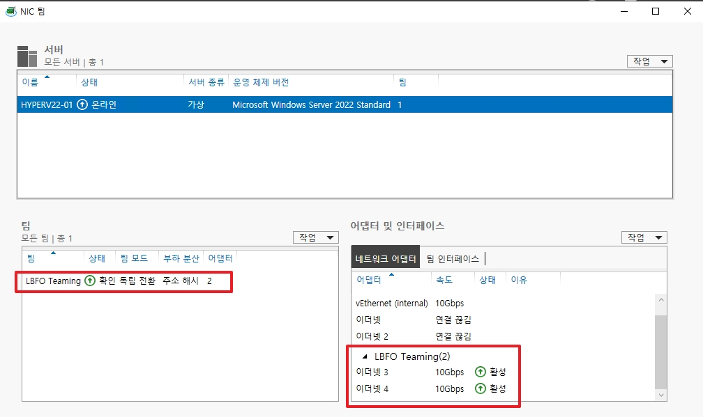
* 생성된 LBFO Teaming을 확인합니다.

<br>

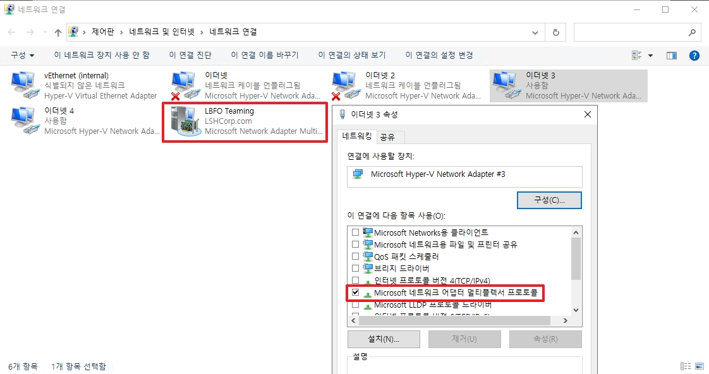
* Teaming을 새로 생성하게 되면 `ncpa.cpl`에서 위와 같은 UI로 표기됩니다.
* _Teaming에 포함된 어뎁터들은 위와 같이 IPv4에 대한 속성들을 잃습니다._

<br>

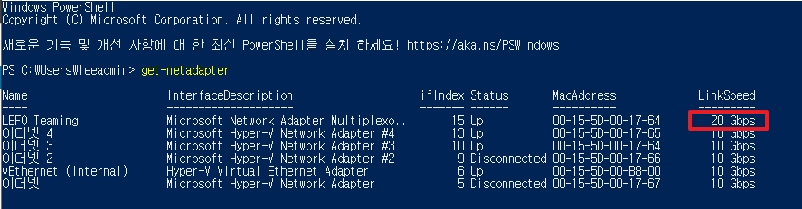
```
get-netadapter
```
* 정상적으로 Teaming에 성공하면 Link Aggregation으로 대역폭이 증가한 것을 확인할 수 있습니다.

<br>
