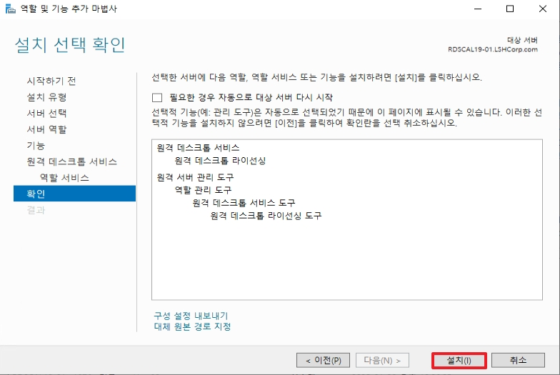
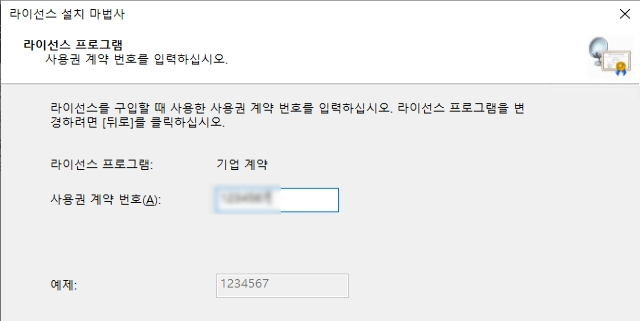
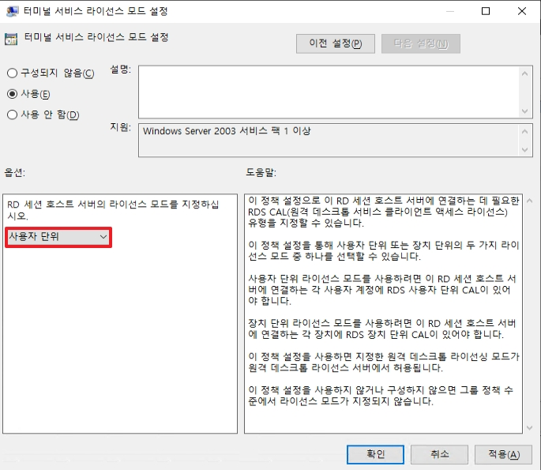
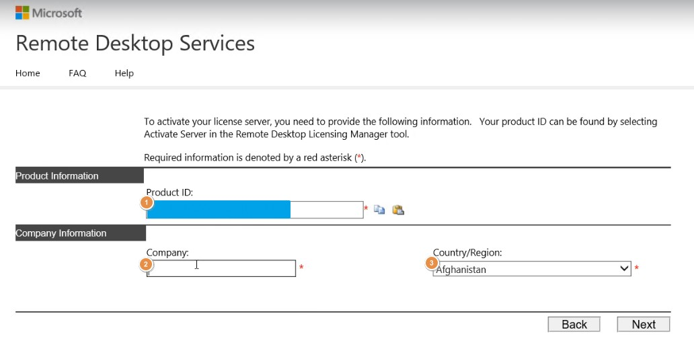
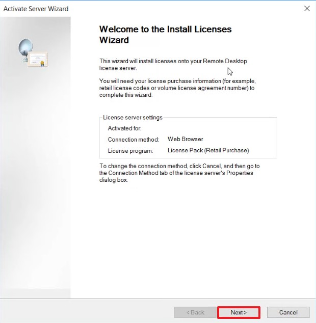

# 원격 접속

Windows Server는 기본적으로 원격 접속을 2개까지만 허용하며, 2개까지 늘리는데도 로컬 GPO를 변경해줘야합니다.  
그렇다면 다 수의 원격 접속을 허용하고 싶다면 어떻게 할까요? 답은 RDS(Remote Desktop Service)입니다.  
<br>
RDS에서는 많은 서비스가 있지만 여기서는 RDS를 가능하게 해주는 라이센싱 서버와 호스팅 서버만 다룹니다.  
`라이센싱 서버` 는 다 수의 원격접속이 가능하도록 하는 CAL(Client Access License)을 발급받은 서버입니다.  
`호스팅 서버` 는 실제로 원격 접속을 수행하는 서버를 뜻합니다.


# 1. Client 기본 설정
* 1개만 접속 가능한 세션의 수를 늘리는 설정입니다.


```
gpedit.msc
```
* 실행에서 위 명령어를 실행합니다.

<br>


* `컴퓨터 구성` -> `관리 템플릿` -> `Windows 구성` -> `터미널 서비스` -> `원격 데스크톱 세션 호스트` -> `연결` -> `연결 개수 제한`으로 이동합니다.
* 최대 허용 연결 수를 설정한 후, 적용합니다.
    * CAL이 없다면 2개까지만 세션이 가능합니다.

<br>


* `컴퓨터 구성` -> `관리 템플릿` -> `Windows 구성` -> `터미널 서비스` -> `원격 데스크톱 세션 호스트` -> `연결` -> `원격 데스크톱 서비스 사용자를 하나의 원격 데스크톱 서비스 세션으로 제한`으로 이동합니다.
* `사용 안함`으로 적용합니다.


<br>


```
gpupdate /force
```
* cmd에서 위 명령어를 수행하여 GPO를 적용합니다.

<br>

# 2. RDS Licensing Server(CAL Server)
* _CAL을 발급 받기 위해서는 인터넷이 가능한 환경에서 가능합니다._


* 역할에서 `원격 데스크톱 서비스`를 추가합니다.

</br>


* RDS 역할 중 `원격 데스크톱 라이선싱` 역할을 선택합니다.

</br>


* 선택한 역할을 설치합니다.

</br>


* 설치를 완료한 후, `서버 관리자` -> `도구` -> `Remote Desktop Services` -> `원격 데스크톱 라이선싱 관리자`로 이동합니다.

</br>


* 해당 라이선싱 서버가 아직 활성화 되지 않았음으로 서버를 활성화합니다.

</br>


* _위 예시에서는 자동 연결 방법으로 서버를 활성화 합니다._

</br>


* 회사 정보를 입력합니다.

</br>


* 추가 회사 정보를 입력합니다.

</br>


* 회사 정보 입력을 끝마치면 서버가 활성화 됩니다.
* 서버가 활성화 된 이후, CAL을 발급받기 위하여 `라이선스 설치`를 실행합니다.

</br>


* 발급 받은 CAL 프로그램을 선택합니다.

</br>


* 계약 번호를 입력합니다.

</br>


* RDS 제품 버전 및 CAL 유형을 선택합니다.
* 발급 받은 CAL 개수를 입력합니다.
### [추가 설명]
* `장치 단위`: 장치 라이선스가 부여된 서버는 접속 세션 개수에 제한 없이 접속이 가능합니다.
* `사용자 단위`: 라이선스가 부여된 사용자는 AD 내부에 있는 서버들에 세션 개수 제한 없이 접속이 가능합니다.

</br>


* 라이선스 설치를 완료합니다.

</br>


* Windows Server 2019부터는 사용자 CAL 사용 시에 AD 사용이 필수입니다.
* 추가 설정을 위해 `구성` -> `검토`로 이동합니다.

</br>


* `그룹에 추가`를 실행합니다.

</br>


* 계속을 클릭합니다.

</br>


* 그룹에 추가됨을 확인합니다.

</br>


* CAL 서버가 정상적으로 활성화 되면, 왼쪽 탭에 서버명이 초록 불로 전환됩니다.

</br>

# 3. Remote Desktop Session Host


* 역할에서 `원격 데스크톱 서비스`를 추가합니다.

</br>


* RDS 역할 중 `Remote Desktop Session Host`를 추가합니다.

</br>


* 역할을 설치한 후에는 서버를 재부팅합니다.

</br>


* 아직 라이선싱 서버를 설정하지 않았기 때문에 해당 서버는 임시 라이선스를 발급 받습니다.
* _위 테스트는 Windows Server 2019에서 이뤄졌습니다._

</br>


```
gpedit.msc
```
* 실행에서 위 명령어를 실행합니다.

</br>


* `컴퓨터 구성` -> `관리 템플릿` -> `Windows 구성` -> `터미널 서비스` -> `원격 데스크톱 세션 호스트` -> `라이선스` -> `터미널 서비스 라이선스 모드 설정`으로 이동합니다.
* 사용할 라이선스를 설정합니다.

</br>


* `컴퓨터 구성` -> `관리 템플릿` -> `Windows 구성` -> `터미널 서비스` -> `원격 데스크톱 세션 호스트` -> `라이선스` -> `지정한 터미널 서버 라이선스 서버 사용`으로 이동합니다.
* 사용할 라이선스 서버 IP 혹은 서버명을 입력합니다.

</br>


```
gpupdate /force
```
* cmd에서 위 명령어를 수행하여 GPO를 적용합니다.

</br>


* `서버 관리자` -> `도구` -> `Remote Desktop Services` -> `원격 라이선싱 진단 도구`로 이동합니다.
* 정상적으로 라이선싱 서버와 통신하는지 확인합니다.

</br>

# ++ 추가) 1. RDS CAL 추가 - Web Browser

_전화 인증이 아닌 Web Brower로 인증할 일이 생겨 추후를 위해 기록합니다._

```
•	계약번호 : *생략*
•	MPSA number: *생략*
•	Purchasing account number: *생략*
•	Sales order number: *생략*
```
* RDS 라이센스를 구매하면 위와 같이 송장이 오게 되는데 `Purchasing account number`로 입력하면 됩니다.

<br>


* 라이센싱 서버에서 서버 활성화 시, `Web Browser`를 선택합니다.

<br>


* 해당 제품의 Product ID 값(1번)을 복사합니다.
* 복사한 후, 위 링크([https://activate.microsoft.com](https://activate.microsoft.com))에 접속합니다.

<br>


* `Activate a license server`를 선택한 후, 다음으로 넘어갑니다.

<br>


1. 아까 복사한 Product ID(1번)을 1번에 붙여넣습니다.
2. 회사 명을 입력합니다.
3. 지역을 선택합니다.

<br>


* 입력된 값을 재확인 후, 다음으로 넘어갑니다.

<br>


* 위 Product ID를 바탕으로 license server ID(1번)를 발급받습니다.
* 발급 받은 키 값을 복사하여 다시 서버로 이동합니다.

<br>


* 서버에 발급 받은 license server ID를 입력합니다.

<br>


* 라이센스 서버 활성화 후, 다음을 누르고 다시 웹 브라우저로 이동합니다.

<br>


* _전달 받은 송장 Sample은 MPSA로 위와 같이 License Program에서 Microsoft Products and Services Agreement를 선택합니다._

<br>


1. 구매한 제품과 개수를 설정합니다.
2. 위 송장에 적혀있는 `Purchasing account number`를 입력합니다.

<br>


* 입력한 값을 재확인한 후, 다음으로 넘어갑니다.

<br>


* 생성된 RDS CAL 키 값을 복사하여 서버로 이동합니다.
* _위 과정이 안된다면 송장에 문제가 있습니다._

<br>


* 복사한 RDS CAL 키 값을 입력하여 RDS CAL을 설치합니다.

<br>


* 정상적으로 설치되면 위와 같이 RDS CAL이 설치되어 있습니다.