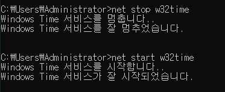
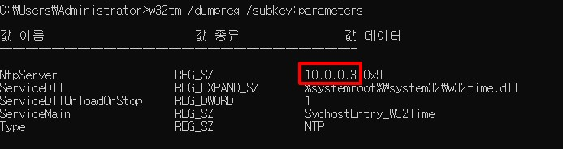

# NTP 프로토콜

같은 인프라 혹은 시스템 내에서 시간 대에 같은 것은 매우 중요합니다. 시스템이 같은 한국 시간대(KST)를 사용하더라도 서버마다 시간이 각각 다르다면 로그 등으로 유지보수 하기가 매우 곤란해질 수 있습니다.  
특히 Failover Cluster 기능에 MS SQL을 올린 FCI 형태라면 DB 데이터에 대한 무결성이 깨질 수도 있습니다.  

이번 챕터에서는 Windows Server에서 시간을 다루는 방법에 대하여 설명하겠습니다.

# 1. NTP 서버 설정 확인
```
w32tm /dumpreg /subkey:parameters
```
* 위 명령어는 기본적인 NTP 설정이 어떻게 되어 있는지 확인하는 CMD 명령어 입니다.

```
값 이름                       값 종류                값 데이터
-------------------------------------------------------

NtpServer                  REG_SZ              time.windows.com,0x8
ServiceDll                 REG_EXPAND_SZ       %systemroot%\system32\w32time.dll
ServiceDllUnloadOnStop     REG_DWORD           1
ServiceMain                REG_SZ              SvchostEntry_W32Time
Type                       REG_SZ              NTP
```
여기서 우선 중요하게 봐야할 부분은 `Type`과 `NtpServer`입니다.  
기본적으로는 _time.windows.com_ 으로 설정되어 있기 때문에 인터넷이 안되는 폐쇄망에서는 해당 NTP 설정을 변경해야 합니다.

</br>

# 2. AD 없이 특정 서버를 대상으로 NTP 설정
AD를 NTP 서버로 자동 설정하는게 좋지만 폐쇄망에서 AD를 사용하지 않을 수 도 있습니다.  
이 경우에는 아래와 같이 설정하여 NTP를 변경합니다.


```bash
w32tm /config /syncfromflags:manual  /manualpeerlist:"[IP 주소 OR 도메인명],0x9" /reliable:yes /update

# 예시
w32tm /config /syncfromflags:manual  /manualpeerlist:"10.0.0.3,0x9" /reliable:yes /update
```
* 위 명령어를 입력하여 대상으로 설정할 NTP 서버를 설정합니다.


```
net stop w32time
net start w32time
```
* 위 명령어를 순서대로 실행시켜 Windows Time 서비스를 재시작합니다.


```
w32tm /dumpreg /subkey:parameters
```
* 위 명령어를 사용하여 NTP 서버가 설정되었는지 확인합니다.

</br>

# 3. AD 환경에서 NTP 설정
해당 서버가 AD에 가입하여 Member Server가 된다면 NTP 설정이 자동으로 됩니다.  
아래와 같이 NTP 설정이 변경되어지며
```
값 이름                       값 종류                값 데이터
-------------------------------------------------------

NtpServer                  REG_SZ              time.windows.com,0x8
ServiceDll                 REG_EXPAND_SZ       %systemroot%\system32\w32time.dll
ServiceDllUnloadOnStop     REG_DWORD           1
ServiceMain                REG_SZ              SvchostEntry_W32Time
Type                       REG_SZ              NT5DS
```
여기서 중요하게 봐야할 점은 __Type__ 의 값이 `NT5DS`로 되어 있다는 점입니다.  
위와 같이 NT5DS는 AD 서버의 DC 서버를 NTP 서버로 사용한다는 뜻이기 때문에 별다른 설정을 할 필요가 없습니다.

# 4. AllSync -> NT5DS Type 로 바꾸기

Allsync는 AD에가 가입 계획이 없었는데 가입을 하거나나 혹은 가입하는 내부 절차까지 오래걸려서 운영을 미리 해야할 경우에 NTP를 설정한 후, AD에 가입하면 발생하는 Type이다.  
좀 더 쉽게 얘기하면 NTP 설정을 한 후에 AD에 가입하게 되면 NTP 서버가 2개가 됨으로 AllSync라는 Type이 발생하게 된다.

__[AD 가입 전]__
```
값 이름                       값 종류                값 데이터
-------------------------------------------------------

NtpServer                  REG_SZ              10.0.0.6,0x9
ServiceDll                 REG_EXPAND_SZ       %systemroot%\system32\w32time.dll
ServiceDllUnloadOnStop     REG_DWORD           1
ServiceMain                REG_SZ              SvchostEntry_W32Time
Type                       REG_SZ              NTP
```

__[AD 가입 후]__
```
값 이름                       값 종류                값 데이터
-------------------------------------------------------

NtpServer                  REG_SZ              10.0.0.6,0x9 time.windows.com,0x8
ServiceDll                 REG_EXPAND_SZ       %systemroot%\system32\w32time.dll
ServiceDllUnloadOnStop     REG_DWORD           1
ServiceMain                REG_SZ              SvchostEntry_W32Time
Type                       REG_SZ              AllSync
```

위 와 같이 2개의 NTP 서버를 설정하여 운영하는 것은 권장사항이 아님으로 AD DC를 NTP 서버로 사용하는 것을 권고한다.  
따라서 `AllSync Type`을 `NT5DS Type`로 바꾸는 것은 아래와 같다.

</br>

## Workaround

1. NTP Type 변경 명령어 입력
```bash
C:\Windows\System32>w32tm /config /syncfromflags:domhier /update
명령이 성공적으로 완료되었습니다.
```
```bash
w32tm /config /syncfromflags:domhier /update
```
* _NTP 설정에 영향을 받은 Application 서비스들을 일시적으로 중지한 다음에 진행한다._

</br>

2. Windows Time 서비스 다시 시작
```bash
C:\Windows\System32>net stop w32time
Windows Time 서비스를 멈춥니다..
Windows Time 서비스를 잘 멈추었습니다.


C:\Windows\System32>net start w32time
Windows Time 서비스를 시작합니다..
Windows Time 서비스가 잘 시작되었습니다.
```

3. 결과 Type 확인
```bash
C:\Windows\System32>w32tm /dumpreg /subkey:parameters

값 이름                       값 종류                값 데이터
-------------------------------------------------------

NtpServer                  REG_SZ              10.0.0.6,0x9 time.windows.com,0x8
ServiceDll                 REG_EXPAND_SZ       %systemroot%\system32\w32time.dll
ServiceDllUnloadOnStop     REG_DWORD           1
ServiceMain                REG_SZ              SvchostEntry_W32Time
Type                       REG_SZ              NT5DS
```
* Type의 결과가 `NT5DS`로 변경 된 것을 확인할 수 있습니다.