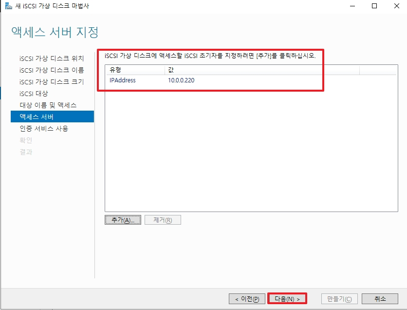
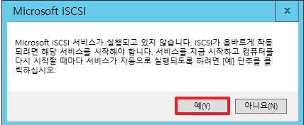

# 개요

이번 시간에는 Storage에 대해서 짧게 정리하고 넘어가려 합니다. 하드웨어 단 보다는 OS쪽에 중점을 두어 설명을 할 예정입니다.

서버에 스토리지를 붙여서 사용하는 규격인 `SCSI`(Small Computer System Interface)가 처음 등장을하게 되었고,  
이에 대하여 고속으로 데이터를 전송할 수 있는 `FC`(파이버 채널)이 나오게 되며, FC를 사용하는 스토리지를 `SAN` 스토리지라고 부르게 됩니다. 
fc 케이블은 일반적인 케이블보다 값이 비싸며 FC네트워크 환경이 아닌 `IP 환경`에서 사용하기 위해 `ISCSI` 가 나오게 됩니다.

그렇다면 우리가 평소에 IP 네트워크 환경에서 사용하는 NAS는 위와 같은 스토리지일까요? 정답은 전혀 다른 프로토콜을 사용하는 스토리지입니다.  
ISCSI는 `블록 스토리지`이며, NAS와 같은 SMB 및 NFS는 `파일 스토리지` 입니다.
* `블록 스토리지`: OS에서 로컬 디스크처럼 인식하여 볼륨을 구성하여 드라이브로 사용
* `파일 스토리지`: 공유 폴더에 파일 단위로 접근하여 해당 폴더를 사용

</br>

# 1. ISCSI 구성
# 1-1. iscsi Target(대상) 서버


* 서버 관리자의 역할 추가에서 `파일 및 iSCSi 서비스` -> `iscsi 대상 서버`를 활성화합니다.

</br>


* `iscsi 대상 서버` 역학을 설치합니다.

</br>


* 서버 관리자에서 왼쪽 탭에서 `파일 및 저장소 서비스` -> `iscsi`로 이동합니다.
* iscsi 가상 디스크 마법사를 통하여 새로운 가상 디스크를 생성합니다.

</br>


* 가상 디스크를 할당해 줄 볼륨을 선택합니다.

</br>


* 가상 디스크 이름을 설정합니다.

</br>


* 가상 디스크 크기를 설정합니다.

</br>


* iscsi를 사용할 노드를 선택합니다.
* 없을 경우 신규 대상을 생성합니다.

</br>


* iscsi 스토리지를 사용하는 그룹(대상)을 지정합니다.

</br>


* 해당 대상에 접속할 엑세스 서버(노드)들을 추가합니다.

</br>


* 접속을 허용할 서버의 IP를 입력합니다.

</br>


* 서버들을 모두 등록하면 다음으로 클릭합니다.
* failover Cluster를 위한 iscsi일 경우, 클러스터 안에 있는 모든 서버를 입력합니다.

</br>


* 노드에서 iscsi를 사용하기 위해 엑세스 인증을 설정하는 화면입니다.
* 다음으로 넘어갑니다.

</br>


* iscsi 가상 디스크를 생성합니다.
* 생성이 완료되면 위에서 설정한 `가상디스크이름.vhdx`로 파일이 생성됩니다.

</br>


</br>


## 2. iscsi node Server


* iscsi를 사용할 서버의 서버 관리자에서 `iscsi 초기자`를 클릭합니다.
* _추가로 설치해야할 역할은 없습니다._

</br>


* iscsi 스토리지가 자동으로 할당 되도록 `예`를 클릭합니다.

</br>


1. 검색 탭으로 이동합니다.
2. 포털을 검색합니다.
3. iscsi target 서버 ip를 입력합니다.
    * 포트를 변경하지 않았다면 기본적으로 3260 포트입니다.

</br>


* 검색이 완료되면 대상 탭에 iscsi target server가 출력됩니다.
* 아직 연결되지 않아 상태가 비활성화 되어 있음으로 아래 연결을 클릭합니다.

</br>


* 즐겨찾기에 추가 후, 확인을 클릭합니다.

</br>


* 확인을 클릭하여 iscsi target server에 연결되면 상태가 `연결됨`으로 변경됩니다.

</br>

  
```
diskmgmt.msc
```
* 실행에서 위 명령어를 입력하여 디스크 관리자로 이동합니다.
* 해당 iscsi 가상 디스크가 할당된 모습을 확인할 수 있으며, 사용하기 위해서 볼륨을 생성해야합니다.