# NTFS File System
Windows Server에서 사용하는 File System은 default 값으로 NTFS를 사용합니다.  
이전에는 FAT/FAT32와 같은 리눅스에서 사용하는 파일 시스템을 사용하였지만 현재는 발전된 NTFS를 씁니다. _(ReFS는 NTFS에서 데이터 유효성 검사 등으로 좀 더 발전된 파일 시스템입니다.)_  
그렇다면 FAT에 비해서 NTFS의 강점은 무엇이 있을까요? 총 3가지의 장점이 있습니다.

1. 보안(Security)
    * 폴더 및 파일에 엑세스 및 사용하는 권한을 부여할 수 있다.

2. 감사(Auditing)
    * 폴더 및 파일에 엑세스할 경우에 이벤트 로그로 히스토리를 남길 수 있다.

3. 압축
    * 텍스트 로그파일 등을 압축하여 FAT보다 효율성 좋게 보관할 수 있다.

여기서 우리는 1번인 `보안`에 대해서 좀 더 알아보겠습니다.

 

# 1. NTFS Basic Security
아래와 같이 폴더 및 파일을 우 클릭한 후, 속성에서 `보안` 탭으로 이동하면 

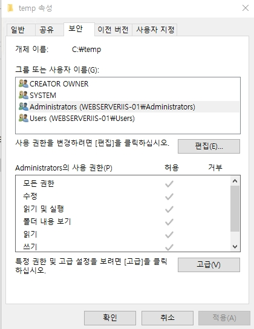
1. `읽기`(Read)
    * 파일을 보고 확인할 수 있는 권한

2. `읽기 및 실행`(Read & execute)
    * 파일을 확인하거나 스크립트(.exe, .bat 등등)를 실행할 수 있는 권한

3. `쓰기`(Write)
    * 폴더 및 파일을 생성할 때 쓰는 권한이다.

4. `수정`(Modify)
    * 완전한 제어가 가능한 권한이며 읽기, 실행 및 쓰기 다 가능한 권한이다.
    * 전체 폴더 및 파일을 이 권한부터 삭제할 수 있다.

5. `모든 권한`(Full Control)
    * 말 그대로 모든 권한을 갖는다.
    * 수정과 다른 점은 "권한 변경"과 "소유권 변경"과 같은 다른 개체들의 권한도 간섭 가능하다.

6. 폴더 내용 보기(List folder contents)
    * 위에서 설명한 권한들과는 결이 다르게 실제로 폴더에 엑세스하지 않는다.
    * 파일 탐색기에서 무슨 폴더 및 파일이 있는지 확인만 가능한 권한이다.

 

위와 같이 권한의 종류를 살펴보았습니다. 여기서 우리는 제일 중요한 점은 권한이 적용되는 우선순위입니다.  
허용권한의 경우 `OR`와 같이 동작한다고 보면 편합니다. 제일 높은 권한으로 엑세스가 적용됩니다.  
 
예를 들어서 test01 계정은 users와 administrators 2개의 그룹에 속하여 있다고 가정합니다.
* users = Read 권한
* administrators = modify 권한

그렇다면 둘 중에 뭐로 적용될까요? test01의 허용 권한은 modify 권한으로 `제일 높은 권한`으로 적용됩니다.
그렇다면 거부 권한까지 섞여 있는 경우는 어떨가요?
* test01 = Write 거부 권한

위와 같이 된다면 __test01계정은 modify 권한을 갖고 있더라도 Write를 할 수 없게 됩니다.__  
정리하여서 `거부 권한`이 `제일 높은 권한`으로 만약 존재한다면 해당 파일에 모든 권한을 갖고 있더라도 거부한 권한에 대해서는 엑세스가 불가능하게 됩니다.

# 2. Sharing Security

SMB를 활용한 공유 폴더도 권한이 존재합니다.

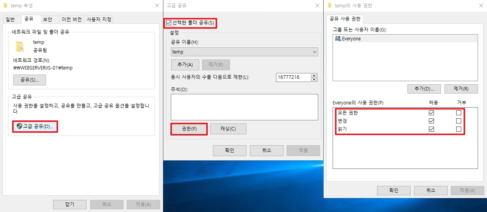

1. Read = ntfs의 Read & Execute 권한
2. Change = ntfs의 modify 권한
3. 모든 권한 = ntfs의 full control 권한

으로 공유 권한은 위와 같이 총 3개의 권한이 적용됩니다. 그렇다면 smb로 접속하게 되면 공유 권한을 적용할까요? 아니면 ntfs 권한으로 적용하게 될까요? 정답은 2개 다 적용하요. 제일 낮은 최소권한으로 적용됩니다.

 

* Share 권한 = Read
* NTFS 권한 = modify  

일 경우에 최종 권한은 Read 권한으로 부여받게 됩니다. 그렇다면 가장 최적으로 설계하려면 어떻게 해야 할까요?  
최소 권한인 점을 이용하여 Share에서는 Everyone 계정에 풀 권한을 준 후, ntfs 권한을 더 보안 상 높게 설정하는 것 입니다.
(_SMB 익명 접속 및 익명 개체(Anonymous Logon)는 기본적으로 비활성화 되어 있기 때문에 허용하지 않았다고 가정하에 설명하겠습니다._)  

__[NTLM 인증]__  
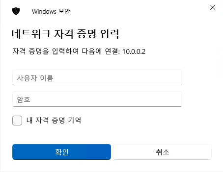

SMB 접속을 할 때, 우리는 ip 및 도메인 네임을 입력한 후, 계정과 비밀번호를 지정합니다. 이 계정은 ntlm에서 인증을 받아서 우리는 smb에 접속할 수 있게 됩니다.  
따라서 share에서는 모든 개체인 Everyone으로 1차적으로 권한을 부여 받고, 2차적인 ntfs 권한은 ntlm에서 인증받은 계정에 대한 권한을 부여받는다고 생각하면 편합니다.  
위와 같이 진행하게 되면 결론적으로 `최소 권한`을 적용하여 `ntfs 권한만 부여 받는 것과 같은 동일 효과`를 갖게 됩니다.

# 3. NTFS Inheritance

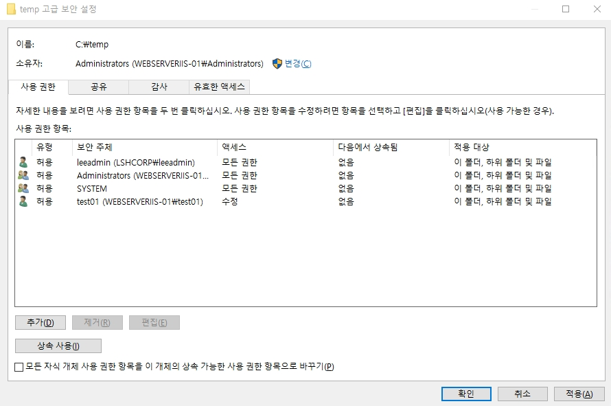

여기서는 권한 상속에 대해서 한 번 살펴 보겠습니다. 우선 보안 개체들에 대하여 설명하기 위하여 개체(test01)을 더블 클릭합니다.

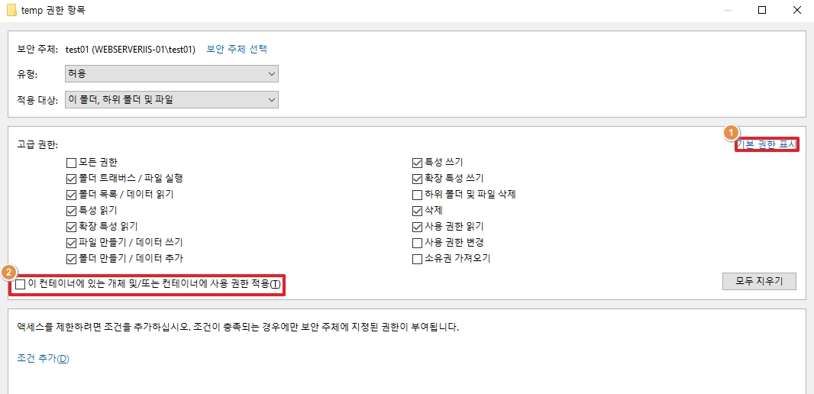
### 1) 고급 권한 
목차 1번에서 표기한 권한 보다 실제로 개체들은 더 많은 권한을 가지고 있습니다. 이러한 권한을 확인하기 위하여서는 1번 버튼을 클릭하여 `고급 권한`으로 변경합니다.  
여기서는 기존 권한 포멧이 아닌 권한을 변경하였을 때 어떻게 변화되는지에 대하여 한 번 알아보겠습니다.

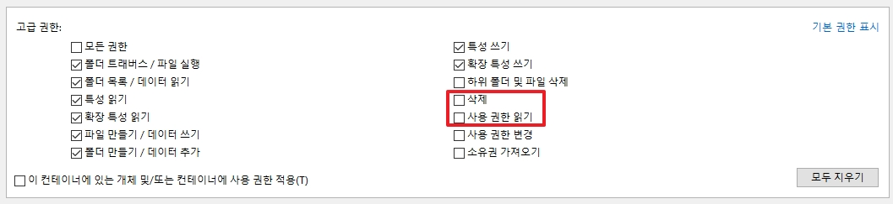
test01은 modify 권한을 가지고 있지만, 여기서 `삭제`와 사용 권한 읽기`에 대한 권한을 삭제하여 보겠습니다.

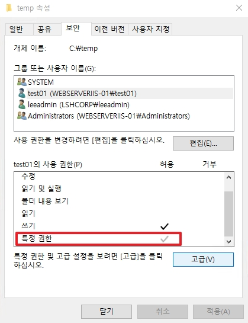
* 해당 권한을 삭제하여 기본 권한 템플릿에 벗어나게 된다면 위와 같이 `특정 권한` 항목이 활성화되면 변화하게 됩니다.

### 2) 컨테이너

여기서 컨테이너는 `폴더`를 뜻하며, 개체는 `파일`을 뜻합니다. __"이 컨테이너에 있는"__ 이라고 하였기 때문에 해당 temp 폴더 안에 있는 폴더 및 파일들이 해당 권한을 상속받게 됩니다.

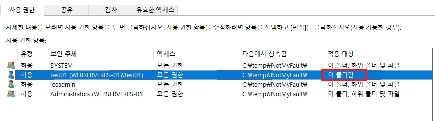  
상속되는 범위는 temp 폴더 하위 폴더만 가능하며, 하위에 폴더의 다음 하위까지는 적용되지 않습니다.

 

이번에는 현재 temp 폴더에서 상위 폴더의 권한을 가져와서 적용시켜 보겠습니다.
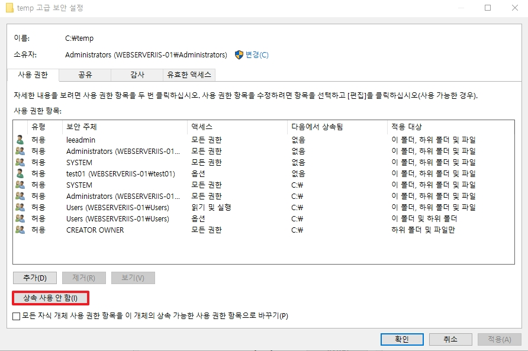
위 버튼을 클릭하게 되면 위처럼 폴더 권한들을 상속하여 가져오게 됩니다. 가져온 후, 다시 권한을 기존으로 변경하고 싶어서 `상속 사용 안 함`을 클릭하면 어떻게 될까요?

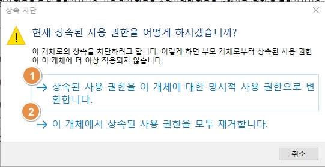  
위와 같이 2가지 선택지가 주어지게 됩니다.

### 1번 상속 해제
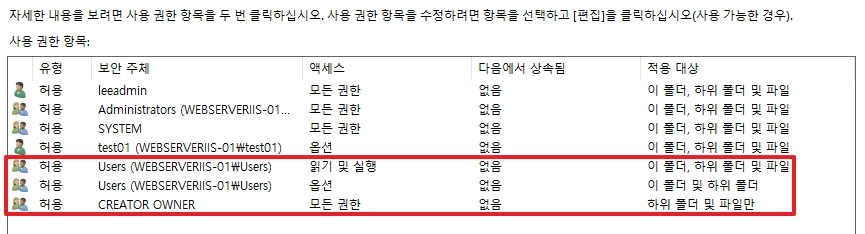
* 1번을 선택하게 되면 위와 같이 `다음에서 상속됨` 컬럼에서 상속이 사라지게 됩니다.
* 상속은 사라졌지만, 상속 했을 때 받았던 권한은 그대로 유지됩니다.

### 2번 상속 해제
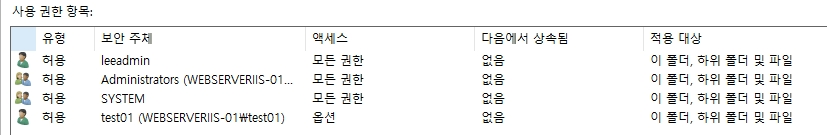
* 상속도 해제되고, 상속 때 받았던 모든 권한이 같이 삭제됩니다.