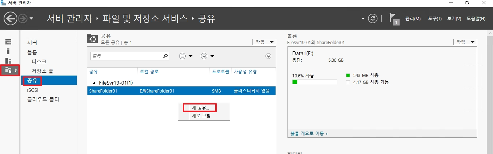

# File Server
기본적으로 File Server라고 하면 쉽게 NAS를 생각하시면 됩니다. NAS는 장비를 구매하시어 사용하게 되면 기본적으로 하드웨어에 맞춰서 OS가 설치되어 있지만 Windows Server에서도 이런 기능을 제공합니다.  
그렇다면 실제로 이런 기능을 어디서 많이 사용할까요? VDI 환경에서 많이 사용하며, 대규모 Client가 있는 환경에서 네트워크 환경의 파일 스토리지를 할당하며 이에 대한 Access 관리는 AD와 융합하여 사용하게 됩니다.

  
_File Server 운영 시, 위 역할을 설치하여 운영합니다._

# 1.고급 SMB 공유 폴더 생성
공유 폴더를 생성할 때, 폴더 속성에 __공유__ 탭을 통하여 만들 수 도 있지만, 서버 관리자에서 고급 공유를 통하여 생성하는 방법에 대하여 정리합니다.

* `서버 관리자` -> `파일 및 저장소 서비스` -> `공유` 로 이동합니다.
* 공유 목록에서 우 클릭 후, `새 공유`로 이동합니다.

 

* `SMB 공유 - 고급` 을 선택합니다.

 

* 공유 폴더를 생성할 위치를 선택합니다.
* 사용자 지정으로 안 할 경우, 각 볼륨 레터의 하위 `Shares` 폴더에 생성됩니다.
    * ex) D:\Shares 아래에 폴더로 생성됩니다.

 

* 생성할 공유 폴더 이름을 설정합니다.

 

1. `엑세스 기반 열거 사용`: SMB 폴더에 접속  시, 엑세스 권한이 없는 폴더는 표시하지 않는 기능
2. `공유의 캐싱 허용`: 오프라인 상태에서도 파일들을 접속할 수 있도록 캐싱 형태로 가지고 유지하는 기능
    * Client가 개인용으로 사용할 때는 문제가 없지만 단체로 사용하는 파일일 경우 동기화에서 문제가 발생할 수 있다.
3. `데이터 엑세스 암호화`: SMB는 엑세스 시에만 NTLM으로 보호하였지만 패킷과 같은 데이터는 보호하지 못하여, 이를 더 강화하기 위하여 나온 암호화 방법이다.
    * SMB 3.0부터 가능한 기능으로 Server와 Client 모두 `SMB 3.0`을 지원해야한다.
    * 인증서 기반인 TLS를 사용하지 않고 AES를 사용하며, 해당 기능 사용 시 CPU 자원을 

 

### +추가)

| SMB 버전 | 기본 암호화 지원 여부 | 추가 보안 기능 |
|----------|------------------|----------------|
| SMB 1.0 (Windows 2000, XP, 2003) | 없음 | NTLM 인증 사용 (취약) |
| SMB 2.0/2.1 (Windows Vista, 2008, 7) | 없음 | 성능 개선, 서명(Signing) 지원 |
| SMB 3.0 (Windows 8, 2012) | 지원 | AES-128-CMAC 서명, End-to-End 암호화 |
| SMB 3.1.1 (Windows 10, 2016 이상) | 강화됨 | AES-128-GCM, 미리 인증 무결성(Pre-authentication Integrity) |

_각 Windows 제품 별 SMB 버전이며, EOS한 제품이 아닐 경우, 전부 SMB 3.0 이상 사용한다고 생각하면 편하다._ 

 

  
_공유 폴더 생성 후, 설정된 공유 값입니다._

* 공유 폴더의 엑세스를 설정합니다.
* 기본적으로 공유 권한은 Everyone 모든 권한으로 설정되어 있으며, 이 화면에서는 NTFS Securtity에 대한 설정입니다.

 

* 폴더 관리 속성으로 `파일 서버 리소스 관리자`에서 자동 분류 관리에서 사용할려고 만든 설정입니다.
* 추후에 변경도 가능하며, 사용 계획이 없다면 다음으로 넘어갑니다.

 

* 공유 폴더에 저장할 수 있는 데이터의 양을 지정합니다.
* _템플릿 생성 방법은 2번 목차인 Quotas에서 다룹니다._

 

* 모든 설정이 끝나면 공유 폴더를 생성합니다.

 

* 

 

## Client에서 SMB 접속

* 실행 창에서 공유 폴더 주소를 입력합니다.

 

* SMB 엑세스 시, 어떠한 계정으로 엑세스할 건지 NTLM에 입력합니다.
* _공유 폴더가 데이터 엑세스 암호화 기능을 설정하였다면, 기존 SMB 보다 접속 시에 조금 더 시간이 소요됩니다._

 

* 정상적으로 접속되면 위와 같이 출력됩니다.

 

# 2. Quotas(할당량)
Quotas는 공유 폴더에 데이터를 제한하여 저장할 수 있도록 해주는 기능입니다.

* `서버 관리자` -> `도구` -> `파일 서버 리소스 관리자`로 이동합니다.

 

* 파일 리소스 관리자 탭에서 `할당량 관리` -> `할당량`으로 이동합니다.
* 이동한 후, 중앙 UI에 우 클릭한 후, `할당량 만들기`로 이동합니다.

 

1. 할당량을 적용할 공유 폴더의 로컬 경로를 설정합니다.
2. 기본적인 Quotas Template이 없을 경우, 사용자 속성에서 새로운 템플릿을 생성합니다.
3. 기본 제공하는 템플릿을 기반으로 선택하여 새로운 템플릿을 생성합니다.
4. 공유 폴더가 사용할 수 있는 크기를 제한합니다.
    * __하드 할당량__ : 공유 폴더가 제한된 크기를 지키도록 합니다.
    * __소프트 할당량__ : 제한된 크기를 초과할 수 있도록 하며, 주 목적은 사용량 모니터링입니다.
5. 할당량에 도달하기 전 트리거로 생성할 알림 임계값을 추가합니다.

 

* 할당량에 도달하기 전 임계값을 퍼센트로 설정합니다.
* 알림을 선택할 방법이 여러 가지 있으며, 일반적으로는 이벤트 로그로 많이 합니다.

 

* 사용자 지정 Quotas Template을 작성하여 생성하게 되면, 위와 같이 할당량 속성이 반영됩니다.

 

* 신규로 만든 Template을 추후에 사용할 수 있도록 Template 이름을 설정합니다.

 

* 이렇게 최종적으로 Quotas를 적용하게 되면 위와 같이 출력되게 됩니다.

 

## 템플릿은 유지할 상태로 공유 폴더의 할당량을 변경할 수 있을까?

* 정답은 가능합니다. 할당량을 변경하게 되면 `제햔` 탭이 변경된 할당량으로 변경됩니다.
* 하지만 템플릿은 여전히 1.5GByte에 대한 템플릿이기 때문에 `템플릿 일치` 탭에서는 아니요로 변하게 됩니다.

 

## 템플릿 변경

* 새로 생성하였던 템플릿의 할당량도 변경할 수 있습니다.
* 변경된 템플릿을 사용하는 모든 공유 폴더들을 템플릿과 동일하게 한 번에 설정하고 싶을 경우에는 `파생된 모든 할당량에 템플릿 적용`을 선택합니다.

 

* 위와 같이 설정하게 되면 모든 공유 폴더들의 설정이 변경되어지며, 템플릿과 일치되게 됩니다.

 

# 3. File Screen