# Sysprep

Sysprep은 기본적으로 초기 이미지를 생성하는 방법이라고 생각하면 편합니다. 하나의 이미지를 생성하고 그 이미지를 배포하여 VM에서도 복사하고 사용하는 개념입니다.  
그렇다면 시점 복원을 하여 사용하는 스냅샷도 있는데 차이가 뭘까요? 스냅샷은 현재의 상태를 저장하는데 주 역할을 하며, Sysprep은 현재 상태가 아닌 초기 설정을 하여 배포용으로 사용하는 이미지라는 것 입니다.  
 
따라서 `whoami /user`를 사용하였을 때, AD 등에서 사용하는 SID 값이 스냅샷으로 배포하면 값이 같기 때문에 장애가 발생할 수 있지만, Sysprep은 일반화 기능을 통하여 초기 상태로 되돌리기 때문에 배포하는 VM 마다 SID 값이 다릅니다.

# Sysprep Boot Option
이미지를 만드는 진행 순서는 `Sysprep` -> `시스템 감사모드(옵션: 재부팅)` -> `이미지 커스터마이징` -> `시스템 OOBE(옵션: 시스템 종료, 일반화 활성화)`

 

# VHDX 이미지 배포
_해당 Demo는 Hyper-V 환경에서 진행하였습니다._

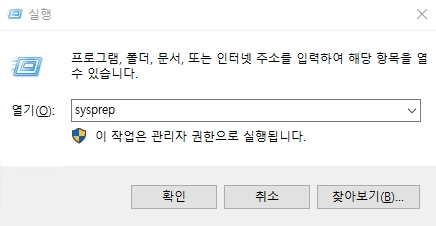
* 실행에서 `sysprep`을 실행하여 Sysprep 폴더로 이동합니다.

 

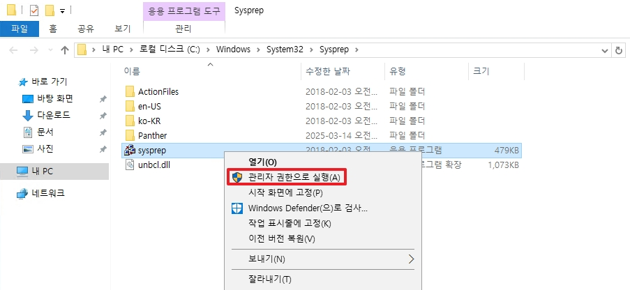
* Sysprep을 관리자 권한으로 실행합니다.

 

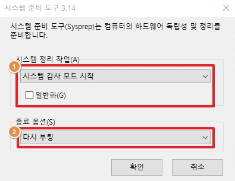
* 시스템 감사모드로 실행하며, 종료옵션은 재부팅으로 진행합니다.
* 재부팅 후, Administrator 계정을 접속되며, 기본 이미지에 포함시킬 애플리케이션들의 설치를 진행합니다.

 

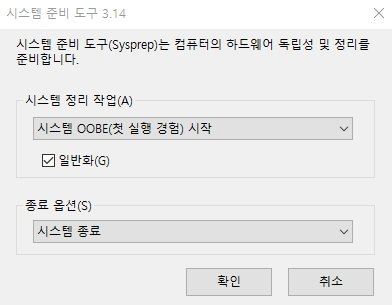
* 모든 설치가 끝난 후, Sysprep을 다시 실행시킵니다.
* 시스템 정리 작업에서 `OOBE` 와 `일반화` 를 선택합니다. (_해당 옵션의 결과는 아래에서 설명합니다._)
* 종료 옵션은 `시스템 종료`를 선택합니다.

 

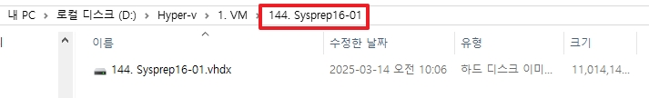
* 해당 테스트 VM은 144번 VM으로 `vhdx` 파일을 복사합니다.

 

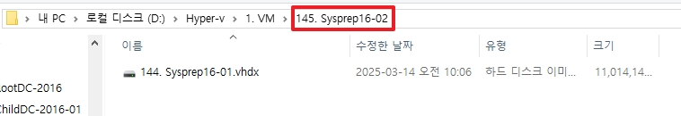
* 신규 VM인 145번 VM 디스크 폴더에 복사한 파일을 붙여넣습니다.

 

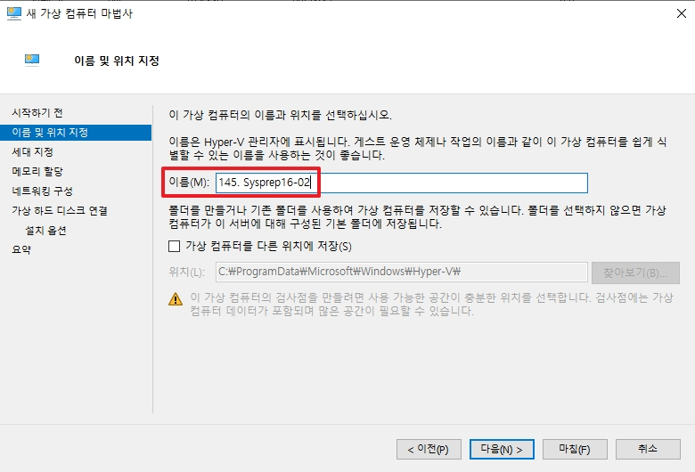
* 145번 VM을 생성합니다.

 

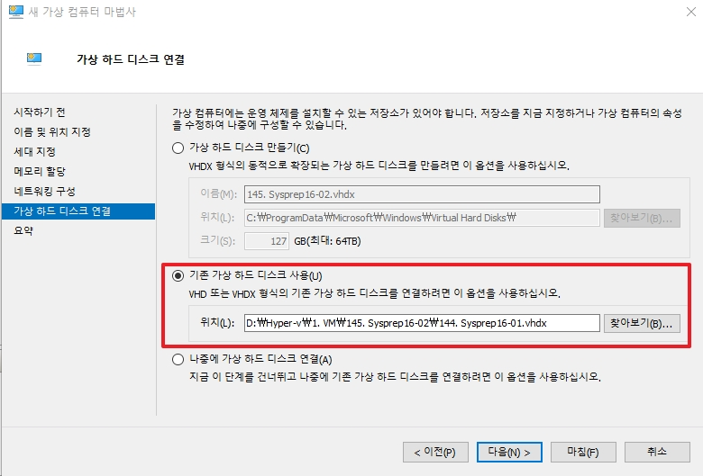
* `145번 VM 생성 시,` 145번 디스크 폴더에 있는 `144번 vhdx 복사 파일`을 사용합니다.

 

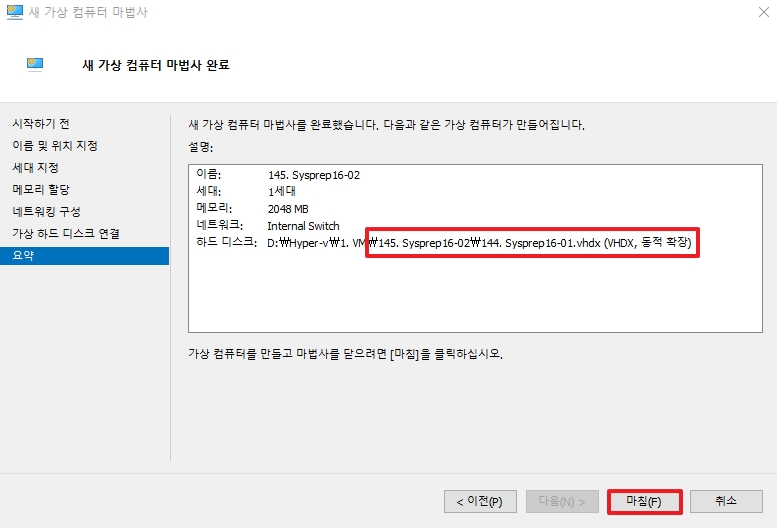
* 145번 VM을 생성한 후, 실행합니다.

 

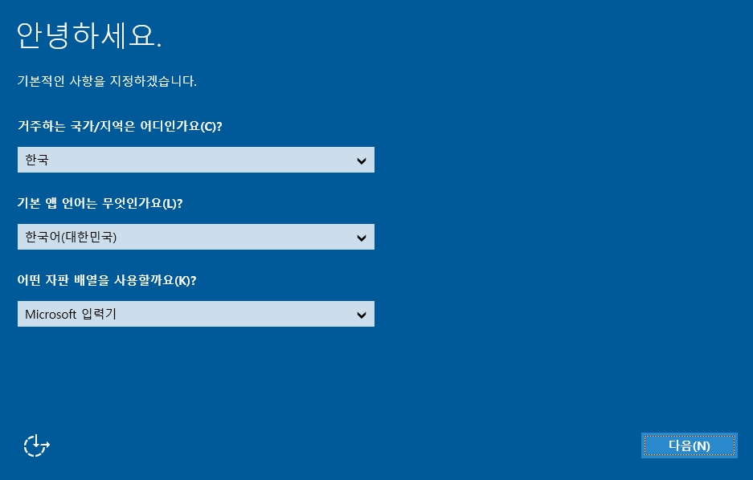
* 복사하였던 이미지로 정상적으로 부팅되어지며, `OOBE`로 시스템을 정리하였기 때문에 초기 이미지 설정 화면이 출력됩니다.

 

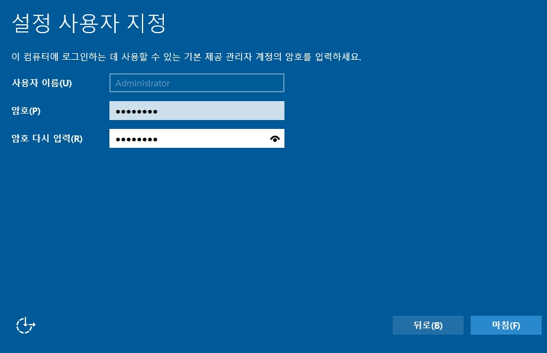
* 새로운 관리자 계정을 설정합니다.

 

이후, administrator 계정으로 접속하여 기존 144번 서버와 이미지를 배포 받아 생성한 145번 서버의 sid와 네트워크 설정 값을 비교하여 보겠습니다.

|Base Image|Deployed Server|
|:---:|:---:|
|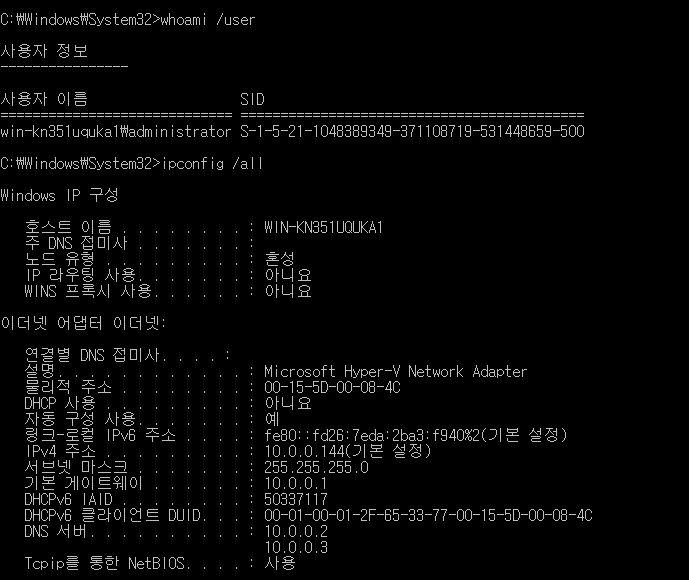|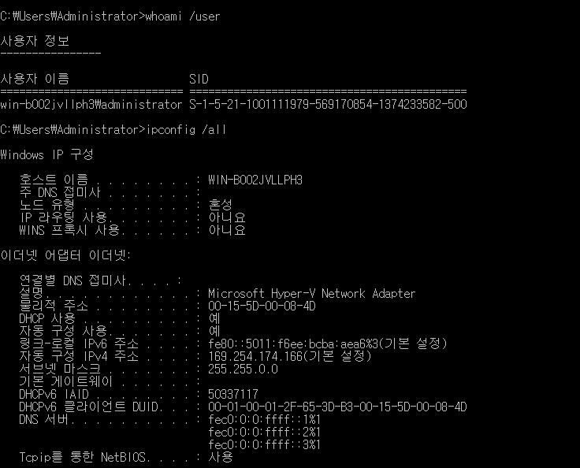|

* administrator 계정의 `SID`와 `ncpa.cpl`로 설정한 네트워크  값이 달라집니다.
* 위 결과를 통하여 일반화 옵션을 선택하였을 때, 이미지의 설정 값들이 초기화됨을 확인할 수 있습니다.

 

### ++추가) AD 탈퇴
Sysprep을 사용하여 기본 베이스 이미지를 생성할 경우, 해당 서버는 `AD 도메인 탈퇴`를 `필수`로 진행해야만 합니다.  
* DC 기준으로는 Member Server가 Sysprep으로 종료되어 이미지가 삭제되어도 해당 개체의 변경점을 인식하지 못합니다.
* AD에 가입된 Member Server 이미지를 배포할 경우, Workgroup이 아닌 도메인명으로 표기되어 있느나, DC에서는 해당 개체를 생성하지 않으며 존재를 모르기 때문에 필수로 탈퇴한 다음에 이미지를 배포해야 합니다.